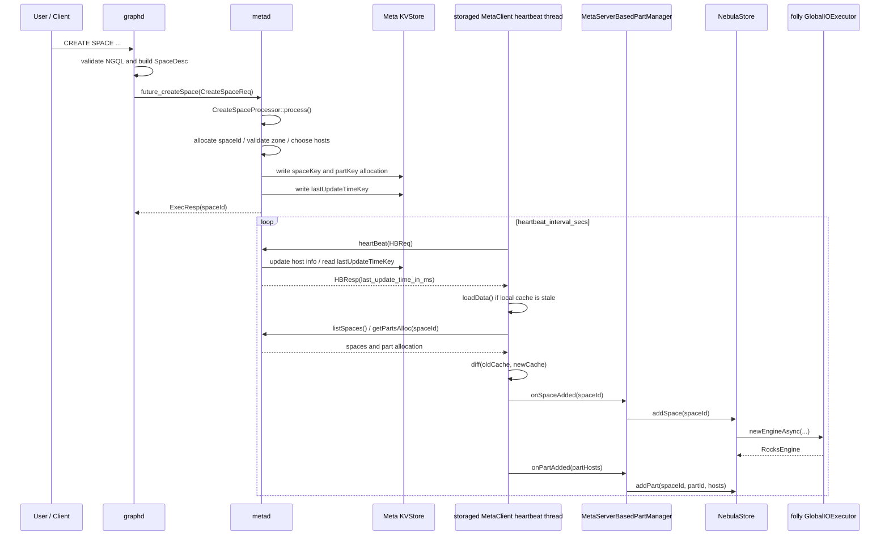

# Nebula Graph `CREATE SPACE` 到 Storage 创建本地图空间的链路分析

## 1. 结论先行

`CREATE SPACE` 的链路里，**Meta 在处理 `CreateSpaceReq` 时并不会直接 RPC 调用 Storage 去“创建图空间”**。它做的核心事情是：

1. Graph 解析并校验 `CREATE SPACE` NGQL，生成 `SpaceDesc`。
2. Graph 通过 `MetaClient::createSpace()` 向 Meta 发 `CreateSpaceReq`。
3. Meta 的 `CreateSpaceProcessor` 分配 `spaceId`，根据 `partition_num` / `replica_factor` / zone / host 活跃状态生成每个 partition 的 host 分配，并把这些元数据写入 Meta KV：
   - space name 到 space id 的索引；
   - space properties；
   - 每个 part 的 replica host 列表；
   - `last_update_time`。
4. Storage 进程自身的 `MetaClient` 心跳线程周期性向 Meta 发送 heartbeat，拿到 Meta 返回的 `last_update_time`。
5. 如果本地缓存的 `localDataLastUpdateTime_` 落后于 Meta 的 `metadLastUpdateTime_`，Storage 的 `MetaClient::loadData()` 会重新拉取 spaces 和 parts allocation。
6. `MetaClient::diff(oldCache, newCache)` 发现“当前 Storage host 新增了某个 space/part”后，回调 `MetaServerBasedPartManager`。
7. `MetaServerBasedPartManager` 再回调 `NebulaStore::addSpace()` / `NebulaStore::addPart()`；其中 `addSpace()` 会调用 `newEngine()`，最终触发 `newEngineAsync()` 在 `folly::getGlobalIOExecutor()` 上创建 RocksEngine。

因此，你在 storage/meta 心跳相关代码里看到“创建图空间”的逻辑，是因为**物理创建并不是在 Meta 的 create-space RPC 里同步推给 Storage，而是通过心跳驱动的 MetaClient cache refresh + diff listener 在 Storage 侧异步落地**。

> 简单说：
>
> - Meta `CREATE SPACE`：写元数据、更新时间戳。
> - Storage heartbeat：发现元数据版本变了，拉取新分配。
> - Storage diff callback：本地执行 `addSpace()` / `addPart()`，创建 engine 和 raft part。

## 2. 整体时序图



## 3. Graph 侧：NGQL 如何变成 Meta RPC

### 3.1 Validator 填充 `SpaceDesc`

`CreateSpaceValidator::validateImpl()` 从 parser sentence 中读取 space name 和 options，并填充 `meta::cpp2::SpaceDesc`：

- `space_name`：来自 `sentence->spaceName()`；
- `partition_num`：来自 `PARTITION_NUM`；
- `replica_factor`：来自 `REPLICA_FACTOR`；
- `vid_type`：只允许 `INT64` 或 `FIXED_STRING`，并设置 vid 长度；
- charset/collate/comment/isolation level 等其它属性。

其中 vid type 在该版本中必须显式指定，否则直接返回语义错误。

随后 `toPlan()` 会创建 `CreateSpace` plan node，把 `spaceDesc_` 放入执行计划。

### 3.2 Executor 调用 MetaClient

`CreateSpaceExecutor::execute()` 取出 plan node 上的 `SpaceDesc`，调用：

```cpp
qctx()->getMetaClient()->createSpace(csNode->getSpaceDesc(), csNode->getIfNotExists())
```

这个调用是 Graph 到 Meta 的入口。

### 3.3 Graph 侧 MetaClient 发送 `CreateSpaceReq`

`MetaClient::createSpace()` 构造 `cpp2::CreateSpaceReq`：

```cpp
req.properties_ref() = std::move(spaceDesc);
req.if_not_exists_ref() = ifNotExists;
```

然后通过 thrift client 调用 MetaService 的 `future_createSpace()`。

## 4. Meta 侧：`CREATE SPACE` 只写分配元数据，不同步 RPC Storage

### 4.1 MetaServiceHandler 分发到 `CreateSpaceProcessor`

Meta 收到 Graph 发来的 `CreateSpaceReq` 后，`MetaServiceHandler::future_createSpace()` 创建 `CreateSpaceProcessor` 并调用 `process(req)`。

### 4.2 `CreateSpaceProcessor` 的核心步骤

`CreateSpaceProcessor::process()` 做了以下事情：

1. 获取全局写锁 `LockUtils::lock()`，避免并发修改 Meta 元数据。
2. 根据 space name 调 `getSpaceId()` 检查是否已存在；如果已存在，根据 `IF NOT EXISTS` 返回成功或 `E_EXISTED`。
3. 读取并修正默认值：如果 `partition_num == 0`，使用 `FLAGS_default_parts_num`；如果 `replica_factor == 0`，使用 `FLAGS_default_replica_factor`。
4. 校验 vid size/type、zone 数量、zone 是否存在。
5. 通过 `doGet(hostKey)` 读取各 host 的 `HostInfo`，用最近 heartbeat 时间判断 host 是否活跃。
6. 对每个 partition：
   - `pickLightLoadZones(replicaFactor)` 选择负载轻的 zone；
   - `pickHostsWithZone(...)` 在 zone 内选择 host；
   - 生成 `MetaKeyUtils::partKey(spaceId, partId)` -> `MetaKeyUtils::partVal(partHosts)`。
7. 写入 `MetaKeyUtils::indexSpaceKey(spaceName)` -> `spaceId`。
8. 写入 `MetaKeyUtils::spaceKey(spaceId)` -> `spaceVal(properties)`。
9. 调 `LastUpdateTimeMan::update(data, timeInMilliSec)` 写入 `lastUpdateTimeKey`。
10. `doSyncPut(std::move(data))` 写入 Meta KV。

关键点：这段流程里没有调用 StorageAdminService 的 `addPart` RPC，也没有直接调用 Storage 进程。Meta 只是把“图空间定义 + partition 分配”持久化到 Meta KV，并更新时间戳。

### 4.3 `doSyncPut()` 写入的是 Meta KVStore

`BaseProcessor::doSyncPut()` 调用的是 Meta 服务自己的 `kvstore_`：

```cpp
kvstore_->asyncMultiPut(kDefaultSpaceId, kDefaultPartId, std::move(data), ...)
```

这里的 `kDefaultSpaceId/kDefaultPartId` 是 Meta 自己的系统 KV 分区，不是用户刚创建的 graph space。也就是说，`CREATE SPACE` 在 Meta 这里完成的是**元数据写入**。

## 5. Storage 侧：为什么心跳链路里会触发创建图空间

### 5.1 StorageServer 初始化 PartManager 时注册 Meta listener

Storage 启动时，`StorageServer::getStoreInstance()` 构造 `KVOptions`，其中：

```cpp
options.partMan_ = std::make_unique<kvstore::MetaServerBasedPartManager>(localHost_, metaClient_.get());
```

`MetaServerBasedPartManager` 构造函数会调用：

```cpp
client_->registerListener(this);
```

所以 Storage 的 `MetaClient` 发现 Meta 数据变化时，可以回调这个 PartManager。

### 5.2 NebulaStore 初始化时先按当前 Meta cache 拉一次

`NebulaStore::init()` 中会调用：

```cpp
loadPartFromDataPath();
loadPartFromPartManager();
loadRemoteListenerFromPartManager();
```

`loadPartFromPartManager()` 会通过 `options_.partMan_->parts(storeSvcAddr_)` 从 MetaClient 本地 cache 取“当前 host 应该持有的 parts”，然后对每个 space 调用 `addSpace(spaceId)`，对每个 part 调用 `addPart(...)`。

这解释了第一类 `newEngineAsync()` 来源：**Storage 启动时，如果 Meta cache 里已经有这个 host 的分配，NebulaStore 会在初始化阶段为这些 space 创建 engine**。

### 5.3 Storage MetaClient 心跳线程刷新 cache

Storage 的 `MetaClient::heartBeatThreadFunc()` 周期性执行：

```cpp
auto ret = heartbeat().get();
...
loadData();
loadCfg();
```

`heartbeat()` 构造 `HBReq`，如果角色是 `STORAGE` 或 `STORAGE_LISTENER`，还会把本机 cluster id、leader info、disk parts、dir info 等带给 Meta。Meta 返回的 `HBResp` 中包含 `last_update_time_in_ms`，客户端把它保存到 `metadLastUpdateTime_`。

`loadData()` 的开头有一个短路判断：如果本地数据缓存时间等于 Meta 返回的更新时间，就不重新拉全量数据：

```cpp
if (options_.role_ != cpp2::HostRole::UNKNOWN &&
    localDataLastUpdateTime_ == metadLastUpdateTime_) {
  return true;
}
```

当 `CREATE SPACE` 写入了新的 `last_update_time` 后，这个判断会失效，于是 Storage 会重新拉取 Meta 数据。

### 5.4 `loadData()` 重新拉 spaces 和 parts allocation

`MetaClient::loadData()` 会：

1. `listSpaces().get()` 获取所有 space；
2. 对每个 space 调 `getPartsAlloc(spaceId, &partTerms).get()`；
3. `getPartsAlloc()` 对应 Meta 的 `GetPartsAllocProcessor`，它扫描 `MetaKeyUtils::partPrefix(spaceId)` 下所有 part 分配；
4. `loadData()` 将 `partsAlloc` 反转为 `partsOnHost_`，也就是每个 host 拥有哪些 part；
5. 组装新的 `localCache_`。

完成 cache 替换后，`loadData()` 调用：

```cpp
diff(oldCache, localCache_);
listenerDiff(oldCache, localCache_);
loadRemoteListeners();
```

真正触发 Storage 本地创建 space/part 的是 `diff(oldCache, localCache_)`。

### 5.5 `diff()` 发现新增分配并回调 listener

`MetaClient::diff()` 会根据当前 Storage host 计算新旧 `PartsMap`：

```cpp
auto newPartsMap = doGetPartsMap(options_.localHost_, newCache);
auto oldPartsMap = doGetPartsMap(options_.localHost_, oldCache);
```

如果某个 `spaceId` 在新 map 中存在、旧 map 中不存在：

```cpp
listener_->onSpaceAdded(spaceId);
for (const auto& newPart : newParts) {
  listener_->onPartAdded(newPart.second);
}
```

如果 space 已存在但 part 是新增的，则只调用 `onPartAdded()`。

这就是“心跳里有创建图空间逻辑”的核心：心跳本身不是创建 space，而是**心跳之后发现 Meta 数据版本变化，刷新 cache，再通过 diff 回调让 Storage 创建本地资源**。

## 6. 从 listener 回调到 `NebulaStore::newEngineAsync()`

### 6.1 `MetaServerBasedPartManager` 把 MetaClient 事件转成 KVStore Handler 调用

`MetaServerBasedPartManager::onSpaceAdded()` 调用：

```cpp
handler_->addSpace(spaceId);
```

`MetaServerBasedPartManager::onPartAdded()` 调用：

```cpp
handler_->addPart(partMeta.spaceId_, partMeta.partId_, false, partMeta.hosts_);
```

这里的 `handler_` 是 `NebulaStore`，因为 `NebulaStore::init()` 最后会 `options_.partMan_->registerHandler(this)`。

### 6.2 `NebulaStore::addSpace()` 创建 engine

`NebulaStore::addSpace()` 持有 `lock_` 写锁：

```cpp
folly::RWSpinLock::WriteHolder wh(&lock_);
```

如果 space 不存在，会创建 `SpacePartInfo`，然后对每个 data path 调用 `newEngine(spaceId, path, options_.walPath_)`。如果 space 已存在，也会检查每个 data path 是否已有 engine，缺失则补建。

`newEngine()` 调用：

```cpp
auto pair = this->newEngineAsync(spaceId, dataPath, walPath).get();
```

而 `newEngineAsync()` 是：

```cpp
return folly::via(folly::getGlobalIOExecutor().get(), [this, spaceId, dataPath, walPath]() {
  ...
  engine = std::make_unique<RocksEngine>(...);
  return std::make_pair(spaceId, std::move(engine));
});
```

所以你看到的 `newEngineAsync()` 是 Storage 侧真正创建本地图空间 engine 的动作。它不是 Meta 进程执行的，而是 Storage 在同步 Meta 元数据后执行的。

### 6.3 `NebulaStore::addPart()` 创建 partition / raft part

`addSpace()` 只是准备 space 级别的 engine；真正把 partition 放入本地 store 的是 `NebulaStore::addPart()`：

1. 持有 `lock_` 写锁；
2. 根据 peers 生成 raft peers；
3. 在当前 space 的多个 engine 中选择 `totalPartsNum()` 最小的 engine；
4. 调 `targetEngine->addPart(partId, peersToPersist)` 持久化 part 元信息；
5. 调 `newPart(...)` 创建 `Part`，并加入 `parts_`。

因此，物理层面的落地可以拆成两步：

```text
onSpaceAdded -> NebulaStore::addSpace -> create RocksEngine per data path
onPartAdded  -> NebulaStore::addPart  -> create local raft Part on selected engine
```

## 7. Meta 心跳代码在做什么，为什么也和空间创建有关

Meta 端的 `HBProcessor::process()` 处理 Storage/Graph/Listener 的 heartbeat。对于 Storage，它主要做这些事情：

1. 检查 storage host 是否已注册；
2. 检查 / 下发 cluster id；
3. 接收并保存 storage 上报的 disk parts；
4. 接收并保存 storage 上报的 leader info；
5. 更新 host heartbeat 时间；
6. 读取并返回 `last_update_time_in_ms` 给客户端；
7. 写入 host info / leader info / disk parts 等 KV。

它本身不会调用 `NebulaStore::addSpace()`。但它和创建 space 有两个关键关系：

- `CreateSpaceProcessor` 写入 `lastUpdateTimeKey`；`HBProcessor` 读取这个 key 并放进 `HBResp`；Storage MetaClient 看到 `metadLastUpdateTime_` 变化才会 `loadData()`。
- Storage heartbeat 上报的 leader/disk parts 可能也会更新 `lastUpdateTimeKey`，进一步触发其它 MetaClient refresh cache，但这不是创建 space 的主路径。

所以，Meta 心跳代码是**通知机制的一部分**，不是物理创建执行者。

## 8. Storage 心跳代码在做什么，为什么也和 `newEngineAsync()` 有关

Storage 侧 `MetaClient::heartbeat()` 会把本机状态发给 Meta，并读取 Meta 返回的最新更新时间。`heartBeatThreadFunc()` 在 heartbeat 后调用 `loadData()`。

当 `CREATE SPACE` 导致 Meta 的 `last_update_time` 改变时：

```text
heartbeat() updates metadLastUpdateTime_
  -> loadData() detects localDataLastUpdateTime_ != metadLastUpdateTime_
  -> listSpaces/getPartsAlloc rebuilds localCache_
  -> diff(oldCache, localCache_) sees new space/part for this host
  -> listener_->onSpaceAdded/onPartAdded
  -> MetaServerBasedPartManager::onSpaceAdded/onPartAdded
  -> NebulaStore::addSpace/addPart
  -> newEngineAsync / newPart
```

这就是为什么你会在 storage 心跳相关链路里看到创建图空间、创建 engine 的逻辑。它是 Nebula Graph 元数据订阅/同步机制的一部分。

## 9. StorageAdminService 的 `addPart` RPC 与 `CREATE SPACE` 的关系

代码里确实存在 Storage admin RPC：

```cpp
StorageAdminServiceHandler::future_addPart(const cpp2::AddPartReq& req)
```

它会分发到 `AddPartProcessor::process()`；如果本地没有 space，`AddPartProcessor` 也会调用 `store->addSpace(spaceId)`，然后调用 `store->addPart(...)`。

但这条链路主要用于 balance / admin 任务这类显式向某台 Storage 增加 part 的场景。就本仓库当前 `CreateSpaceProcessor` 代码来看，`CREATE SPACE` 的 Meta 处理流程没有直接调用 StorageAdminService 的 `addPart`。`CREATE SPACE` 新 space 初次落到 Storage，主要依靠上文的 heartbeat + cache diff listener。

因此可以这样区分：

| 场景 | Meta 是否直接 RPC Storage | Storage 本地创建入口 |
| --- | --- | --- |
| `CREATE SPACE` 初次分配 | 否；Meta 写 KV 元数据和 last update time | Storage heartbeat 后 `MetaClient::diff()` -> `onSpaceAdded/onPartAdded` |
| Storage 启动加载已有分配 | 否；Storage 从本地 Meta cache / MetaClient 拉取 | `NebulaStore::init()` -> `loadPartFromPartManager()` |
| Balance/admin add part | 是；通过 StorageAdminService `addPart` | `AddPartProcessor::process()` -> `NebulaStore::addSpace/addPart` |

## 10. 与前一个死锁分析的连接点

前一个文档关注 `NebulaStore::lock_` 和 GlobalIO 的潜在死锁。通过本链路可以看到，`CREATE SPACE` 后触发 `newEngineAsync()` 的常见入口有两个：

1. Storage 启动时：`NebulaStore::init()` -> `loadPartFromPartManager()` -> `addSpace()` -> `newEngine()` -> `newEngineAsync()`。
2. Storage 心跳刷新 Meta cache 后：`MetaClient::diff()` -> `MetaServerBasedPartManager::onSpaceAdded()` -> `NebulaStore::addSpace()` -> `newEngine()` -> `newEngineAsync()`。

这说明 `newEngineAsync()` 并不是只在手动调用 `addSpace()` 时出现；它本来就是 Storage 通过 Meta 心跳同步新 space/part 的物理落地路径。因此，`addSpace()` 内持有写锁并同步等待 GlobalIO 的风险，会在 `CREATE SPACE` 后的 heartbeat diff 阶段暴露出来。

## 11. 关键代码位置索引

- Graph validator：`src/graph/validator/AdminValidator.cpp`
- Graph executor：`src/graph/executor/admin/SpaceExecutor.cpp`
- Graph/Storage 共用 MetaClient：`src/clients/meta/MetaClient.cpp`
- Meta RPC handler：`src/meta/MetaServiceHandler.cpp`
- Meta create space processor：`src/meta/processors/parts/CreateSpaceProcessor.cpp`
- Meta base processor KV 写入：`src/meta/processors/BaseProcessor-inl.h`
- Meta heartbeat processor：`src/meta/processors/admin/HBProcessor.cpp`
- Last update time：`src/meta/ActiveHostsMan.h` / `src/meta/ActiveHostsMan.cpp`
- Storage server 初始化 PartManager：`src/storage/StorageServer.cpp`
- MetaServerBasedPartManager listener bridge：`src/kvstore/PartManager.cpp`
- Storage physical create：`src/kvstore/NebulaStore.cpp`
- Storage admin addPart 旁路：`src/storage/StorageAdminServiceHandler.cpp` / `src/storage/admin/AdminProcessor.h`
