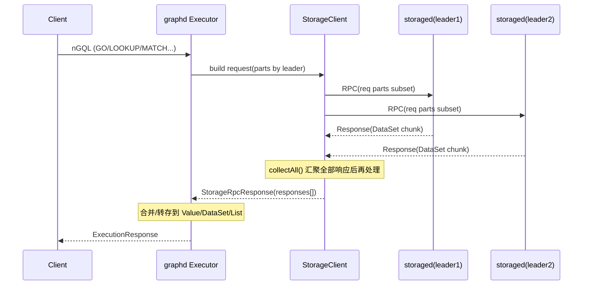

# NebulaGraph 大查询场景 Graph OOM 技术分析与防护方案报告

## 1. 目标与范围

本报告基于当前目录源码（`nebula-release-3.6`）分析：

1. 查询执行过程中 `graphd` 与 `storaged` 的交互实现细节（结合 nGQL 示例）  
2. 在“不改代码优先”的前提下，给出多套可落地的 Graph OOM 防护方案

---

## 2. 结论摘要（先给结论）

1. 你的判断是对的：大查询时，`storaged` 返回结果可能在 `graphd` 端形成瞬时内存峰值，触发 OOM。  
2. 关键放大点在 `graphd` 侧“全量汇聚”：`StorageClientBase::collectResponse()` 使用 `folly::collectAll` 等待并持有所有主机响应后再统一处理（`src/clients/storage/StorageClientBase-inl.h:102`）。  
3. 多个执行器会进一步把分片响应再拼成一个大结果（例如 `GetPropExecutor`、`IndexScanExecutor`），放大峰值（`src/graph/executor/query/GetPropExecutor.h:27`，`src/graph/executor/query/IndexScanExecutor.cpp:104`）。  
4. 现有保护是“检测+失败返回”型，不是“流式背压”型：有内存水位检查和 `bad_alloc` 捕获，但缺少 `storage->graph` 的按批流控。  

---

## 3. 端到端交互链路（graph 与 storage）

### 3.1 执行主链

1. `GraphService` 接收请求并交给 `QueryEngine`（`src/graph/service/GraphService.cpp:146`）。  
2. `QueryInstance` 做 `parse -> validate -> optimize -> schedule`（`src/graph/service/QueryInstance.cpp:39`）。  
3. `AsyncMsgNotifyBasedScheduler` 驱动各执行器执行（`src/graph/scheduler/AsyncMsgNotifyBasedScheduler.cpp:31`）。  
4. 访问存储类执行器（如 `GetNeighborsExecutor`/`IndexScanExecutor`/`ScanVerticesExecutor`）调用 `StorageClient` 发 RPC。  
5. `StorageClient` 按分区 leader 聚合请求，向各 storaged 并发发请求（`src/clients/storage/StorageClient.cpp`）。  
6. `storaged` 的 `GraphStorageServiceHandler` 分发到各 Processor（`src/storage/GraphStorageServiceHandler.cpp:139`）。  
7. Processor 组装 `DataSet` 返回；`graphd` 收集后拼结果，写入 `ExecutionContext`（`src/graph/executor/Executor.cpp:734`，`src/graph/context/ExecutionContext.cpp:23`）。

### 3.2 时序图（核心内存路径）



---

## 4. 结合 nGQL 的实现细节

### 4.1 `GO` / `MATCH` 多跳扩展（高风险）

示例：

```ngql
GO 2 TO 4 STEPS FROM "player100" OVER follow YIELD dst(edge) AS id;
```

或

```ngql
MATCH (a:player)-[:follow*1..3]->(b) RETURN b LIMIT 1000;
```

关键实现：

1. `GO` 会被规划为 `Expand/ExpandAll/Traverse` 等节点（`src/graph/planner/ngql/GoPlanner.cpp:154`，`src/graph/planner/match/MatchPathPlanner.cpp:216`）。  
2. 执行器每一跳调用 `storageClient->getNeighbors(...)`（`src/graph/executor/query/TraverseExecutor.cpp:90`，`src/graph/executor/query/ExpandExecutor.cpp:145`）。  
3. `StorageClient` 在 `collectResponse()` 中对所有 host future 执行 `collectAll`，再统一构造 `StorageRpcResponse.responses_`（`src/clients/storage/StorageClientBase-inl.h:75`、`:102`、`:135`）。  
4. `Traverse/Expand` 后续会构建邻接结构和路径中间态（如 `adjList_`、`dst2PathsMap_`），内存与跳数和扩展度相关（`src/graph/executor/query/TraverseExecutor.cpp:180`、`:200`）。

结论：多跳+高扩展度时，`graphd` 内存峰值容易高。

### 4.2 `LOOKUP`（索引查找）

示例：

```ngql
LOOKUP ON player WHERE player.age > 30 YIELD id(vertex), player.name;
```

关键实现：

1. `LookupPlanner` 生成 `IndexScan` 相关计划（`src/graph/planner/ngql/LookupPlanner.cpp:111`）。  
2. `IndexScanExecutor` 调 `storageClient->lookupIndex(...)`（`src/graph/executor/query/IndexScanExecutor.cpp:79`）。  
3. 返回后在 graph 侧合并 `DataSet`（`src/graph/executor/query/IndexScanExecutor.cpp:104`）。  

风险点：结果行很多时，合并阶段内存占用上升明显。

### 4.3 无索引起点的 `MATCH`（极高风险）

示例：

```ngql
MATCH (v) RETURN v;
```

关键实现：

1. `ScanSeek` 可能直接规划为 `ScanVertices`（`src/graph/planner/match/ScanSeek.cpp:71`）。  
2. `ScanVertices/ScanEdges` 默认 limit 为 `-1`（不限）（`src/graph/planner/plan/Query.h:822`、`:887`）。  
3. `Scan` 类执行器调 `scanVertex/scanEdge`，然后在 graph 侧聚合结果（`src/graph/executor/query/ScanVerticesExecutor.cpp:33`，`src/graph/executor/query/ScanEdgesExecutor.cpp:32`）。  

风险点：全图扫描非常容易把 graph 内存打满。

---

## 5. OOM 根因拆解（源码证据）

### 5.1 graph 侧全量汇聚，无流式背压

`StorageClientBase::collectResponse()` 先 `collectAll` 再汇总，意味着“所有 host 响应都在内存里同时存在”（`src/clients/storage/StorageClientBase-inl.h:102`）。

### 5.2 二次聚合放大

1. `GetPropExecutor` 把多个响应继续 append 到一个 DataSet（`src/graph/executor/query/GetPropExecutor.h:27`）。  
2. `IndexScanExecutor` 合并 rows（`src/graph/executor/query/IndexScanExecutor.cpp:112`）。  
3. `GetNeighborsExecutor` 把每个响应 DataSet 放到 `List` 再交 `GetNeighborsIter`（`src/graph/executor/query/GetNeighborsExecutor.cpp:87`）。

### 5.3 多跳中间态缓存

`Traverse/Expand` 为继续扩展保留 `adjList`/路径映射等中间结构（`src/graph/executor/query/TraverseExecutor.cpp:241`）。

### 5.4 storage 侧并发查询也会局部放大

Processor 在 `query_concurrently=true` 时按分区并发，先分片结果、后汇总（如 `GetNeighborsProcessor`/`GetPropProcessor`/`ScanVertexProcessor`），同样有峰值（`src/storage/query/GetNeighborsProcessor.cpp:116`，`src/storage/query/GetPropProcessor.cpp:119`）。

### 5.5 保护机制是“阈值检测+失败”

1. graph/storage 都有内存监控线程更新高水位（`src/graph/service/QueryEngine.cpp:60`，`src/storage/StorageServer.cpp:73`）。  
2. 查询节点开始和迭代中会检查高水位（`src/graph/executor/Executor.cpp:625`，`src/graph/context/iterator/Iterator.cpp:16`）。  
3. 超限通常走 `GraphMemoryExceeded/StorageMemoryExceeded` 返回，但不是平滑限流。

---

## 6. 不改代码优先的防护方案（多方案）

## 6.1 方案 A：查询治理（优先级最高，见效最快）

1. 禁止无上限语句进入生产：如 `MATCH (v) RETURN v`、超大 hop 的 `*1..N`。  
2. 强制 `LIMIT`，并把大查询拆批（按 VID 范围、时间窗口、业务分片）。  
3. 先 `LOOKUP`/索引过滤，再 `GO/MATCH` 扩展。  
4. 发布查询规范：必须先 `EXPLAIN/PROFILE`，检查是否含 `ScanVertices/ScanEdges`。  

适用：马上可做，无需改二进制。

## 6.2 方案 B：graph 参数收敛（不改代码）

建议从保守值起步灰度：

1. `--system_memory_high_watermark_ratio` 从 `0.8` 下调到 `0.65~0.75`。  
2. `--memory_tracker_limit_ratio` 从 `0.8` 下调到 `0.6~0.7`。  
3. 开启 `--memory_tracker_detail_log=true` 观察趋势。  
4. 开启 `--enable_async_gc=true`（减少主线程释放抖动）。  
5. 对多作业并行谨慎调 `--max_job_size`（先小幅测试）。

参考配置位置：`conf/nebula-graphd.conf.default:86`、`:110`、`:128`。

## 6.3 方案 C：storage 输出收敛（不改代码）

1. 调整 `--max_edge_returned_per_vertex`，限制单点高扩展返回量（`src/storage/StorageFlags.cpp:43`）。  
2. 评估 `--query_concurrently`（并发高吞吐 vs 峰值内存，`conf/nebula-storaged.conf.production:109`）。  
3. 对 scan/lookup 类请求在业务层控制 limit，避免单次返回过大。

## 6.4 方案 D：并发与准入控制（系统层）

1. 客户端网关做“重查询队列”和并发上限（按用户/租户）。  
2. 高风险时段降低并发，分时执行离线大查询。  
3. 使用 `SHOW QUERIES` + `KILL QUERY(session=..., plan=...)` 做应急熔断（语法见 `tests/tck/slowquery/KillSlowQueryBaseTest.feature:12`）。

## 6.5 方案 E：OS/容器防线

1. 为 graphd 设置 cgroup/systemd 内存上限，防止整机被拖垮。  
2. 配置更保守的 OOM 策略，避免核心进程被优先杀。  
3. 预留足够可用内存给系统缓存和后台线程。

---

## 7. 分阶段落地建议（推荐顺序）

### Phase 0（1-2 天）

1. 立即上线查询黑白名单与 SQL 审核（禁无 LIMIT 全图查询）。  
2. 下调 graph 内存水位参数并开启 memory tracker 细粒度日志。  
3. 建立 `SHOW QUERIES + KILL QUERY` 的值班 SOP。

### Phase 1（1-2 周）

1. 客户端/网关实现大查询拆批。  
2. 关键业务查询改写为“先索引过滤后扩展”。  
3. 对高扩展边类型设置 `max_edge_returned_per_vertex` 上限并压测回归。

### Phase 2（长期，可考虑代码改造）

1. 把 `graph<-storage` 改为流式消费（替代当前 `collectAll` 全量汇聚）。  
2. 对 scan/lookup 增加端到端游标拉取与背压控制。  
3. 增加单查询内存预算和 admission control（按 query 估算拒绝或降级）。

---

## 8. 关键源码索引（便于继续深挖）

1. graph 汇聚 storage 响应：`src/clients/storage/StorageClientBase-inl.h:75`、`:102`  
2. graph 查询执行与调度：`src/graph/service/QueryInstance.cpp:39`、`src/graph/scheduler/AsyncMsgNotifyBasedScheduler.cpp:31`  
3. graph 内存高水位检查：`src/graph/executor/Executor.cpp:625`  
4. 内存监控线程：`src/graph/service/QueryEngine.cpp:60`、`src/storage/StorageServer.cpp:73`  
5. storage 请求入口：`src/storage/GraphStorageServiceHandler.cpp:139`  
6. GetNeighbors/GetProp/Scan/Lookup processor：  
   - `src/storage/query/GetNeighborsProcessor.cpp:77`  
   - `src/storage/query/GetPropProcessor.cpp:58`  
   - `src/storage/query/ScanVertexProcessor.cpp:153`  
   - `src/storage/index/LookupProcessor.cpp:219`  
7. scan/lookup/neighbor thrift 协议：`src/interface/storage.thrift:172`、`:270`、`:560`、`:595`、`:614`

---

## 9. 对你当前问题的直接回答

你的“storage 推大量数据导致 graph OOM”在该版本实现上是成立的，且最核心触发点是 graph 端对多 host 响应的全量汇聚和后续再聚合。  
在不改代码前提下，最有效路径是：**查询治理 + 参数收敛 + 并发准入 + 应急 kill** 组合落地。

--------------------

## 10. 源码修改方案
› 我想从根源上解决此问题，请提供源码修改方案，实现在大查询过程中自识别内存不足自行停止查询任务。请提供多种方案供讨论分析。


• 可以，从“根源”看你要的是两件事同时成立：

1. 内存压力能被及时识别（不是等 bad_alloc）
2. 查询能主动停止（最好还能尽快停止 storage 侧继续产出）

下面给你 4 套源码方案，按改动规模从小到大。

先说明现状缺口

1. 现在有水位检查，但检查点偏粗：主要在 executor open 和 iterator 访问时（src/graph/executor/Executor.cpp:625, src/graph/context/iterator/Iterator.cpp:16）。
2. StorageClientBase::collectResponse 仍是 collectAll 全量汇聚（src/clients/storage/StorageClientBase-inl.h:102），这是大查询峰值的核心放大点。
3. 触发后多为异常返回，不是“协同取消”。

———

方案 1：快速止血版（低风险，1-2 周）

1. 新增主动内存压力判定函数，例如 MemoryPressure::shouldAbortQuery()。
2. 在大内存热点循环中高频检查，命中后立即 qctx->markKilled() 并返回 Status::GraphMemoryExceeded。
3. 建议插点文件：
   src/graph/executor/query/GetNeighborsExecutor.cpp:64
   src/graph/executor/query/TraverseExecutor.cpp:107
   src/graph/executor/query/IndexScanExecutor.cpp:88
   src/graph/executor/query/AppendVerticesExecutor.cpp:62
   src/graph/executor/StorageAccessExecutor.cpp:187
4. 新增配置：
   --query_memory_abort_ratio（如 0.85）
   --query_memory_abort_check_rows（如每 512/1024 行检查）
5. 优点：改动小，快速见效。
6. 缺点：collectAll 仍在，峰值下降有限。

———

方案 2：推荐版（中等改动，2-4 周）

1. 把 StorageClientBase::collectResponse() 从“全量收齐再处理”改成“边到边处理”。
2. 核心思路：每个 host response 到达即合并，合并后马上做内存压力检查；超阈值立刻停止后续处理并返回。
3. 关键改动点：
   src/clients/storage/StorageClientBase-inl.h:75
   src/clients/storage/StorageClientBase.h:128
4. 配套新增“每查询并发上限”参数：
   --max_storage_inflight_per_query
   避免同一查询同时挂太多大响应。
5. 取消语义：返回 E_GRAPH_MEMORY_EXCEEDED 并标记 query killed。
6. 优点：直接打掉 collectAll 峰值问题，收益最大。
7. 缺点：客户端聚合路径重构量中等，需回归覆盖所有 RPC 类型。

———

方案 3：协同取消版（中高改动，3-6 周）

1. 在方案 2 基础上加入“graph->storage 协同取消”。
2. 利用已有 session_id/plan_id（src/interface/storage.thrift:24），新增取消状态检查。
3. 新增错误码建议：E_QUERY_CANCELLED（common/storage/graph 三侧映射）。
4. storage processor 在分区/行循环里周期检查取消标志，立即停止并返回：
   src/storage/query/GetNeighborsProcessor.cpp:85
   src/storage/query/GetPropProcessor.cpp:64
   src/storage/index/LookupProcessor.cpp:225
   src/storage/query/ScanVertexProcessor.cpp:159
5. 优点：真正“自行停止任务链”，减少无效计算和回传。
6. 缺点：涉及 meta/session 或分布式取消状态传播，联调复杂。

———

方案 4：协议级根治版（高改动，6 周+）

1. 给 GetNeighbors/GetProp/Lookup 增加和 Scan 类似的 cursor + page 拉取机制。
2. graph 采用分页拉取，内存不足时不再请求下一页，天然止损。
3. 需要改 thrift 协议和双端实现：
   src/interface/storage.thrift
   src/clients/storage/StorageClient.cpp
   src/storage/query/*.cpp
   src/storage/index/LookupProcessor.cpp
4. 优点：架构上最彻底，长期稳定。
5. 缺点：协议兼容、灰度升级成本最高。

———

我建议的落地顺序

1. 先做方案 1（马上可控）。
2. 并行设计方案 2（主线，真正解决峰值根因）。
3. 再决定是否上方案 3（是否需要跨服务协同取消）。
4. 方案 4 作为大版本演进目标。

如果你同意，我下一步可以直接给你出“方案 2 + 方案 1”的详细改动清单（函数级别、伪代码、回归测试点）。


› 我没看明白方案1，请结合具体的例子详细解释，并说明缺点的原因。


• 你这个问题问得很关键。下面我把**方案1（快速止血版）**拆开讲清楚。

## 方案1到底做了什么

一句话：
在 graphd 的“结果合并热点”里，增加高频内存检查；一旦发现内存紧张，就立刻把当前查询标记为 killed，并返回 GraphMemoryExceeded，停止后续执行。

核心动作是两步：

1. 检查：if (memory_pressure) ...
2. 停止：qctx_->markKilled(); return Status::GraphMemoryExceeded(...)

———

## 具体例子（按真实执行路径）

假设用户跑了大查询：

MATCH (a:player)-[:follow*1..3]->(b) RETURN b;

这类查询会走 Traverse/Expand，会不断从 storage 拉 getNeighbors 结果。

### 执行过程（方案1加了什么）

1. TraverseExecutor 收到一批 storage 响应（src/graph/executor/query/TraverseExecutor.cpp:107）。
2. 原来逻辑会继续展开、构建 adjList_、dst2PathsMap_ 等中间结构（src/graph/executor/query/TraverseExecutor.cpp:180）。
3. 方案1会在这些循环里每处理 N 行做一次检查（例如每 1024 行）：
   - 内存没超：继续
   - 内存超阈：立刻中断当前查询
4. 中断后：
   - qctx_->markKilled()（src/graph/context/QueryContext.h:131）
   - 返回 Status::GraphMemoryExceeded
   - 调度器后续 executor 不再正常推进

———

## 一个简化伪代码（就是方案1的代码形态）

插在类似 handleResp() / handleResponse() 的大循环里：

if (UNLIKELY((rows_processed % FLAGS_query_memory_abort_check_rows) == 0)) {
if (MemoryPressure::shouldAbortQuery()) {
qctx_->markKilled();
return Status::GraphMemoryExceeded("query aborted by memory pressure");
}
}

典型插点：

- src/graph/executor/query/TraverseExecutor.cpp
- src/graph/executor/query/GetNeighborsExecutor.cpp
- src/graph/executor/query/IndexScanExecutor.cpp
- src/graph/executor/query/AppendVerticesExecutor.cpp
- src/graph/executor/StorageAccessExecutor.cpp

———

## 为什么它有缺点（重点解释原因）

你问的“缺点原因”本质是：它只能在 graph 侧“处理阶段”刹车，不能在“数据已经涌入前”刹车。

### 缺点1：刹车时机偏晚

根因在这里：StorageClientBase::collectResponse() 用了 collectAll（src/clients/storage/StorageClientBase-inl.h:102）。
意味着各 storaged 的响应会先被收齐并放进 responses_，之后才到 executor 合并逻辑。
所以方案1检查发生时，很多内存已经占用了。

### 缺点2：不能阻止“正在路上的数据”

方案1只是在 graph executor 里停。
但 RPC 早已发给 storaged，storage 可能还在计算和回传，网络和反序列化成本仍然发生。
所以它能止损，但不能完全避免浪费。

### 缺点3：全局水位不是“单查询预算”

当前水位是进程级（system watermark / memory tracker），不是“每个查询独立配额”。
结果是：

- 多查询并发时，某个正常查询也可能被误伤
- 很难精确控制“单个大查询最多吃多少内存”

### 缺点4：可能仍有瞬时冲顶

监控线程是周期更新（默认 1s 一次），再加上“每 N 行检查”，存在检测滞后。
如果增长非常快，仍可能在两次检查之间冲高。

———

所以总结：
方案1是“快速止血、能救急”，但不是根治。
根治要做你前面看到的方案2（去掉 collectAll 式全量汇聚，改成边到边处理/限并发）。


› 我没看明白方案2，请结合具体的例子详细解释，并说明缺点的原因。


• 方案2的核心不是“多加几个检查点”，而是把 graphd 收 storage 响应的方式从“先全收齐”改成“边收边处理，且限制并发在途响应数”。

现在最关键的代码在 src/clients/storage/StorageClientBase-inl.h:75 的 collectResponse()，它用的是 folly::collectAll（src/clients/storage/StorageClientBase-inl.h:102）。

## 先用一个具体例子

查询：

GO 1 STEPS FROM $big_vid_set OVER follow YIELD dst(edge);

假设：

1. 这次请求被拆到 8 个 storaged host。
2. 每个 host 返回反序列化后约 200MB。
3. 你的 graphd 可用内存余量约 1.2GB。

### 现在（旧实现）

1. 8 个请求并发发出。
2. collectAll 等 8 个都返回。
3. 这 8 份响应先都在 responses_ 里。
4. 然后 executor 再把它们合并成最终结果。
5. 峰值很容易是“8份响应 + 合并中间态 + 结果对象”，直接冲爆。

### 方案2（新实现）

1. 增加参数，例如 --max_storage_inflight_per_query=2。
2. 同时只放 2 个 host 请求在途。
3. 任意一个 host 返回后，立刻做：
   - 错误码处理
   - 结果合并到目标结构
   - 内存压力检查（超阈值就 markKilled + GraphMemoryExceeded）
4. 合并完成后再发下一个 host 请求，直到结束或中止。

这样峰值从“8份一起堆”变成“最多2份在途 + 当前合并态”。

———

## 你可以把它理解成“水龙头 + 水桶”

1. 旧实现：8个水龙头同时开，先把水都接到很多桶，再倒入总桶。
2. 新实现：只开2个水龙头，接一点倒一点；水快满了就立刻关闸停止。

———

## 代码改动点（实现层面）

1. 重构 collectResponse() 的调度方式（src/clients/storage/StorageClientBase-inl.h）。
2. 新增“每查询在途 host 请求数”限制参数（建议放 graph flags）。
3. 在每次 host 响应处理后做内存判断，命中即提前结束并返回 E_GRAPH_MEMORY_EXCEEDED 映射状态。
4. 保持现有错误处理语义（leader changed、failed parts）不变。

———

## 方案2的缺点，以及“为什么”

1. 代码复杂度明显上升。
   原因：collectAll 很简单，改成“动态补位发送 + 提前终止 + 并发状态机”后，异步控制流复杂很多。
2. 吞吐可能下降。
   原因：你限制了并发在途请求数，峰值稳了，但总并发度下降，查询总耗时可能变长。
3. 仍无法避免“单个超大响应包”问题。
   原因：如果某一个 host 本身就返回超大包（例如 600MB），即使 in-flight=1，也可能在反序列化时顶到高压。
4. 只能“graph侧尽早停”，不能立即让 storage 全部停算。
   原因：RPC 已经发出，storage 可能还在算；要彻底协同停，需要方案3那类跨服务取消机制。
5. 回归测试成本高。
   原因：这个函数是所有 storage RPC 的公共路径（getNeighbors/getProps/lookup/scan 都走它），要做大范围回归。
6. 结果顺序/统计细节要谨慎处理。
   原因：到达顺序不再固定，若上层或 profile 展示隐式依赖顺序，需要补充稳定化逻辑。

———

所以，方案2是“最接近根治峰值放大点”的客户端侧改造，但它不是零成本，也不是协议级最终解。
如果你愿意，我下一步可以直接给你画“旧 collectAll -> 新 bounded in-flight”的函数级伪代码草图（按你这版代码结构写）。

