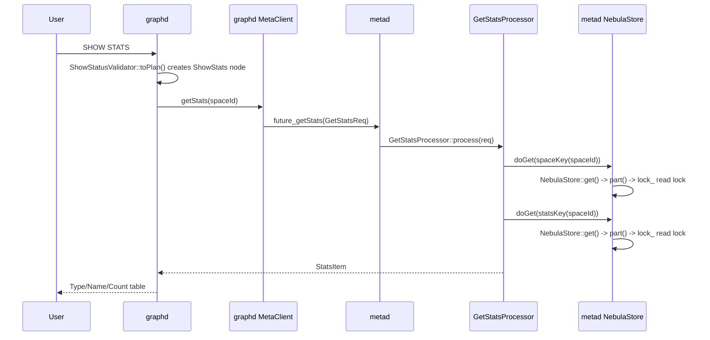
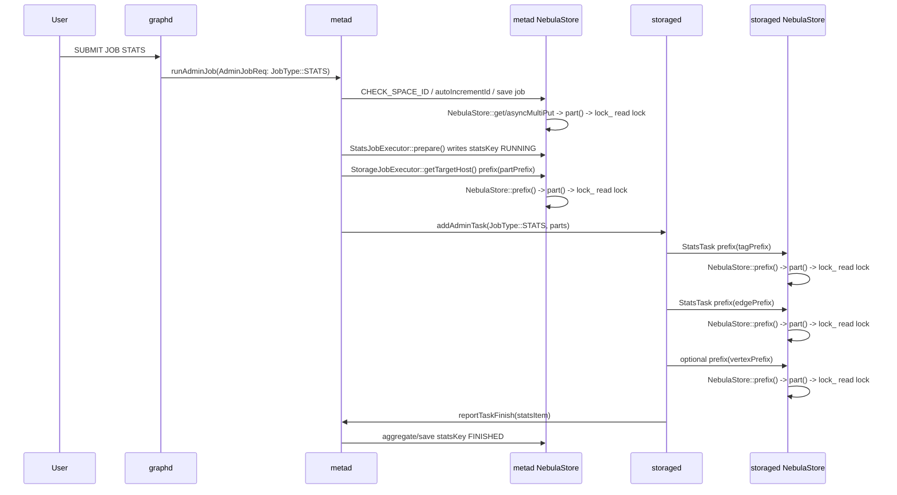

# `SHOW STATS` 与 `SUBMIT JOB STATS` 是否使用 `NebulaStore::lock_` 的代码链路分析

## 1. 结论

`SHOW STATS` 和 `SUBMIT JOB STATS` 都会使用到 `NebulaStore.h` 里的 `folly::RWSpinLock lock_`，但二者使用到的 `NebulaStore` 实例、调用路径和锁持有方式不同。

| NGQL | 是否使用 `NebulaStore::lock_` | 使用哪个进程/实例的锁 | 锁类型 | 是否触发 Storage 数据扫描 |
| --- | --- | --- | --- | --- |
| `SHOW STATS` | 会 | Meta 进程内部 Meta KVStore 的 `NebulaStore` | 读锁 | 不会，只读取 Meta 中已保存的统计结果 |
| `SUBMIT JOB STATS` | 会 | Meta 进程 Meta KVStore 的 `NebulaStore`，并且 Storage task 执行时会使用 Storage 进程用户数据 KVStore 的 `NebulaStore` | 读锁为主；提交/状态写入路径会执行 KV 写入，但 `NebulaStore::lock_` 本身仍主要在查找 part/space 时以读锁进入 | 会，Storage 侧 `StatsTask` 会 prefix 扫描 tag/edge/vertex 数据 |

最关键的区别是：

- `SHOW STATS` 是“展示结果”：只读 Meta KV 中的 `statsKey(spaceId)`。
- `SUBMIT JOB STATS` 是“生成结果”：Meta 创建并调度 stats job，Storage 收到 `JobType::STATS` task 后扫描真实数据，计算完成后回报给 Meta，Meta 聚合并写回 `statsKey(spaceId)`。

因此，如果只问“是否会用到 `NebulaStore.h` 的 `folly::RWSpinLock lock_`”：

```text
SHOW STATS        -> 会，Meta NebulaStore::part() 读锁。
SUBMIT JOB STATS  -> 会，Meta NebulaStore 读锁/写入路径 + Storage NebulaStore::part() 读锁。
```

但如果问“是否会触发前面 `addSpace()` / `newEngineAsync()` 相关的写锁等待 GlobalIO 风险”：

```text
SHOW STATS        -> 本身不会。
SUBMIT JOB STATS  -> 正常 stats task 本身不会调用 addSpace()/newEngineAsync()；
                     但它会在 Storage 数据 KVStore 上做 prefix 读，因而会参与 Storage NebulaStore::lock_ 的读锁竞争。
```

## 2. `SHOW STATS` 的锁使用链路

### 2.1 主流程



### 2.2 Graph 层进入 MetaClient

`ShowStatusValidator::toPlan()` 会创建 `ShowStats` plan node：

```cpp
auto *node = ShowStats::make(qctx_, nullptr);
root_ = node;
tail_ = root_;
```

`ShowStatsExecutor::execute()` 从当前 session 取 `spaceId`，然后调用 `MetaClient::getStats(spaceId)`。

Graph executor 不会访问 StorageClient，也不会扫描 Storage 数据；它只等待 Meta 返回 `StatsItem`，再把 tag/edge/space 统计整理成 `DataSet({"Type", "Name", "Count"})`。

### 2.3 MetaClient 构造 `GetStatsReq`

`MetaClient::getStats()` 构造 `cpp2::GetStatsReq`，设置 `space_id`，通过 thrift 调用 MetaService 的 `future_getStats()`，并从 `GetStatsResp` 中取出 `stats` 字段。

### 2.4 Meta `GetStatsProcessor` 的两次 KV 读取

`MetaServiceHandler::future_getStats()` 创建 `GetStatsProcessor`。

`GetStatsProcessor::process()` 首先执行：

```cpp
auto spaceId = req.get_space_id();
CHECK_SPACE_ID_AND_RETURN(spaceId);
```

这个宏会调用 `BaseProcessor::spaceExist(spaceId)`，而 `spaceExist()` 会通过 `doGet(MetaKeyUtils::spaceKey(spaceId))` 读取 Meta KV，确认 space 存在。

之后 `GetStatsProcessor` 再执行：

```cpp
auto statsRet = doGet(MetaKeyUtils::statsKey(spaceId));
```

如果 `statsKey` 不存在，会返回 `E_STATS_NOT_FOUND`，日志提示需要先执行 `submit job stats`；如果存在，会解析 `StatsItem`，并要求状态为 `FINISHED`。

### 2.5 `doGet()` 如何拿到 `NebulaStore::lock_`

Meta processor 的 `BaseProcessor::doGet()` 调用：

```cpp
kvstore_->get(kDefaultSpaceId, kDefaultPartId, key, &value);
```

MetaDaemon 初始化时，Meta KVStore 也是 `NebulaStore`：

```cpp
auto kvstore = std::make_unique<nebula::kvstore::NebulaStore>(...);
```

因此 `doGet()` 最终进入 `NebulaStore::get()`。`NebulaStore::get()` 先调用 `part(spaceId, partId)`，而 `NebulaStore::part()` 内部会获取 `lock_` 读锁：

```cpp
folly::RWSpinLock::ReadHolder rh(&lock_);
```

所以 `SHOW STATS` 会使用 `NebulaStore::lock_`，但使用的是 Meta 进程 Meta KVStore 的读锁，并且锁持有时间只覆盖 `spaces_` / `parts_` 查表和返回 `shared_ptr<Part>` 的短临界区；实际 RocksEngine `get()` 在返回 part 后执行。

## 3. `SUBMIT JOB STATS` 的锁使用链路总览

`SUBMIT JOB STATS` 的链路明显比 `SHOW STATS` 长，可以分成三个阶段：

1. Graph 向 Meta 提交 stats job。
2. Meta 创建 job、准备 stats 状态、查找目标 Storage host 并下发 `JobType::STATS` admin task。
3. Storage 执行 `StatsTask`，通过 `env_->kvstore_->prefix(...)` 扫描真实图数据，并回报局部统计结果给 Meta 聚合。



## 4. `SUBMIT JOB STATS` 在 Graph/Meta 提交阶段如何使用 Meta `NebulaStore::lock_`

### 4.1 Graph validator/executor

`AdminJobValidator::toPlan()` 会把 `SUBMIT JOB STATS` 这类 admin job sentence 转成 `SubmitJob` plan node。

`SubmitJobExecutor::execute()` 从 session 获取当前 spaceId，然后调用：

```cpp
qctx()->getMetaClient()->submitJob(spaceId, jobOp, jobType, params)
```

`MetaClient::submitJob()` 构造 `AdminJobReq`，设置 `space_id`、`op`、`type`、`paras`，并调用 Meta 的 `future_runAdminJob()`。

### 4.2 Meta `AdminJobProcessor` 检查 space 并创建 job

MetaService 的 `future_runAdminJob()` 创建 `AdminJobProcessor`。`AdminJobProcessor::process()` 一开始就执行：

```cpp
spaceId_ = req.get_space_id();
CHECK_SPACE_ID_AND_RETURN(spaceId_);
```

这一步和 `SHOW STATS` 类似，会通过 Meta KVStore 的 `doGet(spaceKey)` 进入 Meta `NebulaStore::get()`，进而在 `part()` 中拿 `lock_` 读锁。

当 job op 是 `ADD` 时，`AdminJobProcessor::addJobProcess()` 会：

- 检查是否已有同类 running job；
- 检查是否有需要 recover 的 job；
- 获取 Meta 全局写锁 `LockUtils::lock()` 和 snapshot 读锁；
- 调用 `autoIncrementId()` 生成 jobId；
- 构造 `JobDescription`；
- 调 `JobManager::addJob()` 保存 job。

其中 `autoIncrementId()` 和 `JobManager::save()` 都会访问 Meta KVStore：

- `autoIncrementId()` 先 `kvstore_->get(kDefaultSpaceId, kDefaultPartId, idKey, &val)`，再 `asyncMultiPut(...)` 写回新 id；
- `JobManager::save()` 通过 `kvStore_->asyncMultiPut(kDefaultSpaceId, kDefaultPartId, ...)` 写 job key。

这些 `get` / `asyncMultiPut` 在底层都需要定位 Meta 默认 part，因此会经过 Meta `NebulaStore::part()` 的读锁路径。

### 4.3 JobManager 执行 STATS job 时的 Meta KV 访问

`JobExecutorFactory::createJobExecutor()` 在 `JobType::STATS` 时创建 `StatsJobExecutor`。

`JobManager::runJobInternal()` 会调用 `prepareRunJob()`，后者执行：

```cpp
jobExec->check();
jobExec->prepare();
```

对 `StatsJobExecutor` 来说：

- `check()` 要求参数为空；
- `prepare()` 先 `spaceExist()`，再把 `MetaKeyUtils::statsKey(space_)` 写为 `RUNNING`。

`StatsJobExecutor::prepare()` 的 `spaceExist()` 通过 `JobExecutor::spaceExist()` 调 `kvstore_->get(kDefaultSpaceId, kDefaultPartId, spaceKey, &val)`，因此会进入 Meta `NebulaStore::part()` 读锁。

写 `statsKey` 的 `save()` 使用 `kvstore_->asyncMultiPut(kDefaultSpaceId, kDefaultPartId, ...)`；底层同样需要通过 Meta `NebulaStore` 找到默认 part，因而会参与 Meta `NebulaStore::lock_` 的读锁路径。

### 4.4 下发 Storage task 前查目标 host

`StatsJobExecutor` 继承自 `StorageJobExecutor`。`StorageJobExecutor::execute()` 对默认 target host 模式会调用：

```cpp
addressesRet = getTargetHost(space_);
```

`getTargetHost()` 扫描 Meta KV 中 `MetaKeyUtils::partPrefix(spaceId)`，得到每个 host 对应的 part 列表。它调用：

```cpp
kvstore_->prefix(kDefaultSpaceId, kDefaultPartId, partPrefix, &iter);
```

这会进入 Meta `NebulaStore::prefix()`，而 `NebulaStore::prefix()` 也先调用 `part(spaceId, partId)`，因此会获取 Meta `NebulaStore::lock_` 读锁。

随后 `StorageJobExecutor::execute()` 会先写入 task 元数据到 Meta KV，再调用 `executeInternal(...)` 下发实际 Storage task。这些 task 元数据写入也通过 `asyncMultiPut(kDefaultSpaceId, kDefaultPartId, ...)` 进入 Meta KVStore。

## 5. `SUBMIT JOB STATS` 在 Storage 执行阶段如何使用 Storage `NebulaStore::lock_`

### 5.1 Meta 下发 `JobType::STATS` admin task

`StatsJobExecutor::executeInternal()` 通过 `AdminClient::addTask()` 向目标 Storage 发送 `JobType::STATS`、jobId、taskId、spaceId 和 part 列表。

Storage 端 `StorageAdminServiceHandler::future_addAdminTask()` 分发到 `AdminTaskProcessor::process()`。

`AdminTaskProcessor` 使用 `AdminTaskFactory::createAdminTask()` 创建具体 task；对于 `JobType::STATS`，会创建 `StatsTask`。随后 `AdminTaskManager::addAsyncTask()` 把 task 放入队列，由 `AdminTaskManager::schedule()` / `runSubTask()` 调度执行。

### 5.2 `StatsTask::genSubTask()` 通过 `env_->kvstore_->prefix()` 扫描真实数据

`StatsTask::genSubTask()` 是 Storage 侧实际统计每个 part 的地方。它会构造：

- `NebulaKeyUtils::tagPrefix(part)`；
- `NebulaKeyUtils::edgePrefix(part)`；
- 如果 `FLAGS_use_vertex_key` 打开，还会构造 `NebulaKeyUtils::vertexPrefix(part)`。

然后分别调用 Storage 的用户数据 KVStore：

```cpp
env_->kvstore_->prefix(spaceId, part, tagPrefix, &tagIter, true);
env_->kvstore_->prefix(spaceId, part, edgePrefix, &edgeIter, true);
env_->kvstore_->prefix(spaceId, part, vertexPrefix, &vertexIter, true);
```

这里的 `env_->kvstore_` 是 StorageServer 初始化的 Storage 数据 KVStore，也就是 Storage 进程自己的 `NebulaStore` 实例。

`NebulaStore::prefix()` 内部会：

```cpp
auto ret = part(spaceId, partId);
```

而 `part()` 会拿读锁：

```cpp
folly::RWSpinLock::ReadHolder rh(&lock_);
```

因此，`SUBMIT JOB STATS` 执行到 Storage task 阶段时，会使用 Storage 进程用户数据 `NebulaStore::lock_` 的读锁。每个 prefix 调用拿一次读锁，拿到 `std::shared_ptr<Part>` 后释放锁，后续真实 RocksEngine iterator 扫描不再持有这把 `lock_`。

### 5.3 `canReadFromFollower = true` 不会跳过 `lock_`

`StatsTask` 调用 `prefix(..., true)` 的注释说明：Storage 发生 leader change 时继续从 follower 读取数据，而不是报错。

但这个 `true` 只影响 `NebulaStore::checkLeader(part, canReadFromFollower)` 的 leader 校验逻辑；它不影响 `NebulaStore::part()` 查表，因此不会跳过 `lock_` 读锁。

### 5.4 Storage task 完成后回报 Meta，Meta 再次使用 Meta `NebulaStore::lock_`

`StatsTask::finish()` 聚合本 Storage task 的所有 part 统计结果后，通过 callback 调用 `AdminTaskManager::saveAndNotify()`，把结果先写入 Storage 本地 adminStore，并通知后台上报线程。

后台线程最终调用：

```cpp
env_->metaClient_->reportTaskFinish(spaceId, jobId, taskId, errCode, pStats);
```

Meta 端收到 report 后，`StatsJobExecutor::saveSpecialTaskStatus()` 会读取已有 stats 值、聚合当前 task 的 `StatsItem`，再写入临时 stats key。job 完成时 `StatsJobExecutor::finish()` 会把最终 stats 写回 `statsKey(space_)`，并删除临时 key。

这些 Meta 端读写仍然会经过 Meta KVStore 的 `NebulaStore`，从而使用 Meta `NebulaStore::lock_` 的读锁路径来定位默认 part。

## 6. 二者与 `addSpace()` / `newEngineAsync()` 死锁风险的关系

### 6.1 `SHOW STATS`

`SHOW STATS` 不会触发 `NebulaStore::addSpace()`、`addPart()` 或 `newEngineAsync()`。它只通过 Meta KVStore 做两次短读：`spaceKey` 和 `statsKey`。

所以它会参与 Meta `NebulaStore::lock_` 的读锁竞争，但不是写锁持有者，也不会等待 `folly::getGlobalIOExecutor()`。

### 6.2 `SUBMIT JOB STATS`

`SUBMIT JOB STATS` 正常执行路径也不创建 space/engine，不调用 `NebulaStore::addSpace()` 或 `newEngineAsync()`。但是它比 `SHOW STATS` 更重：

- Meta 端会多次读写 Meta KV；
- Meta 端会 prefix 扫描 part allocation 来确定目标 Storage；
- Storage 端会对用户数据 KVStore 执行 tag/edge/vertex prefix scan；
- Storage 端每个 prefix 调用都会短暂进入 Storage `NebulaStore::part()` 读锁。

因此，`SUBMIT JOB STATS` 不是 `addSpace()` 写锁等待 GlobalIO 的直接触发者，但它确实可能在 Storage `NebulaStore::lock_` 上形成读锁压力。如果此时同一 Storage 进程中有 `addSpace()`、`removePart()`、`removeSpace()` 等写锁路径，stats task 的 prefix 查表读锁会和这些写锁互斥。

需要注意的是，`StatsTask` 的长时间扫描发生在 RocksEngine iterator 上，不是在 `NebulaStore::lock_` 持有期间。也就是说，它不会长时间持有 `NebulaStore::lock_`，但大量 part/subtask 并发时会频繁获取读锁。

## 7. 汇总：按阶段列出锁使用点

| 阶段 | 代码路径 | KVStore 实例 | `NebulaStore::lock_` 使用情况 |
| --- | --- | --- | --- |
| `SHOW STATS` 检查 space | `GetStatsProcessor -> CHECK_SPACE_ID_AND_RETURN -> BaseProcessor::spaceExist -> doGet(spaceKey)` | Meta `NebulaStore` | `get()` -> `part()` 获取读锁 |
| `SHOW STATS` 读取结果 | `GetStatsProcessor -> doGet(statsKey)` | Meta `NebulaStore` | `get()` -> `part()` 获取读锁 |
| `SUBMIT JOB STATS` 提交 job 检查 space | `AdminJobProcessor -> CHECK_SPACE_ID_AND_RETURN` | Meta `NebulaStore` | `get()` -> `part()` 获取读锁 |
| `SUBMIT JOB STATS` 分配 jobId / 保存 job | `autoIncrementId()` / `JobManager::save()` | Meta `NebulaStore` | `get()` / `asyncMultiPut()` 底层定位默认 part，进入读锁路径 |
| stats job prepare | `StatsJobExecutor::prepare()` | Meta `NebulaStore` | `spaceExist()` 读锁；写 `statsKey RUNNING` 时底层定位 part |
| stats job 确定目标 Storage | `StorageJobExecutor::getTargetHost()` | Meta `NebulaStore` | `prefix()` -> `part()` 获取读锁 |
| Storage 执行 stats task | `StatsTask::genSubTask() -> env_->kvstore_->prefix(tag/edge/vertex)` | Storage `NebulaStore` | 每次 `prefix()` -> `part()` 获取读锁 |
| Storage 回报 task 结果后 Meta 聚合 | `reportTaskFinish -> StatsJobExecutor::saveSpecialTaskStatus()/finish()` | Meta `NebulaStore` | `get()` / `asyncMultiPut()` / `asyncRemove()` 底层定位默认 part |

## 8. 关键代码位置索引

- `src/graph/validator/AdminValidator.cpp`：`SHOW STATS` 生成 `ShowStats` plan node。
- `src/graph/executor/admin/ShowStatsExecutor.cpp`：`SHOW STATS` 调用 `MetaClient::getStats(spaceId)`。
- `src/meta/processors/job/GetStatsProcessor.cpp`：`SHOW STATS` 的 Meta 处理器，读取 `spaceKey` 和 `statsKey`。
- `src/graph/validator/AdminJobValidator.cpp`：`SUBMIT JOB STATS` 生成 `SubmitJob` plan node。
- `src/graph/executor/admin/SubmitJobExecutor.cpp`：`SUBMIT JOB STATS` 调用 `MetaClient::submitJob(...)`。
- `src/meta/processors/job/AdminJobProcessor.cpp`：Meta 处理 `AdminJobReq`，检查 space、创建 job。
- `src/meta/processors/job/JobManager.cpp`：保存 job、运行 job、调度 executor。
- `src/meta/processors/job/JobExecutor.cpp`：`JobType::STATS` 创建 `StatsJobExecutor`。
- `src/meta/processors/job/StatsJobExecutor.cpp`：stats job prepare、下发 Storage task、聚合结果。
- `src/meta/processors/job/StorageJobExecutor.cpp`：扫描 Meta part allocation，向 Storage 下发 task。
- `src/storage/StorageAdminServiceHandler.cpp`：Storage 接收 `addAdminTask`。
- `src/storage/admin/AdminTaskProcessor.cpp`：创建并排队 admin task。
- `src/storage/admin/AdminTaskManager.cpp`：调度 subtask 执行并上报结果。
- `src/storage/admin/StatsTask.cpp`：Storage 实际 prefix 扫描 tag/edge/vertex 数据。
- `src/meta/processors/BaseProcessor-inl.h`：Meta processor 的 `doGet()` 进入 `kvstore_->get(...)`。
- `src/daemons/MetaDaemonInit.cpp`：MetaDaemon 使用 `NebulaStore` 初始化 Meta KVStore。
- `src/kvstore/NebulaStore.cpp`：`get()` / `prefix()` 调 `part()`；`part()` 中获取 `lock_` 读锁。
- `src/kvstore/NebulaStore.h`：`folly::RWSpinLock lock_` 成员定义。
