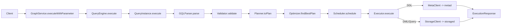
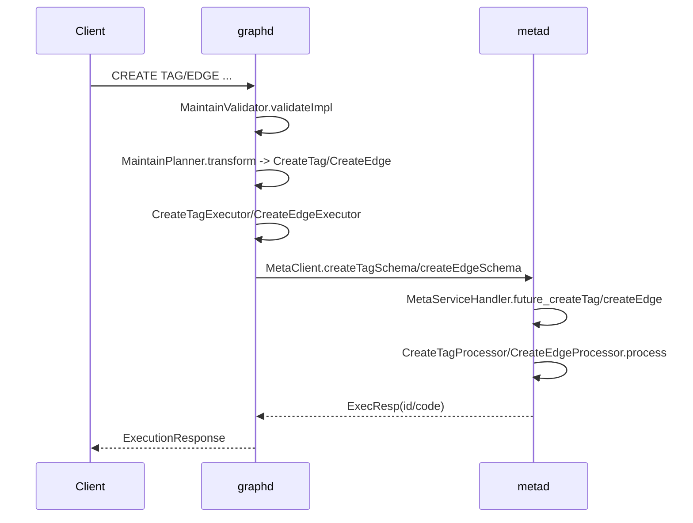
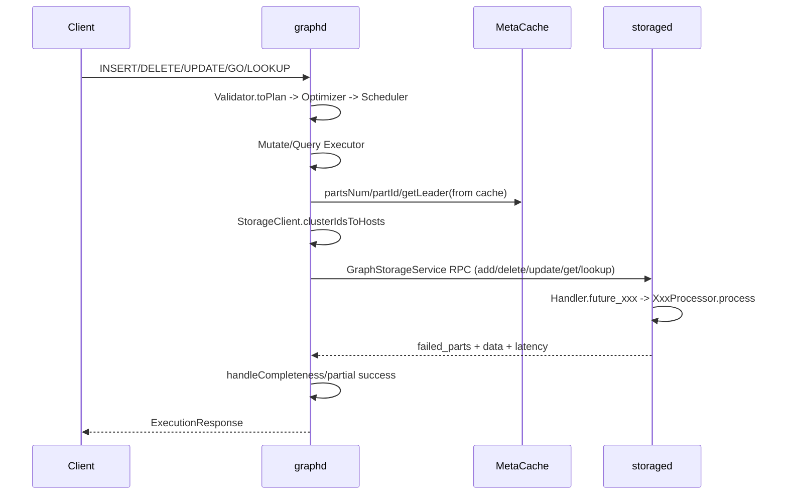

# NebulaGraph nGQL 执行数据流与 CRUD 源码导读（3.6）

## 1. 目标与范围
本文面向 NebulaGraph 初学者，回答 `note1` 的核心要求：
- nGQL 语句从 graphd 入口到执行完成的完整数据流。
- 增删改查阶段 graphd / metad / storaged 的交互细节。
- 关键函数、接口、远程调用（Thrift RPC）定位。
- 给出可直接用于源码跟踪的流程图与阅读顺序。

## 2. 三个服务的职责边界
- `graphd`：接收 nGQL，请求解析/校验/优化/执行；通过 `MetaClient` 访问元数据，通过 `StorageClient` 访问数据。
- `metad`：维护空间、Tag/Edge Schema、索引、分区与 leader 信息。
- `storaged`：按分区落盘与查询图数据（点边写入、删除、更新、邻居遍历、属性读取、索引查询）。

RPC 接口定义：
- graph 接口：`src/interface/graph.thrift:112`
- meta 接口：`src/interface/meta.thrift:1207`
- storage 接口：`src/interface/storage.thrift:683`

## 3. nGQL 通用执行主干（所有语句共享）

### 3.1 graphd 入口与上下文初始化
1. graphd 启动时初始化 `MetaClient` / `SessionManager` / `QueryEngine`  
   `src/graph/service/GraphService.cpp:28`  
2. 客户端调用 `GraphService.executeWithParameter`（thrift）  
   `src/interface/graph.thrift:118`  
3. `GraphService::future_executeWithParameter` 校验 session、组装 `RequestContext`、交给 `QueryEngine`  
   `src/graph/service/GraphService.cpp:146`  
4. `QueryEngine::execute` 创建 `QueryContext` 和 `QueryInstance`  
   `src/graph/service/QueryEngine.cpp:49`

### 3.2 Parser -> Validator -> Planner -> Optimizer
1. `QueryInstance::execute` 先做 `validateAndOptimize`  
   `src/graph/service/QueryInstance.cpp:39`  
2. `GQLParser::parse` 执行 scanner/parser，生成 AST（Sentence）  
   `src/parser/GQLParser.h:41`  
3. `Validator::makeValidator` 按语句类型分派具体 validator（Create/Insert/Delete/Update/Go/Lookup...）  
   `src/graph/validator/Validator.cpp:52`  
4. `Validator::validate` 检查 space、语义、权限，并调用 `toPlan`  
   `src/graph/validator/Validator.cpp:273`, `src/graph/validator/Validator.cpp:332`, `src/graph/validator/Validator.cpp:399`  
5. `Planner::toPlan` 根据 sentence kind 选择 planner  
   `src/graph/planner/Planner.cpp:19`  
6. planner 注册入口（DDL/Sequential/Match）  
   `src/graph/planner/PlannersRegister.cpp:30`  
7. `Optimizer::findBestPlan` 做 rule-based exploration 与 postprocess  
   `src/graph/optimizer/Optimizer.cpp:33`, `src/graph/optimizer/Optimizer.cpp:73`, `src/graph/optimizer/Optimizer.cpp:54`

### 3.3 Scheduler -> Executor
1. `AsyncMsgNotifyBasedScheduler::schedule` 从 plan root 创建执行树并调度  
   `src/graph/scheduler/AsyncMsgNotifyBasedScheduler.cpp:31`  
2. `doSchedule` 按依赖关系构建 future/promise 图，异步执行  
   `src/graph/scheduler/AsyncMsgNotifyBasedScheduler.cpp:44`  
3. `execute` / `runExecute` 生命周期：`open -> execute -> close`，统一兜底异常  
   `src/graph/scheduler/AsyncMsgNotifyBasedScheduler.cpp:241`, `src/graph/scheduler/AsyncMsgNotifyBasedScheduler.cpp:262`  
4. `Executor::makeExecutor` 完成 PlanNode -> Executor 映射  
   `src/graph/executor/Executor.cpp:157`  
5. `Executor::open/close/finish/drop` 负责内存水位检查、profile、结果生命周期优化  
   `src/graph/executor/Executor.cpp:594`, `src/graph/executor/Executor.cpp:609`, `src/graph/executor/Executor.cpp:738`, `src/graph/executor/Executor.cpp:651`

### 3.4 总体数据流图

## 4. DDL 流程（CREATE TAG / CREATE EDGE）：graphd 与 metad

### 4.1 graphd 侧（校验与计划）
1. `CreateTagValidator::validateImpl` / `CreateEdgeValidator::validateImpl` 检查列定义、schema props，写入验证上下文  
   `src/graph/validator/MaintainValidator.cpp:158`, `src/graph/validator/MaintainValidator.cpp:180`  
2. `CreateTagPlanner::transform` / `CreateEdgePlanner::transform` 产出 `CreateTag` / `CreateEdge` PlanNode  
   `src/graph/planner/ngql/MaintainPlanner.cpp:14`, `src/graph/planner/ngql/MaintainPlanner.cpp:25`  
3. PlanNode 定义（携带 schema、ifNotExists）  
   `src/graph/planner/plan/Maintain.h:50`, `src/graph/planner/plan/Maintain.h:72`

### 4.2 graphd 侧（执行器调用 MetaClient）
1. `CreateTagExecutor::execute` 调 `MetaClient::createTagSchema`  
   `src/graph/executor/maintain/TagExecutor.cpp:13`, `src/graph/executor/maintain/TagExecutor.cpp:20`  
2. `CreateEdgeExecutor::execute` 调 `MetaClient::createEdgeSchema`  
   `src/graph/executor/maintain/EdgeExecutor.cpp:13`, `src/graph/executor/maintain/EdgeExecutor.cpp:20`

### 4.3 metad 侧（RPC 分发与持久化）
1. `MetaClient::createTagSchema/createEdgeSchema` 构造请求并经 `getResponse` 发送到 meta leader  
   `src/clients/meta/MetaClient.cpp:1606`, `src/clients/meta/MetaClient.cpp:1701`, `src/clients/meta/MetaClient.cpp:703`  
2. `MetaServiceHandler::future_createTag/future_createEdge` 分发到 processor  
   `src/meta/MetaServiceHandler.cpp:167`, `src/meta/MetaServiceHandler.cpp:193`  
3. `CreateTagProcessor::process` / `CreateEdgeProcessor::process` 校验冲突、分配 ID、写入 KV（index key + schema key）  
   `src/meta/processors/schema/CreateTagProcessor.cpp:13`, `src/meta/processors/schema/CreateEdgeProcessor.cpp:13`

### 4.4 DDL 数据流图

## 5. DML 写路径（INSERT / DELETE / UPDATE）：graphd 与 storaged

### 5.1 INSERT
graphd 关键链路：
1. `InsertVerticesValidator::toPlan` -> `InsertVertices`  
   `src/graph/validator/MutateValidator.cpp:26`  
2. `InsertEdgesValidator::toPlan` -> `InsertEdges`（支持 `TOSS` 隔离级别链式写）  
   `src/graph/validator/MutateValidator.cpp:158`  
3. `InsertVerticesExecutor/InsertEdgesExecutor` 调 `StorageClient::addVertices/addEdges`  
   `src/graph/executor/mutate/InsertExecutor.cpp:19`, `src/graph/executor/mutate/InsertExecutor.cpp:50`  

storage client 路由与 RPC：
1. `clusterIdsToHosts` 按 `partId` 和 leader 聚簇请求  
   `src/clients/storage/StorageClientBase-inl.h:378`  
2. `addVertices/addEdges` 组装 `AddVerticesRequest/AddEdgesRequest` 并发发送  
   `src/clients/storage/StorageClient.cpp:149`, `src/clients/storage/StorageClient.cpp:188`  
3. `collectResponse` 聚合分片结果、延迟、失败 part  
   `src/clients/storage/StorageClientBase-inl.h:80`

storaged 处理：
1. `GraphStorageServiceHandler::future_addVertices/future_addEdges` 分发  
   `src/storage/GraphStorageServiceHandler.cpp:89`, `src/storage/GraphStorageServiceHandler.cpp:115`  
2. `AddVerticesProcessor::process` / `AddEdgesProcessor::process`，内部区分有无索引写路径  
   `src/storage/mutate/AddVerticesProcessor.cpp:24`, `src/storage/mutate/AddEdgesProcessor.cpp:23`

### 5.2 DELETE
graphd 关键链路：
1. `DeleteVerticesValidator::toPlan` 支持“先查边再删点”：`Dedup -> GetNeighbors -> Project -> Dedup -> DeleteEdges -> DeleteVertices`  
   `src/graph/validator/MutateValidator.cpp:371`  
2. `DeleteTagsValidator::toPlan` 构建 `Dedup -> DeleteTags`  
   `src/graph/validator/MutateValidator.cpp:518`  
3. `DeleteEdgesValidator::toPlan` 构建 `Dedup -> DeleteEdges`  
   `src/graph/validator/MutateValidator.cpp:636`

执行器与 RPC：
1. `DeleteVerticesExecutor::deleteVertices`  
   `src/graph/executor/mutate/DeleteExecutor.cpp:22`  
2. `DeleteTagsExecutor::deleteTags`  
   `src/graph/executor/mutate/DeleteExecutor.cpp:84`  
3. `DeleteEdgesExecutor::deleteEdges`（同时构造 out/in 两条边键）  
   `src/graph/executor/mutate/DeleteExecutor.cpp:139`  
4. 对应 storage client：`deleteVertices/deleteTags/deleteEdges`  
   `src/clients/storage/StorageClient.cpp:317`, `src/clients/storage/StorageClient.cpp:349`, `src/clients/storage/StorageClient.cpp:283`

storaged 处理：
- `DeleteVerticesProcessor::process` / `deleteVertices`  
  `src/storage/mutate/DeleteVerticesProcessor.cpp:19`, `src/storage/mutate/DeleteVerticesProcessor.cpp:112`  
- `DeleteEdgesProcessor::process` / `deleteEdges`  
  `src/storage/mutate/DeleteEdgesProcessor.cpp:22`, `src/storage/mutate/DeleteEdgesProcessor.cpp:160`

### 5.3 UPDATE
graphd 关键链路：
1. `UpdateVertexValidator::toPlan` 产出单个 `UpdateVertex`  
   `src/graph/validator/MutateValidator.cpp:855`  
2. `UpdateEdgeValidator::toPlan` 产出两段 `UpdateEdge`（先 out，再 in，第二段 edgeType 取负）  
   `src/graph/validator/MutateValidator.cpp:897`  
3. `UpdateVertexExecutor::execute` / `UpdateEdgeExecutor::execute`  
   `src/graph/executor/mutate/UpdateExecutor.cpp:41`, `src/graph/executor/mutate/UpdateExecutor.cpp:88`

storage client 与 storaged：
1. `StorageClient::updateVertex/updateEdge` 是单分片 leader 直连路径（`getResponse`，非 collect）  
   `src/clients/storage/StorageClient.cpp:381`, `src/clients/storage/StorageClient.cpp:431`  
2. Handler 分发：`future_updateVertex/future_updateEdge`  
   `src/storage/GraphStorageServiceHandler.cpp:107`, `src/storage/GraphStorageServiceHandler.cpp:127`  
3. Processor：`UpdateVertexProcessor::doProcess/buildPlan` 与 `UpdateEdgeProcessor::doProcess/buildPlan`  
   `src/storage/mutate/UpdateVertexProcessor.cpp:30`, `src/storage/mutate/UpdateVertexProcessor.cpp:130`, `src/storage/mutate/UpdateEdgeProcessor.cpp:30`, `src/storage/mutate/UpdateEdgeProcessor.cpp:144`

## 6. 读路径（GO/GET/LOOKUP 等）：graphd 与 storaged

graphd 执行器：
- 邻居遍历：`GetNeighborsExecutor::execute -> StorageClient::getNeighbors`  
  `src/graph/executor/query/GetNeighborsExecutor.cpp:26`, `src/graph/executor/query/GetNeighborsExecutor.cpp:46`  
- 点属性：`GetVerticesExecutor::getVertices -> StorageClient::getProps`  
  `src/graph/executor/query/GetVerticesExecutor.cpp:18`, `src/graph/executor/query/GetVerticesExecutor.cpp:39`  
- 边属性：`GetEdgesExecutor::getEdges -> StorageClient::getProps`  
  `src/graph/executor/query/GetEdgesExecutor.cpp:64`, `src/graph/executor/query/GetEdgesExecutor.cpp:89`  
- 索引查：`IndexScanExecutor::indexScan -> StorageClient::lookupIndex`  
  `src/graph/executor/query/IndexScanExecutor.cpp:25`, `src/graph/executor/query/IndexScanExecutor.cpp:82`

storaged 处理器：
- `GetNeighborsProcessor::process/doProcess/buildPlan`  
  `src/storage/query/GetNeighborsProcessor.cpp:23`, `src/storage/query/GetNeighborsProcessor.cpp:32`, `src/storage/query/GetNeighborsProcessor.cpp:208`  
- `GetPropProcessor::process/doProcess/buildTagPlan/buildEdgePlan`  
  `src/storage/query/GetPropProcessor.cpp:16`, `src/storage/query/GetPropProcessor.cpp:25`, `src/storage/query/GetPropProcessor.cpp:229`, `src/storage/query/GetPropProcessor.cpp:247`  
- `LookupProcessor::process/prepare/buildPlan`  
  `src/storage/index/LookupProcessor.cpp:30`, `src/storage/index/LookupProcessor.cpp:80`, `src/storage/index/LookupProcessor.cpp:118`

## 7. DML/Query 数据流图（graphd <-> storaged）

## 8. 关键技术点（源码级）

### 8.1 分区路由与 leader 感知
- 路由核心：`clusterIdsToHosts`  
  `src/clients/storage/StorageClientBase-inl.h:378`
- 计算分区依赖 `MetaClient::partsNum/partId`  
  `src/clients/meta/MetaClient.cpp:1595`
- leader 变更在 RPC 回包处处理：`E_LEADER_CHANGED` 时更新 leader cache  
  `src/clients/storage/StorageClientBase-inl.h:324`

### 8.2 RPC 聚合模型与“部分成功”
- `StorageRpcResponse` 同时维护 `completeness`、`failedParts`、`hostLatency`  
  `src/clients/storage/StorageClientBase.h:28`
- `collectResponse` 实现 in-flight 限流、并发收敛、失败分片归并  
  `src/clients/storage/StorageClientBase-inl.h:80`
- graph 执行器侧依据 `handleCompleteness` 决定失败还是 partial success（如 `GetNeighbors` / `IndexScan`）  
  `src/graph/executor/query/GetNeighborsExecutor.cpp:87`, `src/graph/executor/query/IndexScanExecutor.cpp:101`

### 8.3 多层内存保护
- QueryEngine 后台线程周期刷新内存高水位  
  `src/graph/service/QueryEngine.cpp:60`
- 执行器入口 `open` 检查内存水位  
  `src/graph/executor/Executor.cpp:594`, `src/graph/executor/Executor.cpp:624`
- storage client 聚合中也检查内存并可提前中断未发请求  
  `src/clients/storage/StorageClientBase-inl.h:103`, `src/clients/storage/StorageClientBase-inl.h:151`, `src/clients/storage/StorageClientBase-inl.h:226`
- storaged 查询处理器在多线程执行阶段检测内存（如 GetNeighbors/GetProp/Lookup）  
  `src/storage/query/GetNeighborsProcessor.cpp:179`, `src/storage/query/GetPropProcessor.cpp:174`, `src/storage/index/LookupProcessor.cpp:307`

### 8.4 执行计划生命周期优化与 Profile
- `Executor::finish/drop` 会按变量引用计数回收中间结果  
  `src/graph/executor/Executor.cpp:738`, `src/graph/executor/Executor.cpp:651`
- `Executor::close` 回填 profile 统计（总时延、exec 时延、行数、附加 stats）  
  `src/graph/executor/Executor.cpp:609`
- 请求会把 `session_id/plan_id/profile_detail` 下发到 storage，支持端到端 profiling  
  `src/clients/storage/StorageClient.cpp:32`

### 8.5 MetaClient 的重试与 leader 切换
- `MetaClient::getResponse` 统一处理 RPC 异常、leader changed、重试退避  
  `src/clients/meta/MetaClient.cpp:703`
- graphd 启动阶段会等待 metad ready 并启动心跳任务  
  `src/clients/meta/MetaClient.cpp:128`

## 9. RPC 接口速查表（按操作）

| 操作 | graphd 执行器 | 客户端调用 | thrift 方法 | 服务端处理 |
|---|---|---|---|---|
| CREATE TAG | `CreateTagExecutor` | `MetaClient::createTagSchema` | `MetaService.createTag` | `MetaServiceHandler::future_createTag -> CreateTagProcessor` |
| CREATE EDGE | `CreateEdgeExecutor` | `MetaClient::createEdgeSchema` | `MetaService.createEdge` | `MetaServiceHandler::future_createEdge -> CreateEdgeProcessor` |
| INSERT VERTEX | `InsertVerticesExecutor` | `StorageClient::addVertices` | `GraphStorageService.addVertices` | `GraphStorageServiceHandler::future_addVertices -> AddVerticesProcessor` |
| INSERT EDGE | `InsertEdgesExecutor` | `StorageClient::addEdges` | `GraphStorageService.addEdges/chainAddEdges` | `future_addEdges/future_chainAddEdges -> AddEdges/ChainAddEdges` |
| DELETE VERTEX | `DeleteVerticesExecutor` | `StorageClient::deleteVertices` | `GraphStorageService.deleteVertices` | `future_deleteVertices -> DeleteVerticesProcessor` |
| DELETE EDGE | `DeleteEdgesExecutor` | `StorageClient::deleteEdges` | `GraphStorageService.deleteEdges/chainDeleteEdges` | `future_deleteEdges/future_chainDeleteEdges -> DeleteEdges/ChainDeleteEdges` |
| UPDATE VERTEX | `UpdateVertexExecutor` | `StorageClient::updateVertex` | `GraphStorageService.updateVertex` | `future_updateVertex -> UpdateVertexProcessor` |
| UPDATE EDGE | `UpdateEdgeExecutor` | `StorageClient::updateEdge` | `GraphStorageService.updateEdge/chainUpdateEdge` | `future_updateEdge/future_chainUpdateEdge -> UpdateEdge/ChainUpdateEdge` |
| GO/GET | `GetNeighbors/GetVertices/GetEdgesExecutor` | `getNeighbors/getProps` | `GraphStorageService.getNeighbors/getProps` | `GetNeighborsProcessor/GetPropProcessor` |
| LOOKUP | `IndexScanExecutor` | `lookupIndex` | `GraphStorageService.lookupIndex` | `LookupProcessor` |

## 10. 建议的源码阅读顺序
1. 先看总入口：`GraphService.cpp -> QueryEngine.cpp -> QueryInstance.cpp`  
2. 再看语法链：`GQLParser.h -> Validator.cpp -> Planner.cpp -> Optimizer.cpp`  
3. 再看执行链：`AsyncMsgNotifyBasedScheduler.cpp -> Executor.cpp`  
4. 然后按场景深入：
- DDL：`MaintainValidator.cpp -> MaintainPlanner.cpp -> Tag/EdgeExecutor.cpp -> MetaClient.cpp -> MetaServiceHandler.cpp -> CreateTag/EdgeProcessor.cpp`
- DML/Query：`MutateValidator.cpp + Query Executors -> StorageClient.cpp/StorageClientBase-inl.h -> GraphStorageServiceHandler.cpp -> 对应 Processor`

---

如果你接下来要做“单条语句断点调试”，建议从 `QueryInstance::execute`（`src/graph/service/QueryInstance.cpp:39`）打第一断点，再按语句类型跳到对应 executor（例如 `InsertExecutor.cpp`、`TagExecutor.cpp`、`GetNeighborsExecutor.cpp`）一路跟到 thrift handler 与 processor。
