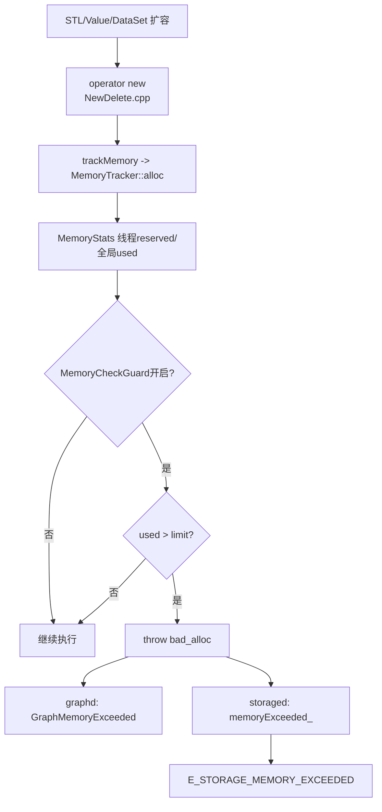
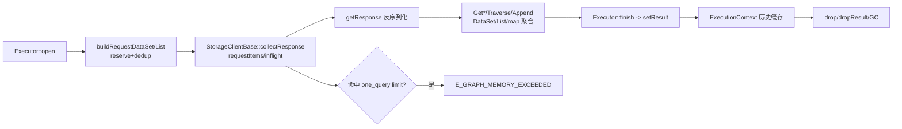
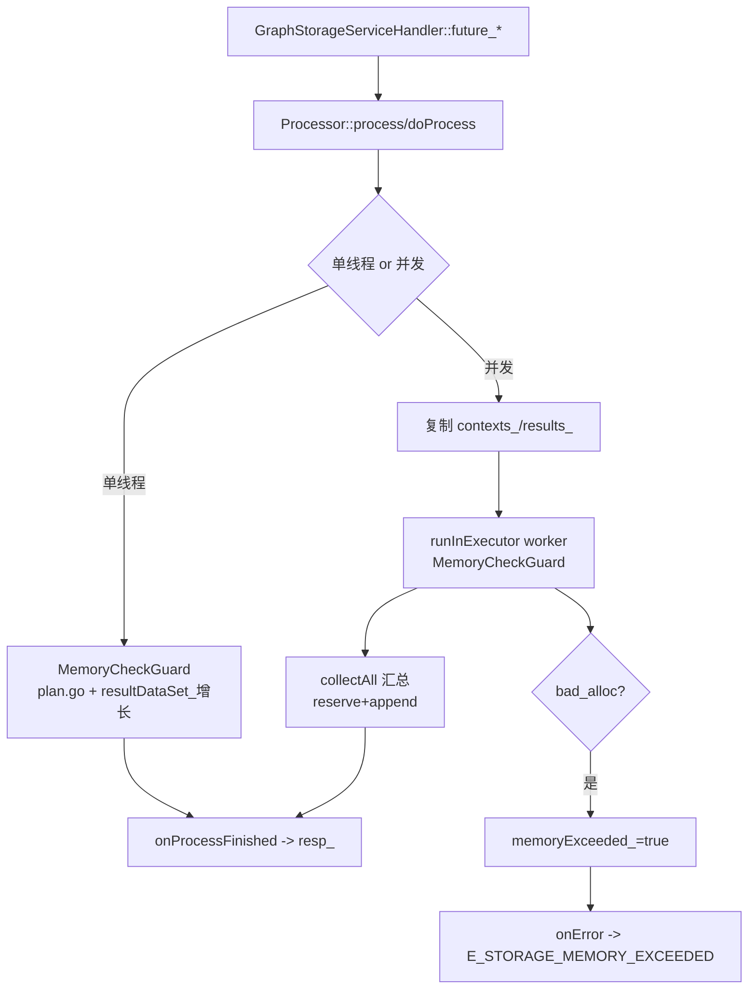

# NebulaGraph 任务三：graphd/storaged 查询过程关键内存申请全流程与 OOM 路径

> 范围说明：本文聚焦 **查询链路**（`GO/LOOKUP/GET PROP/TRAVERSE/MATCH` 对应执行器与处理器）中的关键内存申请与释放，不展开 DDL/写请求路径。
>
> 基线源码：`nebula-release-3.6`（当前工程目录）。

## 1. 全局内存跟踪框架（query 路径共用）

### 1.1 new/delete 统一挂钩到 MemoryTracker
- 全局 `operator new/delete` 被替换并接入 `trackMemory/untrackMemory`：`src/common/memory/NewDelete.cpp:17`
- 这意味着查询过程中 STL 容器扩容、`Value/DataSet/Row` 构造等，最终都能进入统一跟踪。

### 1.2 MemoryStats 的线程本地配额 + 全局 used/limit
- 线程先消耗本地 `reserved`，不足时向全局申请：`src/common/memory/MemoryTracker.h:66`
- 全局申请时若超过 `limit_` 并允许抛错，抛 `std::bad_alloc`：`src/common/memory/MemoryTracker.h:158`
- 释放时回补线程本地，超过阈值再归还全局：`src/common/memory/MemoryTracker.h:86`
- `MemoryTracker::alloc/free/realloc` 入口：`src/common/memory/MemoryTracker.cpp:21`

### 1.3 查询期“开关式”内存保护
- 开启抛错保护：`MemoryCheckGuard`，`src/common/memory/MemoryTracker.h:179`
- 临时关闭保护：`MemoryCheckOffGuard`，`src/common/memory/MemoryTracker.h:191`
- graphd/storaged 在跨线程汇总、RPC 调度等场景会显式开关这两个 guard。

### 1.4 双层阈值检测：系统高水位 + 单查询上限
- 系统高水位检测：`hitsHighWatermark()`，`src/common/memory/MemoryUtils.cpp:86`
- 单查询上限检测：`hitsOneQueryMemoryLimit()`，`src/common/memory/MemoryUtils.cpp:142`
- graphd 周期线程更新水位：`src/graph/service/QueryEngine.cpp:60`
- storaged 周期线程更新水位：`src/storage/StorageServer.cpp:73`

---

## 2. graphd 查询内存申请全流程

### 2.1 执行器生命周期中的内存门禁与结果落盘
- 每个执行器 `open()` 先检查内存水位：`src/graph/executor/Executor.cpp:594`
- 结果写入 `ExecutionContext` 前，会开启 query memory 检查标记：`src/graph/executor/Executor.cpp:738`
- `Result` 内部持有 `shared_ptr<Value>`，且把 `checkMemory` 传播到迭代器：`src/graph/context/Result.h:100`
- 迭代读取过程中会周期触发单查询内存检测：`src/graph/context/iterator/Iterator.cpp:15`

### 2.2 输入构造阶段（常见大对象申请）
- `StorageAccessExecutor` 构造请求数据时典型热点：
  - `DataSet rows.reserve(...)`：`src/graph/executor/StorageAccessExecutor.cpp:51`
  - `vector<Value>::reserve(...)`：`src/graph/executor/StorageAccessExecutor.cpp:102`
  - 去重 `unordered_set` 扩容：`src/graph/executor/StorageAccessExecutor.cpp:55`
- 并在循环中按批次检测是否超限：`src/graph/executor/StorageAccessExecutor.cpp:63`、`src/graph/executor/StorageAccessExecutor.cpp:115`

### 2.3 RPC 聚合阶段（graphd -> storaged）
- `collectResponse()` 先关闭抛错 guard，组织 `requestItems` 缓冲：`src/clients/storage/StorageClientBase-inl.h:80`
- 发包前若已超限，直接构造失败结果（`E_GRAPH_MEMORY_EXCEEDED`）：`src/clients/storage/StorageClientBase-inl.h:103`
- 回包处理 `handleOneResponse()` 内开启 `MemoryCheckGuard`，聚合 `responses/failedParts/latency`：`src/clients/storage/StorageClientBase-inl.h:180`
- 命中超限会中止未发请求并标记失败 part：`src/clients/storage/StorageClientBase-inl.h:151`
- `getResponse()` 中反序列化与失败处理也在 guard 下，`bad_alloc` 映射为 `GraphMemoryExceeded`：`src/clients/storage/StorageClientBase-inl.h:291`

### 2.4 回包拼装阶段（query executor 热点）
- `GetNeighborsExecutor`：
  - 把多个 `GetNeighborsResponse` 聚合成 `List<DataSet>`：`src/graph/executor/query/GetNeighborsExecutor.cpp:86`
  - `list.values.emplace_back(std::move(*dataset))` 为主要增长点：`src/graph/executor/query/GetNeighborsExecutor.cpp:104`
- `GetVerticesExecutor` / `GetEdgesExecutor`：
  - 输入 `DataSet` 构造 + `getProps` 回包合并：`src/graph/executor/query/GetVerticesExecutor.cpp:24`、`src/graph/executor/query/GetEdgesExecutor.cpp:21`
- `IndexScanExecutor`：
  - 回包 `DataSet.rows.insert(...)` 聚合：`src/graph/executor/query/IndexScanExecutor.cpp:100`
- `TraverseExecutor`（内存最重）：
  - `vids_/adjList_/initVertices_` 多层容器扩容与移动：`src/graph/executor/query/TraverseExecutor.cpp:38`、`src/graph/executor/query/TraverseExecutor.cpp:219`、`src/graph/executor/query/TraverseExecutor.cpp:360`
  - BFS 构路过程频繁 `vector<Row>`、`queue<vector<Value>*>`、`list<unique_ptr<vector<Value>>>` 分配：`src/graph/executor/query/TraverseExecutor.cpp:527`
- `AppendVerticesExecutor`：
  - map + DataSet 双重合并：`src/graph/executor/query/AppendVerticesExecutor.cpp:116`
  - 多线程 gather 阶段把各子任务结果写回 `result_.rows`：`src/graph/executor/query/AppendVerticesExecutor.cpp:183`

### 2.5 执行上下文驻留与释放
- 结果放入 `ExecutionContext::setResult`（历史版本保留）：`src/graph/context/ExecutionContext.cpp:23`
- 生命周期优化开启时，执行器会 `drop()` 输入变量并触发 `dropResult()`：`src/graph/executor/Executor.cpp:651`
- `dropResult()` 可走异步 GC：`src/graph/context/ExecutionContext.cpp:29`

---

## 3. storaged 查询内存申请全流程

### 3.1 请求入口与异常兜底
- `GraphStorageServiceHandler` 的 `RETURN_FUTURE` 宏捕获 `bad_alloc`，转为 `memoryExceeded()+onError()`：`src/storage/GraphStorageServiceHandler.cpp:34`
- `BaseProcessor::onError()` 将内存超限映射为 `E_STORAGE_MEMORY_EXCEEDED`：`src/storage/BaseProcessor.h:65`
- 异步执行路径统一通过 `MemoryCheckScope` 自动兜底：`src/storage/BaseProcessor.h:169`

### 3.2 GetNeighborsProcessor（查询主路径之一）
- 单线程模式：
  - `MemoryCheckGuard` 打开：`src/storage/query/GetNeighborsProcessor.cpp:77`
  - `resultDataSet_` 作为输出缓存持续增长：`src/storage/query/QueryBaseProcessor.h:221`
- 并发模式：
  - 先复制 `resultDataSet_` 到 `results_`、构造 `contexts_`：`src/storage/query/GetNeighborsProcessor.cpp:119`
  - 每个 worker 在 `runInExecutor()` 内开 guard 执行 plan：`src/storage/query/GetNeighborsProcessor.cpp:166`
  - `collectAll` 汇总时先 `reserve(sum)` 再 `append`：`src/storage/query/GetNeighborsProcessor.cpp:134`
- 输出落到响应：`resp_.vertices = move(resultDataSet_)`：`src/storage/query/GetNeighborsProcessor.cpp:491`

### 3.3 GetPropProcessor（点/边属性读取）
- 单线程：`MemoryCheckGuard` + `buildTagPlan/buildEdgePlan` 执行：`src/storage/query/GetPropProcessor.cpp:58`
- 并发：
  - 初始化 `results_` 缓冲：`src/storage/query/GetPropProcessor.cpp:119`
  - 汇总前 `reserve(sum)`，再逐分片 append：`src/storage/query/GetPropProcessor.cpp:133`
  - worker 的 `bad_alloc` 会把 `memoryExceeded_` 置 true：`src/storage/query/GetPropProcessor.cpp:165`
- 输出：`resp_.props = move(resultDataSet_)`：`src/storage/query/GetPropProcessor.cpp:359`

### 3.4 LookupProcessor（索引查询）
- `prepare()` 构造 `resultDataSet_` 列定义：`src/storage/index/LookupProcessor.cpp:80`
- 单线程模式：
  - `MemoryCheckGuard` 下以 `deque<Row>` 暂存每个 part 结果，再搬运到 `resultDataSet_`：`src/storage/index/LookupProcessor.cpp:219`
- 并发模式：
  - `reproducePlan()` 克隆计划树（每 part 一份）：`src/storage/index/LookupProcessor.cpp:267`
  - worker 中 `deque<Row>` 持续增长：`src/storage/index/LookupProcessor.cpp:275`
  - 汇总阶段将各 worker 的 row `emplace_back` 到 `resultDataSet_`：`src/storage/index/LookupProcessor.cpp:311`
- 输出：`resp_.data/resp_.stat_data` 在 `onProcessFinished()` 赋值：`src/storage/index/LookupProcessor.h:33`

---

## 4. OOM 触发与传播路径

### 4.1 graphd 侧
1. 容器扩容/对象申请触发 `operator new` -> `MemoryTracker::alloc`。  
2. `hitsOneQueryMemoryLimit()` 或 `MemoryCheckGuard` 下 `bad_alloc` 命中。  
3. `StorageAccessExecutor::checkMemoryAndAbortQuery()` 返回 `memoryExceededStatus()`：`src/graph/executor/StorageAccessExecutor.h:189`  
4. 错误码映射到 `E_GRAPH_MEMORY_EXCEEDED`，并可通过 StorageClient 传播到 failed part。  

### 4.2 storaged 侧
1. processor/plan 执行中触发 `bad_alloc`。  
2. `MemoryCheckScope` 或 `RETURN_FUTURE` 捕获后设置 `memoryExceeded_`。  
3. `BaseProcessor::onError()` 统一返回 `E_STORAGE_MEMORY_EXCEEDED`：`src/storage/BaseProcessor.h:80`。  
4. graphd 收到后在 `StorageAccessExecutor` 映射为 `Status::StorageMemoryExceeded`：`src/graph/executor/StorageAccessExecutor.h:146`。  

---

## 5. 内存申请流图

### 图1：全局内存申请与保护机制

### 图2：graphd 查询内存流（构造 -> RPC -> 聚合 -> 释放）

### 图3：storaged 查询内存流（以 GetNeighbors/GetProp/Lookup 为代表）

---

## 6. 关键观察点（用于 OOM 排查）

- 配置阈值：
  - `one_query_max_memory_usage`：`src/common/memory/MemoryUtils.cpp:28`
  - `memory_tracker_limit_ratio`：`src/common/memory/MemoryUtils.cpp:62`
- graphd 入口检查点：
  - `Executor::checkMemoryWatermark()`：`src/graph/executor/Executor.cpp:624`
  - `StorageAccessExecutor::checkMemoryAndAbortQuery()`：`src/graph/executor/StorageAccessExecutor.h:189`
- storaged 入口检查点：
  - `RETURN_FUTURE`：`src/storage/GraphStorageServiceHandler.cpp:34`
  - `BaseProcessor::onError` 返回码：`src/storage/BaseProcessor.h:65`

## 7. 结论（任务三交付）

- graphd 与 storaged 的查询内存控制并非“单点判断”，而是：
  1. 全局 new/delete 计量  
  2. query 期 guard 抛错  
  3. 执行器/处理器循环中的显式阈值检查  
  4. RPC 聚合阶段中断与错误码传播  
- 对 OOM 最敏感的热点在：
  - graphd：`TraverseExecutor`、`AppendVerticesExecutor`、`StorageClientBase::collectResponse` 聚合段
  - storaged：`GetNeighbors/GetProp` 并发汇总 `reserve+append`，以及 `Lookup` 多分区 `deque<Row>` 聚合段
