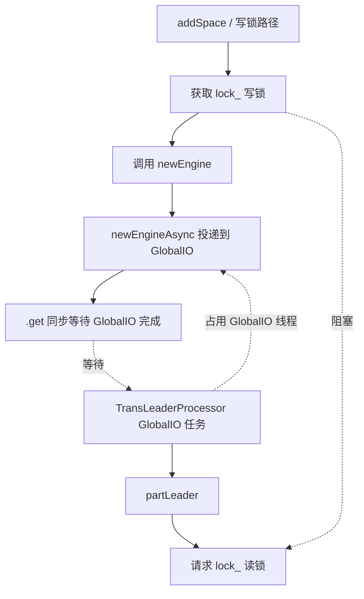

# NebulaStore 中 `folly::RWSpinLock lock_` 与 `folly::getGlobalIOExecutor()` 的潜在死锁场景分析

## 1. 结论摘要

当前代码里，`NebulaStore` 的 `lock_` 用来保护 `spaces_` 和 `spaceListeners_` 两个容器；它是一个进程内的读写自旋锁。`NebulaStore` 中最危险的组合是：

1. 某个线程已经拿到 `lock_` 的写锁；
2. 该线程在写锁保护区内调用 `newEngine()`；
3. `newEngine()` 会提交 `newEngineAsync()` 到 `folly::getGlobalIOExecutor()`，然后同步 `.get()` 等待 GlobalIO 线程执行完成；
4. 如果 GlobalIO 线程池中所有线程此时都阻塞在需要 `lock_` 读锁的任务上，例如 `TransLeaderProcessor` 的异步 leader 轮询任务调用 `NebulaStore::partLeader()`，这些读锁请求会被已有写锁挡住；
5. 写锁持有者又在等待 GlobalIO 线程执行 `newEngineAsync()`，但 GlobalIO 线程都被读锁请求占满，形成闭环等待。

因此，代码中真正可确认的核心死锁链路是：

```text
写锁持有者：NebulaStore::addSpace()
  -> 持有 lock_ 写锁
  -> newEngine()
  -> newEngineAsync() 投递到 GlobalIO
  -> .get() 同步等待 GlobalIO

GlobalIO 工作线程：TransLeaderProcessor 的 leader 轮询任务
  -> 调用 NebulaStore::partLeader()
  -> 等待 lock_ 读锁

结果：
  addSpace 等 GlobalIO；GlobalIO 等 addSpace 释放写锁。
```

需要特别澄清：从当前仓库代码看，显式使用 `folly::getGlobalIOExecutor()` 的位置只有两个：

- `NebulaStore::newEngineAsync()`：在 GlobalIO 上创建 RocksEngine，本身不直接获取 `lock_`。
- `TransLeaderProcessor`：在 GlobalIO 上轮询新 leader，调用 `NebulaStore::partLeader()`，需要获取 `lock_` 读锁。

也就是说，**当前代码中没有发现显式投递到 GlobalIO 的任务直接获取 `lock_` 写锁**。所谓“GlobalIO 线程池中有的线程占用写锁、有的占用读锁”的情况，在当前显式代码路径中并不成立；更准确的风险是：**非 GlobalIO 线程持有写锁并等待 GlobalIO，而 GlobalIO 线程全部阻塞在读锁获取上**。如果未来或者运行时集成层把 `addSpace()` 这类写锁路径也放到 GlobalIO 中执行，则还会出现“GlobalIO 线程持有写锁并等待同一个 GlobalIO 线程池”的更强自锁风险。

## 2. 相关代码事实

### 2.1 `lock_` 保护的数据

`NebulaStore.h` 中注释明确说明 `lock_` 用于保护 `spaces_`，实际代码还用同一把锁保护 `spaceListeners_`：

```cpp
// The lock used to protect spaces_
folly::RWSpinLock lock_;
std::unordered_map<GraphSpaceID, std::shared_ptr<SpacePartInfo>> spaces_;
std::unordered_map<GraphSpaceID, std::shared_ptr<SpaceListenerInfo>> spaceListeners_;
```

### 2.2 `newEngineAsync()` 使用 GlobalIO

`newEngineAsync()` 把 engine 创建任务投递到 `folly::getGlobalIOExecutor()`：

```cpp
return folly::via(folly::getGlobalIOExecutor().get(), [this, spaceId, dataPath, walPath]() {
  ...
  engine = std::make_unique<RocksEngine>(...);
  return std::make_pair(spaceId, std::move(engine));
});
```

`newEngine()` 立即调用 `.get()` 同步等待该 Future：

```cpp
auto pair = this->newEngineAsync(spaceId, dataPath, walPath).get();
return std::move(pair.second);
```

### 2.3 `addSpace()` 在写锁内同步等待 GlobalIO

`addSpace()` 一进入函数就获取 `lock_` 写锁；如果需要补建 engine，会在写锁持有期间调用 `newEngine()`：

```cpp
folly::RWSpinLock::WriteHolder wh(&lock_);
...
spaces_[spaceId]->engines_.emplace_back(newEngine(spaceId, path, options_.walPath_));
...
this->spaces_[spaceId]->engines_.emplace_back(newEngine(spaceId, path, options_.walPath_));
```

这是所有死锁分析中的关键点：**写锁没有在等待 GlobalIO 前释放**。

### 2.4 `TransLeaderProcessor` 在 GlobalIO 上调用读锁路径

`TransLeaderProcessor` 在 transfer leader 成功后，为避免其它死锁，把“检查新 leader”的逻辑投递到 GlobalIO：

```cpp
folly::via(folly::getGlobalIOExecutor().get(), [this, part, spaceId, partId] {
  ...
  auto leaderRet = env_->kvstore_->partLeader(spaceId, partId);
  ...
  sleep(FLAGS_waiting_new_leader_interval_in_secs);
});
```

`partLeader()` 内部获取 `lock_` 读锁：

```cpp
folly::RWSpinLock::ReadHolder rh(&lock_);
```

因此，GlobalIO 线程上的 `TransLeaderProcessor` 任务会被 `NebulaStore` 写锁阻塞。

## 3. 锁与 GlobalIO 交互图



## 4. 当前代码中可能出现的场景清单

### 场景 1：新增不存在的 Space 时，`AddPartProcessor` 触发 `addSpace()`，同时 GlobalIO 被 transfer leader 轮询任务占满

#### 触发路径

1. Storage admin 收到 `addPart` 请求后进入 `AddPartProcessor::process()`。
2. 它先调用 `store->space(spaceId)` 判断 space 是否存在；如果返回 `E_SPACE_NOT_FOUND`，就调用 `store->addSpace(spaceId)`。
3. `addSpace()` 获取 `lock_` 写锁。
4. `addSpace()` 在写锁内为每个 `dataPath` 调用 `newEngine()`。
5. `newEngine()` 调用 `newEngineAsync(...).get()`，等待 GlobalIO 线程创建 engine。
6. 与此同时，多个 transfer leader 成功后的 `TransLeaderProcessor` 任务已经投递到 GlobalIO，并且每个任务都调用 `partLeader()` 尝试获取 `lock_` 读锁。
7. 由于 `addSpace()` 已经持有写锁，GlobalIO 线程上的 `partLeader()` 全部阻塞。
8. 由于 GlobalIO 线程全部被阻塞，没有线程能执行 `newEngineAsync()`，`addSpace()` 不能返回，也不会释放写锁。

#### 死锁条件

该场景需要同时满足：

- GlobalIO 线程池容量有限，且所有工作线程都被 `TransLeaderProcessor` 的 GlobalIO 任务占用；
- 这些 GlobalIO 任务都已经进入或即将进入 `partLeader()`，并因写锁而阻塞；
- `addSpace()` 在持有写锁的情况下提交了新的 `newEngineAsync()` 任务并 `.get()` 等待；
- 没有额外的 GlobalIO 空闲线程可以执行 `newEngineAsync()`。

#### 为什么是死锁而不是慢请求

`TransLeaderProcessor` 的 GlobalIO 任务里虽然有 retry 和 `sleep()`，但阻塞发生在 `partLeader()` 进入函数时获取读锁的位置。一旦读锁获取被写锁挡住，该线程不会走到后续 retry 或 sleep 逻辑。因此当所有 GlobalIO 线程都卡在读锁获取处时，`newEngineAsync()` 没有机会被调度执行。

#### 代码依据

- `AddPartProcessor::process()` 在 space 不存在时调用 `store->addSpace(spaceId)`，随后调用 `store->addPart(...)`。
- `addSpace()` 持有写锁并在写锁内调用 `newEngine()`。
- `newEngine()` 同步等待 `newEngineAsync()`。
- `newEngineAsync()` 投递到 GlobalIO。
- `TransLeaderProcessor` 的 GlobalIO 任务调用 `partLeader()`。
- `partLeader()` 获取读锁。

### 场景 2：Meta 监听到新 Space 后回调 `MetaServerBasedPartManager::onSpaceAdded()`，触发 `addSpace()`，同时 GlobalIO 被读锁任务占满

#### 触发路径

1. `MetaServerBasedPartManager` 注册为 MetaClient 的监听者。
2. 当 meta cache 感知新 space 时，`MetaServerBasedPartManager::onSpaceAdded()` 调用 `handler_->addSpace(spaceId)`。
3. `handler_` 即 `NebulaStore`，因此进入 `NebulaStore::addSpace()`。
4. 后续与场景 1 完全相同：`addSpace()` 持有写锁，写锁内调用 `newEngine()`，同步等待投递到 GlobalIO 的 `newEngineAsync()`。
5. 如果 GlobalIO 此时全部阻塞在 `TransLeaderProcessor -> partLeader() -> lock_ 读锁` 上，则形成同样闭环。

#### 与场景 1 的差异

场景 1 的入口是 storage admin RPC 的 `addPart`；场景 2 的入口是 meta cache listener 回调。两者最终都会进入同一个危险点：`NebulaStore::addSpace()` 写锁内同步等待 GlobalIO。

#### 代码依据

- `MetaServerBasedPartManager` 构造时注册 listener。
- `onSpaceAdded()` 调用 `handler_->addSpace(spaceId)`。
- `addSpace()`、`newEngine()`、`newEngineAsync()` 的调用关系同场景 1。

### 场景 3：已有 Space 缺少某个 dataPath 对应的 engine，`addSpace()` 在“补 engine”分支中等待 GlobalIO

#### 触发路径

`addSpace()` 不只在创建全新 space 时会调用 `newEngine()`。如果 `spaces_` 中已经存在该 `spaceId`，它还会遍历所有配置的 `options_.dataPaths_`，检查每个 dataPath 下是否已有对应 engine：

```cpp
if (this->spaces_.find(spaceId) != this->spaces_.end()) {
  ...
  if (!engineExist) {
    spaces_[spaceId]->engines_.emplace_back(newEngine(spaceId, path, options_.walPath_));
  }
}
```

如果某个路径缺 engine，该分支也会在同一把写锁内调用 `newEngine()` 并等待 GlobalIO。

#### 可能出现的运行条件

- 本地 `spaces_` 已经有该 space，但配置中的某个 data path 尚未创建 engine；
- meta 回调或 admin 请求再次触发 `addSpace(spaceId)`；
- GlobalIO 被 `TransLeaderProcessor` 的读锁任务占满。

该场景本质上是场景 1/2 的变体，但值得单独列出，因为它不要求 space 完全不存在，只要求需要补建 engine。

### 场景 4：进程启动 `loadPartFromPartManager()` 阶段调用 `addSpace()`，在特殊并发条件下与 GlobalIO 读锁任务形成闭环

#### 触发路径

`NebulaStore::init()` 中，普通 storage 模式会依次调用：

```cpp
loadPartFromDataPath();
loadPartFromPartManager();
loadRemoteListenerFromPartManager();
```

`loadPartFromPartManager()` 从 part manager 中拿到当前 host 的 parts，然后对每个 space 调用 `addSpace(spaceId)`，再调用 `addPart(...)`。

因此，如果启动阶段已经存在其它来源投递到 GlobalIO 的 `TransLeaderProcessor` leader 轮询任务，并且这些任务阻塞在 `partLeader()` 读锁上，`loadPartFromPartManager()` 里的 `addSpace()` 也会出现同样问题。

#### 风险等级说明

这个场景在正常启动流程中概率较低，因为 raft service 和 handler 注册发生在 `init()` 中，通常外部 admin 流量还没有完全进入。但从代码结构看，`loadPartFromPartManager()` 确实会走 `addSpace()`，而 `addSpace()` 的锁等待 GlobalIO 问题与入口无关，所以在测试、嵌入式使用、异常重启或外部并发调用时仍是一个理论可达风险。

### 场景 5：如果未来把写锁路径投递到 GlobalIO，会形成更直接的 GlobalIO 自锁

#### 当前代码状态

当前仓库中显式 `folly::getGlobalIOExecutor()` 只有两个使用点：

- `NebulaStore::newEngineAsync()`；
- `TransLeaderProcessor` 的 leader 轮询任务。

其中，`newEngineAsync()` 本身不直接获取 `lock_`；`TransLeaderProcessor` 只通过 `partLeader()` 获取读锁。因此，当前代码里没有发现“GlobalIO 任务直接进入 `addSpace()` 并持有写锁”的显式路径。

#### 未来/集成层风险

如果未来改动或外部集成把如下写锁入口放到 GlobalIO 上执行：

- `NebulaStore::addSpace()`；
- `NebulaStore::addPart()`；
- `NebulaStore::removePart()`；
- `NebulaStore::removeSpace()`；
- `NebulaStore::addListenerPart()` / `removeListenerPart()`；

那么 `addSpace()` 会尤其危险：GlobalIO 某个线程拿到写锁后调用 `newEngine()`，再向同一个 GlobalIO 线程池投递 `newEngineAsync()` 并同步等待。在线程池较小或其它线程被读锁任务占满时，这会变成“GlobalIO 等 GlobalIO”的自锁。即使没有读锁任务参与，单线程 GlobalIO 配置下也可能自锁。

### 场景 6：大量 GlobalIO leader 轮询任务长时间占用线程，放大上述死锁窗口

`TransLeaderProcessor` 的 GlobalIO lambda 中有最多多轮 retry，并在未找到 leader 时调用 `sleep(FLAGS_waiting_new_leader_interval_in_secs)`。这意味着一个 transfer leader 请求成功后，其 GlobalIO 任务可能长时间占用 GlobalIO 线程。

这本身不一定造成 `lock_` 死锁，因为任务睡眠时不持有 `lock_`。但它会放大风险窗口：

- 如果大量任务在 sleep，它们会占用 GlobalIO 线程，降低 `newEngineAsync()` 获得执行机会；
- 一旦 `addSpace()` 拿到写锁，睡眠结束的任务再次调用 `partLeader()` 时会阻塞在读锁上；
- 当所有 GlobalIO 线程都进入这种读锁等待状态后，`addSpace()` 投递的 `newEngineAsync()` 就无法执行。

因此，这不是一个独立的锁闭环，而是场景 1/2/3/4 的放大器。

## 5. 与 `lock_` 有关但不构成“GlobalIO + lock_”死锁的路径

为了避免误判，下面列出当前代码中与 `lock_` 有关但没有直接形成上述 GlobalIO 闭环的路径。

### 5.1 `part()` 读锁路径通常只短暂查表

大多数 KV 读写接口先调用 `part(spaceId, partId)`，`part()` 内部只拿读锁查找 `spaces_` 和 `parts_`，返回 `std::shared_ptr<Part>` 后读锁释放。随后真正的 `engine()->get()`、`range()`、`asyncMultiPut()` 等操作不再持有 `lock_`。

所以这些普通 KV 请求会被写锁短暂阻塞，但不会因为自身投递到 GlobalIO 而形成本文所述的闭环。

### 5.2 `space()` 读锁路径返回 shared_ptr 后释放锁

`ingest()`、`setOption()`、`setDBOption()`、`compact()`、`flush()`、`createCheckpoint()`、`dropCheckpoint()`、`setWriteBlocking()` 等函数会先调用 `space(spaceId)`；`space()` 只是读锁查表并返回 `std::shared_ptr<SpacePartInfo>`。后续耗时操作通常在锁外执行。

这些路径可能与 remove/add 并发产生生命周期和一致性层面的讨论，但不是“持有读锁占满 GlobalIO，阻塞写锁等待 GlobalIO”的直接来源。

### 5.3 `cleanWAL()` 持有读锁执行较重操作，但运行在线程 `storeWorker_` 上

`cleanWAL()` 获取读锁后遍历 engine 和 part，并可能执行 `flush()`、`part->cleanWal()`、`listener->cleanWal()`。它会延长写锁等待时间，但它是通过 `storeWorker_` 定时任务调度，不是 GlobalIO 任务，因此不会直接占满 GlobalIO。

不过，如果 `cleanWAL()` 长时间持有读锁，`addSpace()` 的写锁获取会延迟；这会增加后续进入写锁等待 GlobalIO 的时序不确定性。

### 5.4 `addPart()` 持有写锁执行较多外部操作，但不直接等待 GlobalIO

`addPart()` 持有写锁期间会调用 `targetEngine->addPart()`，并调用 `newPart()`；`newPart()` 又会 `raftService_->addPartition(part)`、执行 `onNewPartAdded_` 回调、`part->start(...)`、`diskMan_->addPartToPath(...)`。这些操作都在写锁内，临界区偏大。

但当前代码中 `addPart()` 不调用 `newEngine()`，也不直接提交任务到 `folly::getGlobalIOExecutor()` 并等待。因此它可能导致读锁请求排队，但不是本文核心 GlobalIO 闭环的直接起点。

### 5.5 listener 增删路径持有写锁执行 raft/listener 操作，但不直接等待 GlobalIO

`addListenerPart()`、`removeListenerPart()`、`newListener()` 等 listener 路径在写锁内做了较重操作，如创建 `ESListener`、`raftService_->addPartition()`、`listener->start()`、`raftService_->removePartition()`、`listener->resetListener()`。这会扩大写锁临界区。

但它们当前没有直接调用 `newEngineAsync()` 或 `folly::getGlobalIOExecutor()`，所以不是“写锁等待 GlobalIO”的直接来源。

## 6. 风险排序

| 风险等级 | 场景 | 原因 |
| --- | --- | --- |
| 高 | `addSpace()` 写锁内 `newEngine().get()` + GlobalIO 中 `partLeader()` 读锁任务占满 | 已有代码明确可组成闭环 |
| 中 | Meta 回调 `onSpaceAdded()` / 启动 `loadPartFromPartManager()` 进入 `addSpace()` | 与入口线程模型有关，但最终危险点相同 |
| 中 | `addSpace()` 已存在 space 但补建缺失 engine | 不要求新 space，但触发条件相对少 |
| 中 | `TransLeaderProcessor` GlobalIO 任务 sleep/retry 长时间占用线程 | 放大死锁窗口，不单独构成闭环 |
| 低到中 | 未来把写锁路径放到 GlobalIO 执行 | 当前代码未发现显式路径，但一旦引入风险很高 |
| 低 | 普通 KV `part()` / `space()` 查表读锁 | 锁持有短，且没有 GlobalIO 同步等待 |

## 7. 建议的修复方向

### 7.1 不要在持有 `lock_` 写锁时同步等待 GlobalIO

最关键的修复是改造 `addSpace()`：先在锁内判断需要创建哪些 engine，释放锁后创建 engine，最后重新拿写锁合并结果。伪流程如下：

```text
addSpace(spaceId):
  write lock:
    计算缺失的 dataPath 列表
    如果 space 不存在，先创建空 SpacePartInfo 或记录需要创建
  unlock

  在锁外创建 engine，可以同步也可以异步等待

  write lock:
    再次检查 space 和 engine 是否已被其它线程创建
    合并新 engine
  unlock
```

这样即使 GlobalIO 线程需要读锁，也不会被 `addSpace()` 的写锁挡住。

### 7.2 避免在 GlobalIO 任务里阻塞式轮询和 `sleep()`

`TransLeaderProcessor` 当前把整个 retry loop 放在 GlobalIO 线程中，并直接 `sleep()`。可以考虑改为：

- 使用 `folly::HHWheelTimer` / EventBase timer / delayed future；
- 每次只做一次轻量检查，未成功则延迟重新投递；
- 不占用 GlobalIO 工作线程睡眠。

这样可以显著降低 GlobalIO 被占满的概率。

### 7.3 `partLeader()` 可以尽量缩短读锁区间

当前 `partLeader()` 读锁区已经很短，只做 map 查找和 `leader()` 调用。若 `leader()` 内部也可能阻塞，可考虑先复制 `std::shared_ptr<Part>` 后释放 `lock_`，再调用 `Part::leader()`。不过这需要确认 `Part` 生命周期和语义是否允许。

### 7.4 建立代码约束：`lock_` 内禁止调用 `.get()` 等同步等待异步 executor 的操作

可以形成约定或静态检查：

- 持有 `lock_` 的作用域内禁止 `Future::get()`、`Baton::wait()`、`sleep()`；
- 持有 `lock_` 的作用域内禁止调用可能投递到固定线程池并同步等待的函数；
- 写锁内只做容器元数据更新，不做 RocksDB、raft、磁盘、网络和回调。

## 8. 本次分析覆盖到的关键代码位置

- `src/kvstore/NebulaStore.h`：`lock_`、`spaces_`、`spaceListeners_` 成员定义。
- `src/kvstore/NebulaStore.cpp`：`newEngineAsync()`、`newEngine()`、`addSpace()`、`partLeader()`、各类读写锁路径。
- `src/storage/admin/AdminProcessor.h`：`TransLeaderProcessor` 的 GlobalIO leader 轮询，以及 `AddPartProcessor` 进入 `addSpace()` 的入口。
- `src/kvstore/PartManager.cpp`：Meta listener 回调进入 `addSpace()` / `addPart()` 等 handler 的入口。
- `src/kvstore/PartManager.h`：`MemPartManager` 测试/内存实现中直接调用 handler 的入口。
