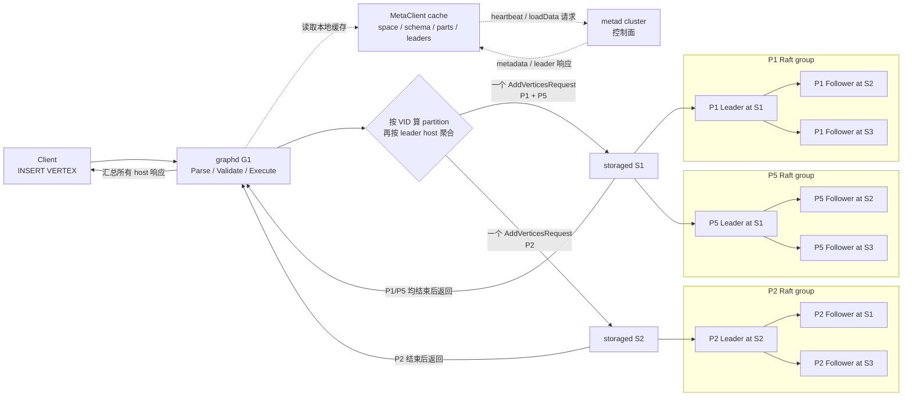
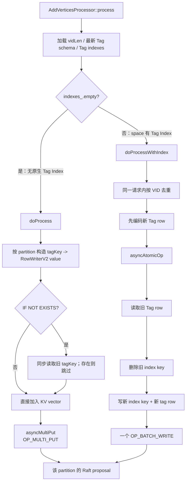
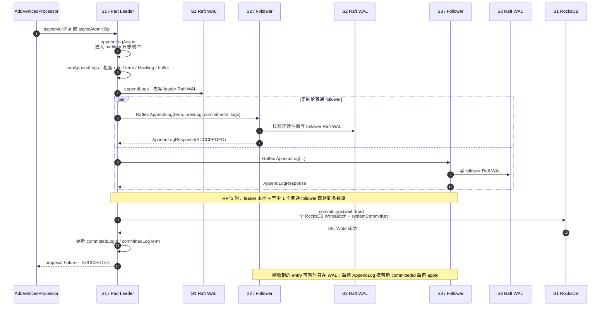

# NebulaGraph 3.6 `INSERT VERTEX` 后 Storage 数据流详解

> - 适用代码：本仓库 `3.6-w-1` 分支，分析基线
>   `65abd33d0349091e8d4c751e609924408c10940a`。
> - 分析范围：普通分布式部署（多个 graphd、metad、storaged），默认
>   `NebulaStore + Raft + RocksDB`；同时覆盖原生 Tag Index 和可选
>   Elasticsearch Listener。
> - 本文中的 `P1`、`S1` 等分布关系仅用于说明，真实 leader 由运行时
>   Raft 选举决定。

## 1. 先记住这 10 个结论

1. `INSERT VERTEX` 的热路径不是 graphd 直接写 RocksDB，而是：
   `Parser/Validator -> InsertVerticesExecutor -> StorageClient -> storaged
   AddVerticesProcessor -> KVStore -> Raft -> WAL -> RocksDB`。
2. 顶点先按 **VID** 计算 partition；同一个 VID 的所有 Tag 一定进入同一
   partition。
3. graphd 再按 **partition leader 所在 storaged** 聚合请求，所以一条语句
   可能被拆成多个并行 Storage RPC；同一台 leader 上的多个 partition 会合并
   在一个 RPC 中。
4. metad 是控制面：提供 space、schema、partition 副本分布和 leader 信息；
   正常写入不经过 metad 转发，graphd 使用本地 MetaClient 缓存路由。
5. storaged 对收到的每个 partition 独立发起一次 Raft proposal。一次语句跨
   partition 时，**没有跨 partition 的 2PC，也没有失败回滚**。
6. 无原生 Tag Index 时，每个 partition 通常生成一个 `OP_MULTI_PUT` Raft
   log；存在任意 Tag Index 时，走 `asyncAtomicOp`，把旧索引删除、新索引
   写入和 Tag 数据写入编码到同一个 `OP_BATCH_WRITE`。
7. replica factor 为 3 时，leader 本地写 Raft WAL 后，只需至少一个普通
   follower 成功接收（leader + follower = 多数派），即可在 leader 上 commit。
8. graphd 收到成功前，leader 已把该 partition 的 committed log 应用到本地
   RocksDB；但 follower 对“刚收到”的 log 可能还只写入 Raft WAL，稍后的
   AppendLog 才推动其应用。
9. **Raft WAL 与 RocksDB WAL 是两层不同日志。** 本分支
   `wal_sync=false`、`rocksdb_wal_sync=false` 默认都不逐次 fsync；
   “逻辑提交成功”不能简单等同于“所有副本均已逐写落到物理介质”。
10. graphd 对 mutation 不接受 partial success，但这只影响返回值：某些
    partition 已成功、另一些失败时，语句返回失败，已提交的数据不会被撤销。

---

## 2. 用一个多实例例子建立整体认识

假设：

- 2 个 graphd：`G1`、`G2`；
- 3 个 metad，组成 Meta Raft 组；
- 3 个 storaged：`S1`、`S2`、`S3`；
- space 有 6 个 partition，`replica_factor=3`；
- 本次请求连接到 `G1`；
- 示例 VID 类型为 `INT64`，写入 VID `6`、`1`、`10`：
  `6 -> P1`、`1 -> P2`、`10 -> P5`；
- 此时 `P1/P5` leader 在 `S1`，`P2` leader 在 `S2`。

### 2.1 多实例 scatter/gather 原理图



图中的两个“聚合”不要混淆：

- graphd 聚合：`HostAddr -> {PartID -> [NewVertex...]}`，减少到 leader host
  的 RPC 数；
- Raft 聚合：每个 partition 的 proposal 仍属于自己的 Raft group，不能跨
  partition 形成一个共识事务。

### 2.2 服务端口也分两层

- graphd 到 storaged 使用 Storage Thrift 端口，例如默认配置中的 `9779`；
- storaged leader 到 follower 使用独立 RaftexService，地址由 storage 地址
  的 `port + 1` 得到，例如 `9780`。

代码位置：

- Storage Thrift server：
  [StorageServer.cpp:367](../../src/storage/StorageServer.cpp#L367)
- storage/raft 端口换算：
  [Utils.h:30](../../src/common/utils/Utils.h#L30)
- RaftexService 启动：
  [NebulaStore.cpp:47](../../src/kvstore/NebulaStore.cpp#L47)

---

## 3. 第一段：graphd 如何把 nGQL 变成 Storage 请求

### 3.1 Parser：生成 InsertVerticesSentence

语法入口位于
[parser.yy:2920](../../src/parser/parser.yy#L2920)：

```text
INSERT VERTEX
  [IF NOT EXISTS]
  [IGNORE_EXISTED_INDEX]
  tag(prop, ...)
VALUES
  vid:(value, ...), ...
```

Parser 生成 `InsertVerticesSentence`，其中保存：

- Tag 列表；
- 每个 Tag 的属性名；
- 每一行的 VID 和属性表达式；
- `ifNotExists`；
- `ignoreExistedIndex`。

AST 数据结构在
[MutateSentences.h:157](../../src/parser/MutateSentences.h#L157)。

### 3.2 Validator：解析 schema，并构造 NewVertex/NewTag

`Validator::validate()` 先从当前 session 选中的 space 读取 VID 类型，再把
`kInsertVertices` 分派给 `InsertVerticesValidator`：

- [Validator.cpp:115](../../src/graph/validator/Validator.cpp#L115)
- [Validator.cpp:343](../../src/graph/validator/Validator.cpp#L343)

`InsertVerticesValidator` 完成四类工作：

1. 根据 Tag name 从 graphd 的 schema cache 解析 `TagID`；
2. 校验属性名存在，并建立
   `TagID -> [propName...]`；
3. 校验列数、VID 表达式和属性表达式；
4. 把每行转换成 Thrift 数据结构：
   `NewVertex{id, tags=[NewTag{tag_id, props}]}`。

主代码：

- schema/属性校验：
  [MutateValidator.cpp:19](../../src/graph/validator/MutateValidator.cpp#L19)
- VID、值求值和 `NewVertex` 构造：
  [MutateValidator.cpp:98](../../src/graph/validator/MutateValidator.cpp#L98)
- VID 类型检查：
  [SchemaUtil.cpp:126](../../src/graph/util/SchemaUtil.cpp#L126)

这里需要注意：

- graphd 主要检查 VID 的 Value 类型；FIXED_STRING 是否超过 space 的
  `vid_len`，storaged 还会再次检查；
- 多个 Tag 的属性值在语句中是一条扁平 values 列表，Validator 按每个 Tag
  的属性个数切片，组装成多个 `NewTag`；
- 默认值和 nullable 字段的最终填充发生在 storaged 的 `RowWriterV2::finish()`，
  不是在 parser 阶段。

### 3.3 Plan/Executor：调用 StorageClient

Validator 创建只包含一次 mutation 的 `InsertVertices` plan node，节点保存
`spaceId`、所有 `NewVertex`、属性名映射及两个语义开关：

- [MutateValidator.cpp:26](../../src/graph/validator/MutateValidator.cpp#L26)
- [Mutate.h:16](../../src/graph/planner/plan/Mutate.h#L16)

`InsertVerticesExecutor::insertVertices()` 构造带有
`space/session/plan/profile` 的 `CommonRequestParam`，调用
`StorageClient::addVertices()`：

- [InsertExecutor.cpp:19](../../src/graph/executor/mutate/InsertExecutor.cpp#L19)
- RequestCommon 编码：
  [StorageClient.cpp:32](../../src/clients/storage/StorageClient.cpp#L32)

---

## 4. 第二段：VID 分区、leader 路由和多 host RPC

### 4.1 INT64 VID 先转换为 8 字节 VertexID

`StorageClient::getIdFromNewVertex()` 根据 space VID 类型返回取 ID 的函数：

- `INT64`：把整数的 8 字节内存表示写回字符串形式的 `VertexID`；
- `FIXED_STRING`：直接使用字符串。

代码：
[StorageClient.cpp:774](../../src/clients/storage/StorageClient.cpp#L774)。

这解释了为什么进入 storaged 后，处理器使用
`vertex.get_id().getStr()`，即使 nGQL 中的 VID 原本是整数。

### 4.2 partition 公式

`MetaClient::partId()` 的代码在
[MetaClient.cpp:1218](../../src/clients/meta/MetaClient.cpp#L1218)：

```text
if VertexID 字节长度 == 8:
    vid = 把 8 字节直接解释为 uint64
else:
    vid = MurmurHash2(VertexID)

partId = vid % partition_num + 1
```

例如 `partition_num=6` 且 VID 为正 INT64：

| VID | 计算 | PartID |
|---:|---:|---:|
| 6 | `6 % 6 + 1` | 1 |
| 1 | `1 % 6 + 1` | 2 |
| 10 | `10 % 6 + 1` | 5 |

> **关键细节：** 代码只看 VertexID 的字节长度。长度恰好为 8 的
> FIXED_STRING 也走“直接解释 uint64”的兼容路径，而不是 MurmurHash2。
> 排查扩容、导入或跨语言路由问题时，必须以这段源码为准，不能笼统认为
> “字符串 VID 都走 hash”。

### 4.3 leader cache 从哪里来

graphd 的 `MetaClient` 本地维护
`(spaceId, partId) -> leader HostAddr`：

- 正常从 metad 返回的 host/leader 信息加载：
  [MetaClient.cpp:3234](../../src/clients/meta/MetaClient.cpp#L3234)
- 命中缓存时直接返回；
- 缓存没有 leader 时，从该 partition 的 peers 中 round-robin 选择一个
  暂定目标：
  [MetaClient.cpp:2391](../../src/clients/meta/MetaClient.cpp#L2391)
- 收到 `E_LEADER_CHANGED` 后更新本 graphd 的缓存：
  [StorageClientBase-inl.h:189](../../src/clients/storage/StorageClientBase-inl.h#L189)

因此在多个 graphd 的场景中，`G1` 和 `G2` 的 leader cache 可能短暂不同；
一个 graphd 从错误路由中学习到新 leader，并不代表其他 graphd 的本地缓存已
同步更新。

### 4.4 clusterIdsToHosts：先按 part，再按 leader host

`clusterIdsToHosts()` 的输出类型就是：

```text
unordered_map<
  HostAddr,
  unordered_map<PartitionID, vector<NewVertex>>
>
```

实现位于
[StorageClientBase-inl.h:240](../../src/clients/storage/StorageClientBase-inl.h#L240)。

其步骤为：

1. 从 MetaClient cache 取 `partition_num`；
2. 为 `1..partition_num` 的所有 partition 获取 leader；
3. 对每个 vertex 计算 part；
4. 放入 `clusters[leader][part]`。

> **性能观察点：** 3.6 这段实现会先遍历 space 的所有 partition 获取 leader，
> 不只是本批次实际命中的 partition。查询来自缓存，但超大 partition 数下仍有
> 每次请求的本地路由开销。

### 4.5 一个 leader host 一个 AddVerticesRequest

`StorageClient::addVertices()` 为每个 `HostAddr` 构造一个请求：

```text
AddVerticesRequest {
  space_id
  parts: PartID -> [NewVertex...]
  prop_names: TagID -> [property name...]
  if_not_exists
  ignore_existed_index
  common
}
```

代码与 IDL：

- 请求拆分：
  [StorageClient.cpp:149](../../src/clients/storage/StorageClient.cpp#L149)
- Thrift 结构：
  [storage.thrift:326](../../src/interface/storage.thrift#L326)
- RPC 方法：
  [storage.thrift:683](../../src/interface/storage.thrift#L683)

`collectResponse()` 同时发出所有 host RPC，并使用
`folly::collectAll` 等待它们全部结束：
[StorageClientBase-inl.h:72](../../src/clients/storage/StorageClientBase-inl.h#L72)。

---

## 5. 第三段：storaged 如何把请求变成 KV

### 5.1 RPC Handler 只负责创建 Processor

`GraphStorageServiceHandler::future_addVertices()` 创建
`AddVerticesProcessor`，先拿 Future，再调用 `process(req)`：

- [GraphStorageServiceHandler.cpp:34](../../src/storage/GraphStorageServiceHandler.cpp#L34)
- [GraphStorageServiceHandler.cpp:88](../../src/storage/GraphStorageServiceHandler.cpp#L88)

Processor 本身由 Promise/Future 管理异步完成；最终 `onFinished()` 设置
`ExecResponse` 并删除自身：
[BaseProcessor.h:37](../../src/storage/BaseProcessor.h#L37)。

### 5.2 process() 的公共前置检查

`AddVerticesProcessor::process()`：

1. 保存 `spaceId` 和 `ifNotExists`；
2. 从 storaged 自己的 SchemaManager cache 取 `spaceVidLen`；
3. 取该 space 所有 Tag 的最新 schema；
4. 令 `callingNum_ = req.parts.size()`，用于等待每个 partition 回调；
5. 从 IndexManager 取该 space 的全部 Tag Index；
6. 无 index 走 `doProcess()`，有任意 index 走
   `doProcessWithIndex()`。

代码：
[AddVerticesProcessor.cpp:24](../../src/storage/mutate/AddVerticesProcessor.cpp#L24)。

> **关键细节：** 分支条件是“space 中是否存在任意 Tag Index”，不是“本次
> 插入的 Tag 是否有 index”。只要 space 中有一个 Tag Index，本次写入就进入
> atomic-op 路径，然后在循环中再按 TagID 过滤相关 index。

### 5.3 两条写路径图



### 5.4 无原生索引路径：doProcess()

核心代码：
[AddVerticesProcessor.cpp:74](../../src/storage/mutate/AddVerticesProcessor.cpp#L74)。

对每个 partition：

1. 创建一个 `vector<KV> data`；
2. 检查 VID 长度；
3. 若 `--use_vertex_key=true`，加入一个
   `vertexKey -> empty value`；
4. 对每个 `NewTag`：
   - 校验 TagID；
   - 生成 `tagKey(part, vid, tagId)`；
   - 若 `IF NOT EXISTS`，读取旧 key；存在则跳过该
     `(VID, TagID)`；
   - 根据 `prop_names` 和 schema 用 `RowWriterV2` 编码 value；
   - 加入 `data`；
5. 整个 partition 校验成功后调用 `doPut()`。

`doPut()` 最终调用
`KVStore::asyncMultiPut(spaceId, partId, data, callback)`：
[BaseProcessor-inl.h:110](../../src/storage/BaseProcessor-inl.h#L110)。

如果构造本 partition 数据时遇到非法 VID、Tag 或属性编码错误，该 partition
不会提交 `data`；其他 partition 不受影响。

### 5.5 有原生索引路径：doProcessWithIndex()

入口：
[AddVerticesProcessor.cpp:152](../../src/storage/mutate/AddVerticesProcessor.cpp#L152)。

预编码完成后，它不是直接写 KV，而是把闭包交给
`KVStore::asyncAtomicOp()`。闭包在 Raft proposal 串行化阶段调用
`addVerticesWithIndex()`：

- 创建 `BatchHolder`；
- 读取旧 Tag value；
- `IF NOT EXISTS` 且旧值存在时跳过；
- 根据旧 row 计算并删除旧 index key；
- 根据新 row 计算并写入新 index key；
- 写入新的 Tag key/value；
- 返回编码后的 batch、read set 和 write set。

核心代码：
[AddVerticesProcessor.cpp:227](../../src/storage/mutate/AddVerticesProcessor.cpp#L227)。

原生顶点索引 key 的概念布局：

```text
[part/type: 4B] [indexId: 4B] [encoded indexed values] [padded VID]
```

生成位置：
[IndexKeyUtils.cpp:87](../../src/common/utils/IndexKeyUtils.cpp#L87)。

旧 index 删除、新 index 添加、Tag row 写入会编码在同一个
`OP_BATCH_WRITE` 中，随后成为同一个 partition 的一个 Raft log，并最终进入
同一个 RocksDB WriteBatch，所以原生索引与主数据具有 partition 内原子性。

#### Index rebuild 状态

在 index rebuilding 时，处理器不直接修改最终 index key，而是写
`OperationKey` 让 rebuild 流程补偿；index locked 时返回
`E_DATA_CONFLICT_ERROR`。代码在
[AddVerticesProcessor.cpp:269](../../src/storage/mutate/AddVerticesProcessor.cpp#L269)。

#### IGNORE_EXISTED_INDEX 的准确含义

当 `ignoreExistedIndex=true` 时，3.6 代码跳过读取旧 row，因此不会删除旧
属性对应的 index key，但仍会插入新 index key 和新 Tag row。覆盖已有数据时，
旧 index entry 可能保留，应只在明确的维护流程中使用。

更需要注意的是，`ifNotExists_` 检查也位于
`if (!ignoreExistedIndex_)` 内。也就是说，在当前源码的有索引路径里同时使用
`IF NOT EXISTS IGNORE_EXISTED_INDEX` 时，旧值不会被读取，
`IF NOT EXISTS` 不能按通常理解阻止覆盖。建议商用分支为该组合增加明确的
回归测试或直接禁用组合使用。对应位置：
[AddVerticesProcessor.cpp:252](../../src/storage/mutate/AddVerticesProcessor.cpp#L252)。

---

## 6. 第四段：KVStore、Raft WAL、多副本复制和 RocksDB

### 6.1 从 NebulaStore 找到本地 Part

两条 processor 路径分别进入：

- `NebulaStore::asyncMultiPut()`：
  [NebulaStore.cpp:891](../../src/kvstore/NebulaStore.cpp#L891)
- `NebulaStore::asyncAtomicOp()`：
  [NebulaStore.cpp:944](../../src/kvstore/NebulaStore.cpp#L944)

`NebulaStore` 先检查本机是否持有 `space/part`，找到
`shared_ptr<Part>` 后转发。此时“本机有副本”不等于“本机是 leader”；
leader 身份检查在 Raft append 阶段完成。

### 6.2 Part 把 KV 操作编码成 Raft log body

- 无 index：`Part::asyncMultiPut()` 把 KV vector 编成
  `OP_MULTI_PUT`：
  [Part.cpp:83](../../src/kvstore/Part.cpp#L83)
- 有 index：`Part::asyncAtomicOp()` 进入 `atomicOpAsync()`：
  [Part.cpp:120](../../src/kvstore/Part.cpp#L120)

`LogEncoder` 的普通 multi-put body 为：

```text
[timestamp:8] [opType:1] [valueCount:4]
repeated [keyLen:4][key][valueLen:4][value]
```

代码：
[LogEncoder.cpp:92](../../src/kvstore/LogEncoder.cpp#L92)。

有索引的 `BatchHolder` 会编码为 `OP_BATCH_WRITE`，其中每项还带
`PUT/REMOVE/REMOVE_RANGE` 类型：
[LogEncoder.cpp:163](../../src/kvstore/LogEncoder.cpp#L163)。

### 6.3 一个 partition 的精确 Raft 时序

下面以 `replica_factor=3`、`S1` 为 leader 为例。Raft 地址使用
storage port + 1。



对应源码按时序如下。

#### A. proposal 缓冲与 leader 检查

`RaftPart::appendLogAsync()`：

- snapshot 写阻塞时返回 `E_RAFT_WRITE_BLOCKED`；
- 日志缓冲超过 `max_batch_size` 时返回
  `E_RAFT_BUFFER_OVERFLOW`；
- 把 proposal 和 Promise 放进 `logs_`；
- 检查本 partition 是否仍为当前 term leader；
- 把可合并 proposal 组成发送批次。

代码：
[RaftPart.cpp:786](../../src/kvstore/raftex/RaftPart.cpp#L786)。

这里的“batch”不改变日志的 partition 边界；同一 partition 的多个并发 proposal
可以一批复制和 apply，但每个 proposal 仍有自己的 Promise。

#### B. leader 先写自己的 Raft WAL

`appendLogsInternal()` 明确标记：

- Step 1：`wal_->appendLogs(iter)`；
- Step 2：`replicateLogs(...)`。

代码：
[RaftPart.cpp:874](../../src/kvstore/raftex/RaftPart.cpp#L874)。

Raft WAL 单条物理记录包含：

```text
[logId] [termId] [messageLength] [clusterId] [message] [messageLength]
```

写入实现：
[FileBasedWal.cpp:442](../../src/kvstore/wal/FileBasedWal.cpp#L442)。

#### C. follower 写 WAL 后响应

follower 的 `processAppendLogRequest()`：

1. 校验 status、leader、term；
2. 校验 `prevLogId/prevLogTerm`，必要时回退冲突 WAL；
3. 把新 entries 追加到本地 Raft WAL；
4. 只 apply 到
   `min(lastMatchedLogId, request.committedLogId)`；
5. 返回自己的 last matched/committed 信息。

代码：
[RaftPart.cpp:1610](../../src/kvstore/raftex/RaftPart.cpp#L1610)。

当前批次发出时携带的是 leader 在发批前的 `committedLogId`，所以 follower
可以在只持有“新 log 的 WAL”、尚未把它应用到 RocksDB 的情况下确认接收。
下一次 AppendLog（heartbeat 周期也会尝试追加 empty log）携带推进后的
`committedLogId`，再促使 follower apply：
[RaftPart.cpp:2041](../../src/kvstore/raftex/RaftPart.cpp#L2041)。

#### D. 多数派后 leader apply RocksDB

`processAppendLogResponses()` 统计普通 follower 的成功数。初始化时
`quorum_=(peerCount+1)/2`，这里的 `peerCount` 不含 leader 自己：

- RF=1：需要 0 个 follower；
- RF=3：需要 1 个 follower，连同 leader 为 2/3；
- RF=5：需要 2 个 follower，连同 leader 为 3/5。

初始化代码：
[RaftPart.cpp:400](../../src/kvstore/raftex/RaftPart.cpp#L400)。

达到 quorum 后，leader 从 Raft WAL 读取待提交 entries，调用
`Part::commitLogs(wait=true)`：
[RaftPart.cpp:1044](../../src/kvstore/raftex/RaftPart.cpp#L1044)。

`Part::commitLogs()`：

- 解码 `OP_MULTI_PUT` 或 `OP_BATCH_WRITE`；
- 把业务 KV 操作加入一个 RocksDB WriteBatch；
- 把该 partition 的 `lastLogId/lastTerm` 也作为
  `systemCommitKey` 放进同一个 batch；
- 调用 `engine_->commitBatchWrite(..., wait=true)`。

代码：
[Part.cpp:215](../../src/kvstore/Part.cpp#L215)。

`RocksEngine::commitBatchWrite()` 最终调用 `rocksdb::DB::Write`：
[RocksEngine.cpp:120](../../src/kvstore/RocksEngine.cpp#L120)。

只有 leader RocksDB apply 成功并更新 committed id 后，才执行
`iter.commit()`，兑现最初 proposal 的 Promise：
[RaftPart.cpp:1068](../../src/kvstore/raftex/RaftPart.cpp#L1068)。

---

## 7. 第五段：响应如何回到 graphd

### 7.1 storaged 等待本 RPC 内所有 partition

`callingNum_` 初值等于请求中的 partition 数。每个 partition 的 KV callback
进入 `handleAsync()`：

- 记录该 partition 错误；
- `callingNum_--`；
- 归零后才调用 `onFinished()`。

代码：
[BaseProcessor-inl.h:40](../../src/storage/BaseProcessor-inl.h#L40)。

`ResponseCommon.failed_parts` **只放失败 partition**，成功 partition 不列出；
IDL 在
[storage.thrift:30](../../src/interface/storage.thrift#L30)。

### 7.2 E_LEADER_CHANGED 携带新 leader

如果请求发给了 follower，Raft append 返回 `E_LEADER_CHANGED`。BaseProcessor
调用 `kvstore_->partLeader()`，把 Raft 地址转回 Storage 地址并放进
`PartitionResult.leader`：

- [BaseProcessor-inl.h:85](../../src/storage/BaseProcessor-inl.h#L85)
- [NebulaStore.cpp:380](../../src/kvstore/NebulaStore.cpp#L380)

graphd 收到后更新本地 leader cache。但当前
`StorageClient::addVertices -> collectResponse` 路径没有把失败 partition 在同一
调用中重新发送；Executor 最终返回“Please retry later”：

- leader cache 更新：
  [StorageClientBase-inl.h:189](../../src/clients/storage/StorageClientBase-inl.h#L189)
- mutation 错误转换：
  [StorageAccessExecutor.h:89](../../src/graph/executor/StorageAccessExecutor.h#L89)

### 7.3 graphd mutation 要求 100% 完整

`InsertVerticesExecutor` 调用
`handleCompleteness(resp, false)`，第二个参数明确表示不接受 partial success：
[InsertExecutor.cpp:38](../../src/graph/executor/mutate/InsertExecutor.cpp#L38)。

因此：

- 所有 host、所有 part 成功：客户端看到成功；
- 任意 host/RPC/part 失败：客户端看到失败；
- **已经成功的 part 不会被撤销。**

---

## 8. RocksDB 中究竟存了什么

### 8.1 默认并不存在唯一的“顶点整行”

默认 `--use_vertex_key=false`。一个带两个 Tag 的顶点通常存成两个独立 KV：

```text
tagKey(part, vid, tagIdA) -> encoded row A
tagKey(part, vid, tagIdB) -> encoded row B
```

只有开启 `--use_vertex_key=true` 才额外写：

```text
vertexKey(part, vid) -> empty value
```

相关代码：

- flag 默认值：
  [StorageFlags.cpp:50](../../src/storage/StorageFlags.cpp#L50)
- 写 vertex key：
  [AddVerticesProcessor.cpp:90](../../src/storage/mutate/AddVerticesProcessor.cpp#L90)

graphd 还有独立的 `--graph_use_vertex_key`，决定是否允许无 Tag 的
`INSERT VERTEX VALUES ...`：
[MutateValidator.cpp:51](../../src/graph/validator/MutateValidator.cpp#L51)。
需要支持无 Tag 顶点时，graphd/storaged 两侧配置应保持一致。

### 8.2 Tag key 布局

概念布局：

```text
[type:1 + partId:3] [VID:固定 vid_len] [TagID:4]
```

实现中前四字节由
`(partId << 8) | NebulaKeyType::kTag_` 组合：
[NebulaKeyUtils.cpp:37](../../src/common/utils/NebulaKeyUtils.cpp#L37)。

同一个 `(part, VID, TagID)` 生成相同 key，因此普通
`INSERT VERTEX` 对已有同 Tag 顶点是覆盖写；给同 VID 增加不同 Tag 则生成
另一条 key。

### 8.3 Tag value 布局

`RowWriterV2` 编码布局：

```text
[header]
[schema version: 0..7 bytes]
[nullable bits]
[fixed-length property area]
[variable string/geography content]
[write timestamp: 8 bytes]
```

完整格式说明：
[RowWriterV2.h:25](../../src/codec/RowWriterV2.h#L25)。

`finish()` 还会：

- 为未赋值字段应用 default 或 nullable；
- 追加微秒时间戳。

代码：
[RowWriterV2.cpp:935](../../src/codec/RowWriterV2.cpp#L935)。

### 8.4 多 data_path 时的物理组织

一个 storaged 配置多个 `data_path` 时，每个 path 对每个 space 建一个
RocksDB engine；新 partition 选择当前 part 数最少的 engine：
[NebulaStore.cpp:458](../../src/kvstore/NebulaStore.cpp#L458)。

典型目录概念如下：

```text
<data_path>/nebula/<spaceId>/data/          # RocksDB，多个 part 共享 engine
<wal_root>/nebula/<spaceId>/wal/<partId>/  # 每个 part 的 Raft WAL
```

构造位置：

- RocksDB data/wal root：
  [RocksEngine.cpp:33](../../src/kvstore/RocksEngine.cpp#L33)
- partition Raft WAL：
  [NebulaStore.cpp:484](../../src/kvstore/NebulaStore.cpp#L484)

---

## 9. 两层 WAL 与“成功”的耐久性含义

### 9.1 两层日志不能混为一谈

| 层 | 目的 | 写入位置 | 相关开关 |
|---|---|---|---|
| Nebula Raft WAL | 共识日志、复制、崩溃恢复、follower catch-up | 每个 partition 独立目录 | `--wal_sync` |
| RocksDB WAL | RocksDB memtable 崩溃恢复 | RocksDB DB/WAL 目录 | `--rocksdb_disable_wal`、`--rocksdb_wal_sync` |

Raft WAL 是共识事实来源；RocksDB 是状态机。即使关闭 RocksDB WAL，理论上仍可
通过保留的 Raft WAL/快照恢复状态，但具体安全性还取决于 WAL 清理、快照和故障
模型，不能孤立修改一个开关。

### 9.2 本分支默认值

- `wal_sync=false`：
  [FileBasedWal.cpp:18](../../src/kvstore/wal/FileBasedWal.cpp#L18)
- `rocksdb_disable_wal=false`；
- `rocksdb_wal_sync=false`：
  [RocksEngineConfig.cpp:24](../../src/kvstore/RocksEngineConfig.cpp#L24)

`FileBasedWal::appendLogInternal()` 总会调用 `write(2)`，只有
`wal_sync=true` 才在每条写后调用 `fsync`：
[FileBasedWal.cpp:480](../../src/kvstore/wal/FileBasedWal.cpp#L480)。

因此默认成功语义更准确地描述为：

> leader 与多数派已接受 Raft log，leader 已把 committed batch 写入 RocksDB，
> 且 graphd 已收到所有 partition 成功；但默认开关不保证每次写都在返回前执行
> 物理 fsync。

进程崩溃、单机断电、机房级同时掉电是不同故障模型。商用部署若需要严格的掉电
耐久目标，应结合磁盘缓存策略、文件系统、Raft/RocksDB 两层 sync 开关和实测
延迟制定配置，不应只看 nGQL 返回成功。

---

## 10. 原子性、一致性和失败边界

### 10.1 原子性边界表

| 范围 | 是否原子 | 原因 |
|---|---|---|
| 同一 partition、无 index 的本批 KV | 是 | 一个 `OP_MULTI_PUT`，apply 为一个 RocksDB WriteBatch |
| 同一 partition、原生 index + Tag row | 是 | 一个 `OP_BATCH_WRITE`，同一个 RocksDB WriteBatch |
| 同一 host 上的两个 partition | 否 | 两个独立 Part、两个 Raft group、两个 callback |
| 不同 host leader 上的 partition | 否 | 独立 RPC 和独立 Raft group |
| 整条跨 partition nGQL | 否 | 没有协调器、prepare/commit 或 rollback |
| Elasticsearch 全文索引与主数据 | 否 | Listener 为 learner，异步 apply，不参与 quorum |

### 10.2 partial commit 示例

仍用 `P1/P2/P5`：

1. `P1`、`P5` 在 `S1` 成功 commit；
2. `P2` 在 `S2` 因 leader change 失败；
3. `S1` 的响应只有成功，`S2` 响应中列出 P2；
4. graphd 因 completeness 非 100% 返回语句失败；
5. P1/P5 数据仍然存在。

应用层若要求“一个业务批次全有或全无”，不能把一条跨 partition
`INSERT VERTEX` 当作分布式事务。常见方案是：

- 使用可重放、确定性的 VID 和属性，让失败批次可以安全补写；
- 记录业务批次 ID/状态并做补偿；
- 写后按 VID 校验，而不是仅根据一次 RPC 返回推断全局状态。

### 10.3 leader 切换导致未知结果

Raft 代码明确处理一种情况：旧 leader 已把 log 复制给 followers，但在确认
commit 前看到更高 term。此时返回
`E_RAFT_UNKNOWN_APPEND_LOG`，因为该 log 可能被后来成为 leader 的 follower
提交：
[RaftPart.cpp:1022](../../src/kvstore/raftex/RaftPart.cpp#L1022)。

同理，graphd Storage RPC timeout 只说明客户端没有及时拿到结果，不能证明写入
未发生。重试设计必须考虑“结果未知”，而不是把所有错误都视为“零写入”。

### 10.4 quorum 不可用

未达到多数派时，当前 leader 的 Raft 层会继续尝试复制，而不是立即把少数派写
当作成功：
[RaftPart.cpp:1129](../../src/kvstore/raftex/RaftPart.cpp#L1129)。

外层 graphd 仍可能先达到 `storage_client_timeout_ms` 而超时。因此出现：

- 客户端已超时；
- storaged/Raft proposal 尚在处理；
- 随后可能因恢复 quorum 而成功，也可能因 term/leader 变化而失败。

---

## 11. 三个语法/并发细节

### 11.1 默认 INSERT 是覆盖同 Tag，而不是报“vertex exists”

主键是 `(part, VID, TagID)`。没有 `IF NOT EXISTS` 时，相同 key 后写覆盖
前写；更新原生 index 时会先删旧 index key，再写新 index key。

### 11.2 IF NOT EXISTS 的粒度与并发差异

语义检查粒度是 `(VID, TagID)`，不是整个 VID：

- 已有 `person` Tag 不阻止同 VID 新增 `student` Tag；
- 同 VID 的同一 Tag 已存在才跳过。

无 index 路径中，旧值读取发生在 proposal 前：
[AddVerticesProcessor.cpp:111](../../src/storage/mutate/AddVerticesProcessor.cpp#L111)。
两个并发请求可能都读到“不存在”，随后按 Raft 顺序覆盖，因此它不是严格的跨
请求 compare-and-set。

有 index 路径使用 `MergeableAtomicOp` 的 read/write set，并在 Raft 日志
批处理处隔离已登记的 read-after-write 冲突：

- atomic result 定义：
  [Common.h:275](../../src/kvstore/Common.h#L275)
- 合并冲突判断：
  [RaftPart.cpp:159](../../src/kvstore/raftex/RaftPart.cpp#L159)

但当前实现只在旧 row **已经存在**时才把 Tag key 放入 `readSet`；“读到不存在”
没有被登记为负读。同时，合并代码对 write-after-write 明确采用 last-write-wins。
所以两个并发请求向同一个原本不存在的 `(VID, TagID)` 执行
`IF NOT EXISTS` 时，有 index 路径也可能让两个闭包都判断“不存在”，最后由后写
覆盖。对应位置：

- 仅旧值非空才加入 `readSet`：
  [AddVerticesProcessor.cpp:252](../../src/storage/mutate/AddVerticesProcessor.cpp#L252)
- write/write 合并为后写覆盖：
  [RaftPart.cpp:249](../../src/kvstore/raftex/RaftPart.cpp#L249)

因此两条路径都不能被当作严格的 compare-and-set，只是并发窗口和合并机制不同。
商用代码若依赖严格 `IF NOT EXISTS`，应增加同 key 高并发回归测试，并考虑在
Storage/Raft 层显式表达“key 不存在”这一读取条件。

### 11.3 同一语句内重复 VID

有 index 路径会先按 VID 去重：

- `IF NOT EXISTS=true`：保留第一个；
- 否则：保留最后一个。

代码：
[AddVerticesProcessor.cpp:365](../../src/storage/mutate/AddVerticesProcessor.cpp#L365)。

无 index 路径没有同样的 VID 级预去重；`IF NOT EXISTS` 时使用
`visited tagKey` 保留同 key 的第一个，否则同一 RocksDB batch 内相同 key
最终表现为后写覆盖。批量语句中不要依赖重复 VID 的隐式顺序，最好在上游去重。

---

## 12. 原生索引与全文索引不是同一条完成链

### 12.1 原生 Tag Index

原生 index key 与 Tag row：

- 在同一 partition；
- 编码进同一个 Raft log；
- apply 到同一个 RocksDB WriteBatch；
- nGQL 成功时 leader 上二者都已 apply。

### 12.2 Elasticsearch Fulltext Listener

Listener 作为 Raft learner 接收 log，但 learner 不计入写 quorum。Raft 复制
成功判断显式排除 `isLearner()`：
[RaftPart.cpp:951](../../src/kvstore/raftex/RaftPart.cpp#L951)。

Listener 的 `commitLogs()` 先推进 leader commit 观察值，后台线程周期性
`processLogs()`，ESListener 再转换为 bulk 请求：

- Listener 异步 apply：
  [Listener.cpp:130](../../src/kvstore/listener/Listener.cpp#L130)
- ES bulk：
  [ESListener.cpp:36](../../src/kvstore/listener/elasticsearch/ESListener.cpp#L36)

所以 `INSERT VERTEX` 返回成功并不保证全文索引立即可查；这属于设计上的
异步可见性，而不是主数据写失败。

---

## 13. 常见错误沿哪条路径返回

| 错误/现象 | 产生位置 | 对已成功其他 part 的影响 |
|---|---|---|
| `E_INVALID_VID` | storaged 检查 VID 超过 space vid_len | 当前 part 不提交；其他 part 可成功 |
| `E_TAG_NOT_FOUND` | storaged 最新 schema 中无 TagID | 当前 part 不提交 |
| 属性类型/NULL/default 错误 | `RowWriterV2::finish()` | 当前 part 不提交 |
| `E_PART_NOT_FOUND` | 请求发到不持有该 part 的 storaged | 其他 part 不回滚 |
| `E_LEADER_CHANGED` | 本地有副本但不是 leader/term 已变 | graphd 更新 cache，当前调用报错 |
| `E_RAFT_BUFFER_OVERFLOW` | partition proposal buffer 满 | 当前 part 失败，可稍后重试 |
| `E_RAFT_WRITE_BLOCKED` | snapshot 等流程阻塞写 | 当前 part 失败 |
| `E_RAFT_WAL_FAIL` | Raft WAL 写失败/磁盘空间不足 | 当前 part 不能正常 commit |
| RPC timeout | graphd 到 storaged 超时 | 结果可能未知，不代表未写 |
| `E_RAFT_UNKNOWN_APPEND_LOG` | 复制后发生更高 term | 结果明确为未知，需校验/幂等重试 |

错误码定义：
[common.thrift:450](../../src/interface/common.thrift#L450)。

---

## 14. 源码调试建议

### 14.1 推荐断点顺序

```text
nebula::graph::InsertVerticesExecutor::insertVertices
nebula::storage::StorageClient::addVertices
nebula::storage::AddVerticesProcessor::process
nebula::storage::AddVerticesProcessor::doProcess
nebula::storage::AddVerticesProcessor::doProcessWithIndex
nebula::kvstore::Part::asyncMultiPut
nebula::raftex::RaftPart::appendLogAsync
nebula::raftex::RaftPart::appendLogsInternal
nebula::raftex::RaftPart::processAppendLogResponses
nebula::kvstore::Part::commitLogs
nebula::kvstore::RocksEngine::commitBatchWrite
```

在 follower 再断：

```text
nebula::raftex::RaftPart::processAppendLogRequest
```

### 14.2 推荐观察字段

| 层 | 重点字段 |
|---|---|
| graphd | `spaceId`、原始 VID 类型、`clusters[host][part]` |
| Storage RPC | `parts`、`prop_names`、两个语义开关 |
| Processor | `spaceVidLen_`、`indexes_`、`callingNum_`、生成 KV 数 |
| Raft leader | `role_`、`term_`、`lastLogId_`、`committedLogId_`、`quorum_` |
| follower | request committed id、last matched id、本地 committed id |
| RocksDB | batch 中 Tag key、Index key、`systemCommitKey` |

### 14.3 日志开关

- `AddVerticesProcessor` 在 VLOG(3) 输出 part/VID/Tag；
- `--trace_raft=true` 时打印 AppendLog 请求范围、term 和 commit id；
- VLOG(4) 可看到 WAL、OP_MULTI_PUT/OP_BATCH_WRITE 解码及 commit 细节。

相关位置：

- Processor：
  [AddVerticesProcessor.cpp:99](../../src/storage/mutate/AddVerticesProcessor.cpp#L99)
- Raft trace：
  [RaftPart.cpp:946](../../src/kvstore/raftex/RaftPart.cpp#L946)
- follower trace：
  [RaftPart.cpp:1610](../../src/kvstore/raftex/RaftPart.cpp#L1610)

若实际启动本仓库配套实例，先遵守本仓库约束：

```bash
ulimit -n 65536
/home/sch/nebula-run/nebula-wal/scripts/nebula.service start metad
/home/sch/nebula-run/nebula-wal/scripts/nebula.service start storaged
/home/sch/nebula-run/nebula-wal/scripts/nebula.service start graphd
```

分布式验证建议让一批 VID 命中至少两个 partition，再在提交过程中停止某个
partition leader，分别观察：

- graphd 的 `E_LEADER_CHANGED`；
- 新 leader cache 更新；
- 各 partition 的 `committedLogId`；
- 返回失败后哪些 VID 已经可读；
- follower WAL 与 RocksDB apply 的时间差。

---

## 15. 代码导航总表

| 阶段 | 文件与入口 |
|---|---|
| nGQL grammar | [parser.yy:2920](../../src/parser/parser.yy#L2920) |
| AST | [MutateSentences.h:157](../../src/parser/MutateSentences.h#L157) |
| Validator | [MutateValidator.cpp:19](../../src/graph/validator/MutateValidator.cpp#L19) |
| Plan node | [Mutate.h:16](../../src/graph/planner/plan/Mutate.h#L16) |
| Executor | [InsertExecutor.cpp:19](../../src/graph/executor/mutate/InsertExecutor.cpp#L19) |
| StorageClient addVertices | [StorageClient.cpp:149](../../src/clients/storage/StorageClient.cpp#L149) |
| INT64/FIXED_STRING ID 转换 | [StorageClient.cpp:774](../../src/clients/storage/StorageClient.cpp#L774) |
| 分区与 host 聚合 | [StorageClientBase-inl.h:240](../../src/clients/storage/StorageClientBase-inl.h#L240) |
| partition hash 公式 | [MetaClient.cpp:1218](../../src/clients/meta/MetaClient.cpp#L1218) |
| leader cache | [MetaClient.cpp:2391](../../src/clients/meta/MetaClient.cpp#L2391) |
| AddVertices Thrift | [storage.thrift:326](../../src/interface/storage.thrift#L326) |
| Storage RPC handler | [GraphStorageServiceHandler.cpp:88](../../src/storage/GraphStorageServiceHandler.cpp#L88) |
| Processor 总入口 | [AddVerticesProcessor.cpp:24](../../src/storage/mutate/AddVerticesProcessor.cpp#L24) |
| 无 index 写路径 | [AddVerticesProcessor.cpp:74](../../src/storage/mutate/AddVerticesProcessor.cpp#L74) |
| 有 index 写路径 | [AddVerticesProcessor.cpp:152](../../src/storage/mutate/AddVerticesProcessor.cpp#L152) |
| index atomic batch | [AddVerticesProcessor.cpp:227](../../src/storage/mutate/AddVerticesProcessor.cpp#L227) |
| Processor 异步汇总 | [BaseProcessor-inl.h:40](../../src/storage/BaseProcessor-inl.h#L40) |
| KVStore 转 Part | [NebulaStore.cpp:891](../../src/kvstore/NebulaStore.cpp#L891) |
| Part 编码 proposal | [Part.cpp:83](../../src/kvstore/Part.cpp#L83) |
| Raft proposal 缓冲 | [RaftPart.cpp:786](../../src/kvstore/raftex/RaftPart.cpp#L786) |
| leader WAL/复制 | [RaftPart.cpp:874](../../src/kvstore/raftex/RaftPart.cpp#L874) |
| quorum/leader commit | [RaftPart.cpp:1002](../../src/kvstore/raftex/RaftPart.cpp#L1002) |
| follower AppendLog | [RaftPart.cpp:1610](../../src/kvstore/raftex/RaftPart.cpp#L1610) |
| RocksDB state-machine apply | [Part.cpp:215](../../src/kvstore/Part.cpp#L215) |
| RocksDB DB::Write | [RocksEngine.cpp:120](../../src/kvstore/RocksEngine.cpp#L120) |
| Raft WAL 文件写 | [FileBasedWal.cpp:442](../../src/kvstore/wal/FileBasedWal.cpp#L442) |
| Tag key | [NebulaKeyUtils.cpp:37](../../src/common/utils/NebulaKeyUtils.cpp#L37) |
| Index key | [IndexKeyUtils.cpp:87](../../src/common/utils/IndexKeyUtils.cpp#L87) |
| Row value | [RowWriterV2.h:25](../../src/codec/RowWriterV2.h#L25) |
| graphd 响应汇总 | [StorageClientBase-inl.h:72](../../src/clients/storage/StorageClientBase-inl.h#L72) |
| mutation 完整性判断 | [StorageAccessExecutor.h:40](../../src/graph/executor/StorageAccessExecutor.h#L40) |

---

## 16. 最后用一句话串起来

> graphd 把已校验的 `NewVertex` 按 VID 分区并按 leader host 扇出；
> 每个 storaged leader 把本机收到的各 partition 分别编码成 Tag/Index KV，
> 为每个 partition 独立提交 Raft log；leader 与多数派先接受 Raft WAL，
> leader 再用一个 RocksDB WriteBatch 应用该 partition 的业务数据和 commit
> 位置；所有 partition callback 和所有 host RPC 都成功后 graphd 才返回成功，
> 但跨 partition 从始至终没有全局事务。

任务静态分析与验证记录见
[investigation.log](./investigation.log)。
