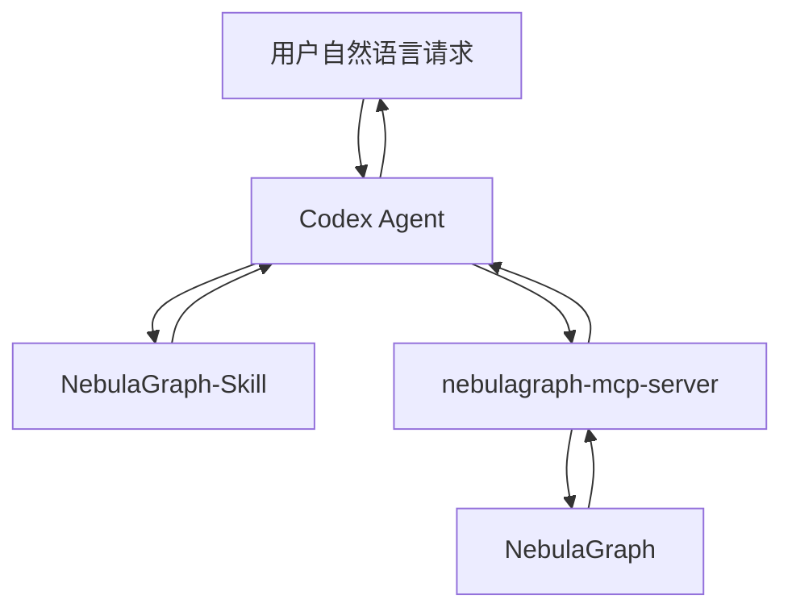
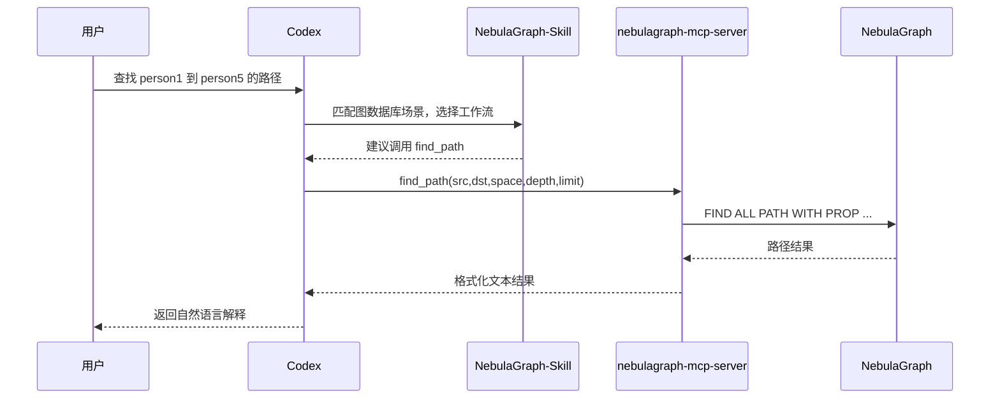
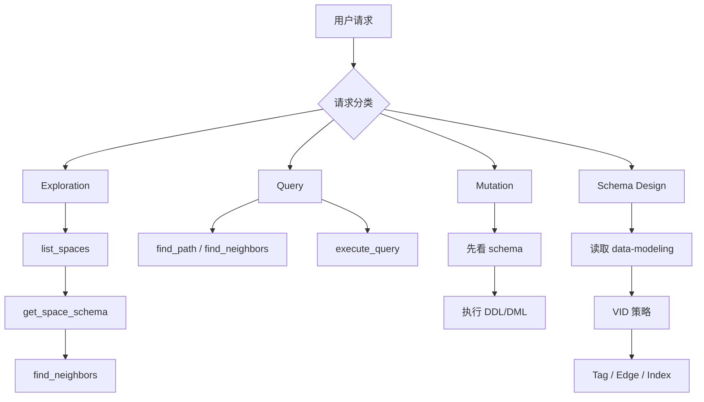
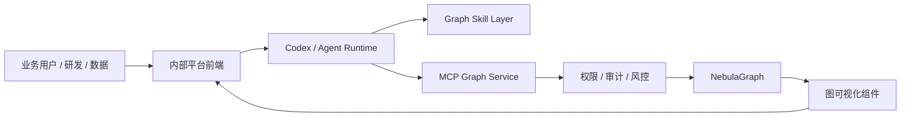

# NebulaGraph 智能交互方案架构图

## 1. 四层总体架构图



## 2. 端到端调用时序图



## 3. Skill 内部工作流图



## 4. MCP Server 内部结构图

```mermaid
flowchart TD
    Main[main()]
    FastMCP[FastMCP]
    Life[Lifespan]
    Pool[ConnectionPool]
    Tools[Tools / Resources]
    Nebula[NebulaGraph]

    Main --> FastMCP
    FastMCP --> Life
    Life --> Pool
    FastMCP --> Tools
    Tools --> Pool
    Pool --> Nebula
```

## 5. 内部项目落地建议架构图


