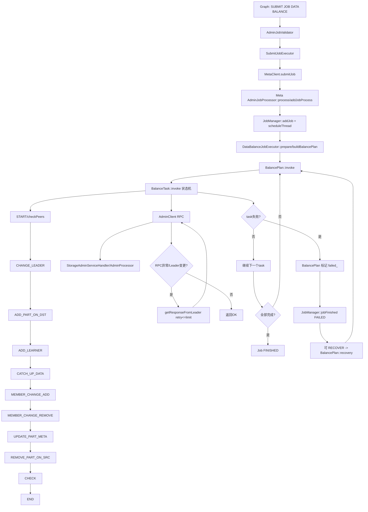

# Nebula Balance 扩容后失败问题分析记录

> 目标：先分析，不改代码。面向初学者解释 Data/Storage Balance 相关模块、入口链路、状态流转、重点文件、排查建议与链路图。

## 1) 问题理解（Problem understanding）

你描述的问题是：**storage 节点水平扩容后，执行 data balance 经常失败且不稳定**。

这类问题通常不是单点 bug，而是「调度 + 元数据一致性 + RPC 重试 + 节点存活变化 + Raft 状态变化」共同作用的结果。

## 2) 相关模块（初学者版）

可以把整个功能理解成 4 层：

1. **Graph 层（入口层）**
   - 你在控制台执行 `SUBMIT JOB DATA BALANCE ...`。
   - Graph 负责语法校验、组装请求，发给 Meta。

2. **Meta Job 层（大脑/调度层）**
   - `AdminJobProcessor` 接收 job。
   - `JobManager` 排队、串行/并行调度 job。
   - `DataBalanceJobExecutor` 生成 balance plan（把哪些分片从哪搬到哪）。

3. **Balance 执行层（任务状态机）**
   - `BalancePlan` 管理多 task 的并发、失败汇总、恢复。
   - `BalanceTask` 按步骤执行迁移（check peers、转 leader、加 learner、catch up、member change、更新 meta、删源副本、最终 check）。

4. **Storage Admin RPC 层（动作执行层）**
   - `AdminClient` 通过 RPC 调 storage 的 admin 接口执行具体动作。
   - storage 侧 `StorageAdminServiceHandler` + `AdminProcessor` 真正操作 partition/raft。

## 3) 入口、核心执行链路、状态流转位置

### 3.1 入口

- Graph 校验入口：`src/graph/validator/AdminJobValidator.cpp`
- Graph 执行入口：`src/graph/executor/admin/SubmitJobExecutor.cpp`
- Meta 接收入口：`src/meta/processors/job/AdminJobProcessor.cpp`

### 3.2 主链路（简化）

1. 用户提交 DATA BALANCE job（Graph）
2. Meta `AdminJobProcessor::addJobProcess()` 创建 job
3. `JobManager` 后台线程 `scheduleThread()` 拉取任务并运行
4. `DataBalanceJobExecutor::prepare()` 读取 space/zone/part 当前分布
5. `DataBalanceJobExecutor::buildBalancePlan()` 生成 `BalanceTask` 列表
6. `BalancePlan::invoke()` 并发调度 task bucket
7. 每个 `BalanceTask::invoke()` 按状态机推进
8. 每步调用 `AdminClient` 发起 storage admin RPC
9. 成功/失败回写到 meta kv（task/job 状态）

### 3.3 状态流转关键位置

- **Job 状态**：`JobManager::scheduleThread()`, `JobManager::jobFinished()`
- **Plan 状态**：`BalancePlan::invoke()`, `setStatus(RUNNING/FAILED/FINISHED)`
- **Task 状态机**：`BalanceTask::invoke()`（START -> ... -> END）
- **恢复逻辑**：`BalanceJobExecutor::recovery()`, `BalancePlan::recovery()`

## 4) 先读的 10 个文件（按重要性）

1. `src/meta/processors/job/BalanceTask.cpp`
2. `src/meta/processors/job/BalancePlan.cpp`
3. `src/meta/processors/admin/AdminClient.cpp`
4. `src/meta/processors/job/DataBalanceJobExecutor.cpp`
5. `src/meta/processors/job/JobManager.cpp`
6. `src/meta/processors/job/AdminJobProcessor.cpp`
7. `src/storage/admin/AdminProcessor.h`
8. `src/storage/StorageAdminServiceHandler.cpp`
9. `src/graph/executor/admin/SubmitJobExecutor.cpp`
10. `src/meta/test/BalancerTest.cpp`

## 5) 推荐阅读顺序

建议按「从外到内，再回到测试验证」阅读：

1. `SubmitJobExecutor.cpp`（请求怎么发起）
2. `AdminJobProcessor.cpp`（Meta 怎么接）
3. `JobManager.cpp`（何时执行、何时结束）
4. `DataBalanceJobExecutor.cpp`（plan 怎么算）
5. `BalancePlan.cpp`（并发调度+恢复）
6. `BalanceTask.cpp`（单 task 状态机）
7. `AdminClient.cpp`（RPC 重试/leader changed 处理）
8. `StorageAdminServiceHandler.cpp`
9. `AdminProcessor.h`（storage 端动作）
10. `BalancerTest.cpp`（看已有回归覆盖）

## 6) 与“扩容后失败”最相关的可疑点（假设树）

## 6.1 已确认事实（Confirmed facts）

- Data balance 是 meta job，任务状态持久化在 meta kv。
- `BalanceTask` 每一步都持久化状态，失败会将 task 标记 FAILED。
- `AdminClient::getResponseFromLeader()` 有 retry + leader changed 处理，但有重试上限。
- `BalancePlan::recovery(resume=true)` 会重置 FAILED/INVALID task 为 IN_PROGRESS 再跑。

## 6.2 假设（Assumptions）

### H1：扩容后 leader 高频变更，超过 retry 窗口导致间歇失败
- 证据点：`AdminClient::getResponseFromLeader()` 在 RPC 异常、`E_LEADER_CHANGED`、unknown code 都会 retry，但有上限 `FLAGS_max_retry_times_admin_op`。
- 影响阶段：`ADD_LEARNER` / `CATCH_UP_DATA` / `MEMBER_CHANGE_*`。

### H2：新节点存活/心跳状态抖动，导致任务被判 INVALID 或执行失败
- 证据点：恢复时会检查目标节点是否存活，不存活会标记 INVALID。
- 影响：plan 最终 FAILED，表现为“不稳定”。

### H3：元数据 peers 与真实 raft peers 短时不一致
- 证据点：`updateMeta()` 与 member change/leader 切换之间存在时序窗口；代码里有针对「leader 不在 meta peers 里」的补偿逻辑，但仍可能反复重试。

### H4：同分片串行 + 不同分片并发，局部热点导致某些 part 经常超时
- 证据点：`BalancePlan` 按 part 分 bucket，同 part 串行，不同 part 并发（`FLAGS_task_concurrency`）。扩容期 raft 压力上来可能触发尾部失败。

## 6.3 最关键代码定位

- 重试与 leader changed：`AdminClient::getResponseFromLeader()`
- 单 task 失败位置：`BalanceTask::invoke()` 各状态分支日志
- 计划构造是否合理：`DataBalanceJobExecutor::buildBalancePlan()`
- 恢复逻辑：`BalancePlan::recovery()` + `BalanceJobExecutor::recovery()`
- job 聚合失败：`JobManager::jobFinished()`

## 7) 建议补充的关键日志（先定位，不改行为）

> 不改逻辑，仅增强观测；建议后续最小 patch 添加。

1. 在 `AdminClient::getResponseFromLeader()` 中增加统一日志字段：
   - `spaceId, partId, opType, hostIndex, retry, retryLimit, errorCode, reportedLeader`
2. 在 `BalanceTask::invoke()` 每个阶段失败时统一打印：
   - `taskId, phase(status), src, dst, part, respCode, elapsed`
3. 在 `DataBalanceJobExecutor::buildBalancePlan()` 打印：
   - `lostHosts, zone->activeHostsCount, totalTasks, perZoneTaskCount`
4. 在 `BalancePlan::invoke()` 打印并发参数与 bucket 分布：
   - `task_concurrency, bucket_count, bucket_size_histogram`

## 8) 状态/重试/并发/部分失败角度分析（分布式重点）

- **状态流转**：task 状态机是线性推进，失败即 `ret_=FAILED`，plan 标记 FAILED。
- **重试**：主要在 AdminClient 层，重试次数有限；当 leader 持续变更时会耗尽。
- **幂等性**：注释说明 task 各步骤设计为可重复执行；恢复机制依赖该特性。
- **并发**：同 part 串行，跨 part 并行；高并发会放大扩容期资源波动。
- **部分失败**：单 task 失败可让 job 最终 FAILED；恢复可继续失败/无效任务。
- **可观测性不足点**：目前日志对“哪个 op 在第几次重试失败”不够结构化。

## 9) 总体链路图（调度入口/状态/执行器/失败处理/重试）

## 10) 最小修复计划（仅计划，不动代码）

1. 先补日志（上述 4 处），不改执行语义。
2. 用一次扩容场景复现，采集单个失败 task 的完整时间线。
3. 用日志验证假设树（先 H1/H2）。
4. 若 H1 成立，最小改动方向：
   - 调整 retry 策略（上限/退避）或在关键操作增加更明确的 leader 跟随。
5. 增加针对“扩容中 leader 频繁变更”的回归测试（优先 meta 层单测）。

## 11) 风险

- 仅靠提高重试次数可能掩盖真实慢点（catch up 时间长、节点抖动）。
- 盲目提高并发可能加重 raft 压力，导致更不稳定。
- 恢复逻辑如果缺少关键上下文日志，问题会被“恢复成功/失败”表象掩盖。

## 12) PR-ready 摘要（后续可直接用于修复 PR）

- 问题：扩容后 data balance 间歇失败，怀疑与 leader 频繁变化、节点存活抖动、meta/raft 短时不一致相关。
- 方案：先做可观测性增强（AdminClient + BalanceTask + Plan + buildPlan 日志），再依据日志做最小修复。
- 预期收益：把“偶发失败”变成可归因失败，快速定位是重试不足、活跃判断不稳定，还是状态机阶段性超时。
