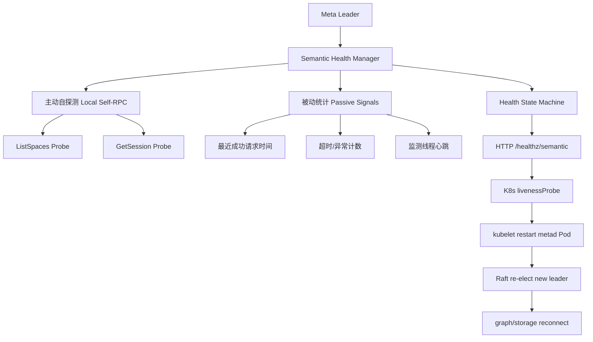
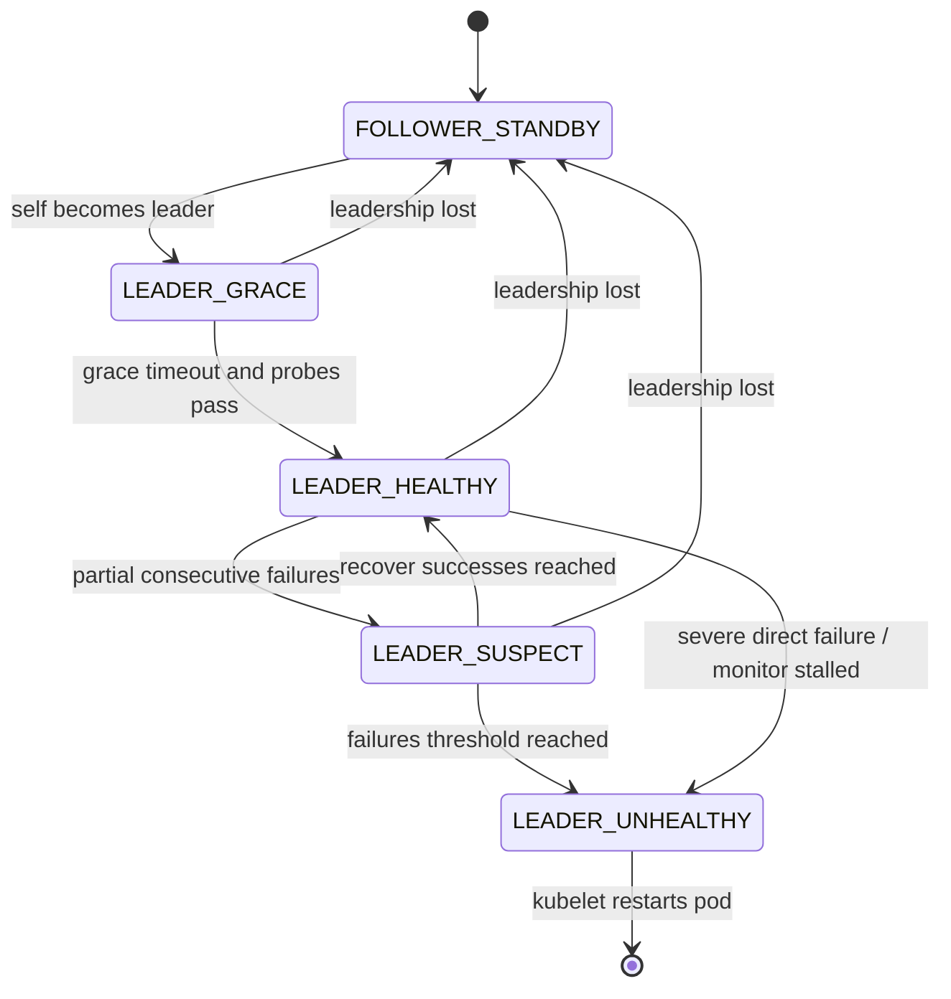

# NebulaGraph Meta Leader 语义级自恢复方案（release-3.6）

- 文档版本：v1.0
- 面向版本：`vesoft-inc/nebula` `release-3.6`
- 适用部署：3 节点 K8s 容器化集群，`graphd/metad/storaged` 均为 3 副本
- 文档用途：供架构评审、研发排期、Codex 编码实现、测试验收与灰度上线使用
- 方案定位：产品化方案书，不依赖本次锁竞争根因被完全定位

---

## 1. 文档摘要

本文针对一类高风险故障给出产品化自恢复方案：

> `metad leader 进程仍然存活，端口、metrics、HTTP 线程也仍可用，但 leader 已无法在限定时间内处理关键 Meta 请求，导致 graph/storage 依赖 Meta 的控制面能力失效，最终表现为 session 创建失败、DDL/DML 失败、集群不可用。`

结合你给出的故障信息，本次问题具有以下关键特征：

1. **故障点在 Meta leader，而不是整个 Meta 集群同时掉进程**。  
2. **Raft 视角中的 leader 在故障阶段仍可能保持 leader 身份**，没有立即触发正常的 leader 漂移。  
3. **metad 进程存活探针无法发现问题**，因为进程、端口、metrics、HTTP 线程都还活着。  
4. **graph/storage 对 Meta 的关键 RPC 超时**，从业务视角看数据库已不可用。  
5. 根因与具体哪把锁、哪段代码造成竞争/饥饿有关，但**本方案不依赖根因精确定位**，而是面向“leader 存活但失去服务能力”这一故障类统一治理。

本文给出的**推荐方案**为：

> **在 metad 内部引入“Leader 语义健康监测器（Semantic Health Manager）”，由 metad 自行判断自己是否仍具备对外服务能力；一旦连续判定为 leader 不可服务，则通过 HTTP 健康端点向 K8s 暴露 liveness 失败，由 kubelet 完成 Pod 重启。**

这条路线的核心原则是：

- **判定在内核**：只有 metad 自己最清楚自己是否还是“可服务 leader”。
- **动作在平台**：让 kubelet 负责重启，而不是 metad 在内部直接 `abort/exit`。
- **语义优先**：检测“服务能力”，而不是检测“进程活着”。
- **极度保守**：只允许 leader 触发自愈，必须连续失败、多窗口确认、带选主宽限期，优先避免误杀。

---

## 2. 问题前因后果

### 2.1 环境背景

- NebulaGraph 三节点部署在 K8s 中。
- `graphd/metad/storaged` 各 3 实例。
- 已具备监控、采集 Nebula 内核指标、定义规则上报告警能力。
- 当前 K8s 对 `metad` 的探针主要仍是进程层面的：`nebula.service status metad`。

这意味着当前系统只能发现以下故障：

- 进程退出
- 端口不可达
- 容器 crash

但无法发现下面这种更危险的故障：

- leader 进程仍存活
- 端口还在监听
- HTTP/metrics 线程仍在工作
- 但处理 Meta Client 请求的关键线程已经因为锁竞争等原因长期卡住
- 从 graph/storage/client 视角看，Meta 已经“死了”

### 2.2 现象总结

根据你给出的排障结论，这次故障的外在表现是：

- Java 客户端创建 session 失败。
- graph/storage 到 Meta 的 RPC 持续超时。
- session 无法创建，增删改查语句全部失败。
- metrics 接口正常。
- graph/meta/storage 端口与进程状态正常。
- 网络环境正常。
- 故障聚焦在 **Meta leader**；其他 meta follower 进程正常。
- 故障期间 leader 在 Raft 层面并未立刻让位，形成“**leader 活着但不可服务**”的僵死状态。

### 2.3 关键日志时间线

> 注：以下时间线仅基于你提供的关键日志，目的是还原“前因后果”和定位恢复设计要覆盖的时间窗口，不等价于完整 root cause 还原。

#### 阶段 A：storage 先观测到 Meta leader RPC 超时

`storage` 日志最早在 **2026-04-09 16:50:33** 报错：

- 向 `infinitygraph-metad-1` 发送请求超过重试上限
- `TTransportException: Timed out`
- 随后 heartbeat 失败

这说明故障最先表现为：

- Meta leader 仍可被寻址到
- 但关键 RPC 已不能在超时时间内完成
- storage 无法按预期完成与 Meta 的控制面交互

#### 阶段 B：follower 收到请求，但返回 `E_LEADER_CHANGED`

`meta follower` 日志在 **17:02** 左右出现：

- `SessionManagerProcessor.cpp:16] User does not exist, errorCode: E_LEADER_CHANGED`
- `ListSpacesProcessor.cpp:17] List spaces failed, error E_LEADER_CHANGED`

这说明：

- 部分请求已经落到 follower 上
- follower 无法接管服务，请求仍被按 leader 语义拒绝
- 集群没有在用户可接受的时间内完成“从坏 leader 到新 leader”的恢复闭环

#### 阶段 C：graph 外显为 session 创建失败、数据库不可用

`graphd` 在 **17:07 ~ 17:08** 连续报错：

- `Create session failed`
- `RPC failure in MetaClient`
- `TTransportException: Timed out`
- `exceed retry limit`

从数据库外层看，这已经等价于：

- 用户无法建立会话
- 后续查询、DDL、DML 都无法继续
- 生产环境进入不可用状态

#### 阶段 D：后续才出现 `Leader changed!`

`graphd` 在 **17:09:41** 出现：

- `Heartbeat failed, status:LeaderChanged: Leader changed!`

这说明：

- 在外层感知到 leader 变化之前，业务已经经历了较长时间的控制面中断
- “等待正常 leader 漂移”并不能满足生产恢复时效
- 必须引入一套**主动发现 + 主动重启**机制

### 2.4 问题本质

本问题的本质不是“metad 进程挂掉”，而是：

> **metad leader 发生“语义死亡（semantic death）”：进程仍活着，但对外不再具备 Meta 服务能力。**

因此，传统的存活探针有天然盲区：

- `ps` 存在：无法说明 leader 还能处理请求
- TCP 端口可连：无法说明 thrift worker 没被锁住
- metrics 正常：无法说明 session/list spaces/heartbeat 路径还能执行
- HTTP 正常：无法说明 Meta 关键控制面仍可用

### 2.5 业务影响

该类故障的影响级别为 **P0 / 生产不可用**：

- graph 无法创建 session
- storage 无法正常 heartbeat/meta sync
- 所有依赖 Meta 的读写/DDL/鉴权/空间元数据操作失败
- 外层看是整库不可用，而非单实例抖动

因此必须把该类故障纳入**内建自愈能力**，而不是仅依赖人工排障。

---

## 3. 需求定义

### 3.1 功能目标

系统需要具备以下能力：

1. **发现能力**：Meta leader 在“进程活着但不可服务”时，能够在较短时间内自我识别。  
2. **恢复能力**：Meta leader 识别到自身长期不可服务后，能够触发 K8s 重启自身 Pod。  
3. **低误判**：不能因短时抖动、选主切换、瞬时锁等待、轻微负载毛刺而误杀 leader。  
4. **低开销**：监测开销足够小，不得明显增加 Meta 的 CPU/内存/锁竞争负担。  
5. **可观测**：必须输出健康状态、失败原因、探针结果和状态转移指标。  
6. **可灰度**：必须支持 observe-only、告警-only、自动重启三个阶段逐步启用。  
7. **兼容 K8s**：与现有 StatefulSet/Pod 生命周期机制协同工作。

### 3.2 非目标

本方案**不把以下内容作为一期目标**：

1. 不要求精准定位每一种锁竞争根因。  
2. 不要求修复所有导致请求变慢的性能问题。  
3. 不要求在 metad 内核里实现“线程强杀”“锁抢占”“局部线程重置”。  
4. 不要求依赖 graph/storage 作为主判定源。  
5. 不要求引入复杂 operator 控制器作为一期前提。

### 3.3 约束条件

根据你的要求，方案必须满足：

- **误杀不可接受**。
- **额外资源占用必须很低**。
- **优先由 Meta 自己发现问题**。
- **执行动作优先交给 K8s liveness + kubelet**。
- **方案要能产品化落地，而不是一次性 patch**。

---

## 4. 方案选型与结论

### 4.1 候选方案对比

| 方案 | 描述 | 优点 | 缺点 | 结论 |
|---|---|---|---|---|
| 方案 A | 仅保留进程/端口存活探针 | 实现简单 | 对本类故障完全失效 | 淘汰 |
| 方案 B | 由 graph/storage 侧观测 Meta 超时并触发重启 | 利用现有外部信号 | 依赖外部组件，耦合强，恢复路径长 | 不作为主方案 |
| 方案 C | metad 内部自检，发现异常后直接 `abort/exit` | 判定路径最短 | 判定与执行耦合，误杀成本高，可运维性差 | 不推荐作为默认方案 |
| 方案 D | metad 内部自检 + HTTP 暴露语义健康状态 + K8s liveness 重启 | 判定语义准、执行标准化、观测好、易灰度 | 实现复杂度中等 | **推荐** |

### 4.2 最终结论

**推荐采用方案 D**：

> **metad 内部实现 Leader 语义健康检测器；当 leader 连续判断为不可服务时，向 K8s 暴露 liveness 失败，由 kubelet 重启该 Pod。**

### 4.3 为什么不是“metad 直接自杀”

虽然 metad 自杀看起来简单，但不适合作为默认产品化方案：

1. **检测与动作绑定过死**：一旦判定逻辑有瑕疵，错误动作就是直接杀 leader。  
2. **缺少平台层 backoff 与事件留痕**：kubelet 在重启、退避、事件记录、状态统一上更成熟。  
3. **调试不友好**：很难区分“真的不可服务”还是“判定器噪声”。  
4. **不利于灰度**：先观测、后告警、再自动化的演进空间更小。

因此建议把“直接退出”只保留为一个**可选实验开关**，不作为默认动作。

---

## 5. 总体架构方案

### 5.1 架构概览



### 5.2 设计原则

#### 原则 1：只对 leader 做严格语义判定

因为 Nebula Meta 只有 leader 对外提供服务，follower 本质上是 standby。  
因此：

- follower 不应因为 `E_LEADER_CHANGED` 被判 unhealthy
- follower 不应触发自杀/重启
- **只有 leader 才有资格将自己标记为“不可服务”**

#### 原则 2：检测“服务能力”，不是“进程存活”

真正需要回答的问题是：

> `我这个 metad，作为 leader，是否还能在限定时间内完成关键 Meta 请求？`

#### 原则 3：使用多信号 + 连续窗口确认

单次失败、单个探针、单个超时都不应直接触发重启。  
必须使用：

- 连续失败计数
- 选主宽限期
- 角色稳定确认
- 监测线程心跳
- 可选被动统计辅助判断

#### 原则 4：内核判定、平台执行

- metad 负责判定自身是否不可服务
- K8s 负责真正执行重启

这种职责分离更安全，也更方便灰度和观测。

---

## 6. 语义健康模型设计

### 6.1 健康定义

定义 Meta leader 的健康状态如下：

| 状态 | 含义 |
|---|---|
| `FOLLOWER_STANDBY` | 当前不是 leader，不参与严格服务健康判定 |
| `LEADER_GRACE` | 刚成为 leader，处于宽限期，不触发自愈 |
| `LEADER_HEALTHY` | 当前 leader 连续通过语义探测 |
| `LEADER_SUSPECT` | 当前 leader 出现连续失败，但未达到重启阈值 |
| `LEADER_UNHEALTHY` | 当前 leader 已被判定长期不可服务，liveness 应失败 |

### 6.2 什么叫“leader 可服务”

满足以下条件时，判定 leader 为可服务：

1. 本节点当前确认自己是 default space/default part 的 leader。  
2. 监测线程本身在按周期运行，没有停摆。  
3. 至少两个关键语义探针在最近窗口内可以按时返回：
   - **Meta 全局读路径探针**：`ListSpaces`
   - **Session 路径探针**：`GetSession(nonexistent-id)`  
4. 返回结果满足预期语义：
   - `ListSpaces` 返回 `SUCCEEDED`
   - `GetSession` 返回 `SUCCEEDED` 或 `E_SESSION_NOT_FOUND`
5. 若角色已发生变化（例如返回 `E_LEADER_CHANGED` 且本地角色刷新为 follower），则不应继续将自己当作 leader unhealthy 处理。

### 6.3 为什么选这两个主动探针

#### 探针 1：`ListSpaces`

目的：覆盖“Meta 全局读路径”。

它的价值在于：

- 是只读请求，无副作用
- 请求很轻量
- 可以穿过 thrift 服务栈、worker 线程池、处理器、Meta KV 读路径
- 能覆盖 `LockUtils::lock()` 这一类全局锁路径
- follower 上会自然返回 `E_LEADER_CHANGED`

#### 探针 2：`GetSession(nonexistent-id)`

目的：覆盖“Session 锁路径”。

它比 `ListSessions` 更合适，因为：

- 只读
- 不需要真实 session
- 对 KV 的压力更低
- 不会因为 session 数量多而变重
- 能覆盖 `LockUtils::sessionLock()` 相关路径

这样设计以后：

- 如果是**全局元数据路径**被锁住，`ListSpaces` 会失败
- 如果是**session 管理路径**被锁住，`GetSession` 会失败
- 如果是**服务线程池/Thrift 处理线程**被卡住，两者都会超时

### 6.4 为什么一定要用“自发起 self-RPC”，而不是直接在进程内调用 processor

**必须优先采用 self-RPC，而不是直接 new processor / 直接调内部函数。**

原因：

1. 直接调用 processor **无法覆盖 thrift server 的 worker 线程池、排队、调度和处理线程阻塞**。  
2. 本次故障恰恰表现为“处理 Meta Client 的线程因为竞争锁而卡住”，因此要测的不是“逻辑函数能不能运行”，而是“**真实服务路径还能不能跑通**”。  
3. self-RPC 仍然是低开销，因为请求走的是本地 loopback，且是两个极轻量只读请求。  
4. self-RPC 更接近真实外部用户和 graph/storage 的调用链。

因此建议实现一个**专用 LocalMetaProbeClient**，使用单独的小 IO 线程池、短超时配置，定期向本 Pod 的 metad thrift 地址发起本地探测请求。

---

## 7. 判定算法设计

### 7.1 输入信号

#### 必选主动信号

1. `ProbeSpaces`：`ListSpaces` 的结果、耗时、连续失败次数  
2. `ProbeSession`：`GetSession(nonexistent-id)` 的结果、耗时、连续失败次数  
3. `MonitorTick`：健康监测线程自己的 last tick 时间

#### 可选被动信号（增强但不作为唯一触发条件）

4. 最近 N 秒内 metad 成功处理关键请求的时间戳  
5. 最近 N 秒内 metad 关键请求超时/异常计数  
6. 最近 N 秒内 leader 身份是否抖动

> 一期建议：**主动探针是主判定；被动信号只做增强观测，不作为强依赖。**

### 7.2 判定规则

#### 规则 A：角色规则

- 若本节点不是 leader：`FOLLOWER_STANDBY`
- 若本节点刚从 follower 变成 leader，进入 `LEADER_GRACE`
- 只有在 leader 且宽限期结束后，才允许进入 `SUSPECT/UNHEALTHY`

#### 规则 B：探针通过规则

- `ListSpaces` 成功返回 `SUCCEEDED` 视为通过
- `GetSession(nonexistent-id)` 返回 `SUCCEEDED` 或 `E_SESSION_NOT_FOUND` 视为通过
- `E_LEADER_CHANGED`：
  - 若本地已不是 leader，则转回 `FOLLOWER_STANDBY`
  - 若本地仍认为自己是 leader，则记为失败，并立即刷新角色
- transport timeout / thrift exception / no response 视为失败

#### 规则 C：连续失败规则

- 对每个主动探针分别维护连续失败计数 `consecutive_failures`
- 满足以下任一条件进入 `LEADER_SUSPECT`：
  - `ProbeSpaces` 连续失败达到阈值的一半
  - `ProbeSession` 连续失败达到阈值的一半
- 满足以下任一条件进入 `LEADER_UNHEALTHY`：
  - `ProbeSpaces` 连续失败达到阈值
  - `ProbeSession` 连续失败达到阈值
  - 监测线程心跳超时（说明健康监测器自身可能已卡住）

> 说明：之所以使用“任一关键路径连续失败即可 unhealthy”，是因为你当前业务外显的致命问题之一就是 **session 无法创建**。如果 session 路径已长期不可用，即使其他路径部分可用，从外层看仍是不可用故障。

#### 规则 D：恢复规则

- 若 leader 在 `SUSPECT` 状态后连续成功达到恢复阈值，则回到 `LEADER_HEALTHY`
- `UNHEALTHY` 建议采用**粘滞（latched）策略**：一旦进入，就保持 unhealthy 直到进程被 kubelet 重启

这样可以避免状态来回抖动，以及避免“探针刚好恢复一次就重新变绿，错过重启”的情况。

### 7.3 推荐初始参数

| 参数 | 推荐值 | 说明 |
|---|---:|---|
| 探针周期 | 5s | 低开销且足够快 |
| 单次探针超时 | 1500ms | 避免被 60s MetaClient 超时拖慢自愈 |
| Leader 宽限期 | 30s | 选主、缓存预热、刚切 leader 时避免误判 |
| 连续失败阈值 | 4 | 约 20s 进入 unhealthy |
| 恢复成功阈值 | 2 | 避免单次成功导致抖动 |
| Monitor Tick 超时 | 3 × 周期 + 2s | 防止监测线程停摆 |

对应恢复时序大致为：

- 自检判定 leader unhealthy：约 20s
- K8s liveness 连续失败并重启：约 5 ~ 10s
- Raft 重新选主 + graph/storage 感知：若网络正常，一般在秒级到十几秒

总恢复时间目标可控制在：

> **30 ~ 45 秒级**

这相比“人工发现 + 手工重启”已显著提升。

---

## 8. 健康状态机



### 8.1 关键反误判设计

1. **Leader 宽限期**：刚当选 leader 后 30s 内不触发自愈。  
2. **角色稳定性检查**：每次进入 suspect/unhealthy 前刷新 leader 身份。  
3. **粘滞 unhealthy**：一旦判定 unhealthy，不再自动恢复，等待 kubelet 重启。  
4. **Follower fail-open**：follower 永远不因为 `E_LEADER_CHANGED` 触发重启。  
5. **双路径覆盖**：全局路径和 session 路径分开探测，避免只测一条路径造成漏检。

---

## 9. HTTP 健康端点设计

### 9.1 设计目标

metad 已有 HTTP service，因此最合适的对外暴露方式是增加一个语义健康端点：

- 供 kubelet `livenessProbe` 访问
- 供运维和监控直接查询
- 返回当前角色、状态、最近探针结果、失败原因

### 9.2 端点定义

#### `GET /healthz/semantic`

- **200 OK**：
  - 当前是 follower standby，或者
  - 当前是 leader 且语义健康
- **500 Internal Server Error**：
  - 当前是 leader，且已进入 `LEADER_UNHEALTHY`
  - 或监测线程自身超时/失联

### 9.3 返回体建议

```json
{
  "service": "metad",
  "role": "LEADER",
  "term": 128,
  "state": "LEADER_UNHEALTHY",
  "since_ms": 1712640000000,
  "latched": true,
  "leader_grace": false,
  "last_monitor_tick_ms": 1712640004321,
  "checks": {
    "list_spaces": {
      "ok": false,
      "last_ok_ms": 1712639981000,
      "last_error": "TTransportException: Timed out",
      "consecutive_failures": 4,
      "latency_ms": 1500
    },
    "get_session": {
      "ok": false,
      "last_ok_ms": 1712639981002,
      "last_error": "TTransportException: Timed out",
      "consecutive_failures": 4,
      "latency_ms": 1500
    }
  },
  "decision": "fail_liveness"
}
```

### 9.4 为什么不直接让 HTTP handler 自己做实时探测

不建议让 `/healthz/semantic` 请求到来时再即时做 self-RPC 探测，因为：

- kubelet 探针请求不稳定，无法作为内部统一节拍
- 实时探测会让 liveness 请求路径变重
- 容易在压力场景下引入更多探针竞争

**正确做法**是：

- 后台健康管理线程按固定节拍更新缓存状态
- HTTP endpoint 只读取缓存状态并返回

这样最轻量、最稳定。

---

## 10. K8s 对接方案

### 10.1 livenessProbe 推荐配置

```yaml
livenessProbe:
  httpGet:
    path: /healthz/semantic
    port: 11000
    scheme: HTTP
  initialDelaySeconds: 30
  periodSeconds: 5
  timeoutSeconds: 2
  failureThreshold: 2
```

说明：

- `initialDelaySeconds` 主要覆盖容器启动与选主初期。
- `periodSeconds=5` 与内部探针周期一致即可。
- `failureThreshold=2` 是对 HTTP 抖动再加一层保护。
- 真正的“严格阈值”主要还是由 metad 内部健康状态机负责。

### 10.2 readinessProbe 建议

一期可以选择以下两种之一：

#### 方案 1：维持当前 readiness，不改业务路径

适合你当前 headless service + MetaClient 自己维护 leader 的模式。  
readiness 在这里不是恢复主路径，只做基本可见性。

#### 方案 2：readiness 也对接 `/healthz/semantic`

只建议在你确认 readiness 不会影响 Meta 集群内部发现和连接逻辑时启用。  
因为 headless/stateful 场景下 readiness 对真实 leader 访问路径的收益有限，不应把它设计为方案核心。

### 10.3 为什么主要依赖 liveness，而不是 readiness

因为本问题的目标不是“摘流量”，而是“**把坏 leader 重启掉**”。  
而在 Meta 这种 leader/follower 架构里：

- follower 本来也不直接提供核心服务
- 把 leader readiness 设为 false 并不能自动让坏 leader 退出
- 真正恢复还是要靠 leader 被重启并触发新一轮选主

因此，自愈主路径应放在 **liveness**。

---

## 11. 可观测性设计

### 11.1 新增 metrics

建议新增以下 metrics：

| Metric | 类型 | 含义 |
|---|---|---|
| `metad_semantic_health_state` | gauge | 0=standby,1=grace,2=healthy,3=suspect,4=unhealthy |
| `metad_semantic_probe_total{probe,result}` | counter | 探针总次数与结果分类 |
| `metad_semantic_probe_latency_us{probe}` | histogram | 探针耗时 |
| `metad_semantic_last_success_timestamp_ms{probe}` | gauge | 各探针最近成功时间 |
| `metad_semantic_consecutive_failures{probe}` | gauge | 各探针连续失败次数 |
| `metad_semantic_unhealthy_transitions_total` | counter | 进入 unhealthy 的次数 |
| `metad_semantic_leader_grace` | gauge | 是否处于 leader 宽限期 |
| `metad_semantic_monitor_stall_total` | counter | 监测线程停摆次数 |

### 11.2 新增日志

建议统一打结构化日志：

- 状态迁移日志
- 探针失败日志
- 角色变化日志
- 即将 fail liveness 的决策日志

示例：

```text
I MetaSemanticHealthManager.cpp:210 state transition FOLLOWER_STANDBY -> LEADER_GRACE term=128 reason="became leader"
W MetaSemanticHealthManager.cpp:278 probe failed probe=list_spaces term=128 err="TTransportException: Timed out" consecutive=3
W MetaSemanticHealthManager.cpp:278 probe failed probe=get_session term=128 err="TTransportException: Timed out" consecutive=4
E MetaSemanticHealthManager.cpp:351 state transition LEADER_SUSPECT -> LEADER_UNHEALTHY term=128 reason="session probe consecutive failures reached threshold"
E MetaSemanticHealthManager.cpp:365 semantic liveness failed term=128 action="return 500 on /healthz/semantic"
```

### 11.3 告警建议

在启用自动重启前，先上以下告警：

1. `metad_semantic_health_state == suspect` 持续 15s  
2. `metad_semantic_health_state == unhealthy` 任意一次  
3. `metad_semantic_unhealthy_transitions_total` 在 1h 内 > 0  
4. graph/storage 的 meta client timeout 指标与 metad unhealthy 状态做关联告警

---

## 12. 配置项设计（gflags）

建议新增以下配置：

| gflag | 默认值 | 含义 |
|---|---:|---|
| `enable_semantic_health_check` | `false` | 总开关 |
| `semantic_health_mode` | `observe_only` | `observe_only / report_only / fail_liveness / direct_exit` |
| `semantic_health_probe_interval_secs` | `5` | 自探测周期 |
| `semantic_health_probe_timeout_ms` | `1500` | 单次探测超时 |
| `semantic_health_leader_grace_secs` | `30` | leader 宽限期 |
| `semantic_health_consecutive_failures` | `4` | unhealthy 连续失败阈值 |
| `semantic_health_recover_successes` | `2` | suspect 恢复阈值 |
| `semantic_health_session_probe_id` | `-1` | `GetSession` 使用的固定不存在 sessionId |
| `semantic_health_http_path` | `/healthz/semantic` | 语义健康端点路径 |
| `semantic_health_fail_open_on_unknown_role` | `true` | 角色未知时是否放行为 healthy |
| `semantic_health_monitor_stall_timeout_ms` | `17000` | 监测线程 stall 超时 |

### 12.1 模式说明

#### `observe_only`

- 只做探测、打 metrics、打日志
- `/healthz/semantic` 永远返回 200
- 适合第一阶段灰度

#### `report_only`

- `/healthz/semantic` 返回真实状态
- 但 K8s 暂不接 liveness 或不触发动作
- 适合第二阶段预演

#### `fail_liveness`

- 推荐默认自动化模式
- unhealthy 时 `/healthz/semantic` 返回 500
- kubelet 执行重启

#### `direct_exit`

- 实验模式
- unhealthy 时 metad 直接退出
- 不建议作为默认生产模式

---

## 13. release-3.6 实现落点建议

下面的落点是针对你给出的 `release-3.6` 仓库组织方式给出的建议，便于 Codex 直接拆任务。

### 13.1 已有关键入口

#### 1）`src/daemons/MetaDaemon.cpp`

用途：metad 主进程入口。  
职责：启动 KVStore、启动 HTTP service、创建 `MetaServiceHandler`、启动 thrift server。

适合作为：

- 初始化 `MetaSemanticHealthManager`
- 注入本地地址/端口
- 生命周期托管（start/stop）

#### 2）`src/daemons/MetaDaemonInit.cpp`

用途：metad daemon 初始化辅助逻辑。  
当前已存在 `initWebService()`，并注册 HTTP 路由。

适合作为：

- 新增 `/healthz/semantic` route
- 注册新的 `MetaHttpSemanticHealthHandler`

#### 3）`src/meta/processors/parts/ListSpacesProcessor.cpp`

用途：空间枚举读路径。  
适合作为主动探针 1 的语义目标。

#### 4）`src/meta/processors/session/SessionManagerProcessor.cpp`

用途：session 读写路径。  
适合作为主动探针 2 的语义目标。

#### 5）`src/meta/processors/admin/HBProcessor.cpp`

用途：graph/storage 到 meta 的 heartbeat 路径。  
适合作为观测增强信号与故障注入测试点，但**不建议一期把 heartbeat 作为唯一主动探针**。

### 13.2 新增模块建议

建议新增一个轻量 `health` 子目录，例如：

```text
src/meta/health/
  MetaSemanticHealthManager.h
  MetaSemanticHealthManager.cpp
  MetaSemanticProbeClient.h
  MetaSemanticProbeClient.cpp
  MetaHealthState.h
  MetaHealthState.cpp

src/meta/http/
  MetaHttpSemanticHealthHandler.h
  MetaHttpSemanticHealthHandler.cpp
```

### 13.3 模块职责划分

#### `MetaSemanticProbeClient`

职责：

- 持有指向本 Pod metad 地址的本地 thrift client
- 使用独立小 IO 线程池
- 发起 `ListSpaces` 与 `GetSession(nonexistent-id)` 两个 self-RPC
- 返回标准化 `ProbeResult`

#### `MetaSemanticHealthManager`

职责：

- 单后台线程定期执行探针
- 查询当前 leader 身份与 term
- 驱动状态机
- 维护缓存健康状态
- 输出 metrics/log
- 供 HTTP handler 查询当前健康结果

#### `MetaHttpSemanticHealthHandler`

职责：

- 读取 `MetaSemanticHealthManager` 的缓存状态
- 序列化成 JSON
- 按状态返回 200/500

### 13.4 关键实现建议

#### 建议 1：leader 判断不要依赖缓存变量，直接基于 KVStore leader 视图

每轮检测时都查询一次 default space/default part 的当前 leader：

- 若 leader == self，则进入 leader 逻辑
- 若 leader != self，则进入 follower standby

这样比依赖某个“上次记忆中的 leader 标志”更稳妥。

#### 建议 2：探针 client 要独立于业务 worker 线程池

避免健康探针自己被业务线程阻塞。  
建议：

- 1~2 个独立 IO 线程足够
- timeout 使用短超时
- 不复用 graph/storage 的 MetaClient 实现

#### 建议 3：健康管理线程必须可停止且可观测

- 支持 daemon stop 时优雅退出
- 维护 `last_monitor_tick_ms`
- 防止 health manager 自己死掉但 endpoint 还一直返回旧状态

#### 建议 4：unhealthy 状态建议粘滞

不要在 unhealthy 之后再尝试恢复成 healthy。  
一旦 leader 被判死，保持 unhealthy，等 kubelet 重启即可。

---

## 14. 伪代码设计

### 14.1 核心状态结构

```cpp
struct ProbeResult {
  bool ok;
  std::string probeName;
  std::string error;
  int64_t latencyMs;
  int64_t lastSuccessMs;
  int consecutiveFailures;
};

enum class SemanticHealthState {
  FOLLOWER_STANDBY = 0,
  LEADER_GRACE = 1,
  LEADER_HEALTHY = 2,
  LEADER_SUSPECT = 3,
  LEADER_UNHEALTHY = 4,
};

struct HealthSnapshot {
  bool isLeader;
  int64_t term;
  SemanticHealthState state;
  int64_t stateSinceMs;
  bool latched;
  int64_t lastMonitorTickMs;
  ProbeResult spacesProbe;
  ProbeResult sessionProbe;
  std::string decision;
};
```

### 14.2 周期任务伪代码

```cpp
void MetaSemanticHealthManager::runOnce() {
  lastMonitorTickMs_ = nowMs();

  auto leaderInfo = queryCurrentLeader();
  if (!leaderInfo.ok) {
    // 角色未知时默认 fail-open，避免误杀
    snapshot_.state = FOLLOWER_STANDBY;
    snapshot_.decision = "leader unknown, fail-open";
    return;
  }

  bool selfLeader = (leaderInfo.leader == selfAddr_);
  if (!selfLeader) {
    enterFollowerStandby(leaderInfo.term);
    return;
  }

  if (justBecameLeader(leaderInfo.term)) {
    enterLeaderGrace(leaderInfo.term);
    return;
  }

  if (inLeaderGrace() && !graceExpired()) {
    snapshot_.decision = "leader grace";
    return;
  }

  auto spaces = probeClient_.probeListSpaces(timeoutMs_);
  auto session = probeClient_.probeGetSession(healthSessionId_, timeoutMs_);

  updateProbeState(spacesProbe_, spaces);
  updateProbeState(sessionProbe_, session);

  if (monitorSelfStalled()) {
    latchUnhealthy("monitor stalled");
    return;
  }

  if (spacesProbe_.consecutiveFailures >= failThreshold_) {
    latchUnhealthy("list_spaces probe failed continuously");
    return;
  }

  if (sessionProbe_.consecutiveFailures >= failThreshold_) {
    latchUnhealthy("get_session probe failed continuously");
    return;
  }

  if (spacesProbe_.consecutiveFailures > 0 || sessionProbe_.consecutiveFailures > 0) {
    enterSuspect("partial probe failures");
    return;
  }

  enterHealthy("all probes passed");
}
```

### 14.3 HTTP handler 伪代码

```cpp
Response MetaHttpSemanticHealthHandler::onRequest() {
  auto snap = healthManager_->snapshot();

  if (nowMs() - snap.lastMonitorTickMs > monitorStallTimeoutMs_) {
    return Http500(json("monitor stalled", snap));
  }

  if (snap.state == SemanticHealthState::LEADER_UNHEALTHY) {
    return Http500(toJson(snap));
  }

  return Http200(toJson(snap));
}
```

---

## 15. 测试方案

### 15.1 单元测试

1. 状态机转移测试  
   - follower -> grace -> healthy  
   - healthy -> suspect -> unhealthy  
   - suspect -> healthy  
   - leader -> follower 回落

2. 参数边界测试  
   - 宽限期 = 0  
   - 失败阈值 = 1  
   - 恢复阈值 = 1

3. `E_LEADER_CHANGED` 语义测试  
   - follower 收到 `E_LEADER_CHANGED` 不应 unhealthy  
   - leader 自探测返回 `E_LEADER_CHANGED` 时应刷新角色

4. monitor stall 测试  
   - last tick 超时时 endpoint 返回 500

### 15.2 集成测试

1. 正常 leader 情况下 5 分钟内探针持续通过，无误报。  
2. 刚完成 leader 切换时，宽限期内无误判。  
3. session 探针连续失败达到阈值，进入 unhealthy。  
4. spaces 探针连续失败达到阈值，进入 unhealthy。  
5. unhealthy 后 endpoint 始终返回 500，直到进程被重启。

### 15.3 故障注入测试（强烈建议）

为了验证方案真正覆盖你的故障类，建议在 debug/fault-injection 模式下加入两个测试开关：

#### 故障注入 A：卡住 session 锁路径

在 `SessionManagerProcessor` 相关路径上加入测试开关，例如：

- 获取 `sessionLock()` 后 sleep 很长时间
- 或在特定条件下注入死循环/长等待（仅测试构建启用）

预期结果：

- `GetSession` 自探测超时
- 状态从 healthy -> suspect -> unhealthy
- kubelet 重启 leader Pod
- follower 被选为新 leader
- graph 可以重新创建 session

#### 故障注入 B：卡住全局 Meta 读锁/写锁路径

在 `HBProcessor` 或 `ListSpacesProcessor` 相关锁路径注入长时间持锁。

预期结果：

- `ListSpaces` 自探测超时
- 触发同样的 unhealthy -> restart -> recover 闭环

### 15.4 K8s 验证项

1. metad leader unhealthy 后，kubelet 是否在预期时间内重启 Pod。  
2. StatefulSet 重启后，是否能在无人工干预下恢复 leader。  
3. graph/storage 的 meta client 是否在新 leader 上恢复正常。  
4. 是否出现重复重启 / restart storm。

---

## 16. 风险分析与控制措施

### 16.1 风险：误杀刚切换完成的 leader

**控制措施**：

- 设置 leader 宽限期
- 进入 unhealthy 前再次确认 leader 身份
- 默认 fail-open on unknown role

### 16.2 风险：短时毛刺导致误判

**控制措施**：

- 使用连续失败阈值，而非单次失败
- 使用两个轻量读探针，而不是单个瞬时信号
- K8s 再加一层 `failureThreshold`

### 16.3 风险：探针本身造成额外负担

**控制措施**：

- 每 5 秒仅 2 个本地只读 RPC
- `GetSession(nonexistent-id)` 代替 `ListSessions`
- 独立小 IO 线程池
- 不在 HTTP 请求路径上做实时探测

### 16.4 风险：endpoint 线程还活着，但健康管理线程死了

**控制措施**：

- endpoint 返回 `last_monitor_tick_ms`
- 加 monitor stall 检测
- 超时则 endpoint 返回 500

### 16.5 风险：重启风暴

**控制措施**：

- unhealthy 状态由 metad 内部粘滞，避免来回抖动
- 通过 K8s 默认 backoff 控制重启节奏
- 上线阶段先 observe-only，再 fail_liveness
- 监控 `unhealthy_transitions_total` 和 `restartCount`

---

## 17. 灰度发布方案

### 阶段 1：仅观测

- 打开 `enable_semantic_health_check=true`
- `semantic_health_mode=observe_only`
- 只采 metrics / logs，不接 kubelet 动作

目标：

- 验证在正常生产负载下无误报
- 调优 timeout、失败阈值、grace 参数

### 阶段 2：可见但不自动重启

- `semantic_health_mode=report_only`
- `/healthz/semantic` 返回真实状态
- 手工观察几周

目标：

- 确认 unhealthy 只在真实异常场景出现
- 与 graph/storage timeout 告警做交叉验证

### 阶段 3：小流量自动重启

- 单测试集群、单业务集群开启 `fail_liveness`
- K8s 接 livenessProbe

目标：

- 验证真实闭环
- 验证恢复时间
- 验证是否会误杀

### 阶段 4：全面推广

- 参数标准化
- 接入产品文档和默认部署模板
- 纳入回归测试与升级验证

---

## 18. 验收标准（Definition of Done）

### 18.1 功能验收

1. leader 出现“进程存活但关键 Meta RPC 长期超时”的故障时，能自动进入 unhealthy。  
2. unhealthy 后能通过 kubelet 自动重启 leader Pod。  
3. 重启后集群能自动恢复为可用状态。  
4. follower 永不因 `E_LEADER_CHANGED` 被误杀。  
5. endpoint、metrics、日志完整可观测。

### 18.2 性能与稳定性验收

1. 正常场景 CPU 增量应接近可忽略。  
2. 内存常驻增量很小，仅多一个后台线程和小型 client。  
3. 连续运行 72 小时无误判。  
4. leader 切换、升级、短时抖动场景无错误重启。

### 18.3 恢复时效目标

建议目标：

- **故障识别：≤ 20 ~ 25 秒**
- **K8s 重启启动：≤ 10 秒**
- **整体业务恢复：≤ 45 秒级**

具体数值可在预发灰度后再调优。

---

## 19. 给 Codex 的任务拆解建议

下面这组任务适合直接拆成多个实现 PR/子任务。

### 任务 1：健康状态与配置框架

- 新增 gflags
- 新增 `SemanticHealthState`
- 新增 `HealthSnapshot`
- 新增 metrics 定义

### 任务 2：本地探针 client

- 新建 `MetaSemanticProbeClient`
- 实现 `probeListSpaces()`
- 实现 `probeGetSession(nonexistent-id)`
- 标准化错误码与 timeout 结果

### 任务 3：健康管理器

- 新建 `MetaSemanticHealthManager`
- 后台周期线程
- leader 身份判定
- 状态机转移
- unhealthy 粘滞逻辑

### 任务 4：HTTP handler

- 新建 `MetaHttpSemanticHealthHandler`
- 输出 JSON
- 返回 200/500
- 接入 `initWebService()`

### 任务 5：metad 生命周期接入

- 在 `MetaDaemon.cpp` 创建并启动 health manager
- daemon stop 时优雅关闭
- 注入 self host/port

### 任务 6：日志与指标

- 状态转移日志
- 探针失败日志
- metrics 打点
- endpoint 观察字段

### 任务 7：测试

- 单元测试
- 故障注入测试
- 集成测试
- K8s 验证脚本

### 任务 8：部署模板与文档

- 更新 Helm / Operator / StatefulSet 模板
- 增加 livenessProbe 示例
- 增加灰度说明与回滚说明

---

## 20. 最终推荐结论

如果要把这件事做成一个**真正可产品化、可维护、可灰度、可交付给 Codex 直接实现**的方案，最优路线就是：

> **在 metad release-3.6 中新增“Leader 语义健康监测器”，通过本地 self-RPC 定期探测两条关键读路径（`ListSpaces` 与 `GetSession(nonexistent-id)`），结合角色稳定性、连续失败阈值、leader 宽限期和监测线程心跳，判定 leader 是否已经失去服务能力；一旦判定为 `LEADER_UNHEALTHY`，通过新增 HTTP 端点 `/healthz/semantic` 向 K8s 暴露 liveness 失败，由 kubelet 重启该 metad Pod，触发 Raft 重新选主并恢复集群服务。**

这条路线的优势是：

1. **真正覆盖了你这次故障的本质**：leader 进程没死，但已经不可服务。  
2. **不依赖精确定位哪把锁出了问题**。  
3. **比单纯进程探针更可靠**。  
4. **比直接自杀更稳妥**。  
5. **能逐阶段灰度上线**。  
6. **便于后续沉淀成产品能力和默认部署模板**。

---

## 21. 参考依据（供实现时对照）

### 官方文档

- NebulaGraph 3.6 Meta Service 架构文档：Meta 由 Raft 集群组成，**只有 leader 对外提供服务**，生产建议三节点高可用部署。

### `release-3.6` 仓库中的关键文件

- `src/daemons/MetaDaemon.cpp`
- `src/daemons/MetaDaemonInit.cpp`
- `src/meta/MetaServiceHandler.cpp`
- `src/meta/processors/parts/ListSpacesProcessor.cpp`
- `src/meta/processors/session/SessionManagerProcessor.cpp`
- `src/meta/processors/admin/HBProcessor.cpp`
- `src/clients/meta/MetaClient.cpp`

### 本次故障关键信号（来自现场日志）

- graphd：`Create session failed`、`RPC failure in MetaClient`、`Timed out`
- storage：`Send request ... exceed retry limit`、`Heartbeat failed`
- follower：`E_LEADER_CHANGED`
- leader：故障后无有效运行日志

这些信息共同支撑了本文的故障结论：

> **故障类型是“Meta leader 语义死亡”，而不是普通的进程死亡。**

