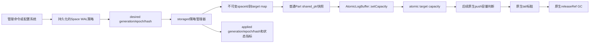

# Nebula Graph 3.6 按图空间热更新 WAL 缓存容量：系统设计方案

> 文档状态：详细设计，尚未实施产品代码。
>
> 适用范围：Nebula Graph 3.6，3 个 storaged、RF=3 的生产拓扑；重点治理长期低写入 Space 的 `AtomicLogBuffer` 内存。
>
> 源码口径：产品源码基线来自分支 `3.6-w-1`；当前工作树的 `AtomicLogBuffer.*` 和 `StorageHttpStatsHandler.cpp` 含此前仅用于根因实验的观测插桩，因此这些文件的本地行号相对原始提交有所后移。本文链接均指向当前工作树，并同时标注关键符号名。
>
> 前置报告：[完整根因分析](./task-wal-root-cause-analysis.md)、[源码系统讲解](./task-wal-source-code-walkthrough.md)、[不改源码的缓解方案](./task-wal-no-source-mitigation.md)、[主动老化方案审查](./task-wal-idle-cache-aging-design.md)。

## 1. 执行摘要

### 1.1 推荐方案

在“允许少量源码扩展，但不能改变 Heartbeat、周期空日志、Raft 复制、提交、WAL 格式和状态机机制”的约束下，推荐方案是：

> 为每个 Space 持久化一个期望的 WAL 内存缓存容量；storaged 将该策略应用到此 Space 的每个普通 replica-part。每个 `AtomicLogBuffer` 只把原来构造期固定的 `capacity_` 改成可原子更新的目标容量，后续缓存收缩仍完全复用现有 `push() -> 标记旧 tail -> releaseRef() GC` 路径，不增加后台主动 trim，不直接修改链表，也不删除磁盘 WAL。

第一版采用人工审核和人工下发 Space 策略，不自动判断冷热。自动冷热识别只作为后续可选阶段，并且应按 replica-part 判断、按 Space 汇总展示。

第一版的准入条件是：目标 Space 的**全部普通 Part** 都已被证明为低非空 WAL 写入，或业务负责人明确接受热点 Part 也同步降容的性能代价。只要存在“一部分 Part 热、一部分 Part 冷”的写入倾斜且不能接受误伤，就应跳过该 Space，或等 Phase 3 使用 per-part 策略；Space 级 target 不会自动避开热点 Part。

### 1.2 为什么它是在线精细化治理中的最佳平衡点

它同时满足：

1. **局部影响**：只缩小指定冷 Space，热 Space 继续保留原有缓存窗口；
2. **无需重启**：目标容量可热更新，避免为了缓存参数反复触发 Leader 迁移；
3. **不改 Raft 协议**：容量不进入 term、quorum、RPC、WAL、Snapshot 或 RocksDB 数据；
4. **不新增第二条链表 Writer**：控制线程只原子写一个容量值，tail 的移动和 Node 标脏仍由现有 `push()` 单 Writer 完成；
5. **可以灰度**：同一 Raft Group 的三个副本可以暂时使用不同容量；一致性不受影响；
6. **容易回滚目标**：可以把目标容量重新调大，虽然已经淘汰的缓存不会立即预热；
7. **收益可计算**：冷 Space 的有效 Node 平台近似与目标容量线性相关。

这里的“最佳”有明确语境：当目标是**以后无需重启即可频繁、选择性地治理冷 Space**时，它是风险与收益最均衡的方案。如果只追求绝对最低代码风险，并且能够接受逐台重启，静态 per-space override 更保守；如果完全不能改源码，全局调小 `wal_buffer_size` 后滚动重启仍是最低代码风险的止损手段。

首次部署支持热容量的新二进制仍然需要滚动重启，并会因为进程重建而立即释放旧 Node。热生效的主要价值是：完成首次部署后，后续 Space 策略调整不再要求重启；不能把首次重启造成的 RSS 下降当成 setter 已完成稳态收缩的证据。

### 1.3 不能忽略的发布阻断项

这个方案不能被简化成“把 `capacity_` 改成 atomic”。启用热降容以前，必须完成以下 P0 闭环：

1. 加固现有 `AtomicLogBuffer::push()` 淘汰与 `releaseRef()` GC 的并发窗口；热降容会把原来低频的淘汰分支放大为连续执行；
2. 对 `WalFileIterator` 与 `rollbackToLog()/ftruncate` 的并发边界完成确定性测试，并在无法证明安全时先完成同步修复；小缓存会增加磁盘 iterator 的使用频率；
3. 策略必须持久化，并具有 generation、单调 snapshot epoch、规范化 hash、幂等应用和 applied 状态；不能只依靠进程内 HTTP 改值；
4. 必须区分“目标容量已设置”“逻辑容量已收敛”“dirty Node 已物理删除”和“RSS 是否归还”。

如果不准备解决这些前置项，最低风险选择仍然是“静态 per-space override + 单节点滚动重启”，而不是热更新。

## 2. 问题、目标与非目标

### 2.1 已验证的问题链

根因报告已经证明以下路径：

```text
RaftPart::statusPolling()
  -> 稳定 Leader 周期 sendHeartbeat()
  -> appendLogAsync(NORMAL, "")
  -> Leader/Follower FileBasedWal
  -> 每个 replica-part 的 AtomicLogBuffer::push()
  -> 空记录逻辑只计16B
  -> 每64条却实际分配一个固定 Node
  -> 达到原8MiB逻辑容量前，live Node 长期线性增加
```

关键源码：

- 周期调度：[`RaftPart::statusPolling()`](../src/kvstore/raftex/RaftPart.cpp#L1401-L1434)；
- 空 NORMAL 日志：[`RaftPart::sendHeartbeat()`](../src/kvstore/raftex/RaftPart.cpp#L2041-L2049)；
- WAL 先写文件、再 push cache：[`FileBasedWal::appendLogInternal()`](../src/kvstore/wal/FileBasedWal.cpp#L442-L500)；
- 空记录逻辑计费：[`Record::size()`](../src/kvstore/wal/AtomicLogBuffer.h#L40-L56)；
- Node 固定64条：[`Node`](../src/kvstore/wal/AtomicLogBuffer.h#L61-L128)；
- 超容量后原生标脏：[`AtomicLogBuffer::push()`](../src/kvstore/wal/AtomicLogBuffer.cpp#L119-L172)；
- reader 释放时原生 GC：[`AtomicLogBuffer::releaseRef()`](../src/kvstore/wal/AtomicLogBuffer.cpp#L220-L268)。

### 2.2 设计目标

本方案必须达到：

1. 支持按 Space 配置 WAL 内存缓存目标容量；
2. 目标容量可以在 storaged 不重启的情况下生效；
3. 未配置 Space 的行为与当前开源版本保持一致；
4. 不改变空日志生成、复制、commit 和 apply；
5. 不改变磁盘 WAL、Snapshot、RocksDB 格式；
6. 不从控制线程直接移动 `tail_`、标脏或 delete Node；
7. 新增 Part、重建 Part、删除 Space 和滚动升级期间策略语义明确；
8. 允许单节点、单 Space、单批 Part 灰度；
9. 可以观测 desired、applied、shrinking、steady 和 warming；
10. 异常配置、乱序更新和进程崩溃不能造成静默回到错误容量。

### 2.3 非目标

第一版明确不做：

- 不修改 `sendHeartbeat()` 或禁止周期空日志；
- 不新增 committed-aware 主动 trim；
- 不主动 reset/swap 整个 `AtomicLogBuffer`；
- 不主动预热已经淘汰的日志；
- 不对冷 Space 主动 flush RocksDB；
- 不自动降低 `wal_ttl`；
- 不承诺 RSS 立即下降；
- 不自动识别业务级“完全空闲”；
- 不把 Listener 默认纳入第一版；
- 不承诺整个 Space 的所有 Part 在同一时刻原子切换容量。

## 3. 不可破坏的正确性边界

### 3.1 AtomicLogBuffer 只是本地读缓存

`FileBasedWal::appendLogInternal()` 的顺序是先编码并写本地 WAL 文件，之后才调用 `logBuffer_->push()`：[`FileBasedWal.cpp:442-500`](../src/kvstore/wal/FileBasedWal.cpp#L442-L500)。

读取时，如果起始 LogID 不在 Atomic cache，会使用磁盘 iterator：[`FileBasedWal::iterator()`](../src/kvstore/wal/FileBasedWal.cpp#L530-L536)。Leader 为落后 peer 准备 AppendLog 也走统一 WAL iterator：[`Host::prepareAppendLogRequest()`](../src/kvstore/raftex/Host.cpp#L287-L345)。

因此缓存容量不参与 Raft 数据路径中的：

- Raft term 和 role；
- 多数派确认；
- `committedLogId`；
- 状态机 apply；
- 查询数据；
- WAL 文件内容；
- Snapshot 内容；
- RocksDB sequence 和 key/value。

三个副本使用不同缓存容量，在协议正确性上是安全的：一个副本从内存读，另一个从磁盘读，权威日志内容相同。

### 3.2 本方案改变的是策略，不是日志机制

当前每个 `RaftPart` 构造时无条件使用全局 gflag：

```cpp
FileBasedWalPolicy policy;
policy.bufferSize = FLAGS_wal_buffer_size;
```

源码：[`RaftPart::RaftPart()`](../src/kvstore/raftex/RaftPart.cpp#L330-L365)。

本方案只让这一容量在运行期可变。原生的下列逻辑保持不变：

```text
记录进入buffer
  -> size + record charge 超过capacity
  -> 标记最旧有效Node
  -> 推进tail和firstLogId
  -> dirtyNodes增加
  -> 最后一个旧reader释放时执行GC
```

准确术语应是“复用原生淘汰机制的最小机制扩展”，不能写成“源码和行为完全不变”。

## 4. 总体架构



架构分成两条互不混淆的路径：

### 4.1 控制路径

负责：

- 校验 Space 和容量；
- 持久化 desired policy；
- 分配同一 generation 内严格单调的 snapshot epoch；
- 将策略下发到各 storaged；
- 收集 applied generation/epoch/hash；
- 支持查询、灰度、重试和回滚。

控制路径不操作 Node 链表。

### 4.2 数据路径

负责：

- 每个 buffer 原子保存目标容量；
- 每次 `push()` 读取一次容量快照；
- 按现有算法逐步标记旧 Node；
- 按现有 reader-ref 协议物理回收；
- Atomic miss 时按现有路径读取磁盘 WAL。

数据路径不读取 Meta，不等待集群共识，也不要求三个副本容量相同。

## 5. 策略模型

### 5.1 策略快照与版本术语

逐 Space CAS 与整张策略快照不能共用一个含义模糊的 `revision`。本文统一采用：

```text
PolicySnapshot {
  policy_generation: uint64/UUID     # restore/rebase后的新世代
  snapshot_epoch: uint64             # 该世代内任一Space变化都+1
  canonical_hash: bytes              # 完整map的规范化hash
  policies: map<space_id, SpaceWalBufferPolicy>
}

SpaceWalBufferPolicy {
  space_id: int32
  target_capacity_bytes: int64
  last_modified_epoch: uint64         # 本Space的CAS token，可跳号
  enabled: bool                        # false表示RESET tombstone
  include_listener: bool = false
}
```

含义：

- 管理命令的 `EXPECT` 比较完整 `(policy_generation,last_modified_epoch)`，防止 restore/rebase 后 generation 变化但 epoch 数值复用形成 ABA；
- storaged desired/applied 比较完整快照的 `(policy_generation, snapshot_epoch, canonical_hash)`；
- 每个 Part 使用6.3节完整 `EffectiveCapacityVersion`（含 gate 与 `generation_install_epoch`）和 target 比较；
- RESET 保留 `enabled=false` tombstone 和新的 `last_modified_epoch`，不能直接物理删除 CAS token；
- Drop Space 可以在删除 Space 元数据时同批删除 tombstone；
- `activity_epoch` 是未来自动冷热的本地活动版本，与以上管理版本完全独立。

当前 generation 中从未配置过的 Space，其初始 CAS token 定义为 `(current_generation, 0)`。

约束：

- `space_id > 0`；
- `0 < target_capacity_bytes <= INT32_MAX`；
- 实际产品上限还应远低于 `INT32_MAX`，避免现有 `int32_t size_` 计算接近溢出；
- `enabled=false` 等价于恢复该 Part 构造时保存的原始 hot capacity；
- 同一 `policy_generation` 内 `snapshot_epoch` 只能增加；回滚也创建更大 epoch；
- 第一版 `include_listener=false`，普通 Storage Part 与 Listener 分开灰度。

### 5.2 运行状态

每个 Part 至少暴露：

```text
DEFAULT    未配置override，使用原始容量
APPLYING   新target已收到，正在写入buffer
SHRINKING  accounted size明显大于target
STEADY     accounted size位于target附近的Node粒度锯齿区间
WARMING    target已调大，但缓存尚未重新填充
ERROR      策略无法解析、对象缺失或应用失败
```

注意：`STEADY` 只表示逻辑有效窗口接近目标，不代表 jemalloc 已把页面归还给操作系统。

### 5.3 Space策略、Part执行

管理对象是 Space，实际执行对象必须是本机的每个 replica-part：

```text
space 10 target=2MiB
  -> part 1 buffer target=2MiB
  -> part 2 buffer target=2MiB
  ...
  -> part 20 buffer target=2MiB
```

这样管理体验保持 Space 级别，同时不引入一个共享 Space buffer。每个 Part 仍拥有独立 `FileBasedWal` 和 `AtomicLogBuffer`：[`RaftPart.cpp:330-372`](../src/kvstore/raftex/RaftPart.cpp#L330-L372)、[`FileBasedWal.cpp:40-60`](../src/kvstore/wal/FileBasedWal.cpp#L40-L60)。

这里的“冷”特指低非空 Raft WAL 写入活动，不等于低查询量。第一版会无差别作用于该 Space 的全部普通 Part；存在写热点分片时，必须放弃 Space 级降容或取得业务风险接受，不能用其余19个冷 Part 掩盖1个热 Part。

## 6. AtomicLogBuffer 热容量实现

### 6.1 字段与接口

当前字段是普通 `int32_t`：[`AtomicLogBuffer.h:385`](../src/kvstore/wal/AtomicLogBuffer.h#L385)。跨线程直接写会形成 C++ data race。

建议接口：

```cpp
struct CapacityChange {
  int32_t oldCapacity;
  int32_t newCapacity;
  bool changed;
};

class AtomicLogBuffer {
 public:
  StatusOr<CapacityChange> setCapacity(int64_t capacity);
  int32_t capacity() const;

 private:
  std::atomic<int32_t> capacity_{8 * 1024 * 1024};
};
```

`setCapacity()` 必须：

1. 拒绝 `capacity <= 0`；
2. 拒绝 `capacity > kProductMaxWalBufferSize`；
3. checked narrowing 到 `int32_t`；
4. 只做一次 `atomic::exchange(memory_order_relaxed)`，可靠取得审计所需的旧值；
5. 不移动 tail；
6. 不修改 `size_`；
7. 不标脏或 delete Node；
8. 返回旧值、新值和是否实际改变，供审计日志使用。

容量是独立策略标量，不发布其他对象，`memory_order_relaxed` 足够；但代码中应明确说明这一点。

当前实验指标聚合直接读取 `capacity_`：[`AtomicLogBuffer::metrics()`](../src/kvstore/wal/AtomicLogBuffer.cpp#L98-L115)。字段原子化后，所有指标、日志和测试读取也必须改用 `capacity()` 或显式 `.load()`；registry mutex 只保护 buffer 生命周期，不能替代 atomic 读写。

### 6.2 push只读取一次容量快照

`push()` 开头应做：

```cpp
const auto capacity = capacity_.load(std::memory_order_relaxed);
const int64_t projected =
    static_cast<int64_t>(size_.load(std::memory_order_relaxed)) + recSize;

if (projected > capacity) {
  // 继续执行原生淘汰路径
}
```

一次 push 内不能多次读取可能变化的容量，否则同一条记录可能在判断过程中使用两个阈值。热更新恰好并发时，允许这一条 push 使用旧 target；下一条自然收敛。

将加法提升到 `int64_t` 是为了避免现有 `int32_t size + recSize` 靠近上界时发生有符号溢出。它不改变正常范围内的淘汰语义。

### 6.3 分层转发

建议调用链：

```text
NebulaStore::applyWalBufferPolicy(spaceId, effectiveVersion, target)
  -> Part::applyWalBufferCapacity(effectiveVersion, target)
  -> RaftPart::applyWalBufferCapacity(effectiveVersion, target)
  -> FileBasedWal::setBufferCapacity(target)
  -> AtomicLogBuffer::setCapacity(target)
```

策略版本和本机 activation gate 不能在转发链中丢失。第一版的复合 key 为：

```text
EffectiveCapacityVersion {
  gate_epoch
  desired_gate_enabled
  generation_install_epoch
  policy_generation
  space_last_modified_epoch
}
```

每个普通 Part/WAL 必须保存 `appliedEffectiveVersion`、`appliedTarget` 和一把仅保护策略状态的小锁；`applyWalBufferCapacity(effectiveVersion,target)` 在同一临界区内完成：

1. 先比较 `gate_epoch`：更小的任务一律拒绝；
2. `gate_epoch` 相同但 `desired_gate_enabled` 不同：一致性冲突，拒绝；
3. `desired_gate_enabled=false` 时，target 必须是 original capacity，即使 policy 版本未变化也允许升容；
4. 再比较 host-local 单调 `generation_install_epoch`：更小的任务拒绝；
5. install epoch 相同但 `policy_generation` 不同：一致性冲突，拒绝；
6. gate启用、generation相同时，再比较 Space 的 last-modified epoch；
7. 完整复合 key 和 target 全相同：幂等成功，可用于崩溃后的补应用；
8. 完整复合 key 相同但 target 不同：一致性错误，拒绝并告警。

`policy_generation` 可以是 UUID，本身不可排序。策略管理器每次通过当前 Meta leader 的 rebase 握手接受新 generation 时，必须先持久化递增的 `generation_install_epoch` 及其 generation 绑定，再发布/应用快照；所有 Part 调用都携带该本地 epoch。迟到的旧 generation 调用因此携带更小 install epoch，并在 Part 策略锁内被拒绝。进程重启后继续使用持久值，不能重新从0开始。

这些规则可同时关闭旧 target、旧 gate 和旧 generation 的 check-then-store 窗口。该策略锁不进入 Raft/WAL 链表临界区，也不能在持有时获取 NebulaStore 或 Meta 锁。

Phase 3 若启用自动冷热，还要把 `activity_epoch` 和 HOT/COLD mode 纳入 effective-capacity 状态机；第一版不预留一个含义模糊的单一 revision 来同时处理三种版本域。

`FileBasedWalPolicy::bufferSize` 当前是构造期策略并保存在 const `policy_`：[`FileBasedWal.h:265`](../src/kvstore/wal/FileBasedWal.h#L265)。热更新后它只能表示 initial capacity；HTTP/metrics 必须从 `AtomicLogBuffer::capacity()` 获取当前有效 target，不能继续展示 `policy_.bufferSize`。

构造路径也必须使用与热 setter 相同的范围校验和 checked narrowing。`FileBasedWalPolicy::bufferSize` 的类型是 `size_t`：[`FileBasedWal.h:20-31`](../src/kvstore/wal/FileBasedWal.h#L20-L31)，而创建 buffer 时会传入 `int32_t`：[`FileBasedWal.cpp:40-60`](../src/kvstore/wal/FileBasedWal.cpp#L40-L60)。只校验热更新、继续允许启动期隐式窄化是不完整的。

每个 Part 还应保存 `originalHotCapacity`，用于 reset policy。这个值来自 Part/WAL 构造时的有效全局或静态配置，不能在回滚时临时读取一个可能已经变化的全局 flag。

## 7. P0：push淘汰与reader GC并发硬化

### 7.1 现有潜在窗口

当前 `push()` 在容量超限后大致执行：

```text
old tail markDeleted=true
  -> firstLogId更新
  -> tail_.store(prev) 发布新tail
  -> 继续读取 oldTail->size_
  -> dirtyNodes++
```

源码：[`AtomicLogBuffer::push()`](../src/kvstore/wal/AtomicLogBuffer.cpp#L144-L167)。

与此同时，最后一个 Reader 可能在 [`releaseRef()`](../src/kvstore/wal/AtomicLogBuffer.cpp#L220-L268) 中：

1. 读到已经发布的新 tail；
2. 发现此前 dirty 数已超过阈值；
3. 从 `newTail->next_` 开始删除 dirty 链；
4. 删除 Writer 尚未完成读取的 old tail。

结果可能是 UAF、dirty 计数下溢或 CHECK 失败。本文将其定义为“源码审计发现的潜在竞态”，不是已经由本次生产实验复现的根因。

正常稳态大约每创建一个新 Node 才需要淘汰一个旧 Node；热降容时 `size_ >> target`，几乎每个非 new-head push 都会进入该分支，因此必须先加固。

### 7.2 推荐线性化方式

更小且可证明的修复是把 `tail_.store(prev, release)` 作为淘汰操作的**最后线性化点**：

```text
CAS标记old tail
  -> 缓存prev和oldSize
  -> 更新firstLogId、size、dirty计数
  -> 最后发布tail=prev
  -> 发布后绝不再解引用old tail
```

两种 GC 交错都可闭环：

1. `releaseRef()` 在新 tail 发布前捕获 old tail：即使 GC 已启动，它只会从 `capturedOldTail->next_` 删除更老的 dirty 链，不会删除 old tail；Writer 仍可安全完成计费。
2. `releaseRef()` 在新 tail 发布后捕获 prev：此时 Writer 已完成 old tail 的全部读取和计数，发布后不再解引用它，因此 GC 可以安全删除 old tail。

这不改变哪个 Node 被标脏、容量判断、firstLogId、dirty 阈值和 GC 删除范围，只修正“发布可回收性”和“最后一次对象访问”的先后关系。现有注释要求若干操作不能重排；实现时必须更新注释并用确定性交错测试证明新的线性化顺序，不能随意交换原子操作。

备选方案是为实际淘汰路径增加 RAII synthetic ref：只在 `tail != head` 且准备标脏时、在发布新 tail 前取得，覆盖最后一次 old tail 解引用和全部 size/dirty 计数，并保证所有出口释放。它也能闭环，但 guard 释放可能在 WAL Writer 线程同步触发长链 GC，改变 GC 时机和 append P99；若采用该方案，必须额外观测 GC duration、单次 deleted nodes 和最大批次。因此第一版优先采用“发布 tail 为最后线性化点”。

### 7.3 必须通过的确定性交错测试

至少覆盖：

1. 初始已有6个 dirty Node；
2. 一个真实 Reader 持有旧区间；
3. Writer 开始标记新 tail；
4. Reader 分别在 tail 发布前、发布后释放；
5. 验证无 UAF、无重复 delete、无 dirty 下溢；
6. 覆盖 Reader 已在 Writer 开始前完成 `refs:1->0` 并启动 GC 的分支；
7. 若采用 synthetic ref，验证 guard 释放能正常触发 GC，并量化 Writer 同步 GC 的最长耗时；
8. ASan、TSan 和重复压力测试均通过。

## 8. 热更新的精确语义

### 8.1 降低容量

`8MiB -> 2MiB` 的 setter 成功只表示 target 已更新。它不会立即遍历或删除旧 Node。

后续每次原生 `push()`：

- 发现 `size + recSize > target`；
- 每次最多标脏一个完整旧 Node；
- new-head 分支仍会在容量检查前返回；
- `tail == head` 时仍不能淘汰唯一 Node；
- 物理 delete 仍等待 reader-ref GC。

因此降低容量是异步、渐进、最终收敛，而不是同步 shrink。

### 8.2 增大容量

`2MiB -> 8MiB` 会让后续 push 使用更大的阈值，但：

- 已经 delete 的 Node 不会复活；
- 已经 markDeleted 的 Node 不会取消标记；
- 不会从磁盘主动预热；
- 已触发的磁盘读取和 Snapshot 无法撤销；
- 只有未来日志会逐渐把窗口重新填大。

因此升容后的状态应显示为 `WARMING`，不能把它描述为即时回滚缓存内容。

### 8.3 没有后续push

没有 push 就不会收缩。当前周期空 NORMAL 日志会持续驱动冷 Part 收敛；如果未来上游修复停止空日志，本方案的自动收缩也会停止。

这是一项明确依赖：

> 本方案适合当前“不改变空日志机制”的约束；它不是独立于未来上游行为的通用主动回收器。

### 8.4 快速重复更新

同一 generation 内，每次策略快照都携带单调 `snapshot_epoch`，目标 Space 同时更新自己的 `last_modified_epoch`：

```text
snapshot 10 / space last_modified=10: 8MiB -> 2MiB
snapshot 11 / space last_modified=11: 2MiB -> 8MiB
```

Meta/管理面用目标 Space 的 `(expected_policy_generation, expected_last_modified_epoch)` 做 CAS；storaged 的每个 Part 使用上一节唯一的 `applyWalBufferCapacity(effectiveVersion,target)`。迟到的 epoch 10 即使已经排队，也会在同一策略临界区被 epoch 11 拒绝。

同一 host 还应只有一个串行 single-flight apply worker：回调只发布最新不可变 `{generation,snapshot_epoch,map,hash}` 并唤醒 worker；旧 job 在每批 Part 前发现 desired 已变化就停止，由唯一 worker重放最新版。host applied 只有在 desired 快照没有再次变化、当前所有目标 Part 都匹配该快照后才能推进。相同 epoch/hash 必须允许幂等 reconcile，不能因为“epoch 没增大”而跳过半应用恢复；相同 epoch 但 hash 不同必须报一致性错误。

回滚也必须提交新的更大 epoch，不能依赖普通 last-write-wins。无论 target 如何更新，已经标脏或删除的缓存都不可逆。

### 8.5 大批次边界

目标容量至少应覆盖现网 p99 单个 Raft 批次的逻辑 charge，并留出余量：

```text
target >= p99 Σ(sizeof(ClusterID) + sizeof(TermID) + payload.size)
```

当前 Leader 批次上限为256条。若一个批次的累计 charge 已超过 target，批首可能在本批复制或提交完成前离开内存，并立即转磁盘 iterator。它不破坏正确性，但可能显著增加 commit P99 和磁盘 IO。

## 9. Part生命周期与并发应用

### 9.1 NebulaStore对象保护

`spaces_` 和 `spaceListeners_` 由 [`NebulaStore::lock_`](../src/kvstore/NebulaStore.h#L868-L883) 保护。新增 Part 也在这把写锁下进行：[`NebulaStore::addPart()`](../src/kvstore/NebulaStore.cpp#L437-L479)。

安全应用顺序：

1. single-flight worker 接收并验证不可变 `{generation,snapshot_epoch,map,hash}`；
2. 获取 `NebulaStore` 写锁，拒绝陈旧 generation/epoch/hash；
3. 在同一锁域替换不可变 policy map，并复制目标 Part 的 `shared_ptr`；
4. 释放 store 锁后发布本地 desired snapshot identity；
5. 逐个调用只含 atomic store 的 setter；
6. 记录成功、缺失和过期任务数量；
7. desired 未变化且全部目标 Part 对齐后，更新 host applied snapshot identity。

禁止：

- 保存 raw `Part*` 或 `AtomicLogBuffer*`；
- 持有 `NebulaStore::lock_` 再等待每个 `raftLock_`；
- 在 MetaClient heartbeat 线程中同步遍历和更新上千 Part；
- 将部分成功误报为整个 Space 已收敛。

### 9.2 新建Part

策略 map 必须是进程内长期状态。新 Part 在构造时主动读取当前 map：

```text
effective capacity = space override or original default
```

不能只依赖“配置变化回调遍历现有 Part”，否则配置值没有再次变化时，后来新增的 Part 会漏掉策略。

安全顺序应保证：

- 策略先发布、后创建的 Part 直接读取新 generation/epoch；
- 策略发布前创建的 Part 会被本轮 shared_ptr 快照覆盖；
- 即使 Part 随后被删除，局部 shared_ptr 也能保证 setter 调用期间对象有效。

启动恢复还有一条独立路径：[`NebulaStore::loadPartFromDataPath()`](../src/kvstore/NebulaStore.cpp#L234-L274) 会在后台、store 锁外构造并启动 Part，之后才插入 map；而 [`newPart()`](../src/kvstore/NebulaStore.cpp#L484-L515) 在插入前已经注册并启动 Raft。若只扫描 map，可能出现“按旧 policy 构造、更新扫描时尚未插入、最后带旧 target 插入”的漏配窗口。

第一版必须同时满足：

1. 本地 last-known-good policy 在 NebulaStore 开始加载 Part 前完成读取；
2. 热 apply worker 在启动 Part 扫描完成后才对外报告 applied；
3. Part 构造前读取一次 policy，在插入 map 的线性化点再读取一次最新 effective version，并通过幂等 `applyWalBufferCapacity(effectiveVersion,target)` 补齐；
4. 启动期间收到的新 desired snapshot 在加载屏障结束后做一次全量重放；
5. host applied snapshot 只有在加载屏障完成、当前 map 内所有目标 Part 都达到对应 policy version 后才能发布。

### 9.3 Listener

Listener 同样拥有独立 Raft/WAL，并可能继承 `RaftPart`。若在 `RaftPart` 基类中按 `spaceId` 无差别应用，Listener 会同步缩小缓存，可能增加外部索引 apply 延迟和磁盘回退。

第一版建议：

- 普通 Storage Part 应用 per-space target；
- Listener 保持原始容量；
- 指标明确区分 ordinary part 与 listener；
- Listener 经过独立追赶、Snapshot 和外部索引验证后再增加 `include_listener=true` 能力。

## 10. 控制面与持久化

### 10.1 不能只改现有gflag

现有 `/flags` PUT 只调用 `gflags::SetCommandLineOption()`：[`SetFlagsHandler.cpp:83`](../src/webservice/SetFlagsHandler.cpp#L83)。它不会自动更新已经构造的 `AtomicLogBuffer`，也没有 per-space applied ack。

现有通用配置键只包含 `(module, name)`，没有 `spaceId`：[`MetaKeyUtils::configKey()`](../src/common/utils/MetaKeyUtils.cpp#L934-L943)。虽然 `ListConfigsReq` 带有 `space` 字段，但 [`ListConfigsProcessor::process()`](../src/meta/processors/config/ListConfigsProcessor.cpp#L11-L35) 只按 module 前缀列举，没有使用该字段。因此不能把现有 `UPDATE CONFIGS` 直接描述成通用的 per-space 控制面。

storaged 默认 `local_config=true`：[`StorageServer.cpp:40`](../src/storage/StorageServer.cpp#L40)，并把它传成 `skipConfig_`：[`StorageServer.cpp:194`](../src/storage/StorageServer.cpp#L194)。此时 [`MetaClient::loadCfg()`](../src/clients/meta/MetaClient.cpp#L3147-L3183) 会跳过 Meta 配置加载。

不能仅为了本功能把生产集群改成 `local_config=false`，因为 Meta 中其他历史配置也可能同时覆盖本地值。

### 10.2 第一阶段：本机持久化策略＋热应用

仅用于实验、单节点 canary，或生产已经具备可靠配置管理系统时，第一阶段可以采用：

```text
每台storaged本机持久化的override文件
  -> 原子rename更新
  -> 策略worker解析和校验
  -> host-local generation/epoch/hash
  -> live Part版本保护的capacity apply
  -> applied状态
```

要求：

- 在目标文件同一文件系统创建临时文件，完整写入并校验后执行 `fsync(temp fd) -> rename -> fsync(parent directory)`；
- 解析失败保留 last-known-good，不自动 reset；
- 文件中保存 generation、epoch、canonical hash 和完整 map，不使用增量补丁；
- 同时持久化 host-local `generation_install_epoch` 及其 generation 绑定，重启后保持单调；
- 三台 storaged 可以不同步灰度，但必须显示每台 desired/applied hash；
- 管理接口只允许 localhost 或受控管理网访问；
- 重启后先读取策略，再开始加载/创建 Part。

这一阶段无需修改 Meta/Graph wire，适合验证 Atomic 热容量和性能，但运维需要负责三台配置一致性。

本地文件不是集群真源。如果没有统一分发、原子落盘、三节点一致性校验和审计能力，不应把三台机器分别维护的文件用于正式生产热更新；这种情况下，第一版应退回静态 per-space override 加滚动重启，或直接完成下一节的 Meta 控制面。

本地 epoch 属于 host-local 命名空间，三台机器上的数字不能直接比较。若现有生产配置管理系统承担权威源，它必须提供单一 artifact 的 generation/CAS、相同 full-map hash、幂等重投和审计；否则该阶段严格限于实验或单机 canary。

### 10.3 产品化阶段：独立的Meta Space策略

产品化后建议新增独立 Meta key，而不是把字段塞进 `SpaceDesc` 或复用普通 `(module, name)` ConfigItem：

```text
__space_wal_buffer__<spaceId>
  -> {target_capacity_bytes, enabled, include_listener, last_modified_epoch}

__space_wal_buffer_snapshot_meta__
  -> {policy_generation, snapshot_epoch, canonical_hash}
```

原因：

- 现有 Config key 不包含 `spaceId`；
- 整张 map 更新容易发生并发覆盖；
- 需要逐 Space CAS 和全局一致快照；
- 需要独立 backup、restore 和 drop-space 生命周期；
- 旧版本对 `SpaceDesc` 未知字段的重新序列化可能丢失扩展字段。

建议管理语义：

```text
SET SPACE WAL BUFFER <space> <bytes> EXPECT GENERATION <g> LAST_MODIFIED_EPOCH <n>
RESET SPACE WAL BUFFER <space> EXPECT GENERATION <g> LAST_MODIFIED_EPOCH <n>
SHOW SPACE WAL BUFFER <space>
SHOW SPACE WAL BUFFER STATUS <space>
```

Meta 返回必须区分：

```text
desired persisted
部分storaged applied
全部目标storaged applied
各host正在shrinking或warming
```

Meta heartbeat 可以携带 optional desired generation/epoch/hash；storaged 通过**独立于普通 gflags 配置**的专用接口拉取同一读快照下生成的 `{generation,epoch,full map,hash}`，应用后在 heartbeat 回报状态。该路径不得调用或依赖 `MetaClient::loadCfg()`、`skipConfig_`、`localCfgLastUpdateTime_`，生产可以继续保持 `local_config=true`。字段缺失或旧 metad 响应不能解释为 reset，必须保留 last-known-good。

Meta processor 必须在 `LockUtils::lock()` 写锁内完成“读取目标 Space token、同时比较 expected generation 与 epoch、分配新 snapshot epoch”，再把 Space record/tombstone 与 snapshot meta 用同一个 Meta Raft KV batch 提交。快照读取在同一读锁下返回 full map 和 canonical hash。Drop Space 时同批清理对应 policy；RESET 则保留 tombstone。新 key 前缀还必须纳入 Meta backup/restore。`applied` 只表示本机 map 已发布、当时存在的目标 Part 已执行 setter、以后新增 Part 会读取该 map；它不表示 Node 或 RSS 已经收敛。

### 10.4 快照版本、崩溃与恢复一致性

一次策略更新应先持久化 desired，再异步 apply：

```text
Meta或本地文件持久化 generation 7 / snapshot epoch 21 / hash H21
  -> storaged A应用一半后崩溃
  -> 重启读取同一快照
  -> 所有新建Part直接使用目标
  -> 幂等重放到现有Part
  -> applied更新为(7,21,H21)
```

不能先修改 live buffer、后持久化目标，否则进程崩溃后会静默恢复旧值。相同 generation/epoch/hash 的重放必须允许补齐半应用，不能因版本“没有变大”而整体跳过。

Meta backup 的时间点回退还会让 `snapshot_epoch` 倒退。恢复流程必须生成新的 `policy_generation`，在当前 Meta leader 身份下发布强制 full snapshot；storaged 经当前集群握手确认新 generation 后，先原子持久化递增的 host-local `generation_install_epoch` 与 generation 绑定，再进行完整 reconcile。所有旧 generation 的在途任务保留旧 install epoch，因而可在 Part 锁内确定拒绝。

rebase 不能只遍历新 map：较早 backup 可能根本不含旧 generation 中后来创建的 override。安全顺序必须与9.1节使用同一个线性化点：

1. 在 `NebulaStore` 写锁内保留 old map，计算受影响 Space 集合 `old enabled overrides ∪ new policies`；
2. 在同一锁域原子发布 new map/新 gate-generation，并抓取这些 Space 当前全部普通 Part 的 `shared_ptr`；
3. 释放 store 锁后，对抓到的 Part 应用新 policy；对新 map 中消失的旧 override，使用新 gate/generation 的 synthetic reset 恢复 `originalHotCapacity`；
4. 发布后新增的 Part 直接按 new map 构造，发布前已插入的 Part 一定在 shared_ptr 快照中；
5. 最后重新核验 desired identity 未变化、受影响 Part 全部对齐，才推进 host applied。

gate enable/disable 也沿用这一顺序，不能先在锁外 reset、后发布新 gate/map。若产品不实现 generation rebase，则必须明确“不支持带该 policy 的时间点回退”，恢复后由运维清除各 host last-known-good 并重建策略；仅把 key 纳入 backup 不足以保证一致性。

### 10.5 混合版本与功能开关

容量是本地 cache 策略，新旧 storaged 或三个副本暂时使用不同 target，不改变 Raft wire、日志内容或 quorum；但磁盘 fallback 和 Snapshot 性能可能不对称。

产品控制面应按以下顺序演进：

1. 新 Meta/Storage Thrift 字段只追加 optional 字段；
2. 先升级全部 metad；
3. 若提供 Graph 管理语法，再升级全部 graphd；在三 graphd 全部升级前禁用新语句，或将管理流量明确路由到已升级 graphd/专用 Meta admin API；
4. 再升级 storaged，新二进制默认 feature gate 关闭；
5. gate 关闭的节点报告 `supported but disabled`，不能冒充 applied；
6. 全量部署关闭状态验证完成后，才启用一个 storaged canary；
7. 旧 metad 或缺失 optional 字段只表示“不支持/未知”，绝不能解释成 reset；
8. 回滚旧二进制前，先停用新管理入口、用更大 epoch 恢复 original target、等待 applied，再按 storaged -> graphd -> metad 逆序回滚并清理旧版本不认识的配置。

把控制字段加入 Meta heartbeat 是向后兼容的管理面扩展，不是 Raft AppendLog/Heartbeat 协议变化；验收时必须把两者区分开。

为了真正支持“只启用一台 storaged”，还需要独立、持久的 per-host activation gate，且不能复用 `local_config`：

```text
DISABLED   拉取并缓存desired，但所有Part保持original target；报告supported_disabled
ENABLING   重放最新完整快照
ENABLED    可报告applied
DISABLING  先把所有Part恢复original target并确认，再进入DISABLED
```

每次启用或停用请求先持久化一个更大的 `gate_epoch`。Part key 保存6.3节完整 `EffectiveCapacityVersion`：`(gate_epoch, desired_gate_enabled, generation_install_epoch, policy_generation, last_modified_epoch)`；`ENABLING/DISABLING` 是 host 聚合状态，不进入 Part key，也无需定义同 epoch 下的四态排序。全部 Part 对齐 `desired_gate_enabled=true/false` 后，host 才分别切换为 `ENABLED/DISABLED`。这样迟到的旧启用任务和旧 generation 都无法覆盖后来的禁用/升容。关闭 gate 只恢复 target，已经淘汰的 Node 仍不会自动预热。

gate 默认 `DISABLED`，由每台 storaged 的专用本地状态文件和受控管理接口维护，使用与10.2节相同的原子落盘协议并记录操作者/时间/旧值/新值；不能仅使用不持久的 `/flags` PUT。中央 Space policy 负责“希望哪些 Space 使用多大容量”，本地 gate 负责“本机是否参与”，两者职责不能混用。

Heartbeat 状态至少携带 `process_instance_id/boot_id`、capability、`gate_epoch/gate_state`、ready、desired generation/epoch/hash 和 `applied_gate_epoch`/generation/epoch/hash。storaged 首次 heartbeat 可能早于 kvstore 构造完成（初始化顺序见 [`StorageServer.cpp:236-257`](../src/storage/StorageServer.cpp#L236-L257)），因此新进程先报告 `INITIALIZING` 且没有 applied；Meta 对同一 boot_id 拒绝较小 gate epoch，只统计当前活跃、属于目标集合、capability/gate匹配且 boot_id 对应本进程的 ack，不能沿用相同 HostAddr 上一个进程的陈旧 applied。

## 11. 可选的自动冷热识别

### 11.1 第一版为什么不自动化

第一版应由运维人工审核冷 Space 并下发 target。这样可以单独验证：

- atomic capacity；
- push/GC 并发硬化；
- 磁盘 fallback；
- Snapshot；
- 控制面 generation/epoch/hash；
- 回滚和升容语义。

把识别、状态机和容量热更新同时上线，会让故障无法归因。

### 11.2 第二版按Part识别、按Space展示

自动模式建议：

```text
HOT
  -> 连续idle_timeout无非空Raft WAL活动
  -> COLD_CANDIDATE
  -> 第二次确认activity_epoch未变化
  -> COLD

COLD
  -> 第一条非空Raft WAL到来
  -> 先恢复hot target
  -> 再push当前日志
  -> HOT
```

识别信号应记录在 `FileBasedWal::appendLogInternal()` 成功路径，条件为 `msg` 非空。准确位置是磁盘 WAL 写入及元数据更新成功之后、[`logBuffer_->push()`](../src/kvstore/wal/FileBasedWal.cpp#L492-L500) 之前。它表示“近期有非空 Raft WAL 活动”，不能直接命名为“没有任何业务写入”，因为 Snapshot、SST ingest 和 restore 可绕过普通 WAL append。

每次非空活动增加 `activity_epoch`。这不能实现成“检查 epoch，再单独 store capacity”，否则仍有迟到 Cleaner 覆盖 HOT 的 check-then-store 竞态。per-part 状态必须提供原子迁移：

- `tryCold(expectedEpoch)`：在同一策略临界区复核 epoch/时间、切换 COLD、写入 cold capacity；
- `onNonEmptyActivity()`：在同一临界区执行 `epoch++`、切换 HOT、恢复 hot capacity，然后才允许当前非空日志进入 buffer；
- 冷任务、WAL Writer 和手工 policy 更新使用定义清楚的优先级；人工 policy snapshot 与本地 gate state 高于自动状态；
- 该临界区不得同步获取 NebulaStore 或 Meta 锁。

`activity_epoch` 只描述本地 Part 活动，不能与管理面的 `policy_generation/snapshot_epoch` 混用。自动阶段启用前必须为这两种迁移加入确定性竞态测试。

一个 Space 可以按以下方式展示：

```text
20/20 parts cold -> SPACE_COLD
18/20 parts cold -> SPACE_PARTIALLY_COLD
0/20 parts cold  -> SPACE_HOT
```

实际 target 仍按 Part 执行，以避免一个热点 Part 拖住其余19个空闲 buffer，或错误缩小热点 Part。

## 12. 容量、时间窗与收敛模型

### 12.1 当前实验二进制的计费关系

本次 Debug 构建实测：

```text
空Record逻辑charge = 16B
每Node固定Record数 = 64
sizeof(Node) = 3200B
jemalloc usable/Node = 3584B
```

因此一个填满空日志的 Node：

```text
逻辑charge = 64 × 16 = 1024B
allocator usable = 3584B
放大系数 = 3584 / 1024 = 3.5
```

在当前 ABI/allocator、正常短 Reader、已经进入稳态的条件下：

```text
每Part有效Node usable平台 ≈ target_capacity × 3.5
```

它不是 RSS hard limit，还不包含：

- partial head；
- 0～约6个正常锯齿 dirty Node；
- 长 Reader 延迟回收的 dirty 链；
- allocator metadata、active/resident page；
- 非 SSO payload 的外部分配；
- RocksDB、RPC、线程栈和其他 storaged 内存。

商业生产二进制的编译器 ABI 和 allocator 未必相同，上线前必须重新测 `sizeof(Node)` 和 allocator usable。

`capacity` 还是软逻辑阈值，不是对象数或 RSS 的硬上限：new-head 分支不检查容量，唯一 Node 不能淘汰，大 payload 也可能造成明显 overshoot。验收区间必须允许至少一个 Node 和最大正常 record 的粒度偏差。

### 12.2 空日志内存时间窗

设：

```text
C = 目标逻辑容量（byte）
H = raft_heartbeat_interval_secs
T_delay ≈ H/3 + 0.2495秒
```

忽略 callback 执行、worker 排队和调度抖动，空日志名义保留时间为：

```text
window(C,H) ≈ (C / 16) × T_delay
```

发布配置 H=30 的条件估算：

| target | 有效空日志Node/Part | 空日志名义时间窗 | 当前构建usable/Part | 1000 cold parts |
|---:|---:|---:|---:|---:|
| 8MiB | 8192 | 约62.2天 | 约28MiB | 约27.34GiB |
| 4MiB | 4096 | 约31.1天 | 约14MiB | 约13.67GiB |
| 2MiB | 2048 | 约15.5天 | 约7MiB | 约6.84GiB |
| 1MiB | 1024 | 约7.8天 | 约3.5MiB | 约3.42GiB |
| 256KiB | 256 | 约46.6小时 | 约896KiB | 约875MiB |

`256KiB` 只是在空日志模型下看起来仍有约两天窗口；真实业务 payload 会更快消耗逻辑容量，第一版不能据此直接使用极小值。

### 12.3 在线降容收敛时间

原生 `push()` 每次最多标脏一个旧 Node，并且每64条日志会有一次 new-head push 跳过容量判断。满缓存、空日志条件下，从 `C_old` 降到 `C_new` 的粗略估算为：

若初始 head 已满，前 `p` 次后续空 push 的逻辑有效 size 近似为：

```text
size(p) = C_old + 16p - 1024 × (p - ceil(p/64))
```

它同时计算了“新 push 自身增加16B”和“非 new-head push 每次淘汰一个1024B满 Node”。忽略取整后：

```text
pushes_to_remove ≈ (C_old - C_new) / (1024 × 63/64 - 16)
                  = (C_old - C_new) / 992
shrink_time ≈ pushes_to_remove × T_delay
```

逐条模拟当前分支后，H=30 的名义值为：

| 热更新 | 净移除有效Node/Part | 约需push/Part | 名义逻辑收敛时间 |
|---|---:|---:|---:|
| 8MiB -> 4MiB | 4096 | 4230 | 约12.04小时 |
| 8MiB -> 2MiB | 6144 | 6344 | 约18.06小时 |
| 8MiB -> 1MiB | 7168 | 7400 | 约21.07小时 |
| 8MiB -> 256KiB | 7936 | 8192 | 约23.32小时 |

1000个 Part 会并行收缩，所以空日志模型下墙钟时间仍是约一天，而不是1000倍；但总 allocator、GC 和磁盘压力也会并行出现。push 更密只代表获得更多淘汰机会；真实收敛取决于“新 Record charge”与“被淘汰 tail Node charge”的差值。若新业务 Record 远大于旧空日志 Node，新增 charge 可能抵消甚至超过每次约1024B的淘汰，逻辑 size 未必更快收敛，soft-target overshoot 也会更大。

这些只是名义逻辑窗口估算，实际墙钟必须使用每个 Part 的实测 push 差值。长 Reader 会让物理 Node 收敛更晚；没有后续 push 时永远不会收缩。

首次部署新二进制时，滚动重启已经把旧进程的8MiB缓存清空，不能在该 canary 上观察“8MiB满缓存降到2MiB的18.06小时收缩”。该模型应在实验室先预填满8MiB后验证，或在以后真实高水位热降容时验证。首次生产启用2MiB target，要在 H=30、纯空日志假设下跨过约15.55天的从空填充时间，才有资格判断新平台是否成立。

### 12.4 内存预算选值

设：

```text
N_hot  = 本机保持默认容量的local replica-parts
N_cold = 本机应用cold target的local replica-parts
C_hot  = hot容量
C_cold = cold容量
alpha   = 本机实测物理放大系数
```

空日志主缓存预算近似：

```text
B_atomic ≈ alpha × (N_hot × C_hot + N_cold × C_cold)
```

应选择“满足 Atomic 内存预算的最大 `C_cold`”，以尽量保留内存追赶窗口：

```text
C_cold <= (B_budget / alpha - N_hot × C_hot) / N_cold
```

同时还必须满足：

```text
C_cold >= max(2 × 现网p99.9单批Raft逻辑charge, 最大正常批次逻辑charge)
```

还要验证磁盘 WAL 的保留范围覆盖现网故障恢复 RTO，并为新增磁盘回读预留资源。生产 canary 前建议数据盘空闲至少30%，最终仍以现网更严格的容量门槛为准。

如果两个条件无法同时满足，说明仅调缓存不能兼顾内存与追赶性能，需要减少不必要 partition、迁移冷 Space 或增加资源，而不是继续把容量压到危险值。

## 13. 完整场景示例

### 13.1 拓扑

假设每台 storaged：

```text
50个Space × 每Space 20个local parts = 1000 local replica-parts
5个热Space = 100 hot parts
45个冷Space = 900 cold parts
```

全部使用8MiB时，本次 ABI 条件估算：

```text
1000 × 8MiB × 3.5 ≈ 27.34GiB
```

热 Space 保持8MiB、冷 Space 设置2MiB：

```text
hot: 100 × 8MiB × 3.5  ≈ 2.73GiB
cold: 900 × 2MiB × 3.5 ≈ 6.15GiB
total ≈ 8.88GiB
```

相对全局8MiB，条件估算减少约18.5GiB；相对全局2MiB，多保留约2GiB用于保护热 Space 的 WAL 命中窗口。

### 13.2 一次热更新

运维设置：

```text
spaceId=10
target=2MiB
expected policy_generation=7
expected last_modified_epoch=41
```

控制面：

```text
CAS成功；同一Raft batch写space last_modified=42和snapshot epoch=42/hash=H42
  -> storaged-1收到desired (generation=7, epoch=42, hash=H42)
  -> 发布本地policy map
  -> 对space 10的20个普通Part执行版本保护的capacity apply
  -> 报告applied (7,42,H42)，20/20成功
  -> storaged-2/3随后分别应用
```

数据面：

```text
setter完成时：若此前已填满，buffer可能仍接近8MiB
后续空push：逐个标脏最旧Node
reader release：按原生GC删除dirty链
约6344次push、名义18.06小时后：逻辑有效窗口接近2MiB
物理Node和RSS：可能更晚或不同比例回落
```

### 13.3 Space恢复业务

人工模式下，运维以新的更大 snapshot epoch 将 target 恢复8MiB。自动模式下，第一条非空 Raft WAL 会先增加 `activity_epoch` 并恢复 hot target，再执行当前 `push()`。

恢复后的第一条业务批次不会被继续按2MiB target主动淘汰，但此前已经删除的缓存不会预热。落后 peer 如需更旧日志，仍可能走磁盘 WAL 或 Snapshot。

## 14. 数据、查询与Raft影响分析

### 14.1 查询正确性

图查询读取的是 RocksDB 状态，不读取 Atomic WAL cache：[`NebulaStore::get()`](../src/kvstore/NebulaStore.cpp#L746-L761)、[`NebulaStore::range()`](../src/kvstore/NebulaStore.cpp#L808-L823)。

因此容量热更新不会直接改变查询返回的数据。它可能通过以下间接路径影响延迟或可用性：

- Follower 追赶变慢；
- Leader transfer 后磁盘读取增加；
- Snapshot 占用 IO；
- storaged P99 上升；
- 极端磁盘 iterator 异常导致分片暂时不可用。

### 14.2 Raft safety

容量不改变日志内容或 committed 水位。即使内存缓存已经淘汰尚未 commit 的日志，磁盘 WAL 仍是权威副本，这是现有原生容量淘汰就允许的行为。

本方案不需要使用 `committedLogId` 作为 setter 条件，因为 setter 不主动删除任何日志，只改变未来 `push()` 使用的原生容量阈值。

### 14.3 Follower追赶与Snapshot

内存 miss 时会尝试磁盘 WAL；如果目标起点早于磁盘 `firstLogId()`，Leader 可能转 Snapshot：[`Host.cpp:306-345`](../src/kvstore/raftex/Host.cpp#L306-L345)。

因此小缓存主要改变追赶性能路径，而不是复制协议：

```text
内存命中减少
  -> 磁盘WAL读取增加
  -> 磁盘范围不足时Snapshot增加
```

第一批变更必须保持现网有效 `wal_ttl` 不变。降低 TTL 不会释放 Atomic live Node，却会进一步缩短磁盘增量追赶窗口。

### 14.4 磁盘iterator/rollback边界

`rollbackToLog()` 会修改或截断磁盘 WAL：[`FileBasedWal.cpp:569-619`](../src/kvstore/wal/FileBasedWal.cpp#L569-L619)，而 `WalFileIterator` 生命周期当前没有持有对应的长期读锁：[`WalFileIterator.cpp:15-105`](../src/kvstore/wal/WalFileIterator.cpp#L15-L105)。

热降容会增加这一既有边界的暴露概率。启用前必须：

- 做磁盘 iterator 与 rollback/ftruncate 的确定性交错测试；
- 覆盖 Leader/Follower 换届、冲突回退和 Snapshot；
- 监控短读、EOF、`E_RAFT_NO_WAL_FOUND` 和 CHECK；
- 若不能证明当前实现安全，先完成统一锁序或不可变文件/version 方案。

不能简单给 iterator 生命周期加读锁而不审计 Listener 等路径的反向锁序。

## 15. 不能消除的残余路径

### 15.1 空日志和磁盘WAL

本方案不停止：

- 周期空 NORMAL 日志；
- Leader/Follower 本地 WAL 文件写入；
- AppendLog 网络复制；
- Node 的持续分配与释放 churn。

达到 cold target 后，预期变化是：

```text
Atomic live valid Node净增长接近0
```

不是：

```text
累计分配、CPU、网络和磁盘活动全部归零
```

健康稳态仍会持续分配和释放 Node：当前 H=30、1000 local parts、本次 jemalloc size class 的条件估算，allocator usable churn 仍约450MiB/日，只是 live valid Node 不再继续净累计。长 Reader 还会延迟 dirty Node 的物理回收，并可能在最后一次释放时形成批量 free。

### 15.2 RocksDB commit-key路径

空日志在 `Part::commitLogs()` 中跳过业务 payload，但仍更新每个 Part 的 `systemCommitKey(partId)` 并执行 RocksDB Write：[`Part.cpp:215-358`](../src/kvstore/Part.cpp#L215-L358)、[`Part.cpp:403-410`](../src/kvstore/Part.cpp#L403-L410)、[`RocksEngine.cpp:120-140`](../src/kvstore/RocksEngine.cpp#L120-L140)。

因此以下现象仍然存在：

- active memtable entries/bytes 增长；
- memtable flush；
- SST 和 compaction；
- allocator和page cache导致RSS不完全回落。

第一版不应同时做 idle-specific RocksDB flush，否则无法区分 Atomic 收益和 IO/compaction 副作用。

### 15.3 RSS边界

Node delete 只表示 live object 释放。jemalloc 可能继续保留 extent/page，RSS 不一定同步下降。验收必须优先看 live/valid/dirty Node 和 allocator allocated，再把 RSS 作为次级指标。

## 16. 风险清单与处理

| 等级 | 风险 | 可能后果 | 必须措施 |
|---|---|---|---|
| P0 | push发布新tail后与reader GC并发 | UAF、计数下溢、storaged崩溃 | 以tail发布为最后线性化点；或经证明的synthetic ref/互斥；确定性交错测试 |
| P0 | 磁盘iterator与rollback/ftruncate | 短读、EOF、CHECK、分片不可用 | 并发测试；必要时先修同步/文件版本机制 |
| P1 | target过小 | 磁盘回读、commit P99、Snapshot增加 | 按p99 batch和内存预算选最大可接受值 |
| P1 | 长Reader延迟GC | dirty链累积、最后释放时CPU长尾 | refs/dirty指标、压力测试、分阶段降容 |
| P1 | 控制面乱序或部分应用 | 节点容量漂移、性能不对称 | per-Space CAS、完整快照generation/epoch/hash、applied ack |
| P1 | 重启丢失内存态策略 | 静默恢复默认容量 | 先持久化desired，再应用live Part |
| P1 | 误把热Space设为冷 | 热业务磁盘IO和P99上升 | 第一版人工审核、单Space canary、快速升容 |
| P1 | Listener被意外纳入 | 外部索引apply lag | 第一版显式 DATA_PART_ONLY |
| P1 | 多Space同时降容 | allocator、GC、IO峰值 | 分host、分Space、8->4->2分级应用 |
| P2 | 升容后缓存不预热 | 短期磁盘回读仍高 | WARMING状态和预期说明，不做危险reset |
| P2 | jemalloc不还页 | RSS下降不明显 | 同时观察allocated/active/resident和live Node |
| P2 | RocksDB次路径继续 | 仍有残余内存周期 | 独立观测，后续单独立项 |

## 17. 与其他方案对比

### 17.1 总体对比矩阵

| 方案 | 是否选择性影响冷Space | 是否需重启 | 是否改变Raft/空日志 | 主路径收益 | 主要风险/缺点 | 结论 |
|---|---|---|---|---|---|---|
| 全局调小现有 `wal_buffer_size` | 否 | 是 | 否 | 压低所有Part平台 | 热Space也更早磁盘回退；重启选举 | 无源码时首选，不是本次最优目标 |
| 静态per-space override | 是 | 是 | 否 | 冷Space平台降低 | 每次冷热变化需滚动重启 | 允许重启时的最低源码风险首选 |
| **per-space atomic热容量** | **是** | **首次部署需重启，后续更新不需要** | **否** | **冷Space渐进降低，热Space保持原窗口** | **需并发硬化；收敛非即时；控制面复杂** | **在线精细化治理首选** |
| committed-aware主动trim | 是 | 首次部署需重启，后续触发不需要 | 否 | 可主动、限量收缩 | 新增第二条tail Writer、valid计数、GC协调，回归面大 | 仅在需要确定快速回收时考虑 |
| 修改 `Record::size()` 物理计费 | 否 | 是 | 否 | 全局更早淘汰 | ABI/SSO/allocator难精确；改变全部Space容量语义 | 后续独立产品化课题 |
| 只为空日志增加accounting charge | 否 | 是 | 不改复制，但针对空日志 | 压低空日志平台 | 魔法常量、空/1字节跳变、全局影响 | 不推荐第一版 |
| 修改Heartbeat/no-op机制 | 全局 | 滚动升级 | 是 | 从上游消除主次路径 | commit传播、Follower追赶、混版和Raft liveness风险 | 根治潜力最高，但不符合低风险约束 |
| 增大Heartbeat间隔 | 全局 | 通常需滚动 | 改变时序 | 近似按比例降低斜率 | 选举、lease、故障发现和RTO改变 | 不作为首波 |
| 降低 `wal_ttl` | 否 | 视配置而定 | 否 | 对Atomic无效 | 缩短追赶窗口、增加Snapshot | 不应使用 |
| allocator purge/drop caches | 否 | 否 | 否 | 对live Node无效 | 只能处理已free/page cache，可能增加IO | 无法解决主因 |
| 定期滚动重启 | 全局 | 是 | 不改源码 | 立即清空进程缓存 | 反复选举，原斜率重新开始 | 只作为应急止血 |
| 减少partition | 按Space | 现有Space需迁移 | 否 | 同时减少主路径和Rocks次路径 | 无法原地缩分片；迁移、校验和切流成本高 | 长期架构治理 |
| 删除确认废弃Space | 是 | 不一定 | 否 | 完全消除对应开销 | 数据恢复、业务审计和误删风险 | 仅适用于真正废弃数据 |

### 17.2 相比全局wal_buffer_size

优势：

- 热 Space 保留8MiB或现有原始容量；
- 只对明确冷 Space 付出磁盘 fallback 代价；
- 不需要为每次目标调整重启 storaged；
- 可以逐 Space、逐 host 灰度。

劣势：

- 需要少量源码和控制面；
- 热更新收敛需要后续 push；
- 必须解决并发和持久化边界。

### 17.3 相比静态per-space override

优势：

- 避免缓存策略变更引起的 Leader 迁移和 RF3 单节点下线窗口；
- 可以快速把误配置的 target 调回较大值；
- 更适合大量 Space 生命周期管理。

劣势：

- `capacity_` 从 immutable 变成 atomic，增加并发模型；
- 需要 desired/applied/converged 状态；
- 回滚 target 不会预热已经淘汰的内容。

### 17.4 相比主动trim

优势：

- 控制线程不修改链表；
- 不需要 committed 水位判断；
- 不需要 valid-node 计数和批量 tail CAS；
- 不新增第二条 Writer；
- 不会在一次清理任务中主动标脏数万 Node；
- 代码和一致性证明明显更小。

劣势：

- 不能分钟级确定释放；
- 无 push 时不收缩；
- 依赖当前周期空日志继续驱动；
- 收缩速率只能通过容量分级和 Part 批次间接控制。

主动 trim 可以做到与未来 push 无关，但速度与资源峰值必须交换：例如1000个满缓存 Part、每10分钟全进程最多标脏4096个 Node 时，扣除空日志继续新增的 Node 后，8MiB->2MiB 的名义理想下界仍约13.4天；若无全局限制地允许每 Part 每轮标脏64个 Node，名义可缩到约16.2小时，但一轮最多触及64,000个 Node，约218.75MiB allocator usable，容易形成同步 GC/free 峰值。这些都是“候选全部 eligible、无长 Reader/Snapshot/balance 阻挡”的理想值，标脏字节也不等于同轮 RSS 下降。它能更确定地推进，却引入第二个链表 Writer 和更难的并发证明，所以不作为第一版。

### 17.5 相比修改空日志上游

优势：

- 不改变 Raft wire、commit 传播或 Follower catch-up；
- 新旧副本可以安全混跑；
- 不需要重新证明 Leader lease 和 election 行为；
- 回归主要集中在缓存和性能路径。

劣势：

- 不能消除磁盘 WAL、网络和 RocksDB commit-key；
- Node 分配/释放 churn 仍存在；
- 它是内存治理，不是上游根因消除。

## 18. 为什么本方案最佳

“最佳”不是指零风险，而是指在当前约束下位于更好的 Pareto 前沿：

```text
选择性：优于全局调参和Record计费
可用性：优于每次滚动重启
协议风险：优于修改Heartbeat/no-op
并发复杂度：优于后台主动trim
长期治理能力：优于周期重启
实施成本：低于现有Space迁移减分片
```

它保留了原生缓存淘汰的核心机制，只扩展“这个阈值从哪里来、能否原子更新”。与主动 trim 相比，这是最关键的风险收敛：控制线程永远不成为新的链表 Writer。

但推荐结论有明确条件：

1. push/GC 并发窗口已经修复并通过 sanitizer；
2. 磁盘 iterator/rollback 边界已验证；
3. 策略有持久化 generation/epoch/hash 和 applied 状态；
4. 第一版人工操作，不把自动识别同时上线；
5. 容量按真实 batch 和内存预算选取；
6. 先单 Space、单 host canary。

任一条件不满足时，应退回静态 per-space override，而不是带风险启用热更新。

## 19. 预计代码改动面

### 19.1 Phase 0：并发硬化

涉及：

- `src/kvstore/wal/AtomicLogBuffer.h/.cpp`
  - Writer/GC淘汰线性化修复；
  - 确定性测试 hook；
  - 精确valid-node计数、一致指标快照与GC指标。
- `src/kvstore/wal/WalFileIterator.*`、`FileBasedWal.*`
  - 磁盘 iterator/rollback 并发审计和必要修复。

这一阶段不增加热配置，行为和容量保持默认。

### 19.2 Phase 1：本机per-space热容量

涉及：

- `AtomicLogBuffer.h/.cpp`
  - atomic capacity；
  - checked setter/getter；
  - push单次容量快照；
  - `int64_t` projected比较；
- `FileBasedWal.h/.cpp`
  - 转发setter和当前target指标；
- `RaftPart.h/.cpp`、普通 `Part`
  - original hot capacity；
  - DATA_PART_ONLY 转发；
- `NebulaStore.h/.cpp`
  - immutable policy map；
  - generation/epoch/hash；
  - Part shared_ptr快照和应用状态；
- storage policy manager与配置解析；
- `StorageHttpStatsHandler` 或独立只读状态接口；
- 配置模板和测试。

### 19.3 Phase 2：集群级产品控制面

涉及：

- 独立 Meta key 编解码；
- Meta processors 和 service handler；
- MetaClient policy snapshot 拉取；
- 独立于普通gflags `loadCfg()/skipConfig_` 的缓存与reconcile；
- heartbeat desired/applied optional 字段；
- Graph 管理语法和 executor；
- Drop Space、backup、restore；
- mixed-version 和 failover 测试。

### 19.4 Phase 3：可选自动冷热

涉及：

- `FileBasedWal` 非空 WAL 活动时间；
- per-part `activity_epoch`；
- HOT/COLD 状态机；
- Snapshot/ingest/restore busy gate；
- hysteresis、冷却时间和自动恢复测试。

## 20. 测试方案

### 20.1 AtomicLogBuffer单元测试

- `capacity_` 并发 set/load 的 TSan 测试；
- lower、raise、reset policy；
- 本次 push 使用一次容量快照；
- `size + recSize` 的64位边界；
- 63/64/65条和唯一 Node 边界；
- 8MiB -> 2MiB 连续淘汰多轮；
- dirty=6、最后 Reader 在淘汰中间释放的确定性交错；
- 多 Reader、Writer、容量更新线程的 ASan/TSan 长跑；
- 长 Reader 导致 dirty 积累，最后释放后安全 GC；
- raise 后 dirty Node 仍按预期删除；
- 无 push 时 setter 不导致链表变化。

### 20.2 FileBasedWal测试

- initial、target、current capacity 指标一致；
- Atomic miss 后磁盘 iterator 返回完全相同的 LogID/term/source/msg；
- 大批次超过 cold target；
- iterator 与 rollback/ftruncate 并发；
- reset、rollback 后保留正确 original/target policy；
- WAL first/last LogID 和磁盘文件不因 setter 改变。

### 20.3 策略管理器测试

- 非法 Space、0、负数、溢出、重复 policy；
- expected last_modified_epoch CAS冲突；
- 旧 generation/epoch 拒绝、同版本同hash幂等补应用、同版本异hash报错；
- 新generation安装后旧generation Part任务晚到，按持久generation_install_epoch拒绝；同install epoch异generation报错；
- single-flight worker并发收到多个快照时只完成最新版，旧任务不能覆盖；
- 完整快照解析失败保留 last-known-good；
- apply 中途新增/删除 Part；
- 进程在持久化后、应用一半时崩溃；
- 启动后台loadPart在构造、插入之间收到新快照，不得漏应用；
- 重启后新 Part 读取当前 target；
- Listener 默认不受影响；
- reset policy 恢复 original hot capacity；
- activation gate的ENABLE/DISABLE/重启与boot_id语义；
- enable->disable后旧enable任务晚到、disable->enable重放最新版，均以gate_epoch拒绝陈旧任务；
- applied 不等于 converged；
- 旧backup恢复后新policy_generation强制全量reconcile。

### 20.4 三副本集成测试

- 三副本分别使用8MiB/4MiB/2MiB，LogID、term、commit、查询一致；
- 单节点、单 Space hot apply；
- Leader 使用较小容量时的落后 Follower 追赶；
- Leader transfer；
- Follower 短时和长期离线；
- 磁盘 WAL 存在时增量追赶；
- 磁盘 WAL 不足时 Snapshot；
- 写入、查询和管理命令并发；
- balance/rebuild/addPart/removePart；
- storaged 在 APPLYING 中崩溃并恢复；
- metad Leader 切换和 epoch CAS；
- 新旧 storaged 混跑但功能未启用。

### 20.5 性能与长跑

- H=1 的加速跨容量实验：先把 buffer 预填满8MiB，再热降到2MiB，至少覆盖6344次后续 push 和多轮 GC；
- H=30 的真实调度验证；
- 1000 local parts 同时降容；
- 8->4->2分级与直接8->2对比；
- p50/p95/p99 batch charge分布；
- Atomic hit/miss；
- WAL disk bytes、IOPS、await；
- Snapshot数量和耗时；
- allocator allocated/active/resident；
- valid/dirty/live Node；
- 查询、写入、Leader transfer和追赶P99。

## 21. 指标与状态接口

### 21.1 每Part指标

```text
space_id
part_id
policy_generation
policy_snapshot_epoch
generation_install_epoch
space_last_modified_epoch
gate_epoch/desired_gate_enabled
original_capacity_bytes
target_capacity_bytes
accounted_bytes
valid_nodes
dirty_nodes
live_nodes
refs
state
last_policy_apply_time
atomic_hit/miss
wal_file_iterator_bytes/latency
gc_runs/deleted_nodes/duration_us/max_deleted_nodes
dirty_nodes_high_water
```

当前观测补丁的 `nodes_` 统计尚未 delete 的全部 Node，包含 dirty Node，并不存在精确 `valid_nodes`：[`AtomicLogBuffer.h:390-393`](../src/kvstore/wal/AtomicLogBuffer.h#L390-L393)。产品实现必须新增在结构线性化点维护的 valid-node 计数。由于 push Writer 与 `releaseRef()` GC 可以并发，分别读取多个 atomic 不是一致快照；用于硬验收的 `snapshotMetrics()` 必须使用轻量 per-buffer stats mutex 或另一种经过证明的 multi-writer 一致快照机制。普通独立 atomic 采样只能用于趋势，不能断言 `live=valid+dirty` 的瞬时不变量。

统计同步只保护计数，不保护或遍历 Node 链表；不得在持有它时获取 registry、NebulaStore、Raft 或 Meta 锁。若采用 synthetic ref 备选，还必须用 GC duration/max-deleted 指标量化 Writer 同步 GC 长尾。

### 21.2 每Space汇总

```text
target_parts
applied_parts
shrinking_parts
steady_parts
warming_parts
error_parts
sum_accounted_bytes
sum_live_node_bytes
desired_generation/epoch/hash
host_applied_gate/generation/epoch/hash
```

### 21.3 集群状态

```text
host capability/process_instance_id/boot_id/ready
gate_epoch/state
desired generation/epoch/hash
applied gate/generation/epoch/hash
policy hash
last error
```

接口必须避免高基数默认全量输出。普通 `/stats` 可只给聚合值，按 Space/Part 的明细通过带过滤参数的只读管理接口查询。

## 22. 发布、灰度与回滚

### 22.1 发布前门槛

- Phase 0 的并发硬化已独立合入并通过 ASan/TSan；
- 磁盘 iterator/rollback 测试完成；
- 所有新功能默认关闭；
- 三台 storaged 均健康，RF完整；
- 无 balance、rebuild、backup、snapshot 管理作业；
- 无持续 `E_RAFT_*`、LOG_GAP、WAITING_SNAPSHOT；
- 已记录基线 Atomic、WAL IO、Snapshot、P99 和 allocator；
- 备份和恢复路径已验证。

### 22.2 推荐灰度顺序

1. 按10.5节顺序完成 metad、必要的 graphd、storaged 部署，所有 storaged feature gate 保持关闭；
2. 验证关闭状态与原版本一致；
3. 在实验环境完成“预填满8MiB，再热降4MiB/2MiB”的真实跨容量验证；
4. 仅一台 Leader 最少的 storaged 启用本地能力；
5. 选择1个已证明全部普通 Part 都冷、或已明确接受热点 Part 代价的 Space；
6. 设置经预算批准的 canary target；若当前 accounted 已接近8MiB，可按8->4->2分级，否则直接设置最终 target；
7. 确认 canary 节点实际承载该 Space 的 Leader；若没有，在健康RF3和无管理作业时做一次受控 Leader transfer；
8. 等待 buffer 真正达到/跨过 target，观察原生淘汰、磁盘 fallback 和多轮 GC，并在逻辑/物理收敛后完成至少24小时稳态验收；
9. 同时覆盖一个业务高峰，检查查询/写入P99、Follower追赶、Snapshot、IO和异常日志；
10. 只有上述路径全部通过后，才依次启用第二、第三台；
11. 第一轮始终保持 heartbeat、`wal_ttl`、RocksDB 参数不变。

首次生产部署的重启已经清空旧缓存，不能借此证明“8MiB->2MiB在线收缩”。H=30、纯空日志、2MiB target 从空触顶名义约15.55天；若不使用经审批的受控负载，就必须等待这段实际 push 窗口后才能扩第二台。不能用15分钟或尚未跨容量的24小时 RSS下降证明方案有效；重启、allocator purge和 target setter 的效果必须分开。

### 22.3 中止门槛

出现以下任一情况，冻结后续更新并恢复较大 target：

- 持续 `E_RAFT_NO_WAL_FOUND` 或 LOG_GAP；
- Snapshot backlog 或频率显著上升；
- WAL read await/IO 超出现网容量；
- 业务错误率或P99突破既有SLO；
- term/Leader频繁抖动；
- dirty Node 长时间只增不减；
- applied generation/epoch不收敛或节点policy hash漂移；
- ASan/TSan/日志出现链表、引用或计数异常。

### 22.4 回滚

回滚不是倒退 epoch，而是在同一 generation 中提交一个更大的新 snapshot epoch：

```text
snapshot epoch 42: target=2MiB
snapshot epoch 43: target=8MiB
```

顺序：

1. 停用新管理命令入口，冻结后续 Space 更新；
2. 持久化恢复 hot target 的新 snapshot epoch；
3. 等目标节点 applied；
4. 持续观察 WARMING、磁盘 IO 和 Snapshot；
5. 逐 host 进入 DISABLING，确认所有 live buffer target 已恢复 original 后再进入 DISABLED；
6. 清理旧二进制不认识的新配置，按 storaged -> graphd -> metad 逆序逐台降级；
7. 不删除 data、WAL 或 RocksDB 文件。

已经淘汰的 Node 不会回填，回滚 target 不能撤销此前发生的磁盘读取、Snapshot 或业务超时。

## 23. 验收标准

### 23.1 正确性

- 三副本 LogID、term、commit/apply一致；
- 业务数据校验一致；
- 无 UAF、double-free、dirty下溢和CHECK；
- 不改变 WAL、Raft Thrift、Snapshot 和 RocksDB 数据格式；Meta 管理面只允许向后兼容的 optional 字段扩展；
- mixed capacity 下 Leader transfer 和追赶正确；
- 同一 generation 内 policy snapshot epoch 在崩溃、重试和 Meta切主后严格单调；restore 使用新 generation rebase。

### 23.2 功能

- 指定 Space 的全部普通 Part 收到 target；
- 未指定 Space 保持 original capacity；
- 新建 Part 自动使用当前 policy；
- reset policy 恢复 original target；
- Listener 第一版不受影响；
- desired/applied/converged 三种状态可区分；
- 目标 Part 在经生产SLO批准的初始 guardrail（候选值60秒）内100%报告 desired generation/epoch/hash、target 和 applied 状态，不接受旧版本回写；
- 重启、新建 Part、balance 后继续继承当前持久策略。

### 23.3 内存

- cold Part 的 accounted bytes 最终接近 target 的 Node粒度区间；
- valid/live Node 从旧平台下降并形成锯齿平台；
- dirty Node 在健康短 Reader 下不长期线性增长；
- allocator allocated 与 live Node方向一致；
- 不把 RSS 立即下降设为唯一成功条件；
- 实验室预填满8MiB后热降2MiB：每 Part 累计约6344次空 push 后，`valid_nodes <= ceil(2MiB/1024)+1`；
- 逻辑收敛且 Writer/旧 Reader 静默后，确认 `gcOnGoing=false`，再由一次最后引用释放触发/完成 GC；在此条件的一致快照中验证 `dirty_nodes <= 5`、`live_nodes <= valid_nodes+5`；若 GC CAS 竞争失败则等待后重试，不能把一次普通 release 当成必然完成；
- 目标 Space 的有效 Node usable 相对8MiB平台下降理论值约75%，验收下限建议不低于70%；
- 逻辑/物理收敛后继续观察至少24小时，valid/live Node 不再出现持续正斜率。

### 23.4 性能

以下百分比是等待生产 SLO/容量团队批准的初始 guardrail，不是由当前测试环境推导出的通用不变量；现有 SLO 更严格时取更严格者。

- WAL disk fallback、Snapshot、IO和P99在现网SLO和资源预算内；
- 热 Space 的 Atomic命中和业务P99不因其他冷 Space策略发生明显回归；
- 1000 Part 批量应用没有形成不可接受的GC/allocator峰值；
- 大批次、Follower落后和Leader transfer专项通过；
- 若现有SLO没有更严格门槛，建议业务/commit P99回归不超过10%，CPU P95增幅不超过10%；
- 数据盘持续 util 低于70%、5分钟峰值低于85%，WAL读延迟回归不超过20%；
- Follower catch-up 不超过基线1.2倍且仍满足故障恢复RTO；
- 排除正常管理作业后，健康RF3下非预期 Snapshot 不高于基线，且无持续 `E_RAFT_NO_WAL_FOUND` 或不可用 Part。

## 24. 最终建议

推荐按以下顺序实施：

```text
Phase 0  修复并证明现有淘汰/GC与磁盘iterator并发边界
Phase 1  默认关闭的本机per-space atomic热容量，人工操作
Phase 2  独立Meta policy generation/epoch/hash/applied控制面
Phase 3  可选per-part自动冷热识别
```

第一批生产版本不要同时实现主动 trim、自动识别和 RocksDB idle flush。先证明：

```text
指定冷Space的target可热更新
  + 原生push/GC安全渐进收缩
  + 热Space保持原缓存窗口
  + 磁盘fallback和Snapshot在预算内
```

第一版只对“全部普通 Part 都已证明为低非空 WAL 写入”的 Space 使用；存在不可接受的分片冷热倾斜时，跳过该 Space，等待 per-part 策略。这个准入条件与并发硬化、磁盘 fallback 压测同等重要。

在这些条件成立后，按图空间热更新 `wal_buffer_size` 是当前约束下最合适的方案：它没有触碰 Raft 正确性核心，把影响限制在明确的冷 Space，并且避免了主动 trim 的第二 Writer 和全局调参对热业务的无差别伤害。
