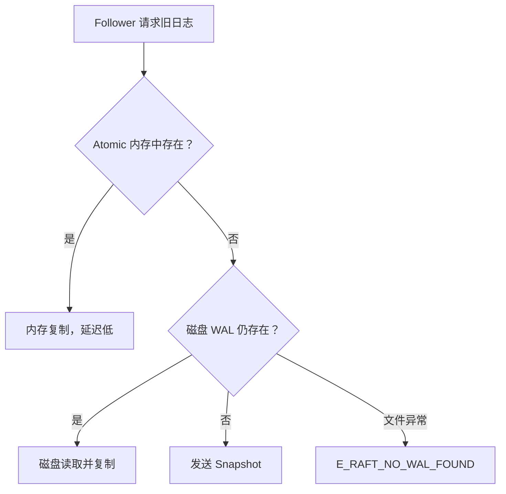

# 拉取 nebula 3.6-w-1 分支

> 拉取 [https://github.com/cccxgit/nebula/tree/3.6-w-1](https://github.com/cccxgit/nebula/tree/3.6-w-1) 代码到当前目录分支3.6-w-1

<details><summary>5 previous messages</summary>

> 我先核对当前仓库的分支、远端和未提交改动，再把远端 `3.6-w-1` 安全拉到当前目录；若有本地改动或分支冲突，我会保留现场并据此处理。
>
> 当前目录还不是 Git 仓库。我正在确认目录是否为空；若为空就直接克隆指定分支，若已有文件则先避免覆盖。
>
> 这个任务目录里的 `.git` 是 Codex 注入的只读占位挂载，不能写入常规 Git 元数据。我会把 Git 元数据放到当前目录的独立隐藏目录中，再将 `3.6-w-1` 工作树检出到当前目录；代码位置不变，也不会碰只读的 `.git/.agents/.codex` 占位目录。
>
> <details><summary>Created a file, edited a file, deleted a file</summary>
>
> - Wrote `./.git-local/.gitkeep` (+1 -0)
> - Deleted `./.git-local/.gitkeep` (+0 -1)
> - Wrote `./.git-local/info/exclude` (+3 -0)
>
> </details>
>
> GitHub 连接已获授权，正在下载该分支的对象和历史；仓库体量较大，完成后我会立即检出并核对分支与提交。
</details>

已完成拉取：

- 当前分支：`3.6-w-1`
- 远端跟踪：`origin/3.6-w-1`
- 当前提交：`de9b3ed800a6627d9845e9289b6bbc5b6faf460a`
- 工作区状态：干净，与远端一致

由于 Codex 将 `.git` 挂载为只读占位目录，Git 元数据保存在 `.git-local`。本任务中可这样执行 Git 命令：

```bash
git --git-dir=.git-local --work-tree=. status
```

> 当前目录为nebula graph开源数据库3.6版本的源码，我已经将其商用。在现网生产环境遇到内存持续升高不下降问题。请你阅读tasks/task-wal.md文章，帮我分析根因。请先分析问题的根因，暂不需要研究解决方案。你可以在外网查找相关博客提问或github issue。nebula graph的开源社区地址：[https://discuss.nebula-graph.com.cn/](https://discuss.nebula-graph.com.cn/)

> 当前目录为nebula graph开源数据库3.6版本的源码，我已经将其商用。在现网生产环境遇到内存持续升高不下降问题。请你阅读tasks/task-wal.md文章，帮我分析根因。
> 请先分析问题的根因，暂不需要研究解决方案。你可以在外网查找相关博客或github issue。nebula graph的开源社区地址：[https://discuss.nebula-graph.com.cn/](https://discuss.nebula-graph.com.cn/)
> 根因分析需足够严谨，必须紧贴源码和实际数据库运行结果。因此必要时可以修改源码，增加观测能力，重新编译运行。我已经将编译和启动命令放在了AGENTS.md文件中

> 当前目录为nebula graph开源数据库3.6版本的源码，我已经将其商用。在现网生产环境遇到内存持续升高不下降问题。请你阅读tasks/task-wal.md文章，帮我分析根因。
> 请先分析问题的根因，暂不需要研究解决方案。你可以在外网查找相关博客或github issue。nebula graph的开源社区地址：[https://discuss.nebula-graph.com.cn/](https://discuss.nebula-graph.com.cn/)
>
> 我的实际生产环境采用多实例部署，storage、meta、graph都是3实例部署。因此你需要修改nebula graph配置文件启动多个服务进程开展运行分析
>
> 根因分析需足够严谨，必须紧贴源码和实际数据库运行结果。因此必要时可以修改源码，增加观测能力，重新编译运行。我已经将编译和启动命令放在了AGENTS.md文件中。过程中需要你输出关键性的分析内容到当前目录下，以方便我阅读审阅

<details><summary>32 previous messages</summary>

> 我会把这次工作拆成三条证据链并行推进：生产现象与复现条件、WAL/共识相关源码的对象生命周期、社区与 GitHub 已知案例。先完整读取 `AGENTS.md` 和 `tasks/task-wal.md`，随后按文档启动 3×storage、3×meta、3×graph 的多实例环境；过程中会把阶段性关键结论和证据写入当前目录，最终只给出根因分析，不展开修复方案。
>
> 任务描述中的关键特征是“多数空间无数据或低频操作也增长”且“空间/分片越多增长越快”。这会把优先级从普通查询内存、活跃写入缓存，转向每分片常驻或周期性执行的 WAL/Raft 路径；我会用实际多实例数据验证这个关联，而不是仅凭代码形态下结论。现在先盘点构建产物、配置和相关源码入口。
>
> <details><summary>Created 2 files</summary>
>
> - Wrote `./tasks/task-wal-investigation.log` (+15 -0)
> - Wrote `./tasks/task-wal-root-cause-analysis.md` (+40 -0)
>
> </details>
>
> 源码链现在出现了一个可量化的吻合点：默认配置写的是 30 秒心跳，但调度循环实际按 `30/3 + 0~0.5 秒` 运行；每次空闲 leader 心跳都会生成一条空 Raft 日志，并复制到三个 storage 副本。按 1,000 个分片副本/节点估算，`AtomicLogBuffer::Node` 的固定对象开销恰好可产生“每天数百 MB”的增长量级。这个结论仍需运行与堆证据确认；我开始按指定 Debug 配置构建基线版本。
>
> <details><summary>Edited 2 files</summary>
>
> - Wrote `./tasks/task-wal-investigation.log` (+9 -0)
> - Wrote `./tasks/task-wal-root-cause-analysis.md` (+46 -2)
>
> </details>
>
> 源码并行审计进一步确认了两条独立但同源的增长路径：空心跳既进入每分片 `AtomicLogBuffer`，也会更新每分片的 RocksDB commit key。当前机器上还发现同一提交已有一组 26 天长跑证据，空心跳导致 RocksDB memtable 按理论时间周期 flush，实测误差约 0.12%。我会把它作为历史对照证据读取，但仍在当前 3+3+3 环境独立复核，避免把旧实验直接当成本次结论。
>
> 多实例审计已确定同机部署的关键隔离条件：storage 身份是 `(local_ip, port)`，其 admin/raft 端口隐式为 `port-1/port+1`；三份 meta 必须使用完全一致的 peer 列表并快速连续启动；每个实例必须独立 pid、日志、data 和 `cluster.id`。我现在把可审阅的 9 份实验配置写到 `tasks/wal-lab/conf`，保持 storage 的 64 MiB RocksDB write buffer 和 8 MiB WAL buffer 不变，只压缩无关线程数。
>
> <details><summary>Created 13 files</summary>
>
> - Wrote `./tasks/wal-lab/conf/nebula-graphd-1.conf` (+29 -0)
> - Wrote `./tasks/wal-lab/conf/nebula-graphd-2.conf` (+29 -0)
> - Wrote `./tasks/wal-lab/conf/nebula-graphd-3.conf` (+29 -0)
> - Wrote `./tasks/wal-lab/conf/nebula-metad-1.conf` (+30 -0)
> - Wrote `./tasks/wal-lab/conf/nebula-metad-2.conf` (+30 -0)
> - Wrote `./tasks/wal-lab/conf/nebula-metad-3.conf` (+30 -0)
> - Wrote `./tasks/wal-lab/conf/nebula-storaged-1.conf` (+44 -0)
> - Wrote `./tasks/wal-lab/conf/nebula-storaged-2.conf` (+44 -0)
> - Wrote `./tasks/wal-lab/conf/nebula-storaged-3.conf` (+44 -0)
> - Wrote `./tasks/wal-lab/add-hosts.ngql` (+2 -0)
> - Wrote `./tasks/wal-lab/create-spaces-01-10.ngql` (+11 -0)
> - Wrote `./tasks/wal-lab/create-spaces-11-50.ngql` (+41 -0)
> - Wrote `./tasks/wal-lab/lab-control.sh` (+60 -0)
>
> </details>
>
> Context compaction
>
> Source: automatic
> Status: completed
>
> 基线构建已进入后半程；目前源码证据与理论斜率已经闭环。接下来我会在不改变 WAL 行为的前提下加入只读计数器，启动 3+3+3 实例，用 10/50 个空间两档实测“空日志数—AtomicLogBuffer 节点—RSS”的对应关系。
>
> 基线源码已完整编译通过。现在开始加入纯观测性指标：每个分片缓冲区的 push/空 push、Node 数、逻辑计费字节和实际 Node 对象字节；这些字段不参与容量判断、回收或 Raft 控制流。
>
> <details><summary>Edited 3 files</summary>
>
> - Wrote `./src/kvstore/wal/AtomicLogBuffer.cpp` (+54 -0)
> - Wrote `./src/kvstore/wal/AtomicLogBuffer.h` (+28 -1)
> - Wrote `./src/storage/http/StorageHttpStatsHandler.cpp` (+21 -0)
>
> </details>
>
> 观测版 storaged 已重新编译并安装成功，Node 的 ABI 大小没有因指标字段改变（Node 独立类型，仍为 3200 字节）。现在按隔离端口启动三 Meta，确认选主后再注册三 Storage；实验全程不执行任何图数据写入。
>
> 九个进程均已通过端口和 `/proc/<pid>/exe` 核验，三 Storage 为 ONLINE；零空间时三个进程的 WAL buffer 实例数、push、Node 都为 0。下面先创建 10×20×RF3 的空空间，预期每台恰有 200 个本地副本，并做分钟级斜率采样。
>
> <details><summary>Created a file</summary>
>
> - Wrote `./tasks/wal-lab/sample-metrics.sh` (+57 -0)
>
> </details>
>
> 10 空间阶段已稳定在每台 200 个 buffer。采样仍在进行，初始观测显示空载也持续产生 WAL push；我会用首末样本计算三台独立斜率，并检查每 64 次 push 是否精确对应一个 3200B Node。
>
> 10 空间结果已经出现源码级指纹：三台的 `pushes == empty_pushes`，122 秒各增加约 4.22 万条；逻辑计费严格增加 `16B/条`，磁盘 WAL 约 `32B/条`，Node 则以 64 条为一组阶梯增长，`dirty_nodes=0`、`refs=0`。这同时排除了“读迭代器卡住 GC”作为当前阶段主因。现在扩展到生产同构的每台 1000 个副本。
>
> 50 空间阶段三台均为 1000 个 buffer，即与生产拓扑一致。即使 Leader 数严重不均（325/145/530），三台的空 push 增速几乎相同，说明增长随“本地副本数”而非 Leader 数：Follower 复制路径也写入相同 WAL/Atomic buffer。
>
> 当前 50 空间样本的空 push 速率约 1715 条/秒/进程，与源码公式 `1000 / (1/3 + 0.2495) = 1716.7` 条/秒仅约千分之一偏差；三台差异也在千分之一级。这个吻合度已经把定时器、Leader 复制和本地 buffer 三段链条连成了可量化证据。
>
> <details><summary>Created 2 files</summary>
>
> - Wrote `./tasks/wal-lab/sample-rocksdb-memtables.sh` (+45 -0)
> - Wrote `./tasks/wal-lab/analyze-runtime-samples.py` (+79 -0)
>
> </details>
>
> 生产同构阶段 184 秒的三台结果已计算：理论 1716.738 条/秒，实测 1717.34–1717.85，误差仅 0.035%–0.065%；每条恰好对应 16B 逻辑 buffer 计费、约 32B 磁盘 WAL。按 H=30 外推，Atomic Node 单项为 402.18 MiB/日 requested、450.44 MiB/日 jemalloc usable。
>
> <details><summary>Created a file</summary>
>
> - Wrote `./tasks/wal-lab/evidence/abi-sizes.txt` (+11 -0)
>
> </details>
>
> 当前实测还量化了第二条路径：105 秒内三个 storaged 的 RocksDB active memtable 分别新增约 17.85–17.90 万个 entry，约 1700–1704 条/秒，紧跟空 WAL 速率；但 arena 按块扩容，三台字节增量不平滑。这解释了 RSS 为什么叠加了 Atomic 的线性基线与 RocksDB 的阶梯/锯齿。现在整理成可审阅的完整根因报告。
>
> <details><summary>Created a file, edited a file, deleted a file</summary>
>
> - Deleted `./tasks/task-wal-root-cause-analysis.md` (+0 -84)
> - Wrote `./tasks/task-wal-root-cause-analysis.md` (+483 -0)
> - Wrote `./tasks/task-wal-investigation.log` (+57 -0)
>
> </details>
>
> <details><summary>Edited a file</summary>
>
> - Wrote `./tasks/task-wal-root-cause-analysis.md` (+14 -0)
>
> </details>
>
> 完整报告已经写入当前目录，原始 CSV、九实例配置、ABI/jemalloc 实测和复算脚本均已保留。正在做最后一轮独立审计，重点检查单位、源码行号与“主因/次因”的表述边界；随后会停止九个实验进程但保留全部数据和日志。
>
> <details><summary>Edited a file</summary>
>
> - Wrote `./tasks/task-wal-root-cause-analysis.md` (+6 -0)
>
> </details>
>
> <details><summary>Edited 3 files</summary>
>
> - Wrote `./tasks/task-wal-root-cause-analysis.md` (+8 -7)
> - Wrote `./tasks/task-wal-root-cause-analysis.md` (+3 -3)
> - Wrote `./tasks/task-wal-root-cause-analysis.md` (+2 -2)
> - Wrote `./tasks/task-wal-root-cause-analysis.md` (+14 -10)
> - Wrote `./tasks/task-wal-root-cause-analysis.md` (+13 -4)
> - Wrote `./tasks/task-wal-root-cause-analysis.md` (+10 -8)
> - Wrote `./tasks/task-wal-root-cause-analysis.md` (+5 -4)
> - Wrote `./tasks/task-wal-investigation.log` (+1 -1)
> - Wrote `./tasks/task-wal-root-cause-analysis.md` (+6 -5)
> - Wrote `./tasks/task-wal-root-cause-analysis.md` (+11 -7)
> - Wrote `./tasks/task-wal-investigation.log` (+1 -1)
> - Wrote `./tasks/task-wal-root-cause-analysis.md` (+10 -5)
> - Wrote `./tasks/task-wal-investigation.log` (+1 -1)
> - Wrote `./tasks/wal-lab/analyze-runtime-samples.py` (+6 -3)
> - Wrote `./tasks/wal-lab/analyze-runtime-samples.py` (+1 -0)
>
> </details>
>
> 独立审计发现并已收敛三类边界：现网未提供实际 H/buffer/data_path；3200/3584B 只对本次 ABI/allocator 成立；整秒采样只能支持约 1% 精度而非万分级。根因机制和 16B/64 条结构事实不受这些边界影响。现在保存末次样本并清理实验进程。
>
> <details><summary>Edited 2 files</summary>
>
> - Wrote `./tasks/task-wal-root-cause-analysis.md` (+15 -6)
> - Wrote `./tasks/task-wal-investigation.log` (+6 -0)
>
> </details>
>
> 九个实验进程已按 Graph → Storage → Meta 顺序停止，相关端口均已释放；data、WAL、服务日志和 CSV 未删除。最后只做文件完整性、构建结果、公式复算和未提交差异检查。
>
> <details><summary>Edited a file</summary>
>
> - Wrote `./tasks/task-wal-root-cause-analysis.md` (+7 -6)
>
> </details>
</details>

根因已锁定，置信度高：Nebula 3.6 在健康空闲状态下持续追加空 `NORMAL` Raft 日志，随后被每个副本长期保存在 WAL 内存缓冲中。

- [RaftPart.cpp](./src/kvstore/raftex/RaftPart.cpp:2041) 的 `sendHeartbeat()` 没有检查 `commitInThisTerm_`，稳定 term 中仍周期追加空日志。
- 空日志被复制到全部副本。每台虽然 Leader 数为 325/145/530，但空 push 速率几乎相同。
- [AtomicLogBuffer.h](./src/kvstore/wal/AtomicLogBuffer.h:40) 对空记录只计费 16B；本次构建中 Node 填满后长期摊销约 50B，jemalloc usable 约 56B。
- 默认 H=30、8MiB 且现网 ABI 相同时，1000 个本地副本预测增长约 401.96MiB/天 requested、450.19MiB/天 jemalloc usable。
- [Part.cpp](./src/kvstore/Part.cpp:215) 还会近似随每条空日志更新 RocksDB commit key，形成额外 memtable 阶梯增长。

3+3+3 实验中，1000 副本理论为 1716.738 push/s，三台名义实测为 1717.342～1717.848 push/s；考虑整秒采样精度，可严谨表述为约 1% 内吻合。所有 push 均为空 payload，逻辑计费严格为 16B/push，磁盘编码约为 32B/push，Node 数满足每 64 条增加一个 Node 的结构不变量。

历史设计来源于合入的 [PR #606](https://github.com/vesoft-inc/nebula/pull/606)。官方仓库 [Issue #6156](https://github.com/vesoft-inc/nebula/issues/6156) 也独立指出相同的条件缺失，但目前仍未获维护者确认或合入；[v3.8.0](https://github.com/vesoft-inc/nebula/blob/v3.8.0/src/kvstore/raftex/RaftPart.cpp#L1920-L1928) 仍保留相同逻辑。

完整材料：

- [完整根因报告](./tasks/task-wal-root-cause-analysis.md:1)
- [调查过程日志](./tasks/task-wal-investigation.log:1)
- [WAL/Node/RSS 原始数据](./tasks/wal-lab/evidence/wal-runtime-samples.csv:1)
- [RocksDB 逐空间数据](./tasks/wal-lab/evidence/rocksdb-memtable-samples.csv:1)
- [复算脚本](./tasks/wal-lab/analyze-runtime-samples.py:1)

观测源码已重新编译验证通过，未加入任何解决方案代码。九个实验进程均已停止，配置、data、WAL 和日志全部保留。

> 输出一份总结的分析报告给我

<details><summary>2 previous messages</summary>

> 我会基于已完成的源码追踪和 3+3+3 实测，整理一份独立、短篇、可直接评审的总结报告；保留关键数字和适用边界，不展开解决方案。
>
> <details><summary>Created a file</summary>
>
> - Wrote `./tasks/task-wal-root-cause-summary.md` (+264 -0)
>
> </details>
</details>

总结报告已生成：

[查看总结分析报告](./tasks/task-wal-root-cause-summary.md:1)

报告涵盖：

- 最终根因及源码调用链
- `AtomicLogBuffer` 与 RocksDB 两条内存路径
- 3+3+3 多实例运行证据
- 默认配置下的内存增长量级
- 其他可能原因的排除
- 适用条件与分析边界
- 外部 Issue、PR 和社区案例佐证

内容仅分析根因，未涉及解决方案。

> 如何启动nebula graph三个进程，我需要手动启动

你当前配置是 3 metad + 3 storaged + 3 graphd，共 9 个进程。当前数据目录已保留，因此无需再次执行 `ADD HOSTS`。

在当前目录执行：

```bash
cd /home/sch/nebula/nebula-3.6-wal-1
ulimit -n 65536

./tasks/wal-lab/lab-control.sh prepare
./tasks/wal-lab/lab-control.sh start-meta
./tasks/wal-lab/lab-control.sh start-storage
./tasks/wal-lab/lab-control.sh start-graph1
./tasks/wal-lab/lab-control.sh start-graph-rest
```

检查状态：

```bash
./tasks/wal-lab/lab-control.sh status
```

连接 graphd：

```bash
/home/sch/nebula-run/nebula-console \
  -addr 127.0.0.1 \
  -port 9669 \
  -u root \
  -p nebula
```

进入 Console 后检查：

```ngql
SHOW HOSTS;
SHOW SPACES;
```

如果希望逐实例手动启动，等价命令如下：

```bash
SERVICE=/home/sch/nebula-run/nebula-wal/scripts/nebula.service
CONF=/home/sch/nebula/nebula-3.6-wal-1/tasks/wal-lab/conf

# 先启动三个 metad
for i in 1 2 3; do
  "$SERVICE" -c "$CONF/nebula-metad-$i.conf" start metad
done

# 再启动三个 storaged
for i in 1 2 3; do
  "$SERVICE" -c "$CONF/nebula-storaged-$i.conf" start storaged
done

# 最后启动三个 graphd
for i in 1 2 3; do
  "$SERVICE" -c "$CONF/nebula-graphd-$i.conf" start graphd
done
```

注意：`-c` 必须放在 `start daemon` 前面，不要使用 `nebula.service start all`，否则多实例配置不会被正确传入。

停止全部实验进程：

```bash
./tasks/wal-lab/lab-control.sh stop
```

> 分析结果涉及代码要标出代码位置，重写下所有分析文档

<details><summary>19 previous messages</summary>

> Context compaction
>
> Source: automatic
> Status: completed
>
> 我会把现有产出的分析文档统一重写，所有涉及源码机制、排除项和实验解释的结论都补上“文件路径 + 精确行号 + 函数/符号”，同时保留原始任务文档和原始证据不改。先盘点文档并复核当前分支行号，再统一改写和交叉审阅。
>
> 目前两份报告的详细版已有部分行号，但总结版大量结论只写了函数名；另外观测代码改动后，`AtomicLogBuffer` 的旧行号已经发生偏移。我会按“当前工作区源码”重新取行号，并在文档开头明确：Raft 主链行号对应基线提交，观测指标行号对应当前观测版源码，避免审阅时混淆。
>
> <details><summary>Created a file, deleted a file</summary>
>
> - Deleted `./tasks/task-wal-root-cause-analysis.md` (+0 -540)
> - Wrote `./tasks/task-wal-root-cause-analysis.md` (+589 -0)
>
> </details>
>
> 详细报告的主体已按统一源码索引重写。审阅中发现一处外部链接锚点存在冲突（v3.8 的同一函数行号），我会直接核对官方仓库后再定稿；同时补上稳定 Leader 判定、复制完成复位和 WAL 600 秒调度这几个必要位置。
>
> <details><summary>Created a file, edited a file, deleted a file, searched the web</summary>
>
> Searched the web for `https://github.com/vesoft-inc/nebula/blob/v3.8.0/src/kvstore/raftex/RaftPart.cpp`
>
> Searched the web for `'void RaftPart::sendHeartbeat()'`
>
> - Wrote `./tasks/task-wal-root-cause-analysis.md` (+47 -12)
>
> - Deleted `./tasks/task-wal-root-cause-summary.md` (+0 -265)
>
> - Wrote `./tasks/task-wal-root-cause-summary.md` (+269 -0)
>
> </details>
>
> 两份分析报告已完成重写：总结版增加了 C1–C14 源码定位表，详细版把主链、Follower 时序、TTL、GC、RocksDB 和排除项都补到了具体文件、行号和符号。调查日志属于原始时间线，我不会改写历史内容，只在末尾追加本次文档重写说明和最终源码定位入口。
>
> <details><summary>Edited 3 files</summary>
>
> - Wrote `./tasks/task-wal-investigation.log` (+8 -0)
> - Wrote `./tasks/task-wal-root-cause-analysis.md` (+15 -4)
> - Wrote `./tasks/task-wal-root-cause-summary.md` (+4 -1)
>
> </details>
>
> 现在进入校验阶段：我会逐一检查本地 Markdown 链接能否解析、引用行号是否超出文件、所有关键结论是否能回链到源码，并复算报告中的数字。原始任务、CSV、GDB 输出和运行日志历史内容均未改写。
>
> 校验时发现 9 个实验端口目前又处于监听状态，说明在此前“实验结束并停止”之后服务已被重新启动；本轮文档重写没有启动或停止任何进程。我会把报告末尾改成“历史清理状态 + 当前运行状态”两段，避免把旧状态写成当前事实。
>
> <details><summary>Edited 3 files</summary>
>
> - Wrote `./tasks/task-wal-investigation.log` (+1 -0)
> - Wrote `./tasks/task-wal-root-cause-analysis.md` (+4 -1)
> - Wrote `./tasks/task-wal-root-cause-summary.md` (+3 -1)
>
> </details>
>
> 复审还指出 RocksDB 的内部行为需要绑定到实际依赖版本，而不能只引用 Nebula 的调用点。我已确认本次构建链接的头文件版本为 RocksDB 7.5.3，并核对了本机匹配源码；接下来会把 write-buffer、sequence entry 和 arena/flush 的精确位置也纳入两份报告。
>
> <details><summary>Edited 2 files</summary>
>
> - Wrote `./tasks/task-wal-root-cause-analysis.md` (+14 -3)
> - Wrote `./tasks/task-wal-root-cause-analysis.md` (+22 -7)
> - Wrote `./tasks/task-wal-root-cause-analysis.md` (+10 -5)
> - Wrote `./tasks/task-wal-root-cause-analysis.md` (+14 -12)
> - Wrote `./tasks/task-wal-root-cause-analysis.md` (+8 -3)
> - Wrote `./tasks/task-wal-root-cause-analysis.md` (+4 -2)
> - Wrote `./tasks/task-wal-root-cause-analysis.md` (+1 -1)
> - Wrote `./tasks/task-wal-root-cause-analysis.md` (+1 -1)
> - Wrote `./tasks/task-wal-root-cause-summary.md` (+11 -6)
> - Wrote `./tasks/task-wal-root-cause-summary.md` (+6 -2)
> - Wrote `./tasks/task-wal-root-cause-summary.md` (+13 -8)
> - Wrote `./tasks/task-wal-root-cause-analysis.md` (+6 -2)
> - Wrote `./tasks/task-wal-root-cause-summary.md` (+1 -1)
> - Wrote `./tasks/task-wal-root-cause-analysis.md` (+5 -3)
> - Wrote `./tasks/task-wal-root-cause-summary.md` (+4 -2)
>
> </details>
>
> Context compaction
>
> Source: automatic
> Status: completed
>
> 我正在做最后一轮源码链闭环审校：补齐 Nebula `WriteBatch` 到 RocksDB 的具体桥接位置，并统一“默认参数外推”“同机九实例边界”等限定，随后会重新校验所有行号链接与实验计算。
>
> <details><summary>Edited 2 files</summary>
>
> - Wrote `./tasks/task-wal-root-cause-analysis.md` (+7 -4)
> - Wrote `./tasks/task-wal-root-cause-analysis.md` (+2 -1)
> - Wrote `./tasks/task-wal-root-cause-analysis.md` (+10 -6)
> - Wrote `./tasks/task-wal-root-cause-analysis.md` (+8 -5)
> - Wrote `./tasks/task-wal-root-cause-analysis.md` (+2 -1)
> - Wrote `./tasks/task-wal-root-cause-analysis.md` (+6 -3)
> - Wrote `./tasks/task-wal-root-cause-summary.md` (+6 -5)
> - Wrote `./tasks/task-wal-root-cause-summary.md` (+2 -2)
> - Wrote `./tasks/task-wal-root-cause-summary.md` (+6 -3)
> - Wrote `./tasks/task-wal-root-cause-summary.md` (+3 -2)
>
> </details>
>
> 两份报告的主因果链已补到 `Part::putCommitMsg → RocksWriteBatch::put/data → RocksEngine::commitBatchWrite → RocksDB MemTable::Add`，并把直接运行证据与基于 RocksDB 7.5.3 源码的解释明确分层。现在在做全量链接、行号和措辞一致性检查。
>
> <details><summary>Edited 2 files</summary>
>
> - Wrote `./tasks/task-wal-root-cause-analysis.md` (+2 -1)
> - Wrote `./tasks/task-wal-root-cause-analysis.md` (+7 -5)
> - Wrote `./tasks/task-wal-root-cause-summary.md` (+5 -3)
> - Wrote `./tasks/task-wal-root-cause-analysis.md` (+10 -5)
> - Wrote `./tasks/task-wal-root-cause-summary.md` (+11 -5)
> - Wrote `./tasks/task-wal-root-cause-analysis.md` (+6 -4)
> - Wrote `./tasks/task-wal-root-cause-summary.md` (+3 -2)
>
> </details>
>
> 文档已完成条件化收口：现网“每天数百 MB”不再被写成已测事实，只在 H=30、8MiB、1000 本地副本且 ABI/allocator 相同时成立；RocksDB 结果也明确为“两点 property 采样”，不外推未观测的完整 flush 曲线。
</details>

已完成所有分析文档重写：

- [完整根因分析报告](./tasks/task-wal-root-cause-analysis.md)
- [总结报告](./tasks/task-wal-root-cause-summary.md)
- [调查运行时间线](./tasks/task-wal-investigation.log)

主要改进：

- 所有源码结论均标注文件和精确行号，关键入口同时标明函数或数据结构。
- 补全 Raft 空日志、Leader/Follower WAL、AtomicLogBuffer、RocksDB commit-key 的完整调用链。
- 严格区分源码事实、运行观测、RocksDB 源码推断和生产条件估算。
- 明确当前观测代码与原始提交的行号差异。
- 保留原始问题、CSV、GDB 等证据，不改写历史调查记录。

已校验 302 个本地文件链接及行号锚点，实验复算和 Markdown 格式检查均通过。当前 3+3+3 共九个 Nebula 服务进程仍在运行，本次文档重写未启停这些进程。

> 我在阅读你给出的分析文档，发现自身对源码和数据库内核理解薄弱。请系统性讲解与这个问题有关的所有源码。请结合你给出的分析文档，提供系统性源码讲解

<details><summary>13 previous messages</summary>

> 我会把现有“根因报告”改造成一份面向源码基础较弱读者的系统教程：先建立 Storage/Raft/WAL/RocksDB 的整体模型，再逐层走读调用链、对象生命周期、内存计算和实验指标。所有关键结论继续附源码位置，并明确哪些是基础机制、哪些才是本问题的异常点。
>
> 教程将特别拆开三个最容易混淆的概念：Meta 心跳、真正的 Raft Heartbeat RPC、以及被当作 heartbeat 的空 `NORMAL` 日志；同时会解释 `Part`、本地副本、Raft Group、RocksEngine 和每分片 WAL 的对象粒度。这样后续看每个函数时不会把不同层次混在一起。
>
> <details><summary>Created a file</summary>
>
> - Wrote `./tasks/task-wal-source-code-walkthrough.md` (+400 -0)
>
> </details>
>
> Context compaction
>
> Source: automatic
> Status: completed
>
> 我正在把已有的“根因报告”改写成一条从对象模型、Raft、WAL、内存缓冲到 RocksDB 的源码学习路径。接下来会补齐 Leader/Follower 时序、内存计算、观测指标和推荐阅读顺序，并逐一校验代码行号。
>
> <details><summary>Edited a file</summary>
>
> - Wrote `./tasks/task-wal-source-code-walkthrough.md` (+760 -1)
>
> </details>
>
> 主体讲解已经写完：现在覆盖了 18 个章节，并把一条空日志在 Leader、Follower、磁盘 WAL、Atomic buffer 和 RocksDB 中的全过程串起来了。接下来我会做两类校验：一是所有源码链接和行号是否存在，二是教学表述是否与既有实验数据和根因报告一致。
>
> <details><summary>Edited 3 files</summary>
>
> - Wrote `./tasks/task-wal-source-code-walkthrough.md` (+0 -39)
> - Wrote `./tasks/task-wal-root-cause-analysis.md` (+3 -0)
> - Wrote `./tasks/task-wal-root-cause-summary.md` (+2 -0)
>
> </details>
>
> <details><summary>Edited a file</summary>
>
> - Wrote `./tasks/task-wal-source-code-walkthrough.md` (+7 -7)
> - Wrote `./tasks/task-wal-source-code-walkthrough.md` (+23 -0)
> - Wrote `./tasks/task-wal-source-code-walkthrough.md` (+5 -0)
> - Wrote `./tasks/task-wal-source-code-walkthrough.md` (+17 -11)
> - Wrote `./tasks/task-wal-source-code-walkthrough.md` (+5 -0)
> - Wrote `./tasks/task-wal-source-code-walkthrough.md` (+11 -6)
> - Wrote `./tasks/task-wal-source-code-walkthrough.md` (+8 -5)
> - Wrote `./tasks/task-wal-source-code-walkthrough.md` (+3 -2)
> - Wrote `./tasks/task-wal-source-code-walkthrough.md` (+6 -0)
> - Wrote `./tasks/task-wal-source-code-walkthrough.md` (+9 -0)
> - Wrote `./tasks/task-wal-source-code-walkthrough.md` (+2 -1)
> - Wrote `./tasks/task-wal-source-code-walkthrough.md` (+6 -0)
>
> </details>
>
> 目前已经完成第一轮审阅修正，包括：拆开 Raft 的 committed/applied 概念、修正 `RaftLogEntry` 不直接携带 LogID、补充 `write` 与可选 `fsync` 的区别，以及限定“Follower 滞后一轮”只适用于健康稳定空载场景。现在正做 WAL/Atomic/RocksDB 与全文一致性的最后复核。
>
> <details><summary>Edited a file</summary>
>
> - Wrote `./tasks/task-wal-source-code-walkthrough.md` (+7 -5)
> - Wrote `./tasks/task-wal-source-code-walkthrough.md` (+4 -3)
> - Wrote `./tasks/task-wal-source-code-walkthrough.md` (+10 -5)
> - Wrote `./tasks/task-wal-source-code-walkthrough.md` (+8 -3)
> - Wrote `./tasks/task-wal-source-code-walkthrough.md` (+6 -3)
> - Wrote `./tasks/task-wal-source-code-walkthrough.md` (+5 -3)
> - Wrote `./tasks/task-wal-source-code-walkthrough.md` (+7 -6)
>
> </details>
>
> <details><summary>Edited 2 files</summary>
>
> - Wrote `./tasks/task-wal-investigation.log` (+5 -0)
> - Wrote `./tasks/task-wal-source-code-walkthrough.md` (+2 -2)
> - Wrote `./tasks/task-wal-source-code-walkthrough.md` (+2 -1)
>
> </details>
>
> 文档的因果链和教学链已经合并完成，最后几处精度边界也已收紧：包括 WAL `write/fsync` 区别、Raft commit 规则、TTL 两个 overload、观测补丁开销，以及 H、buffer、data_path、ABI 各自影响哪一个量。现在执行最终链接、行号、Markdown 和变更范围校验。
</details>

已完成系统性源码讲解：

[系统源码讲解：Nebula Graph 3.6 WAL 内存问题](./tasks/task-wal-source-code-walkthrough.md)

文档共 18 个章节，覆盖：

- Space、Logical Part、Replica Part、RF 与本地对象关系
- storaged → NebulaStore → Part → WAL → AtomicLogBuffer 对象生命周期
- Raft 选举、no-op、Leader/Follower 复制与滞后一轮提交
- `FileBasedWal` 的磁盘编码、iterator、TTL、rollback 和 reset
- `AtomicLogBuffer` 的 Record、Node、容量计费、引用计数与 GC
- 16B、32B、64 条、3200B/3584B 等实验数据的源码来源
- 空日志写入 RocksDB commit key 的完整调用链
- 3+3+3 实验对象数、斜率计算和观测指标解释
- 推荐源码阅读顺序、单元测试入口和理解练习

最核心的阅读主线是：

```text
statusPolling
→ sendHeartbeat
→ appendLogAsync(NORMAL, "")
→ Leader/Follower FileBasedWal
→ AtomicLogBuffer::push
→ Part::commitLogs
→ systemCommitKey
→ RocksDB::Write
```

同时已在以下报告中加入源码导读入口：

- [根因总结](./tasks/task-wal-root-cause-summary.md)
- [完整根因分析](./tasks/task-wal-root-cause-analysis.md)

所有本地源码链接和行号均已校验通过，数学和实验边界也完成复核。本次只更新文档，没有启动、停止、重启或修改现有 Nebula 服务配置。

> 为什么当前目录无法查看git提交记录

<details><summary>1 previous message</summary>

> 我先检查当前目录的 Git 元数据位置和 `git rev-parse/log` 报错。之前这个工作区一直需要显式使用 `.git-local`，很可能是标准 `.git` 被替换或未随代码一起拉取。
</details>

原因很明确：当前目录没有标准的 `.git`，Git 元数据被放在了 `.git-local` 中。

因此普通命令：

```bash
git log
```

无法自动识别仓库。但提交记录并未丢失，以下命令可以正常查看：

```bash
git --git-dir=.git-local --work-tree=. log --oneline
```

当前状态是：

```text
分支：3.6-w-1
HEAD：de9b3ed80
远端：origin/3.6-w-1
```

若要永久恢复普通 Git 命令，推荐创建 `.git` 指针文件，内容为：

```text
gitdir: .git-local
```

之后即可直接执行：

```bash
git status
git log --oneline
```

当前未提交的源码观测改动和 `tasks/` 文档不会因此丢失。我尚未修改 Git 元数据。

> 我使用clion打开文件夹，无法查看历史git提交记录

<details><summary>1 previous message</summary>

> CLion 的 Git 集成不会把 `.git-local` 当作仓库元数据目录；它通常只识别标准 `.git` 目录或 `.git` 指针文件。我再检查项目的 VCS 映射，确认是否还存在第二层配置问题。
</details>

CLion 无法查看历史有两个直接原因：

1. 项目根目录没有标准 `.git`，仓库元数据在 `.git-local`；
2. `.idea/vcs.xml` 不存在，说明 CLion 没有自动建立 Git 目录映射。

处理方法：

1. 在项目根目录创建文件：

```text
/home/sch/nebula/nebula-3.6-wal-1/.git
```

内容只有一行：

```text
gitdir: .git-local
```

2. 重新打开 CLion 项目。

3. 如果仍未识别，在 CLion 的 `Settings → Version Control → Directory Mappings` 中，将项目根目录映射为 `Git`。

完成后，终端中的普通命令也会恢复：

```bash
git status
git log --oneline
```

提交记录没有丢失；当前 `3.6-w-1` 的 HEAD 是 `de9b3ed80`。创建 `.git` 指针也不会影响现有未提交源码和分析文档。

> 你来解决下

<details><summary>2 previous messages</summary>

> 我会同时补齐标准 `.git` 指针和 CLion 的 Git 目录映射，然后用不带任何额外参数的 `git status`、`git log` 验证。现有 `.git-local`、提交记录和未提交改动都不会被移动或改写。
>
> <details><summary>Created 2 files</summary>
>
> - Wrote `./.git` (+1 -0)
> - Wrote `./.idea/vcs.xml` (+6 -0)
>
> </details>
</details>

已修复：

- 创建标准 [.git](./.git) 指针，指向 `.git-local`
- 创建 CLion Git 映射 [.idea/vcs.xml](./.idea/vcs.xml)

已验证普通命令恢复正常：

```text
分支：3.6-w-1
HEAD：de9b3ed80
Git目录：.git-local
```

现在关闭并重新打开 CLion 项目，即可在 Git 工具窗口查看提交历史。现有未提交改动和分析文档均未受影响。

> 如果要解决内存持续上涨，最优方案是什么？

> 如果要解决内存持续上涨，在不改变源码机制，不引入问题的前提下，最优方案是什么？

<details><summary>8 previous messages</summary>

> 我会按“只用现有配置和运维能力、不改 Raft/WAL 代码”的约束，比较三个可行杠杆：分片数量、Raft 心跳周期和 WAL 内存窗口。重点是确认每项在 3.6 源码中的真实作用及副作用，再给出生产优先级。
>
> Context compaction
>
> Source: automatic
> Status: completed
>
> 我会把“最优”拆成两层：生产上立刻可实施的低风险止涨措施，以及长期降低根因规模的结构性措施。先明确一点：完全无副作用的配置不存在；我会给出不改变 Raft 协议语义、风险最低的方案和可验证边界。
>
> <details><summary>Searched the web</summary>
>
> Searched the web for `site:docs.nebula-graph.io/3.6.0 partition_num NebulaGraph best practices partitions storage ...`
>
> Searched the web for `https://github.com/vesoft-inc/nebula/issues/6156`
>
> </details>
>
> 目前源码层面的优先级已经很清楚：`wal_buffer_size` 只改变每个分片内存 WAL 的保留上限，不改变选举、Leader lease 或心跳频率；而增大 `raft_heartbeat_interval_secs` 虽能减慢上涨，却会同时改变故障检测和选举时序，因此不适合作为“低风险最优方案”。我正在把容量值和滚动步骤定量化。
>
> <details><summary>Searched the web</summary>
>
> Searched the web for `'commitInThisTerm_'`
>
> </details>
>
> 我会把这次“仅配置、低风险”的结论单独落成一份实施文档。核心建议不会改 Raft 心跳参数：先用 `wal_buffer_size` 把主增长项的长期上界压住，并通过单节点 canary、逐台滚动来控制风险。
>
> <details><summary>Created a file</summary>
>
> - Wrote `./tasks/task-wal-no-source-mitigation.md` (+155 -0)
>
> </details>
</details>

结论：在“不改源码、不改变 Raft 可用性语义”的约束下，最优方案是降低 storaged 的 `wal_buffer_size`，并逐台滚动重启。它不能消除空日志，但能让主要内存增长更早进入有界平台。

推荐先在一台 storaged 上 canary：

```text
--wal_buffer_size=2097152
--raft_heartbeat_interval_secs=30
--wal_ttl=14400
```

也就是只把 WAL 内存窗口从 8MiB 降到 2MiB，其他参数保持不变。

### 为什么首选它

`wal_buffer_size` 在每个 Part 创建 WAL 时固化，见 [RaftPart.cpp](./src/kvstore/raftex/RaftPart.cpp:357) 和 [FileBasedWal.cpp](./src/kvstore/wal/FileBasedWal.cpp:15)。超过该容量后，旧 Node 才开始标脏和回收，见 [AtomicLogBuffer.cpp](./src/kvstore/wal/AtomicLogBuffer.cpp:144)。

它的特点是：

- 不改变选举超时、Leader lease、RF 和一致性逻辑。
- 不减少空日志产生速度，但能降低长期 Node 保留平台。
- 内存未命中时会回退读取磁盘 WAL，不会直接丢日志，见 [FileBasedWal.cpp](./src/kvstore/wal/FileBasedWal.cpp:530)。
- 代价是落后 Follower 追赶时可能增加磁盘读取，所以仍需 canary。

以你描述的每台约 1000 个 local replica-parts 估算：

| 配置 | 接近容量时间 | Atomic Node usable 平台 |
|---:|---:|---:|
| 8MiB | 约 62.2 天 | 约 27.34GiB |
| 4MiB | 约 31.1 天 | 约 13.67GiB |
| 2MiB | 约 15.5 天 | 约 6.84GiB |
| 1MiB | 约 7.8 天 | 约 3.42GiB |

因此：

- 2MiB：推荐的内存/磁盘风险折中点。
- 4MiB：磁盘压力较大时的保守选择。
- 1MiB：内存预算很紧时考虑，但必须先验证 Follower 追赶、重启恢复和高峰写入。

上述数值依赖本次实验的 ABI 和 jemalloc；生产二进制可能略有差异。

### 滚动实施

1. 确认 3/3 storaged ONLINE，所有 Part、Leader、Peers 正常，无 balance/rebuild/snapshot 作业。
2. 选择负载最低、Leader 最少的一台做 canary。
3. 配置中只保留一条 `--wal_buffer_size=2097152`。
4. 每次只停止一台 storaged；启动前执行 `ulimit -n 65536`。
5. 等待该节点完全 ONLINE、Part 和 Leader 恢复，观察错误率、P99、磁盘延迟、snapshot/log-gap。
6. canary 正常后，逐台滚动另外两台。绝不能同时停止两台。
7. 全量后至少观察24小时。重启后的 RSS 下降只是旧 Node 被释放，不代表已经到达新平台。

该参数不能可靠在线热改：它不在动态配置白名单中，而且既有 Part 的容量不会变化，见 [GflagsManager.cpp](./src/common/meta/GflagsManager.cpp:49)。

### 不建议的方案

- 增大 `raft_heartbeat_interval_secs`：虽能降低斜率，但会延长选举、故障发现和 Leader lease，见 [RaftPart.cpp](./src/kvstore/raftex/RaftPart.cpp:1143)。
- 降低 `wal_ttl`：只清磁盘文件，不清 Atomic Node，见 [FileBasedWal.cpp](./src/kvstore/wal/FileBasedWal.cpp:676)。
- jemalloc purge/drop caches：Node 仍是 live object，无法释放。
- 降低 RF：直接牺牲生产容错。
- 单纯定期重启：只能临时归零，随后重新增长。

长期最有效的无源码措施是减少不必要的分片数，因为它会同时降低 Atomic 和 RocksDB 两条路径。官方3.6资源规划建议按磁盘数乘以2～20设置每个 Space 的分片数；现有 Space 无法原地修改，只能新建后迁移。[官方资源规划](https://docs.nebula-graph.io/3.6.0/4.deployment-and-installation/1.resource-preparations/)

完整实施说明已写入 [task-wal-no-source-mitigation.md](./tasks/task-wal-no-source-mitigation.md)。需要强调：纯配置只能约束主增长项，不能停止重复空 NORMAL 日志；该上游问题目前也已有公开的 [GitHub Issue #6156](https://github.com/vesoft-inc/nebula/issues/6156)。

> 如果要解决内存持续上涨，最小化修改源码和不引入问题的前提下，最优方案是什么？

<details><summary>12 previous messages</summary>

> 这次关键不在于“多加一个条件”本身，而在于避免对 `commitInThisTerm_` 产生无锁并发读写、避免换届竞态，并证明新 Leader 仍会提交一次当前 term 的 no-op。我会先把锁、term 切换和复制完成路径审清，再给最小补丁与必须测试。
>
> <details><summary>Searched the web</summary>
>
> Searched the web for `https://github.com/vesoft-inc/nebula/pull/606`
>
> </details>
>
> 初步结论是：最小修复应当保留“新 Leader 每个 term 至少提交一次 no-op”，仅阻止 `commitInThisTerm_` 已为真之后的重复 no-op；真正的 Heartbeat RPC 继续照常发送。不能直接删掉空日志逻辑，也不应无锁读取普通 `bool`。
>
> Context compaction
>
> Source: automatic
> Status: completed
>
> 源码审计发现一个关键边界：只在 `sendHeartbeat()` 加 `commitInThisTerm_` 条件虽然能止住空 WAL，但会失去 follower 的 commit 推进和空闲期追赶驱动，因此不能作为低风险完整修复。我会把推荐方案限定为复用现有 AppendLog 协议的最小闭环改动，并明确验证与回滚条件。
>
> 推荐方向已经收敛：保留“每个新 term 至少提交一条当前 term 日志”，在完成后把后续周期动作改为“不新增记录的 AppendLog 通知/追赶”，同时继续发送现有 Heartbeat RPC。这样既切断 WAL、AtomicLogBuffer 和 RocksDB commit-key 增长，又保留 follower 最终提交与掉线重连后的追赶语义。
>
> <details><summary>Created a file</summary>
>
> - Wrote `./tasks/task-wal-minimal-source-fix.md` (+338 -0)
>
> </details>
>
> 这个方案的目标不是把所有 Raft 写都停掉，而是把“每个 term 的必要 entry”和“每轮保活/commit 通知”分开：前者仍落 WAL，后者不再创建新日志。发布判断也会以 follower commit/catch-up 正确为第一门槛，内存不涨只是其中一项。
>
> 进一步并发审计否定了“直接周期调用 `Host::appendLogs()` 就够了”：现有 `pendingReq_` 是单槽覆盖，陈旧通知可能覆盖更新的正常复制目标，甚至误兑现新日志的 Future。为满足“尽量不引入问题”，推荐方案需要再加一个很小但必要的 Host 单调合并约束，并采用“兼容代码先全量、Leader 新行为后启用”的两阶段发布。
>
> <details><summary>Edited a file</summary>
>
> - Wrote `./tasks/task-wal-minimal-source-fix.md` (+106 -84)
> - Wrote `./tasks/task-wal-minimal-source-fix.md` (+36 -14)
>
> </details>
>
> 审计后的最终取舍是：不为了“绝对每 term 恰好一条”扩大状态机，因为并发边界多一条合法 no-op 不影响正确性；但复制目标的单调合并和 ACK 目标校验属于安全底线，必须做。若希望支持无法严格控制的新旧版本混部，还应增加 capability 协商；对于你可控的三 storage 集群，可用默认关闭开关 + 两阶段全量升级避免改 Thrift 协议。
>
> <details><summary>Edited a file</summary>
>
> - Wrote `./tasks/task-wal-minimal-source-fix.md` (+16 -1)
> - Wrote `./tasks/task-wal-minimal-source-fix.md` (+4 -3)
> - Wrote `./tasks/task-wal-minimal-source-fix.md` (+2 -0)
>
> </details>
</details>

最优方案不是“一行 `commitInThisTerm_` 判断”，而是一个最小的 Raft 语义闭环：

1. 新 Leader 当前 term 尚未提交日志时，保留必要 no-op。
2. `commitInThisTerm_ == true` 后，停止周期创建空日志，但继续发送 Heartbeat RPC。
3. 改用零 entry AppendLog 传播 commit 水位、驱动落后副本追赶。
4. 修正 follower 零 entry 匹配水位。
5. 修正 `Host::pendingReq_` 的单槽覆盖风险：同 term 复制目标只能单调增大，并校验 ACK 的 `last_matched_log_id`。
6. 新行为放在默认关闭的开关后，分两阶段发布。

核心修改位置：

- 空日志与 Heartbeat：[RaftPart.cpp](./src/kvstore/raftex/RaftPart.cpp:2041)
- follower 零 entry 处理：[RaftPart.cpp](./src/kvstore/raftex/RaftPart.cpp:1673)
- Host 请求队列：[Host.cpp](./src/kvstore/raftex/Host.cpp:100)
- Host 状态：[Host.h](./src/kvstore/raftex/Host.h:250)

不能只加 guard，原因是：

- `commitInThisTerm_` 是受锁保护的普通 `bool`，裸读会产生 data race。
- 当前下一轮空 AppendLog 还负责推进 follower commit 和空闲期 catch-up；直接停止会造成副本长期落后。
- 直接新增周期零 entry 请求又会触发 `pendingReq_` 覆盖竞态，严重时可能把尚未复制的日志错误计入 quorum。

部署应分两轮：

- 第一轮：部署 follower 修正、Host 单调队列、ACK 校验和新 Leader 代码，但开关保持关闭。
- 第二轮：确认所有 voter、learner、listener 都是兼容版本后，再逐台启用开关。
- 回滚时先逐台关闭开关，恢复旧行为，再考虑回滚二进制。

修复后，稳定 term、无业务写入时，`empty_pushes/nodes/node_bytes` 应停止增长，相关 RocksDB commit-key entry 斜率也应消失。已有内存通常需要 storaged 滚动重启后释放，不能要求原进程 RSS 立即下降。

完整设计、并发边界、测试矩阵和回滚步骤已写入：

[task-wal-minimal-source-fix.md](./tasks/task-wal-minimal-source-fix.md)

Nebula Issue [#6156](https://github.com/vesoft-inc/nebula/issues/6156) 提出的单 guard 方向尚未经过维护者评审，也没有覆盖上述 follower 和队列问题；历史 no-op 的设计目的可见 [PR #606](https://github.com/vesoft-inc/nebula/pull/606) 和 [heartbeat 重构 PR #438](https://github.com/vesoft-inc/nebula-storage/pull/438)。

本轮只完成方案设计，没有修改产品源码。

> 前面10次对话都有的什么模型执行的？我刚刚会员掉了

<details><summary>3 previous messages</summary>

> 我会用 OpenAI 产品说明流程核对两件事：当前任务实际可见的模型信息，以及会员状态变化是否会 retroactively 改变前面已完成的调用。模型归属如果没有逐次审计元数据，我会明确区分“能确认”和“无法从界面确认”的部分。
>
> <details><summary>Searched the web</summary>
>
> Searched the web for `Codex ChatGPT plan model usage history site:developers.openai.com ...`
>
> Searched the web for `site:developers.openai.com/codex models Codex app model selector ...`
>
> Searched the web for `https://developers.openai.com/codex/models`
>
> Searched the web for `'GPT-5.6 Sol'`
>
> </details>
>
> 官方文档确认：桌面端模型由输入框下方的模型/推理强度选择器决定；未显式指定时会使用推荐模型。但这并不能证明某条历史回复具体用了哪个模型，所以我再读取本机当前任务的审计元数据和配置，只核对模型字段，不读取或输出账号凭据。
</details>

> 当前提供的源码修改方案过于复杂，难以保证不引入问题。
> 请思考其他更有方案，在不变更心跳和空日志等内核现有机制下，通过自识别长期无数据写入的图空间，加速其缓存老化速度，是否能解决问题？

<details><summary>7 previous messages</summary>

> 这个方向比修改 Raft 提交协议更稳妥：保持空日志、复制、follower commit 和 Heartbeat 全部不变，只改变“内存中保留多少已经落盘且已提交的 WAL 记录”。我会重点验证三件事：怎样可靠识别真实业务写入、空闲空间能否安全缩短 AtomicLogBuffer 保留窗口、RocksDB 次级增长是否仍会让现象残留。
>
> Context compaction
>
> Source: automatic
> Status: completed
>
> 初步判断已经比较明确：这个思路能把主增长项从“按天线性增长数百 MB”变成一个可配置的平台值，但不能单独消除 RocksDB 因空日志更新 commit key 产生的次级内存波动。我正在把“能解决到什么程度”和“最小、低风险的代码边界”拆开，避免把抑制主症状说成彻底根治。
>
> 我把方案收敛成了一个更小的边界：不做“整块缓存清空”，也不在线改 `capacity_`；复用现有 10 分钟 WAL 清理周期，只淘汰“已提交水位之前的完整旧 Node”，并保留最新一段内存窗口。这样不改变任何 Raft 消息、日志内容或提交时序，也避免把未提交日志误当作可老化对象。
>
> <details><summary>Created a file</summary>
>
> - Wrote `./tasks/task-wal-idle-cache-aging-design.md` (+425 -0)
>
> </details>
>
> <details><summary>Edited a file</summary>
>
> - Wrote `./tasks/task-wal-idle-cache-aging-design.md` (+4 -0)
> - Wrote `./tasks/task-wal-idle-cache-aging-design.md` (+30 -13)
> - Wrote `./tasks/task-wal-idle-cache-aging-design.md` (+4 -2)
> - Wrote `./tasks/task-wal-idle-cache-aging-design.md` (+24 -6)
> - Wrote `./tasks/task-wal-idle-cache-aging-design.md` (+10 -3)
> - Wrote `./tasks/task-wal-idle-cache-aging-design.md` (+3 -3)
>
> </details>
>
> 方案审计已经完成。一个关键修正是：不能把“批量标脏”简单写成循环调用现有淘汰代码——它会与并发 GC 形成 UAF 窗口；同时，主动增加磁盘 WAL 回退前，必须闭环 `WalFileIterator` 与 rollback/ftruncate 的既有竞态。最终方案把这两项列为启用前置，而不是留给线上碰运气。
</details>

结论：可行。在“不改变 Heartbeat、空日志和 Raft 协议”的约束下，这是目前更推荐的方案。

推荐设计不是按整个 space 清空缓存，而是：

- 每个 replica-part 记录最后一次非空 Raft WAL 活动时间。
- 长期没有非空日志后进入 `COLD_WAL_CACHE`。
- 利用现有 600 秒 WAL 清理周期，只淘汰 `committedLogId` 之前的完整旧 Node。
- 始终保留最新固定窗口，例如 256 Node。
- 不删除磁盘 WAL，不修改日志、复制和提交机制。
- 业务写恢复后，原有 8MiB 热缓存机制继续生效。

在本次 1000 replica-parts、H=30、本机 ABI/jemalloc 条件下，如果全部进入 cold：

- 原 Atomic 理论平台约 27.3GiB；
- 保留 256 Node/part 后约 875MiB；
- Atomic 主缓存平台降低约 96.9%；
- 保留约 46.6 小时的空日志内存命中窗口。

但它不是完全根治：

- 空日志仍持续产生、复制和写磁盘；
- RocksDB 仍持续更新每个 Part 的 commit key；
- Node 分配/释放仍持续，只是 live Node 净增长平台化；
- jemalloc 不保证把释放内存立即归还操作系统；
- 未进入 cold 的活跃 Part 仍保持原有增长和容量上界。

启用前必须解决两个并发边界：

1. 批量 trim 必须持 synthetic ref，防止与 `releaseRef()` GC 并发形成 UAF。
2. 必须闭环 `WalFileIterator` 与 rollback/ftruncate 竞态，否则增加磁盘回退可能放大现有问题。

因此，它比修改 Raft 协议更安全，但仍需严格实现和测试。第一版不建议同时做 RocksDB 主动 flush。

完整源码位置、参数、内存测算、并发边界和测试清单已写入：

[空闲图空间 WAL 缓存加速老化方案](./tasks/task-wal-idle-cache-aging-design.md)

本轮只新增分析文档，没有修改产品源码。

> 我没理解你如何清除长期不使用的图空间的内存，举个详细例子给我

<details><summary>2 previous messages</summary>

> 我会用“1 个 space、20 个分片、3 副本”的时间线拆开说明。最容易混淆的一点是：这里清理的不是整个图空间的 RocksDB 数据或查询缓存，而是每个本地 Raft 副本持有的旧 WAL 内存 Node；正常图查询仍然读 RocksDB。
>
> <details><summary>Edited a file</summary>
>
> - Wrote `./tasks/task-wal-idle-cache-aging-design.md` (+148 -0)
> - Wrote `./tasks/task-wal-idle-cache-aging-design.md` (+2 -0)
>
> </details>
</details>

先明确一点：我不是把整个图空间的内存全部清空，而是清理这个图空间各分片的 `AtomicLogBuffer` 中“已经提交、长期不用的旧 WAL 内存记录”。

可以把一个 Node 理解成一页内存，每页存放 64 条 Raft 日志。

## 以 `shop` 图空间为例

假设：

```text
PARTITION_NUM = 20
replica_factor = 3
storaged = S1、S2、S3
```

由于只有三台 storaged 且副本数为 3，所以每台 storaged 都保存 `shop` 的 20 个分片副本：

```text
shop-part-1  -> AtomicLogBuffer
shop-part-2  -> AtomicLogBuffer
...
shop-part-20 -> AtomicLogBuffer
```

创建关系位于 [RaftPart.cpp](./src/kvstore/raftex/RaftPart.cpp:330) 和 [FileBasedWal.cpp](./src/kvstore/wal/FileBasedWal.cpp:40)。

### 1. 没有业务写，为什么还增长

假设心跳配置为 30 秒，实际约每 10.25 秒产生一条空日志。

例如 `shop-part-1`：

```text
S1 Leader：生成空日志 #1001
S2 Follower：复制空日志 #1001
S3 Follower：复制空日志 #1001
```

三台都会先写本地 WAL 文件，再放入 AtomicLogBuffer，代码位于 [FileBasedWal.cpp](./src/kvstore/wal/FileBasedWal.cpp:442)。

每个分片副本每天大约产生：

```text
8429.7 条空日志
8429.7 / 64 ≈ 131.7 个 Node
```

所以即使 `shop` 没有数据写入，它的 20 个本地分片仍会不断增加 Node。

### 2. 如何判断进入冷态

示例参数：

```text
idle timeout = 24 小时
keep nodes = 256
clean interval = 10 分钟
```

每个分片记录：

```text
lastNonEmptyLogTime
```

规则是：

- 空心跳日志：不更新时间；
- PUT、REMOVE、批量写等非空日志：更新时间；
- 24 小时没有非空日志：该分片进入 `COLD_WAL_CACHE`。

这是按分片识别，不是整个 space 一个开关。假如 `part-3` 有写入，只有 `part-3` 保持热态，其他 19 个分片仍可以老化。

### 3. 一次清理具体发生什么

假设 `shop-part-1` 当前有 263 个有效 Node：

```text
N1 -> N2 -> ... -> N256 -> ... -> N263
最旧                                      最新
```

配置要求只保留最新 256 个，所以多出 7 个。

10 分钟清理任务进入 [RaftPart::cleanWal()](./src/kvstore/raftex/RaftPart.cpp:492)，执行以下判断：

1. `shop-part-1` 已经 24 小时没有非空 WAL；
2. N1～N7 都是完整 Node；
3. N1～N7 的最后 LogID 都不大于本地 `committedLogId`；
4. 当前没有超过整机清理预算。

满足后：

```text
N1～N7 标记为待删除
有效 tail 从 N1 移动到 N8
```

此时不会马上粗暴释放，因为可能还有线程正在读取 N1～N7。

旧 reader 读完后，现有 [AtomicLogBuffer::releaseRef()](./src/kvstore/wal/AtomicLogBuffer.cpp:220) 才真正执行：

```cpp
delete N1;
delete N2;
...
delete N7;
```

最终有效缓存变为：

```text
N8 -> N9 -> ... -> N263
共 256 个 Node
```

之后空日志仍继续产生，但每增加一个新 Node，就周期淘汰一个最旧的已提交 Node，因此 live Node 数在 256 附近波动，不再一直增长。

### 4. 被删除的日志以后还需要怎么办

这里只删除内存副本，不删除磁盘 WAL。

如果 Follower 需要一条已从 AtomicLogBuffer 淘汰的日志：

1. [FileBasedWal::iterator()](./src/kvstore/wal/FileBasedWal.cpp:530) 先查内存；
2. 内存不命中；
3. 改用 `WalFileIterator` 从磁盘读取；
4. 磁盘历史也不存在时，才可能转 snapshot。

所以它不改变日志内容和 Raft 提交结果，代价是落后副本追赶时可能增加磁盘 IO 或 snapshot。

## 能释放多少

本机实验中，一个满 Node 的 jemalloc usable 内存约为 3.5KiB。

| 状态 | 单分片 | `shop` 每台 20 分片 |
|---|---:|---:|
| 原 8192 Node 上限 | 28MiB | 560MiB |
| 冷态保留 256 Node | 0.875MiB | 17.5MiB |

也就是说，当 `shop` 的 20 个分片全部进入冷态时，每台 storaged 的这部分 WAL 内存理论上可以从约 560MiB 降到约 17.5MiB。

### 5. 业务重新写入时

如果第 10 天写入的数据落到 `shop-part-3`：

- 非空日志立即更新 `part-3` 的活动时间；
- `part-3` 退出冷态；
- 不再执行 idle trim；
- 之后可以继续按原来的 8MiB WAL 热缓存策略增长；
- 其他 19 个没有写入的分片继续保持 256 Node 冷窗口。

已淘汰的旧 Node 不会重新从磁盘预热回来，只有新的日志逐步填充缓存。

## 没有清理的内存

这个方案不会清理：

- RocksDB block cache；
- RocksDB memtable；
- OS page cache；
- 图空间的点和边；
- Raft/Part 固定对象；
- 空日志的磁盘、网络和 CPU 开销。

正常图查询读取 RocksDB，不读取 AtomicLogBuffer。因此即使一个空间有大量只读查询，只要没有数据写入，它的 WAL cache 仍可进入冷态，而查询 block cache 不受影响。

完整例子也已补充到：

[空闲图空间 WAL 缓存加速老化方案](./tasks/task-wal-idle-cache-aging-design.md)

> N1～N7 的最后 LogID 都不大于本地 committedLogId
> 如上信息如何理解？什么是committedLogId？

可以把 `committedLogId` 理解成：

> 本机最后一个已经确认并成功写入状态机（RocksDB）的 Raft 日志编号。

它类似“最后已经正式入账的凭证号”。

## lastLogId 和 committedLogId 的区别

假设某个分片当前状态是：

```text
lastLogId      = 1512
committedLogId = 1450
```

含义是：

- 本地 WAL 已经收到并保存了日志 `1～1512`；
- 其中 `1～1450` 已经按 Raft 规则确认，并成功应用到本机 RocksDB；
- `1451～1512` 目前只在 WAL 中，可能还在复制、等待多数派或等待 apply。

因此：

```text
1 ... 1450 | 1451 ... 1512
 已提交/应用 | 尚不能视为已提交
```

字段定义位于 [RaftPart.h](./src/kvstore/raftex/RaftPart.h:829)。

## 一个完整 Node 范围的例子

假设每个 Node 保存64条日志，从 LogID 1001 开始：

| Node | 保存的 LogID | 最大 LogID | committedLogId=1450 时 |
|---|---:|---:|---|
| N1 | 1001～1064 | 1064 | 可以老化 |
| N2 | 1065～1128 | 1128 | 可以老化 |
| N3 | 1129～1192 | 1192 | 可以老化 |
| N4 | 1193～1256 | 1256 | 可以老化 |
| N5 | 1257～1320 | 1320 | 可以老化 |
| N6 | 1321～1384 | 1384 | 可以老化 |
| N7 | 1385～1448 | 1448 | 可以老化 |
| N8 | 1449～1512 | 1512 | 不能老化 |

判断条件就是：

```text
Node 中最大的 LogID <= committedLogId
```

所以：

```text
N7 最大 LogID = 1448
1448 <= 1450
=> N7 中所有日志都已提交，可以淘汰其内存缓存
```

但是 N8 不行：

```text
N8 保存 1449～1512
committedLogId = 1450
```

虽然其中 `1449、1450` 已经提交，但 `1451～1512` 尚未提交。因为我们按完整 Node 淘汰，不能只删除 N8 的一部分，所以整个 N8 都必须保留。

## 一条日志如何变成 committed

以业务日志 `#1450` 为例，简化流程是：

```text
Leader 生成 #1450
    ↓
Leader 写本地 WAL
    ↓
复制给 Followers
    ↓
满足 Raft 提交规则
    ↓
Leader 调用 commitLogs()
    ↓
把数据写入 RocksDB
    ↓
本地 committedLogId 更新为 1450
```

Leader 更新位置在 [RaftPart.cpp](./src/kvstore/raftex/RaftPart.cpp:1068)。

Follower 收到 Leader 传播的提交水位后，也调用 `commitLogs()`，成功后更新自己的 `committedLogId_`，位置在 [RaftPart.cpp](./src/kvstore/raftex/RaftPart.cpp:1793)。

## 空日志如何提交

空日志没有点、边数据，所以 [Part::commitLogs()](./src/kvstore/Part.cpp:215) 会跳过业务操作：

```cpp
if (log.empty()) {
    // 跳过业务数据处理
}
```

但它仍会更新该分片的系统提交信息：

```text
systemCommitKey(partId)
    value = committedLogId + committedTerm
```

代码在 [Part.cpp](./src/kvstore/Part.cpp:349) 和 [Part.cpp](./src/kvstore/Part.cpp:403)。

所以，即使是空日志，也会推进 `committedLogId`。

## 为什么必须使用“本地” committedLogId

三个副本的提交进度可能短暂不同：

```text
S1 Leader:   committedLogId = 1450
S2 Follower: committedLogId = 1449
S3 Follower: committedLogId = 1449
```

因此每台 storaged 必须根据自己的 committedLogId 决定能淘汰到哪里：

- S1 不能替 S2 判断；
- 不能因为 Leader 已提交1450，就认为所有 Follower 都已应用1450；
- 每个副本只清理自己已经应用的完整旧 Node。

这也是为什么方案把 `committedLogId` 作为硬安全边界，而“多久没有业务写入”只作为开始老化的条件。

最后要注意：这里淘汰的只是内存中的 AtomicLogBuffer Node，不是删除磁盘 WAL。即使日志已经 committed，也不能因为这个条件就直接删除所有磁盘副本；落后 Follower 仍可能需要磁盘 WAL 追赶。

> 是否可能存在1451～1512中有apply失败的日志？这种情况会怎么样？

<details><summary>1 previous message</summary>

> 我会把 Leader 与 Follower 分开说明，因为两者遇到 apply 失败后的处理完全不同：Follower 可以保留 WAL 并等待重试，Leader 的当前实现对不可恢复的本地提交失败会直接走致命退出。
</details>

是的，`1451～1512` 中可能存在“已经写入 WAL，但本机 apply 失败或暂时无法 apply”的日志。:codex-annotation{index="1"}

关键要区分两个阶段：

```text
Append：日志已经写入本地 WAL
Apply：日志对应的数据变更已经写入 RocksDB
```

Append 成功不等于 Apply 成功。

## 可能出现的状态

假设某个 Follower 当前：

```text
lastLogId      = 1512
committedLogId = 1450
```

日志可分成：

```text
1～1450       已在本机成功 apply
1451～1512    已在 WAL，但本机尚未成功 apply
```

`1451～1512` 可能处于以下任一状态：

- Leader 尚未通知它这些日志已经 committed；
- 日志正在等待 apply；
- RocksDB write stall，暂时无法 apply；
- RocksDB 写入发生其他错误；
- Follower 刚恢复，apply 进度还没追上 WAL。

## Follower 遇到 apply 失败

Follower 在 [RaftPart.cpp](./src/kvstore/raftex/RaftPart.cpp:1793) 调用：

```cpp
commitLogs(committedLogId_ + 1, lastLogIdCanCommit)
```

### 情况一：RocksDB Write Stall

Follower apply 使用 `wait=false`。这会让 RocksDB 设置：

```cpp
options.no_slowdown = true;
```

源码在 [RocksEngine.cpp](./src/kvstore/RocksEngine.cpp:124)。

如果 RocksDB 正在 write stall，就返回：

```text
E_WRITE_STALLED
```

此时 Nebula 的处理是：

```text
WAL 中仍保留 1451～1512
committedLogId 仍保持 1450
本次不更新 RocksDB 状态机
等待后续 AppendLog 再次尝试 apply
```

代码位于 [RaftPart.cpp](./src/kvstore/raftex/RaftPart.cpp:1806)。

这里有个容易误解的细节：Follower 仍会向 Leader 返回 AppendLog `SUCCEEDED`，因为日志已经成功接收并写入 WAL；但响应携带的 committedLogId 仍是1450，表示本地 apply 尚未完成。

也就是说：

```text
日志复制成功
≠
Follower 状态机 apply 成功
```

### 情况二：其他 RocksDB 错误

如果不是可延迟的 `E_WRITE_STALLED`，例如 RocksDB 返回其他错误：

- 本地 committedLogId 不推进；
- Follower 返回 `E_RAFT_WAL_FAIL`；
- Leader 后续可能重试；
- 持续失败时该 Follower 会处于异常或落后状态，需要恢复磁盘/RocksDB、重启或 snapshot。

对应代码在 [RaftPart.cpp](./src/kvstore/raftex/RaftPart.cpp:1814)。

## Leader 遇到 apply 失败

Leader 的处理更严格。

Leader 已经获得多数派确认后，会执行本地 `commitLogs()`，位置在 [RaftPart.cpp](./src/kvstore/raftex/RaftPart.cpp:1068)。

Leader 使用 `wait=true`，因此普通 RocksDB write stall 会等待，而不是立即返回 `E_WRITE_STALLED`。

如果最终仍然 apply 失败，当前代码直接：

```cpp
LOG(FATAL) << "Failed to commit logs";
```

位置在 [RaftPart.cpp](./src/kvstore/raftex/RaftPart.cpp:1096)。

结果是：

- storaged 进程终止；
- 其他副本重新选举 Leader；
- 已复制到其他副本 WAL 的日志由新 Leader 继续处理；
- 原节点重启后根据 RocksDB commit 信息和 WAL 恢复。

所以 Leader 的不可恢复 apply 失败不是“把日志留着慢慢重试”，而是致命错误。

## 会不会只 apply 一半？

对于普通 PUT、REMOVE、批量写入，`Part::commitLogs()` 会把一段日志构造成同一个 RocksDB WriteBatch：

```text
日志 1451～1512 的数据操作
+
systemCommitKey = 1512
```

最后只调用一次 `db_->Write()`，代码在：

- [Part.cpp](./src/kvstore/Part.cpp:222)
- [Part.cpp](./src/kvstore/Part.cpp:349)
- [RocksEngine.cpp](./src/kvstore/RocksEngine.cpp:124)

因此正常 RocksDB WriteBatch 语义下：

- 整个 batch 成功，committedLogId 更新到1512；
- 或整个 batch 失败，committedLogId 仍保持1450。

不会正常出现：

```text
1451～1470 已写入
1471 apply 失败
1472～1512 未写入
但 committedLogId 却错误更新到1512
```

## 对缓存老化方案的影响

这正是必须使用“本地 committedLogId”作为删除边界的原因。

假设：

```text
N8 保存 LogID 1449～1512
本地 committedLogId = 1450
```

即使 Leader 已经认为日志1512 committed，只要这个 Follower 本地 apply 失败，它自己的 committedLogId 就仍然是1450。

因此：

```text
N8 最大 LogID 1512 > committedLogId 1450
=> N8 不能淘汰
```

只有本机成功 apply，并把 committedLogId 推进到1512以后，N8 才具备被老化的基本条件。

所以 apply 失败不会导致本方案误删尚未应用的 WAL 内存记录；它会自然阻止清理水位继续前进。

> 未apply的数据，查询的影响是什么？

<details><summary>2 previous messages</summary>

> 查询影响取决于“未 apply 的副本是否会承担读请求”。我先把默认 Leader 读、允许 Follower 读以及 Leader apply 失败三种情况分开核对，避免把副本落后误说成所有查询都丢数据。
>
> Context compaction
>
> Source: automatic
> Status: completed
</details>

核心结论：**未 apply 的日志对本地查询不可见**。因为查询读取的是 RocksDB 中已经 apply 的状态，而不是 Raft WAL。

假设某个副本当前：

```text
lastLogId      = 1512
committedLogId = 1450
```

那么它的本地查询结果只反映到 LogID 1450。1451～1512 即使已经存在于 WAL，只要尚未 apply 到 RocksDB，查询就看不到。

### 一个具体例子

假设日志内容如下：

```text
1450：此前状态
1451：新增顶点 user100
1452：把 user1.age 从 20 更新为 30
1453：删除边 user1 -> user2
1454～1512：空心跳日志
```

某个 Follower 的状态为：

```text
WAL：已经有 1451～1512
RocksDB：只 apply 到 1450
committedLogId：1450
```

如果直接读取这个 Follower：

| 查询 | Follower 返回的结果 |
|---|---|
| 查询 `user100` | 查不到 |
| 查询 `user1.age` | 仍是 20 |
| 查询 `user1 -> user2` | 边仍存在 |
| 查询空日志对应的数据 | 没有业务差异，因为空日志不包含 DML |

也就是说，Follower 返回的是 LogID 1450 时刻的旧快照。

## 普通图查询通常不会读到这个落后的 Follower

Nebula 的 KV 查询首先执行 Leader 检查：

```cpp
return canReadFromFollower ||
       (part->isLeader() && part->leaseValid());
```

源码位置：[NebulaStore.cpp](./src/kvstore/NebulaStore.cpp:1289)

普通查询的 `canReadFromFollower` 默认是 `false`。因此查询只能在满足以下条件的副本执行：

```text
当前是 Leader
并且 Leader Lease 有效
```

查询最终直接读取 RocksDB：

- 单 Key 查询：[NebulaStore.cpp](./src/kvstore/NebulaStore.cpp:746)
- 多 Key 查询：[NebulaStore.cpp](./src/kvstore/NebulaStore.cpp:784)
- Range 查询：[NebulaStore.cpp](./src/kvstore/NebulaStore.cpp:808)
- Prefix 查询：[NebulaStore.cpp](./src/kvstore/NebulaStore.cpp:825)

因此，如果只是某个 Follower apply 落后：

- 普通查询不会从它读取旧数据；
- 它会拒绝查询并返回 Leader 变化相关错误；
- Graph 层通常改为访问对应分片的 Leader；
- 当前 Leader 已正常 apply 时，用户仍能看到最新数据。

## 如果显式允许 Follower Read

部分内部或管理操作会将 `canReadFromFollower` 设置为 `true`，例如统计任务：

[StatsTask.cpp](./src/storage/admin/StatsTask.cpp:120)

这时查询会绕过 Leader/Lease 检查，直接读取 Follower 本地 RocksDB。因此：

```text
Follower committedLogId 落后
        ↓
本地 RocksDB 落后
        ↓
Follower Read 返回旧数据
```

可能表现为：

- 新写入的点或边查不到；
- 更新后仍返回旧属性；
- 已删除的数据仍然可见；
- 统计值落后；
- 不同分片落后的程度不同，跨分片查询可能看到不同时间点的状态。

所以，Follower Read 是未 apply 数据真正可能影响查询正确性的场景。

## 如果 apply 失败发生在 Leader

Leader 的处理更严格。

Leader 在多数派复制完成后调用 `commitLogs()`：

[RaftPart.cpp](./src/kvstore/raftex/RaftPart.cpp:1068)

`Part::commitLogs()` 将业务数据和 `systemCommitKey` 放入同一个 RocksDB WriteBatch：

[Part.cpp](./src/kvstore/Part.cpp:215)

最终写入 RocksDB：

[RocksEngine.cpp](./src/kvstore/RocksEngine.cpp:124)

如果 Leader apply 失败，当前代码会执行 `LOG(FATAL)`，storaged 进程退出，而不是继续作为 Leader 悄悄返回旧数据。

因此用户通常看到的是：

```text
写请求超时或失败
        ↓
storaged 退出/Leader 不可用
        ↓
发生重新选举
        ↓
查询暂时返回 E_LEADER_CHANGED、超时或重试
```

这倾向于造成**可用性问题**，而不是让故障 Leader 长期返回旧结果。

还有一个重要边界：如果写请求已经复制到多数派，但客户端在 Leader 崩溃前没有收到成功响应，客户端看到的可能是超时，但该写入仍可能被新 Leader 提交。因此：

> 客户端超时不能简单理解为“写入一定没有成功”。

## 如果未 apply 的全部是空日志

如果 1451～1512 全部是心跳产生的空 NORMAL 日志，则它们没有点、边或属性操作：

```cpp
if (log.empty()) {
    continue;
}
```

源码位置：[Part.cpp](./src/kvstore/Part.cpp:225)

这种情况下未 apply 不会改变业务查询结果，因为：

```text
1450 的业务状态
+ 62 条空日志
= 仍然是 1450 的业务状态
```

但它仍会影响：

- Follower 的 `committedLogId` 进度；
- 副本是否被认为已经追平；
- Leader 切换后的准备时间；
- WAL 追赶或 Snapshot 判断；
- 本次讨论的 AtomicLogBuffer 内存占用。

## 与缓存淘汰方案的关系

这也是为什么缓存清理必须以本地 `committedLogId` 为安全边界。

在这个例子中：

```text
允许淘汰：LogID <= 1450 的旧 AtomicLogBuffer Node
禁止淘汰：LogID 1451～1512
```

因为 1451～1512 尚未在本地 apply，仍可能被复制、重试或等待提交。方案不会因为图空间长期没有业务写就直接删除这些日志。

而删除 `<=1450` 的已提交内存缓存不会影响查询，因为：

1. 这些日志对应的数据已经写入 RocksDB；
2. 查询本来就读取 RocksDB；
3. 删除的只是 WAL 的内存加速副本；
4. 磁盘 WAL 和 RocksDB 数据都不因此被删除。

可以把三层状态理解为：

```text
WAL 中存在          = 这个副本收到了日志
多数派已确认         = 日志具备提交条件
本地 committed/apply = 本副本查询已经能看见数据
```

对于查询可见性，最关键的是第三层。

> 当前这个方案是否存在风险或弊端？

> 当前这个识别图空间长期不使用，加速老化缓存的方案，是否存在风险或弊端？

<details><summary>1 previous message</summary>

> 我会把风险分成“数据正确性、Raft 行为、性能退化、识别误判、实现并发、运维收益”六类，并明确哪些是必须解决的发布阻断项，哪些只是可接受的代价。先以当前方案文档和对应源码为准复核。
</details>

有风险，而且不能把它理解成“判断空闲后删内存”这么简单。

总体判断是：

> 方案方向可行，Raft 一致性风险低于修改心跳/空日志机制；但当前仍有几个必须解决的并发风险，以及明确的性能副作用。没有完成这些前置工作前，不建议直接进入生产。

完整设计见：[task-wal-idle-cache-aging-design.md](./tasks/task-wal-idle-cache-aging-design.md)

## 一、设计上安全的部分

只要严格满足：

```text
只淘汰完整 Node
Node 中所有 LogID <= 本地 committedLogId
只淘汰最旧连续前缀
不修改磁盘 WAL
不修改 FileBasedWal 的 first/last LogID
```

那么不会删除未 apply 数据，也不会直接影响查询结果。

原因是：

- 进入 Atomic 缓存前，记录已经先写入本地 WAL 文件：[FileBasedWal.cpp](./src/kvstore/wal/FileBasedWal.cpp:442)
- 查询读取 RocksDB，而不是 AtomicLogBuffer。
- `committedLogId` 已经代表本地 apply 成功。
- 内存 miss 可以转向磁盘 WAL：[FileBasedWal.cpp](./src/kvstore/wal/FileBasedWal.cpp:530)

所以这里淘汰的是“旧日志的内存加速副本”，不是业务数据本身。

## 二、三个发布阻断风险

### 1. trim 与现有 GC 并发，可能造成 UAF

AtomicLogBuffer 的旧 Node 不是立即删除，而是：

```text
Writer 标记旧 Node
        ↓
最后一个旧 Reader 离开
        ↓
releaseRef() 物理删除
```

相关代码：

- Node 标脏：[AtomicLogBuffer.cpp](./src/kvstore/wal/AtomicLogBuffer.cpp:144)
- Reader GC：[AtomicLogBuffer.cpp](./src/kvstore/wal/AtomicLogBuffer.cpp:220)

如果批量 trim 正在连续处理多个旧 Node，而最后一个 Reader 恰好在中途退出，GC 可能删除 trim 仍准备访问的 Node，导致：

- use-after-free；
- 重复删除；
- `dirtyNodes_` 下溢；
- storaged 崩溃；
- 极端情况下破坏链表。

当前设计采用“整个 trim 批次持有 synthetic reader ref”的方式规避，但它必须经过确定性并发测试、ASan 和 TSan 验证。仅仅复制现有 `push()` 的删除逻辑是不安全的。

### 2. trim 必须与 push、reset、rollback 严格串行

AtomicLogBuffer 本质是：

```text
single writer + multiple readers
```

如果清理线程直接调用 trim，同时 Raft 线程正在：

- `push()` 新日志；
- `reset()`；
- `rollbackToLog()`；
- Snapshot 后重建；

可能破坏：

```text
tail_
firstLogId_
size_
dirtyNodes_
Node 链表
```

因此 trim 必须在与 Raft WAL writer 相同的 `raftLock_` 临界区执行。现有接入点可以选择：

[RaftPart::cleanWal()](./src/kvstore/raftex/RaftPart.cpp:492)

但这必须成为接口硬约束，不能以后被其他定时线程无锁调用。

### 3. 增加磁盘 WAL 读取后，会放大既有 rollback 竞态

缓存被淘汰后，落后 Follower 可能从 Atomic 内存读取变为从磁盘 WAL 读取。

但当前：

- 磁盘 iterator 读取 WAL：[WalFileIterator.cpp](./src/kvstore/wal/WalFileIterator.cpp:15)
- rollback 会执行 `ftruncate`：[FileBasedWal.cpp](./src/kvstore/wal/FileBasedWal.cpp:569)

两者的生命周期并没有完全互斥。过去高内存命中率可能让这个问题较少暴露；主动淘汰缓存会增加磁盘 iterator 使用频率，从而放大：

- 短读；
- 意外 EOF；
- `E_RAFT_NO_WAL_FOUND`；
- CHECK 失败；
- storaged 崩溃。

这不是新方案创造的一致性漏洞，但新方案会显著增加其出现概率，因此必须在启用前闭环。

而简单给 iterator 加读锁也不够，因为 Listener 等路径可能形成反向锁序死锁，需要统一设计锁顺序或使用不可变/版本化 WAL 文件。

## 三、最主要的性能弊端

缓存老化后的 Follower 追赶路径可能变成：



因此可能增加：

- 磁盘随机读和顺序读；
- Follower 追赶延迟；
- Leader transfer 后的恢复时间；
- Snapshot 数量；
- Snapshot 网络、磁盘和 CPU 压力；
- 查询 p99 抖动。

`keep_nodes` 越小，内存节省越多，但上述风险也越大。

尤其要注意：

> `keep_nodes` 只能决定“内存命中窗口”，不能决定 Follower 最长可离线多久。

真正决定增量追赶窗口的是磁盘 WAL 文件、TTL、文件滚动和 Snapshot 能力。

## 四、“长期不使用”的识别并不完全准确

本方案识别的是：

```text
长期没有非空 Raft WAL payload
```

它不完全等价于：

```text
整个图空间没有任何数据变化
```

因为以下操作可能绕过普通 Raft WAL append：

- Snapshot apply：[Part.cpp](./src/kvstore/Part.cpp:366)
- SST ingest：[NebulaStore.cpp](./src/kvstore/NebulaStore.cpp:972)
- Ingest 管理任务：[IngestTask.cpp](./src/storage/admin/IngestTask.cpp:17)
- Restore：[NebulaStore.cpp](./src/kvstore/NebulaStore.cpp:1368)

这种误判一般不会删除业务数据，因为仍有 `committedLogId` 安全边界；但可能在 ingest、restore 等背景活动期间错误地把 WAL cache 当成冷缓存，引起额外磁盘读取。

因此准确名称应该是：

```text
COLD_WAL_CACHE
```

不应该直接叫“图空间 IDLE”。

## 五、只能覆盖一部分内存问题

本方案只解决进入 cold 状态的 replica-parts。

例如某个 part 每隔 20 小时有一条非空日志，而 idle timeout 是 24 小时，那么它永远不会进入 cold，仍按原来的 8MiB 逻辑容量增长。

另外，即使所有 part 都进入 cold：

- 心跳空日志仍继续产生；
- 每 64 条仍会分配新 Node；
- 旧 Node 只是随后被删除；
- 磁盘 WAL 仍继续增长、滚动和清理；
- 网络复制仍继续；
- RocksDB commit key 仍继续写入；
- RocksDB memtable 仍继续增长和 flush。

因此它改变的是：

```text
Atomic live Node 净增长 → 小窗口平台
```

而不是：

```text
空日志相关的所有分配和 IO → 消失
```

## 六、RSS 不保证立即下降

即使 Node 已经被 `delete`：

- jemalloc 可能把内存保留在 arena；
- 不一定立刻归还操作系统；
- RocksDB memtable 还在增长；
- Node 仍持续分配和释放。

因此可能出现：

```text
Atomic live bytes 已平台
但 RSS 仍缓慢变化或暂时不下降
```

正确验收指标应该优先看：

- Atomic live Node 数；
- valid/dirty Node 数；
- jemalloc allocated/active/resident；
- 磁盘 WAL 读取量；
- Snapshot 数量；
- RocksDB memtable；
- 最后才看 RSS。

## 七、可能出现集中释放峰值

即使限制为每个 part 每轮只 trim 64 个 Node：

```text
1000 parts × 64 Node = 64,000 Node
```

本机约可能对应 218MiB 的 Node 对象在相近时间内标脏或释放，引起：

- CPU 尖峰；
- allocator 锁竞争；
- page fault；
- IO 抖动；
- Raft worker 延迟。

因此必须有 storaged 进程级的：

- 全局 Node 总预算；
- round-robin 游标；
- per-part 随机抖动；
- 单轮时间预算。

不能只有每个 part 的独立上限。

## 八、已有大缓存不会马上收缩

按当前建议：

```text
600 秒执行一次
每 part 每轮最多 64 Node
全进程每轮最多 4096 Node
```

如果 1000 个 parts 已接近原来的最大缓存，从 8192 Node/part 缩到 256 Node/part，理论最坏可能需要约 13.5 天。

滚动升级会重启进程，Atomic 缓存从空开始，因此实际通常不会遇到这个最坏值；但如果希望不中断地给已有长跑进程在线收缩，就不能期待几分钟见效。

## 九、运维和回滚风险

新参数对旧二进制是未知参数。因此正确发布顺序必须是：

1. 新功能默认关闭；
2. 先把新二进制滚动部署到三台 storaged；
3. 全部版本一致后，才在 canary 配置中增加新参数；
4. 回滚旧二进制前先删除新参数。

仅把参数设置为 `0`，旧二进制仍可能因为 unknown flag 启动失败。

关闭功能也不会把已淘汰的 Atomic 缓存重新填回来；后续日志读取仍会根据需要走磁盘或 Snapshot。

## 最终判断

| 维度 | 判断 |
|---|---|
| 删除业务数据风险 | committed 边界正确时很低 |
| Raft 协议风险 | 低，不改变心跳、AppendLog 和提交协议 |
| 并发实现风险 | 高，存在三个发布阻断项 |
| 查询正确性风险 | 低；正常查询读取 RocksDB |
| 查询延迟风险 | 中，磁盘 IO/Snapshot 可能影响 p99 |
| 内存收益 | 对长期 cold parts 很高 |
| RSS 立即下降保证 | 没有 |
| RocksDB 次路径 | 无法解决 |
| 实现复杂度 | 中到高 |

我的建议是：**继续保留这个方向，但不要把它定义成“小改动、低风险即可上线”**。它适合作为一个默认关闭、分阶段启用的性能特性。只有在以下三点完成后，才值得进入 canary：

1. trim/GC 的 synthetic-ref 并发闭环；
2. trim 与 push/reset/rollback 的 single-writer 约束；
3. 磁盘 iterator 与 rollback/ftruncate 的并发闭环。

这三项完成并通过 ASan、TSan、三副本追赶和 Snapshot 压测后，方案的剩余风险主要是可观测、可回滚的性能风险，而不是数据一致性风险。

> 是否有其他更有方案，不改变源码本身机制，且风险和弊端最小

> 是否有其他更优方案，不改变源码本身机制，且风险和弊端最小

<details><summary>2 previous messages</summary>

> 有。若“完全不改变 Raft、心跳、空日志和缓存实现”是第一优先级，最稳妥的首选不是继续增加识别逻辑，而是使用现有 `wal_buffer_size` 配置缩小每个 replica-part 的 Atomic 缓存上限，并逐台滚动重启。我会把它与重启、调心跳、减少分片等替代方案按风险和实际效果对比。
>
> 初步结论已经明确：不存在“零副作用”的配置，但 `wal_buffer_size` 是唯一直接作用于主增长对象、同时不改变 Raft 时序和协议语义的现有参数。需要特别避免把它误解为降低每日生成斜率——它只是把最终平台提前、压低。
</details>

有。若目标是“完全不改源码、保持 Raft/心跳/空日志机制不变，并把生产风险降到最低”，当前最优方案是：

> 使用现有 `wal_buffer_size` 配置缩小每个 replica-part 的 AtomicLogBuffer 上限，单节点 canary 后逐台滚动重启 storaged。

这比“识别空闲空间并新增老化逻辑”简单很多，也不存在新并发代码引入 UAF、链表损坏等风险。

## 推荐配置

第一轮只修改：

```ini
--wal_buffer_size=2097152
```

即 2MiB。保持以下配置不变：

```ini
--raft_heartbeat_interval_secs=30
--wal_ttl=14400
```

2MiB 是当前比较平衡的起点：

- 如果更加保守、业务写入批次较大：先用 4MiB。
- 如果内存预算非常紧张：专项压测通过后再考虑 1MiB。
- 不建议未经压测直接低于 1MiB。

完整方案见：[task-wal-no-source-mitigation.md](./tasks/task-wal-no-source-mitigation.md)

## 为什么这是最低风险方案

`wal_buffer_size` 是现有机制的一部分：

1. WAL 日志仍然先写磁盘；
2. 仍然写入 AtomicLogBuffer；
3. 达到容量后，现有代码开始标记并回收最旧 Node；
4. 内存中没有旧日志时，现有 iterator 回退磁盘读取；
5. Raft term、Leader 选举、多数派、commit 和 apply 均不改变。

源码位置：

- 默认 8MiB：[FileBasedWal.cpp](./src/kvstore/wal/FileBasedWal.cpp:15)
- 每个 Part 构造时固定容量：[RaftPart.cpp](./src/kvstore/raftex/RaftPart.cpp:357)
- 超容量后开始淘汰：[AtomicLogBuffer.cpp](./src/kvstore/wal/AtomicLogBuffer.cpp:144)
- 内存 miss 回退磁盘：[FileBasedWal.cpp](./src/kvstore/wal/FileBasedWal.cpp:530)

它只修改“缓存窗口大小”，不修改数据库协议或状态机。

## 本案中的效果

按本次实验的 ABI、jemalloc、每台约 1000 个 replica-parts 估算：

| `wal_buffer_size` | 名义触顶时间 | Atomic Node 平台估算 |
|---:|---:|---:|
| 8MiB | 约 62.2 天 | 约 27.34GiB |
| 4MiB | 约 31.1 天 | 约 13.67GiB |
| 2MiB | 约 15.5 天 | 约 6.84GiB |
| 1MiB | 约 7.8 天 | 约 3.42GiB |

所以从 8MiB 降到 2MiB，理论上可把 Atomic 主缓存平台降低约 75%。

但必须理解：

> 初期约 450MiB/日的条件估算增长斜率不变，只是从原来约 62 天后平台，提前到约 15.5 天后平台。

这个配置不是严格的 RSS 上限。长生命周期 iterator、dirty Node、allocator 和 RocksDB 都会产生额外内存。

## 它的主要弊端

与空闲识别方案相比，`wal_buffer_size` 是 storaged 进程级配置，会作用于所有 parts：

```text
空闲 part：缓存缩小，收益很大
活跃 part：缓存也缩小，可能增加磁盘 WAL 读取
```

因此可能带来：

- 落后 Follower 更早从磁盘 WAL 追赶；
- 磁盘读取和系统调用增加；
- 业务写入批次很大时，内存命中窗口变短；
- 磁盘 WAL 已清理时，Snapshot 概率增加；
- Leader transfer、Follower 重连期间的追赶延迟可能上升；
- 无法消除 RocksDB commit-key 的 memtable 增长。

这也是为什么推荐从 2MiB canary，而不是直接降到极小值。

配置选择还应满足：

```text
wal_buffer_size >= 现网 p99 单个 Raft 批次的总逻辑日志大小，并留余量
```

当前 `max_batch_size=256`。2MiB 大致相当于平均每条日志约 8KiB 的一个完整批次；如果现网单批明显超过这个量，应优先选择 4MiB。

## 生效必须滚动重启

该参数在 Part 构造时固化，不会在线收缩现有缓存。因此需要逐台重启 storaged，graphd 和 metad 不需要重启。

推荐步骤：

1. 确认三台 storaged 全部 ONLINE、副本完整、无 balance/rebuild/snapshot。
2. 选择 Leader 最少、负载最低的一台 canary。
3. 只修改这一项配置。
4. 优雅停止该 storaged。
5. 启动前执行：

   ```bash
   ulimit -n 65536
   ```

6. 启动后等待 ONLINE、Part/Leader 恢复、追赶完成。
7. 检查业务 P99、磁盘延迟、Snapshot、`E_RAFT_*`。
8. 稳定后再逐台处理另外两台，任何时刻只能停一台。

重启会立即释放旧进程已经积累的 Atomic Node，但这只是即时止血。要证明 2MiB 真正进入平台，需要持续观察到新的触顶窗口；生产 H=30 下约为十五天。

## 其他方案对比

| 方案 | 效果 | 风险 | 结论 |
|---|---|---|---|
| 调小 `wal_buffer_size` | 压低 Atomic 平台 | 活跃 part 磁盘回退增加 | 当前首选 |
| 空闲缓存老化源码方案 | 只处理冷 part | 并发和磁盘 iterator 风险高 | 暂不首选 |
| 定期滚动重启 | 立即释放内存 | 反复选举，增长重新开始 | 仅应急 |
| 增大 Heartbeat | 降低空日志斜率 | 改变选举、lease、故障发现 | 不建议 |
| 降低 `wal_ttl` | 不释放 Atomic Node | 增加 Snapshot 风险 | 无效且有害 |
| jemalloc purge/drop caches | 只处理已释放/page cache | live Node 仍存在 | 无法解决 |
| 减少 partition | 同时降低主、次路径 | 现有空间需要迁移 | 长期最优 |
| 删除确认无用的 Space | 完全消除对应开销 | 数据恢复和业务风险 | 仅限真正废弃数据 |

## 长期最优方向

从架构上，减少不必要的 partition 比调缓存更彻底，因为内存增长近似与本地 replica-part 数量线性相关。

但是 Nebula 3.6 不能原地缩减现有 Space 的 `partition_num`。只能：

```text
创建较少分片的新 Space
→ 迁移并校验数据
→ 业务切流
→ 下线旧 Space
```

所以建议分成两阶段：

1. **当前生产止血和长期有界化**：`wal_buffer_size=2MiB`，严格滚动 canary。
2. **后续架构治理**：新 Space 减少不必要分片；严重过度分片的现有 Space 单独迁移。

最终建议：先不要实现空闲识别源码方案。优先使用 2MiB 现有缓存配置验证；如果 canary 出现磁盘 IO、追赶或 P99 回归，退到 4MiB。这个方案不能消除空日志上游，但在“不改源码机制”的约束下，它是代码风险最低、收益可计算、回滚最简单的选择。

> 如果允许改代码，但是不能变动开源原生机制，风险影响最小的最优方案是什么？

<details><summary>1 previous message</summary>

> 如果允许改代码但必须保留原生 Raft/WAL 行为，我倾向于把方案进一步简化：不要自动 trim，也不要改空日志，而是只增加“按 Space/Part 选择现有 `wal_buffer_size`”的静态策略，并在构造 WAL 时一次性确定容量。这样原生 push、超限标脏、reader-ref GC、磁盘 fallback 全部原样保留。接下来我会比较它与“修正 Record 内存计费”这两个候选方案的风险。
</details>

如果允许少量改代码，但不能改变开源原生 Raft/WAL 机制，最优方案是：

> 新增“按 `spaceId` 静态覆盖 `wal_buffer_size`”能力。只让人工确认的冷 Space 使用较小缓存，活跃 Space 继续使用默认缓存。容量只在 Part/WAL 构造时确定，运行期间不动态改变。

这比自动识别后动态 trim 风险低，也比全局调小 `wal_buffer_size` 对活跃业务的影响小。

## 一、方案核心

当前所有 Part 都使用全局配置：

```cpp
FileBasedWalPolicy policy;
policy.bufferSize = FLAGS_wal_buffer_size;
```

源码：[RaftPart.cpp](./src/kvstore/raftex/RaftPart.cpp:357)

建议只把它扩展为：

```cpp
policy.bufferSize =
    walBufferSizeOverrides.contains(spaceId)
        ? walBufferSizeOverrides[spaceId]
        : FLAGS_wal_buffer_size;
```

配置形式例如：

```ini
--wal_buffer_size=8388608
--wal_buffer_size_overrides=10:2097152,12:4194304
```

表示：

```text
Space 10：2MiB
Space 12：4MiB
其他 Space：仍然是默认8MiB
```

随后全部走原生机制：

```text
原生 push
→ 原生 capacity 判断
→ 原生 tail 标脏
→ 原生 reader-ref GC
→ 原生磁盘 WAL fallback
```

不需要修改：

- `sendHeartbeat()`；
- 空 NORMAL 日志；
- AppendLog RPC；
- Leader/Follower commit；
- `AtomicLogBuffer::push()`；
- `releaseRef()` GC；
- WAL 文件格式；
- RocksDB 格式；
- Snapshot 格式。

## 二、为什么它是风险最低的源码方案

### 1. 不增加运行期并发操作

自动老化方案需要运行期间修改：

```text
tail_
firstLogId_
size_
dirtyNodes_
Node 链表
```

这会引入 trim 与 push、reader GC、rollback、reset 的竞态。

静态容量覆盖方案不会新增任何运行期 writer。容量只在 Part 构造时确定，之后完全使用原生逻辑。

### 2. 默认行为与开源版本完全一致

当覆盖配置为空时：

```text
所有 Space 继续使用 FLAGS_wal_buffer_size
```

因此新二进制在功能关闭状态下，应当与原版本行为一致，便于先部署再灰度启用。

### 3. 只影响指定冷 Space

全局调成2MiB会影响所有 Part，包括高并发热 Space。

静态覆盖可以实现：

```text
热 Space：8MiB，保持原有内存命中窗口
冷 Space：2MiB，更早进入原生淘汰
```

因此磁盘回退、Follower 追赶和业务延迟的影响范围更小。

### 4. 三个副本容量不同也不影响一致性

AtomicLogBuffer 只是本地 WAL 读缓存，容量：

- 不进入 RPC；
- 不进入多数派判断；
- 不进入 WAL 文件；
- 不进入 commit；
- 不进入状态机。

所以 canary 期间可以只有一台 storaged 对目标 Space 使用2MiB，另外两台仍为8MiB。日志内容和 Raft 一致性不受影响，只是本地命中率不同。

## 三、建议不要让数据库自动决定“冷 Space”

为了将风险降到最低，第一版不要自动切换容量。

推荐流程：

```text
只读观测长期活动情况
        ↓
人工审核确认冷 Space
        ↓
将 spaceId 写入 override 配置
        ↓
单节点滚动重启
```

如果需要源码辅助识别，可以只新增只读指标，例如：

```text
last_non_empty_raft_wal_time
effective_wal_buffer_size
atomic_live_nodes
wal_disk_iterator_count
```

但指标只负责报告，不自动触发容量调整。

这样避免：

- Space 在冷热之间频繁切换；
- 误判后自动清理；
- 在线修改普通 `capacity_` 的数据竞争；
- 自动化任务同时处理上千 Part；
- 突发释放和磁盘 IO 峰值。

而且 `last_non_empty_raft_wal_time` 的准确含义只能是“最近一次非空 Raft WAL 活动”，不能直接称为“最近一次业务写入”，因为 Snapshot、SST ingest、restore 等路径可能绕过普通 WAL append。

## 四、定量效果示例

假设当前每台 storaged 有：

```text
50个 Space
每个 Space 20个 local replica-parts
合计1000 parts
```

其中：

```text
5个热 Space  = 100 parts
45个冷 Space = 900 parts
```

按本次二进制 ABI、jemalloc 估算，空日志 Node 的物理放大系数约为：

```text
Atomic Node usable ≈ wal_buffer_size × 3.5
```

全部保持8MiB时：

```text
1000 × 8MiB × 3.5 ≈ 27.34GiB
```

热 Space 保持8MiB，冷 Space改为2MiB：

```text
热：100 × 8MiB × 3.5 ≈ 2.73GiB
冷：900 × 2MiB × 3.5 ≈ 6.15GiB

合计约8.88GiB
```

相对原来的27.34GiB，条件估算可减少约18.5GiB，同时不缩小热 Space 的缓存。

这些数值不是严格 RSS 上限，还会受 dirty Node、长 Reader、业务 payload、allocator 和 RocksDB 影响。

## 五、配置设计要求

推荐使用一个默认空的静态参数：

```ini
--wal_buffer_size_overrides=10:2097152,12:4194304
```

实现必须满足：

- 空字符串完全保持原行为；
- 只允许正数 `spaceId`；
- 容量必须大于0；
- 容量不能超过 `int32_t` 可表示范围；
- 重复 Space ID、非法字符、溢出必须启动失败；
- 启动时只解析一次，得到不可变 map；
- 不加入动态配置白名单；
- 每个 Part 构造时打印 `spaceId/partId/effective capacity`；
- 删除并重新创建 Space 后 ID 可能改变，必须重新审核配置。

不建议配置 Space 名称，因为 RaftPart 构造路径已经直接拥有 `spaceId`，使用名称会额外引入 Meta 查询和启动依赖。

## 六、容量应该如何选择

原则是：

> 在满足 Atomic 内存预算的前提下，选择尽可能大的 cold buffer，从而尽量保留磁盘追赶前的内存窗口。

建议：

- 4MiB：最保守，磁盘回退副作用更小；
- 2MiB：冷 Space 的推荐起点；
- 1MiB：只有内存预算不足且专项压测通过后使用；
- 小于1MiB：第一版不建议。

容量还必须覆盖现网较大的 Raft 批次：

```text
cold buffer >= p99 单批日志 Σ(16 + payload size)，并保留余量
```

当前 Leader 单批最多256条。如果缓存过小，一个大批次的前半部分可能在本批复制或提交完成前已经离开内存，立即转磁盘读取。不会破坏一致性，但会增加 IO 和延迟。

## 七、仍然存在的弊端

这个方案依然不是零副作用：

1. 冷 Space 的 Follower 追赶更容易转磁盘 WAL。
2. 磁盘 WAL 已清理时，可能更早转 Snapshot。
3. 如果把活跃 Space 错列为冷，只会造成性能下降，不会丢数据。
4. Space 变热后不会自动恢复8MiB，需要删除 override 并滚动重启。
5. 它仍然不能停止：
    - 空 NORMAL 日志；
    - WAL 磁盘写；
    - 网络复制；
    - RocksDB commit-key；
    - memtable 增长和 flush。
6. `wal_buffer_size` 是逻辑容量，不是物理硬上限。
7. 长生命周期 iterator 仍可能延迟 dirty Node 的物理释放。
8. jemalloc 不保证 Node 删除后 RSS 立即下降。

另外，小缓存会增加现有 `WalFileIterator` 的使用频率，因此仍需专项验证磁盘 iterator、rollback/ftruncate、Follower catch-up 和 Listener 路径。

## 八、Listener 的作用范围必须明确

如果直接在 `RaftPart` 构造函数里按 `spaceId` 判断，Listener 也可能继承相同的小容量。

一致性上没有问题，但可能增加 Listener：

- 磁盘读取；
- apply 延迟；
- Snapshot；
- 外部索引同步延迟。

为了最小化影响，我建议第一版：

> 只对普通 Storage Part 生效，Listener 继续使用全局 `wal_buffer_size`；Listener 后续单独压测后再决定是否纳入。

这可能比直接在 `RaftPart` 中判断多一点参数传递代码，但作用范围更明确。

## 九、为什么不首选修改 `Record::size()`

另一种看起来很小的改法是：

```cpp
Record::size() = sizeof(Record) + msg.size();
```

它虽然代码可能只有一两行，但不建议作为第一版，因为：

- 会改变所有 Space、所有 Part 的容量语义；
- 热 Space 也会受到影响；
- `sizeof(Record)` 不能准确表示 Node 实际内存；
- `std::string` 有 SSO、capacity 和 allocator rounding；
- Node 是一次性内嵌64个 Record，不是逐条独立分配；
- 新旧副本虽然协议兼容，但 IO 行为差异更难预测。

它更适合作为以后单独设计的“物理内存计费模式”，并保留 legacy 模式灰度，而不是当前生产止损的第一版。

## 十、推荐发布顺序

1. 实现静态 per-space override，默认空。
2. 新二进制在 override 为空的状态下滚动部署到三台 storaged。
3. 验证默认行为与原版本一致。
4. 选择一台 Leader 最少的 storaged。
5. 只对1～2个确定冷 Space 设置2MiB。
6. 执行 `ulimit -n 65536` 后启动。
7. 观察：
    - Part/Leader；
    - Atomic live nodes；
    - WAL磁盘读取；
    - Snapshot；
    - `E_RAFT_NO_WAL_FOUND`；
    - 磁盘util/await；
    - 业务P99。
8. 通过后逐台启用。
9. 回滚时先彻底删除新 flag，再滚动回旧二进制；不能只把值设为0。

最终结论：

> 如果“可以改少量代码，但不能改变开源原生机制”，最佳第一版是“人工冷 Space 名单 + 构造期 per-space `wal_buffer_size` 静态覆盖 + 原生 Atomic 淘汰机制”。它把新增代码限制在配置选择层，不增加运行期并发，不改变 Raft/WAL/GC，且把性能影响限制在明确的冷 Space 内。

> 你的这个最新方案很好，是否可以更近一步，实现wal_buffer_size热生效，使得能动态对冷Space修改缓存大小？

<details><summary>1 previous message</summary>

> 可以实现，而且有一种比“动态 trim 链表”安全得多的做法：运行时只原子更新每个目标 Part 的 `capacity`，仍让原生 `push()` 在后续空日志到来时逐步执行现有淘汰。关键是不能直接修改普通 `int32_t capacity_`，也不能由管理线程直接移动 `tail_`。我先核对现有配置热更新入口和对象生命周期，再给出推荐控制面。
</details>

可以实现，而且比后台直接 `trim Node` 更安全。推荐方案是：

> 将每个 `AtomicLogBuffer` 的容量改成可原子更新的目标值；热更新只修改容量阈值，后续仍由原生 `push() → 标脏旧 Node → releaseRef() GC` 逐步收缩。

但它应准确称为“最小化机制扩展”，不能说完全没有改变原生行为，因为容量从构造期固定变成了运行期可变。

## 一、核心实现

当前容量是普通字段：

[AtomicLogBuffer.h](./src/kvstore/wal/AtomicLogBuffer.h:380)

建议改为：

```cpp
std::atomic<int32_t> capacity_{8 * 1024 * 1024};

void setCapacity(int32_t capacity) {
    capacity_.store(capacity, std::memory_order_relaxed);
}

int32_t capacity() const {
    return capacity_.load(std::memory_order_relaxed);
}
```

`push()` 每次只读取一次容量快照：

```cpp
const auto capacity = capacity_.load(std::memory_order_relaxed);

// 后面继续使用原有容量判断、tail标脏和GC逻辑
```

这样管理线程只修改一个整数，不直接：

- 移动 `tail_`；
- 修改 `size_`；
- 标记 Node；
- 删除 Node；
- 获取 `raftLock_`；
- 触碰 WAL 文件。

### 降低容量

```text
8MiB → 2MiB
```

不会立即删除内存。后续空心跳日志继续调用 `push()`，原生代码发现：

```text
当前size > 新capacity
```

然后每次最多标脏一个旧 Node，逐渐收缩。

### 增大容量

```text
2MiB → 8MiB
```

会立即停止过度淘汰，并允许后续日志逐渐填充更大的窗口。

但已经删除的旧 Node：

- 不会复活；
- 不会从磁盘主动预热；
- 已经标脏的 Node 仍会完成删除。

所以“恢复8MiB”只是恢复未来容量，不是立刻把原来的缓存恢复回来。

## 二、必须先解决一个现有并发风险

不能只把 `capacity_` 改成 atomic 就上线。

现有 `push()` 的淘汰顺序大致是：

```text
发布新的 tail
→ 继续读取旧 tail 的 size
→ 增加 dirtyNodes
```

源码：[AtomicLogBuffer.cpp](./src/kvstore/wal/AtomicLogBuffer.cpp:144)

与此同时，最后一个 Reader 可能进入：

[AtomicLogBuffer::releaseRef()](./src/kvstore/wal/AtomicLogBuffer.cpp:220)

它看到新 tail 和已有的多个 dirty Node 后，可能删除刚刚成为旧 tail 的 Node，而 Writer 随后仍读取该 Node，形成：

- use-after-free；
- dirty 计数下溢；
- storaged 崩溃。

这个竞态原来就潜伏在代码中，只是正常稳态大约每64条日志才淘汰一次。热降容后，当前 size 远大于新容量，几乎每次 `push()` 都进入淘汰分支，暴露概率显著增加。

因此热更新上线前，必须做一次不改变淘汰语义的并发硬化，例如：

```text
Writer 开始处理旧 tail
→ 持有一个 synthetic buffer ref
→ 完成旧 tail 的全部访问和计数更新
→ 释放 synthetic ref
→ 允许原生 releaseRef GC
```

并增加确定性交错测试：

```text
dirtyNodes已经为6
最后一个真实Reader在Writer发布新tail后退出
验证无UAF、无重复delete、无计数下溢
```

如果不允许做这项同步硬化，那么我不建议实现热降容，继续使用“静态 override + 滚动重启”更安全。

## 三、热生效不是立即释放

以一个已经接近8MiB的空日志 buffer 为例，热修改为2MiB：

```text
需要淘汰约：
8192 - 2048 = 6144个有效Node
```

当前 H=30 时，每个 part 名义上约10.25秒收到一次空日志。每次 `push()` 最多淘汰一个 Node，并且每64条的新建 head 分支不会执行容量淘汰。

因此在线收缩大约需要：

```text
约18小时/part
```

8MiB降到256KiB约需要23小时。

1000个 parts 会并行收缩，所以墙钟时间仍约一天，但会持续产生：

- Node 标脏和释放；
- allocator churn；
- WAL磁盘读取；
- 可能的业务延迟波动。

长生命周期 Reader 还可能让物理释放进一步延迟，最后一个 Reader 离开时一次删除大量 dirty Node。

所以 API 必须区分：

```text
target已设置
正在收缩
逻辑size已接近目标
dirty Node已物理释放
```

不能把“设置成功”表述为“内存已经释放”。

## 四、推荐的动态管理结构

建议增加一个 storaged 级策略管理器：

```text
spaceId / partId
    → hotCapacity
    → coldCapacity
    → targetCapacity
    → generation
    → HOT / COLD / SHRINKING / WARMING
```

应用新策略时：

1. 先持久化新的目标配置；
2. 生成单调递增 generation；
3. 原子发布新的不可变策略 map；
4. 在 `NebulaStore` 锁内只复制 `shared_ptr<Part>`；
5. 立即释放全局锁；
6. 对这些 Part 执行原子 setter；
7. 返回目标数、成功数、已删除/新增 Part 数；
8. 新创建的 Part 自动读取最新 generation。

不能：

- 保存裸 `AtomicLogBuffer*`；
- 持有 `NebulaStore` 全局锁再获取每个 `raftLock_`；
- 让旧的异步降容任务覆盖后来的升容；
- 声称整个 Space 在同一纳秒原子切换。

容量不参与 Raft，所以不同 Part、不同副本短时间使用不同容量是安全的。

## 五、冷、热自动切换建议分两期

### 第一版：人工触发热更新

第一版只支持：

```text
人工确认冷Space
→ 热设置较小容量

确认Space恢复使用
→ 热恢复原始容量
```

不要同时上线自动识别。这样更容易验证原子容量、原生GC和磁盘回退。

### 第二版：自动识别

稳定后再引入 per-part 状态机：

```text
HOT
  │ 连续24小时无非空Raft WAL
  ▼
COLD
  │ 第一次出现非空Raft WAL
  ▼
HOT
```

实际上应该按 replica-part 判断，Space 只是聚合展示。因为一个 Space 中可能只有部分 Part 活跃。

必须使用活动 generation 防止这种竞态：

```text
Cleaner判断长期空闲
        ↓
恰好出现业务写，Part恢复HOT
        ↓
迟到的Cleaner又把它设回COLD
```

非空日志到来时，应：

1. 增加 activity generation；
2. 先恢复 hot capacity；
3. 再执行该日志的 buffer push；
4. 迟到任务发现 generation 已变化后放弃降容。

Snapshot、ingest、restore 等直接数据路径还要作为可选 busy gate，否则“无非空 WAL”不完全等于“无任何业务数据活动”。

## 六、控制面如何实现

生产上必须同时满足“热生效”和“重启后仍然存在”。

不建议只有一个内存态 HTTP 请求，否则 storaged 重启后会悄悄恢复默认8MiB。

推荐：

```text
持久化目标配置
        ↓
异步应用到live Part
        ↓
暴露applied generation
```

如果生产已经使用集中配置，即 `local_config=false`，可以扩展现有 `UPDATE CONFIGS storage` 和配置回调。

如果当前使用 `local_config=true`，不要仅为了这个功能改成 `false`。可以采用：

- 本机持久化 override 文件；
- 原子 rename 更新文件；
- storaged 策略 worker 轮询/重载；
- 或仅监听本机管理网的受控管理接口。

现有 `/flags` PUT 只调用 `SetCommandLineOption()`：

[SetFlagsHandler.cpp](./src/webservice/SetFlagsHandler.cpp:83)

它不会自动把新值应用到已有 AtomicLogBuffer；而且需要考虑 HTTP 管理面访问控制。因此不能仅依靠修改 gflag。

## 七、参数建议

第一版建议：

```text
hot capacity  = 当前原始值，通常8MiB
cold capacity = 1MiB或2MiB
idle timeout  = 24小时
```

先从2MiB开始最保守。

自动 HOT 恢复、并发硬化和磁盘追赶测试全部通过后，可以评估512KiB或256KiB。按当前空日志频率：

```text
256KiB仍约能保留46.6小时的空日志
本机约对应875MiB/1000个cold parts
```

但业务 payload 大时对应的日志时间窗会短得多，所以不能只按空日志计算。

## 八、必须观测的指标

每个目标 Part 至少需要：

- `hot_capacity`
- `target_capacity`
- `accounted_size`
- `live_nodes`
- `valid_nodes`
- `dirty_nodes`
- `refs`
- `activity_generation`
- `HOT/COLD/SHRINKING/WARMING`
- Atomic miss 次数
- WalFileIterator bytes/latency
- Snapshot 次数
- Raft lag
- 业务 P99

回滚时必须主动把所有 Part 恢复为各自的 hot capacity。只关闭自动识别线程是不够的，否则现有 buffer 会永久停留在 cold capacity。

## 最终结论

可以实现，推荐顺序是：

1. 先修复/硬化现有 push 淘汰与 reader GC 的并发窗口；
2. 将 `capacity_` 改成 atomic；
3. setter 只修改目标值，不直接 trim；
4. 所有淘汰继续使用原生 `push()` 和 `releaseRef()`；
5. 第一版人工对冷 Space 热更新；
6. 第二版再做 per-part 自动冷热状态机；
7. 目标配置必须持久化，并用 generation 保证更新顺序。

与后台 `trimCommitted()` 相比，这个方案代码和并发风险明显更小；代价是收缩需要约数小时到一天，无法立即释放。如果要求几分钟内确定回收，才需要更复杂的主动 trim，而那就不再属于“最小机制扩展”。

> 这种方案是否存在风险？

有风险，但正确实现后，主要是性能和可用性风险，Raft 数据一致性风险较低。

它的风险等级大致是：

> 比“后台主动 trim Node”低，但比“静态 per-space 配置＋滚动重启”高。

## 两个上线阻断风险

### 1. `push()` 与 GC 的潜在 UAF

当前淘汰路径会先发布新 `tail_`，之后继续访问旧 tail：

[AtomicLogBuffer.cpp](./src/kvstore/wal/AtomicLogBuffer.cpp:144)

并发的最后一个 Reader 可能进入：

[AtomicLogBuffer::releaseRef()](./src/kvstore/wal/AtomicLogBuffer.cpp:220)

然后删除 Writer 尚未完成访问的旧 Node，可能造成：

- use-after-free；
- dirty 计数下溢；
- 重复删除；
- storaged 崩溃。

这个竞态原本就存在，但热降容后可能连续每次 `push()` 都发生淘汰，暴露概率显著放大。

必须先通过 synthetic writer ref 或明确的 Writer/GC 互斥完成并发硬化，再启用动态降容。

### 2. 磁盘 iterator 与 rollback/ftruncate

缓存窗口缩小后，旧日志读取会更频繁转向：

[FileBasedWal::iterator()](./src/kvstore/wal/FileBasedWal.cpp:530)

而 rollback 可能并发修改磁盘 WAL：

[FileBasedWal::rollbackToLog()](./src/kvstore/wal/FileBasedWal.cpp:569)

可能表现为：

- 磁盘短读；
- 意外 EOF；
- `E_RAFT_NO_WAL_FOUND`；
- CHECK 失败；
- Snapshot 增加；
- 极端情况下 storaged 崩溃。

这也是既有薄弱点，但较小缓存会增加其暴露概率。必须完成专项并发测试，必要时先修复锁序或采用不可变 WAL 文件读取方案。

## 主要性能风险

### 1. 降容不会立即释放内存

从8MiB热改到2MiB，一个接近满容量的空日志 buffer 约需要淘汰6144个 Node。

H=30 时，每个 part 约10.25秒才产生一次 push，每次最多淘汰一个 Node，因此名义上需要约18小时才能接近目标。

如果没有后续 push，就永远不会收缩。该方案依赖当前周期空日志继续产生。

### 2. 长 Reader 会延迟释放

降容只会把 Node 标脏。物理删除仍要求最后一个旧 Reader 离开，并满足现有 GC 条件。

长生命周期 Reader 可能导致：

```text
dirty Node不断积累
        ↓
最后一个Reader退出
        ↓
一次删除大量Node
```

可能形成明显的：

- CPU 长尾；
- allocator 锁竞争；
- Raft线程延迟；
- RSS 抖动。

### 3. 磁盘读取和 Snapshot 增加

容量越小，落后副本越早从内存路径转为：

```text
Atomic miss
→ 磁盘 WAL
→ WAL不存在时 Snapshot
```

可能影响：

- Follower 追赶时间；
- Leader transfer；
- Listener apply；
- 业务 P99；
- 磁盘 util/await；
- Snapshot 网络和磁盘压力。

### 4. 大批次可能过早离开缓存

如果新容量小于一个较大的 Raft 批次：

```text
capacity < p99单批 Σ(16 + payload)
```

批次前部可能在该批复制、提交完成前已经离开内存，立即从磁盘读取。

不会破坏一致性，但会放大磁盘 IO 和提交延迟。因此 cold capacity 不能只根据空日志计算。

## 自动冷热识别风险

### 1. 迟到的冷任务覆盖恢复动作

可能发生：

```text
Cleaner判断Part长期空闲
业务写入到来，恢复HOT
迟到的Cleaner又把它设回COLD
```

必须使用单调递增的 `activity generation`：

- 非空日志到来时增加 generation；
- 冷任务应用前重新核对 generation；
- 旧 generation 的任务直接丢弃；
- HOT 恢复必须发生在当前非空日志 `push()` 之前。

### 2. “无非空 WAL”不等于完全无业务变化

Snapshot、SST ingest、restore 等操作可能绕过普通 Raft WAL，因此可能把正在后台处理数据的 Part 识别为冷。

这一般不会导致数据错误，但可能造成额外磁盘读取和性能退化。第一版最好人工触发，自动识别放到第二阶段。

### 3. Space 粒度可能误伤热点 Part

同一个 Space 内可能：

```text
part 1非常活跃
part 2～20长期空闲
```

最佳控制对象应该是 replica-part；Space 只是策略分组和展示。否则一个错误判断会同时缩小整个 Space 所有 Part 的缓存。

## 升容和回滚风险

把容量从2MiB恢复8MiB，只会影响未来日志：

- 已删除 Node 不会复活；
- 已标脏 Node 仍会删除；
- 不会主动从磁盘预热；
- 缓存需要随新日志逐渐重新填充。

因此“恢复8MiB”不是即时回滚。磁盘回读、Snapshot 和已经发生的性能波动也无法撤销。

关闭自动识别功能时，必须主动把所有 Part 恢复为原始 hot capacity。只停止 Cleaner 会让已有 Part 永久停留在 cold capacity。

## 控制面和运维风险

动态策略必须持久化，否则：

```text
运行时热改为2MiB
        ↓
storaged重启
        ↓
恢复默认8MiB
```

还需要处理：

- 新建 Part 读取当前目标；
- 删除 Part 时对象生命周期；
- 重复、乱序更新；
- 三台 storaged 配置漂移；
- Space 删除重建后 ID 改变；
- Listener 是否参与；
- 管理接口未授权访问；
- 更新一半时进程崩溃。

策略应采用：

```text
持久化目标
+ generation
+ 幂等重试
+ last-write-wins
+ applied状态查询
```

不要只依赖内存态 HTTP `/flags`。

## 无法解决的残余问题

即使动态容量完全正确：

- 空 NORMAL 日志仍继续产生；
- WAL 磁盘写仍继续；
- 网络复制仍继续；
- RocksDB commit-key 仍继续更新；
- memtable 仍继续增长和 flush；
- jemalloc 不保证 Node 删除后立即归还 RSS。

因此只能承诺：

```text
Atomic live Node最终接近较小窗口
```

不能承诺：

```text
storaged RSS立即下降并永久水平
```

## 哪些方面风险较低

以下方面通常不会受影响：

- Raft term、角色和 quorum；
- AppendLog 协议；
- committedLogId；
- 状态机 apply；
- WAL文件格式；
- RocksDB数据格式；
- 查询数据正确性。

不同副本使用不同容量也是协议安全的，因为容量只是本地缓存策略。

## 推荐风险控制顺序

1. 先修复 `push()` 与 `releaseRef()` 的并发窗口。
2. 对磁盘 iterator/rollback 做确定性并发测试。
3. `capacity_` 原子化，setter 只写目标值。
4. 第一版只允许人工热更新，不自动识别。
5. 新功能默认关闭，先全量部署关闭状态。
6. 一台 storaged、一个冷 Space canary。
7. 分阶段降容：

   ```text
   8MiB → 4MiB → 2MiB
   ```

8. 保持 Heartbeat、`wal_ttl` 和 RocksDB 参数不变。
9. 验证稳定后再引入自动 per-part 冷热状态机。
10. 第一版不建议低于1MiB。

最终判断：

> 方案可以做，但不是“把 capacity 改成 atomic”就能安全上线。只要两个并发阻断项得到修复，并采用人工灰度、持久化 generation 和充分指标，它的剩余风险主要是磁盘 IO、追赶延迟和 RSS 回收不确定性，而不是数据一致性。若不愿先修并发边界，应该继续采用静态 per-space override＋滚动重启。
